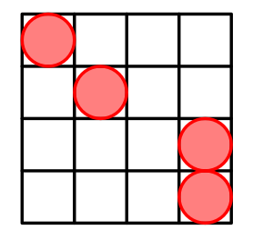
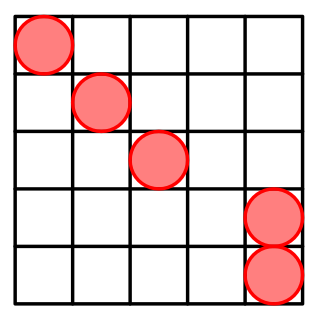

# Tutorial_(en)

We thank everyone who participated in the round.

[1968A - Maximize?](../problems/A._Maximize_.md "Codeforces Round 943 (Div. 3)")

Author: [SashaT9](https://codeforces.com/profile/SashaT9 "Expert SashaT9")

 **Hint 1**Try to find the upper bound of gcd(x,y)+y.

 **Hint 2**gcd(x,y)+y=gcd(x−y,y)+y.

 **Hint 3**gcd(x,y)+y≤x. Try to find such y, that gcd(x,y)+y=x?

 **Solution**
### [1968A - Maximize?](../problems/A._Maximize_.md "Codeforces Round 943 (Div. 3)")

The core idea is to find the upper bound of gcd(x,y)+y.

Let us look closer at the formula gcd(x,y)+y. It is a well-known fact that gcd(a,b)=gcd(a−b,b) for a≥b. Applying it to our formula, we get gcd(x−y,y)+y.

Using the fact that gcd(x−y,y)≤x−y, we get gcd(x−y,y)+y≤x−y+y=x. Hence, gcd(x,y)+y≤x for 1≤y<x.

For y=x−1, we have gcd(x,x−1)+x−1=1+x−1=x, which is the maximal possible value.

Note that the constraints allow finding the optimal y in O(x), while the above solution works in O(1).

 **Implementation**
```cpp
#include<iostream>
using namespace std;
int main(){
	int t;
	cin>>t;
	while(t--){
		int x;
		cin>>x;
		cout<<x-1<<"n";
	}
}
```
 **Rate the problem*** Didn't solve 


[*45*](https://codeforces.com/data/like?action=like "I like this")
* Good task 

 
[*423*](https://codeforces.com/data/like?action=like "I like this")
* Average task 

 
[*45*](https://codeforces.com/data/like?action=like "I like this")
* Bad task 

 
[*30*](https://codeforces.com/data/like?action=like "I like this")
[1968B - Prefiquence](../problems/B._Prefiquence.md "Codeforces Round 943 (Div. 3)")

Author: [FBI](https://codeforces.com/profile/FBI "Expert FBI")

 **Hint 1**Try to check for every k if the prefix of a of length k is a subsequence of b.

 **Solution**
### [1968B - Prefiquence](../problems/B._Prefiquence.md "Codeforces Round 943 (Div. 3)")

We will be solving this task using dynamic programming.

Let us define dpi as the maximal prefix of a that is contained in b1,…,bi as a subsequence.

Then the transitions are as follows:

* if bi is equal to adpi−1+1 then dpi=dpi−1+1.
* otherwise dpi=dpi−1.

The answer is dpm.

 **Implementation**
```cpp
#include<iostream>
#include<vector>
using namespace std;
int main(){
	int t;
	cin>>t;
	while(t--){
		int n,m;
		cin>>n>>m;
		vector<char>a(n+1),b(m+1);
		for(int i=1;i<=n;i++){
			cin>>a[i];
		}
		for(int i=1;i<=m;i++){
			cin>>b[i];
		}
		vector<int>dp(m+1);
		dp[1]=(a[1]==b[1]?1:0);
		for(int i=2;i<=m;i++){
			if(dp[i-1]!=n && b[i]==a[dp[i-1]+1]){
				dp[i]=dp[i-1]+1;
			}else{
				dp[i]=dp[i-1];
			}
		}
		cout<<dp[m]<<"n";
	}
}
```
 **Rate the problem*** Didn't solve 

 
[*29*](https://codeforces.com/data/like?action=like "I like this")
* Good task 

 
[*176*](https://codeforces.com/data/like?action=like "I like this")
* Average task 

 
[*105*](https://codeforces.com/data/like?action=like "I like this")
* Bad task 

 
[*28*](https://codeforces.com/data/like?action=like "I like this")
[1968C - Assembly via Remainders](../problems/C._Assembly_via_Remainders.md "Codeforces Round 943 (Div. 3)")

Author: [SashaT9](https://codeforces.com/profile/SashaT9 "Expert SashaT9")

 **Hint 1**Why constraints are small?

 **Hint 2**Try to think about increacing a1,…,an.

 **Hint 3**((a+b)moda)=b for 0≤b<a.

 **Solution**
### [1968C - Assembly via Remainders](../problems/C._Assembly_via_Remainders.md "Codeforces Round 943 (Div. 3)")

Notice that ((a+b)moda)=b for 0≤b<a. So we may try to generate a sequence with b=xi.

Let us take a1=1000, because 1000 is larger than any of xi. Then, we can take ai as ai−1+xi, since ((ai−1+xi)modai−1)=xi will be hold.

The maximal value of a will be at most 1000+500n what is smaller than 109.

 **Implementation**
```cpp
#include<iostream>
using namespace std;
int main(){
	int t;
	cin>>t;
	while(t--){
		int n;
		cin>>n;
		int S=1000;
		cout<<S<<" ";
		for(int i=2;i<=n;i++){
			int x;
			cin>>x;
			S+=x;
			cout<<S<<" ";
		}
		cout<<"n";
	}
}
```
 **Rate the problem*** Didn't solve 

 
[*52*](https://codeforces.com/data/like?action=like "I like this")
* Good task 

 
[*306*](https://codeforces.com/data/like?action=like "I like this")
* Average task 

 
[*48*](https://codeforces.com/data/like?action=like "I like this")
* Bad task 

 
[*29*](https://codeforces.com/data/like?action=like "I like this")
[1968D - Permutation Game](../problems/D._Permutation_Game.md "Codeforces Round 943 (Div. 3)")

Author: [FBI](https://codeforces.com/profile/FBI "Expert FBI")

 **Hint 1**Consider a cycle of the permutation.

 **Hint 2**When it is optimal to stay on the same place till the end of the game?

 **Solution**
### [1968D - Permutation Game](../problems/D._Permutation_Game.md "Codeforces Round 943 (Div. 3)")

Because p is a permutation, it will be divided into cycles.

For every player it is optimal to move during the first min(n,k) turns. 

We will answer the question by calculating maximal possible score for both players.

Let us define sumi and posi:

* sum of values in the positions that occur during the first i turns.
* position in which player will stop if he decides to move i times.

 We will calculate them as follows: * sumi=sumi−1+aposi
* posi=pposi−1.

Now the maximal possible answer for one player is equal to:

ans=max0≤i≤min(n,k)(sumi+(k−i)aposi)

Now we will compare maximal possible answers for every player.

 **Implementation**
```cpp
#include<bits/stdc++.h>
using namespace std;
long long score(vector<int>&p,vector<int>&a,int s,int k){
	int n=p.size();
	long long mx=0,cur=0;
	vector<bool>vis(n);
	while(!vis[s]&&k>0){
		vis[s]=1;
		mx=max(mx,cur+1ll*k*a[s]);
		cur+=a[s];
		k--;
		s=p[s];
	}
	return mx;
}
int main(){
	int t;
	cin>>t;
	while(t--){
		int n,k,s1,s2;
		cin>>n>>k>>s1>>s2;
		vector<int>p(n),a(n);
		for(auto&e:p){
			cin>>e;
			e--;
		}
		for(auto&e:a){
			cin>>e;
		}
		long long A=score(p,a,s1-1,k),B=score(p,a,s2-1,k);
		cout<<(A>B?"Bodyan":A<B?"Sashan":"Drawn");
	}
}

```
 **Rate the problem*** Didn't solve 

 
[*93*](https://codeforces.com/data/like?action=like "I like this")
* Good task 

 
[*377*](https://codeforces.com/data/like?action=like "I like this")
* Average task 

 
[*27*](https://codeforces.com/data/like?action=like "I like this")
* Bad task 

 
[*21*](https://codeforces.com/data/like?action=like "I like this")
[1968E - Cells Arrangement](../problems/E._Cells_Arrangement.md "Codeforces Round 943 (Div. 3)")

Author: [SashaT9](https://codeforces.com/profile/SashaT9 "Expert SashaT9")

 **Hint 1**What is the maximal possible size of H?

 **Hint 2**Can you always get that size for n≥4?

 **Hint 3**Consider odd and even distances independently.

 **Solution**Let us find an interesting pattern for n≥4.

 **Pattern for n=4**

 **Pattern for n=5**

Can you generalize the pattern? We put n−2 cells on the main diagonal. Then put two cells at (n−1,n) and (n,n).

But why does it work? Interesting fact, that in such way we generate all possible Manhattan distances. Odd distances are generated between cells from the main diagonal and (n−1,n). Even distances are generated between cells from the main diagonal and (n,n).

 **Implementation**
```cpp
#include<iostream>
using namespace std;
int main(){
	int t;
	cin>>t;
	while(t--){
		int n;
		cin>>n;
		for(int i=1;i<=n-2;i++){
			cout<<i<<' '<<i<<"n";
		}
		cout<<n-1<<' '<<n<<"n"<<n<<' '<<n<<"n";
	}
}
```
 **Rate the problem*** Didn't solve 

 
[*94*](https://codeforces.com/data/like?action=like "I like this")
* Good task 

 
[*246*](https://codeforces.com/data/like?action=like "I like this")
* Average task 

 
[*31*](https://codeforces.com/data/like?action=like "I like this")
* Bad task 

 
[*321*](https://codeforces.com/data/like?action=like "I like this")
[1968F - Equal XOR Segments](../problems/F._Equal_XOR_Segments.md "Codeforces Round 943 (Div. 3)")

Author: [SashaT9](https://codeforces.com/profile/SashaT9 "Expert SashaT9")

 **Hint 1**Is it useful to divide the segment into more than three segments?

 **Hint 2**Use the fact, that x⊕x=0 and x⊕x⊕x=x.

 **Hint 3**When you can divide the segment into 2 parts?

 **Hint 4**When can you divide the segment into 3 parts?

 **Solution**
### [1968F - Equal XOR Segments](../problems/F._Equal_XOR_Segments.md "Codeforces Round 943 (Div. 3)")

Observation: any division on more than k>3 segments can be reduced to at most 3 segments.

Proof: suppose the XORs of elements from the segments are x1,…,xk. The condition x1=x2=⋯=xk must be fulfilled. If k>3 we may take any three consecutive segments and merge them into one, because x⊕x⊕x=x. In such way, we reduce k by two. We may repeat this process while k>3.

Let us construct an array b1=a1 and bi=bi−1⊕ai for i≥2. Now, al⊕al+1⊕⋯⊕ar=br⊕bl−1.

There are two cases: 

* k=2, meaning that we divide the segment [l,r] into two segments. Suppose the segments are [l,m] and [m+1,r]. In such case we must check if bm⊕bl−1=br⊕bm. This equality reduces to bl−1=br.
* k=3, meaning that we divide segment [l,r] into [l,s], [s+1,t] and [t+1,r]. We must check if bs⊕bl−1=bt⊕bs and bs⊕bt=br⊕bt. It is equivalent to check if bl−1=bt and bs=br. Also, s<t must be fulfilled. Hence, we may find the largest t<r that bt=bl−1 and the minimal s≥l that bs=br. It can be done using binary search on the positions of a certain value.
 **Implementation**
```cpp
#include<bits/stdc++.h>
using namespace std;
const int N=200005;
int a[N];
int main(){
	int t;
	cin>>t;
	while(t--){
		int n,q;
		cin>>n>>q;
		map<int,vector<int>>id;
		id[0].push_back(0);
		for(int i=1;i<=n;i++){
			cin>>a[i];
			a[i]^=a[i-1];
			id[a[i]].push_back(i);
		}
		while(q--){
			int l,r;
			cin>>l>>r;
			if(a[r]==a[l-1]){
				cout<<"YESn";
				continue;
			}
			int pL=*--lower_bound(id[a[l-1]].begin(),id[a[l-1]].end(),r);
			int pR=*lower_bound(id[a[r]].begin(),id[a[r]].end(),l);
			cout<<(pL>pR?"YESn":"NOn");
		}
		if(t)cout << "n";
	}
}
```
 **Rate the problem*** Didn't solve 

 
[*78*](https://codeforces.com/data/like?action=like "I like this")
* Good task 

 
[*314*](https://codeforces.com/data/like?action=like "I like this")
* Average task 

 
[*13*](https://codeforces.com/data/like?action=like "I like this")
* Bad task 

 
[*14*](https://codeforces.com/data/like?action=like "I like this")
[1968G1 - Division + LCP (easy version)](../problems/G1._Division_+_LCP_(easy_version).md "Codeforces Round 943 (Div. 3)")

Author: [SashaT9](https://codeforces.com/profile/SashaT9 "Expert SashaT9")

 **Hint 1**Binary search.

 **Hint 2**How to check if two strings are equal?

 **Solution**
### [1968G1 - Division + LCP (easy version)](../problems/G1._Division_+_LCP_(easy_version).md "Codeforces Round 943 (Div. 3)")

Consider Fℓ is a function which returns true iff it is possible to divide the string into at least k segments with their LCP equal to ℓ. Notice that Fℓ implies Fℓ−1 for ℓ>0. So we may find the maximal ℓ using binary search, which will be the answer for the problem.

How to compute Fℓ? Let us find Z-function z1,…,zn of the given string. Notice that in the division w1,…,wk we have w1 as the prefix of the given string and all the strings have the common prefix with w1 of length ℓ. Notice that zp gives us the longest common prefix with w1 and a segment starting at p. So if zp≥ℓ we may take this segment into account. In such greedy approach we count the maximal number of segments we can divide our string into. If this number is at least k, then Fℓ is true.

The complexity is O(nlogn).

 **Implementation**
```cpp
#include<bits/stdc++.h>
using namespace std;
vector<int>Zfunc(string& str){
	int n=str.size();
	vector<int>z(n);
	int l=0,r=0;
	for(int i=1;i<n;i++){
		if(i<=r){
			z[i]=min(r-i+1,z[i-l]);
		}
		while(i+z[i]<n&&str[z[i]]==str[i+z[i]]){
			z[i]++;
		}
		if(i+z[i]-1>r){
			l=i;
			r=i+z[i]-1;
		}
	}
	return z;
}
int f(vector<int>&z,int len){
	int n=z.size();
	int cnt=1;
	for(int i=len;i<n;){
		if(z[i]>=len){
			cnt++;
			i+=len;
		}else{
			i++;
		}
	}
	return cnt;
}
int main(){
	int t;
	cin>>t;
	while(t--){
		int n,k;
		string s;
		cin>>n>>k>>k>>s;
		vector<int>z=Zfunc(s);
		int l=0,r=n+1;
		while(r-l>1){
			int mid=(l+r)/2;
			if(f(z,mid)>=k){
				l=mid;
			}else{
				r=mid;
			}
		}
		cout<<l<<"n";
	}
}
```
 **Rate the problem*** Didn't solve 

 
[*30*](https://codeforces.com/data/like?action=like "I like this")
* Good task 

 
[*111*](https://codeforces.com/data/like?action=like "I like this")
* Average task 

 
[*27*](https://codeforces.com/data/like?action=like "I like this")
* Bad task 

 
[*8*](https://codeforces.com/data/like?action=like "I like this")
[1968G2 - Division + LCP (hard version)](../problems/G2._Division_+_LCP_(hard_version).md "Codeforces Round 943 (Div. 3)")

Author: [SashaT9](https://codeforces.com/profile/SashaT9 "Expert SashaT9")

 **Hint 1**Consider the general case: L=1 and R=n.

 **Hint 2**You must find the answer for each k in the range [1,n]. Consider the cases k≤√n and k≥√n.

 **Solution**
### [1968G2 - Division + LCP (hard version)](../problems/G2._Division_+_LCP_(hard_version).md "Codeforces Round 943 (Div. 3)")

In general, in this version we must answer for each k∈{1,2,…,n}. We will use a similar idea as in the easy version considering two cases: 

* k≤√n. We may calculate these values as in the easy version in O(n√nlogn).
* k>√n. As we divide the string into k segments and the LCP is ℓ, then k⋅ℓ≤n. We get, that ℓ≤√n. We may find the maximal possible k for a fixed ℓ as our answer. It works in O(n√n).

There are other approaches to solving this problem, but the authors believe this solution is the simplest one.

 **Implementation**
```cpp
#include<bits/stdc++.h>
using namespace std;
vector<int>Zfunc(string& str){
	int n=str.size();
	vector<int>z(n);
	int l=0,r=0;
	for(int i=1;i<n;i++){
		if(i<=r){
			z[i]=min(r-i+1,z[i-l]);
		}
		while(i+z[i]<n&&str[z[i]]==str[i+z[i]]){
			z[i]++;
		}
		if(i+z[i]-1>r){
			l=i;
			r=i+z[i]-1;
		}
	}
	return z;
}
int f(vector<int>&z,int len){
	int n=z.size();
	int cnt=1;
	for(int i=len;i<n;){
		if(z[i]>=len){
			cnt++;
			i+=len;
		}else{
			i++;
		}
	}
	return cnt;
}
int main(){
	int t;
	cin>>t;
	while(t--){
		int n,L,R;
		string s;
		cin>>n>>L>>R>>s;
		vector<int>z=Zfunc(s);
		const int E=ceil(sqrt(n));
		vector<int>ans(n+1);
		for(int k=1;k<=E;k++){
			int l=0,r=n+1;
			while(r-l>1){
				int mid=(l+r)/2;
				if(f(z,mid)>=k){
					l=mid;
				}else{
					r=mid;
				}
			}
			ans[k]=l;
		}
		for(int len=1;len<=E;len++){
			int k=1;
			for(int i=len;i<n;){
				if(z[i]>=len){
					k++;
					i+=len;
				}else{
					i++;
				}
			}
			ans[k]=max(ans[k],len);
		}
		for(int i=n-1;i>=1;i--){
			ans[i]=max(ans[i],ans[i+1]);
		}
		for(int i=L;i<=R;i++){
			cout<<ans[i]<<' ';
		}
		cout<<"n";
	}
}

```
 **Rate the problem*** Didn't solve 

 
[*54*](https://codeforces.com/data/like?action=like "I like this")
* Good task 

 
[*117*](https://codeforces.com/data/like?action=like "I like this")
* Average task 

 
[*5*](https://codeforces.com/data/like?action=like "I like this")
* Bad task 

 
[*17*](https://codeforces.com/data/like?action=like "I like this")
