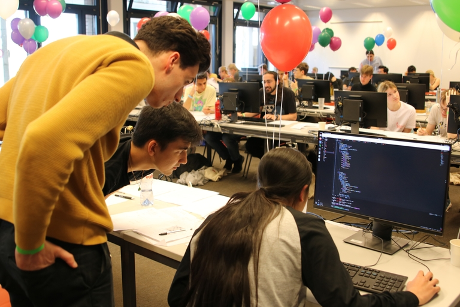

# Announcement_(en)

Hello Codeforces! 

Back from the dead, we'd like to invite you to the [online mirror](https://codeforces.com/contest/1970) of the Helvetic Coding Contest, Switzerland open championship! You can find past mirror from [2019](https://codeforces.com/contest/1184), [2018](https://codeforces.com/contest/958), [2017](https://codeforces.com/contest/802), and [2016](https://codeforces.com/contest/690).

The [Helvetic Coding Contest](https://codeforces.com/https://polympiads.ch/HC2/) used to be held yearly at [EPFL](https://codeforces.com/https://www.epfl.ch/en/). This year, the [Polympiads](https://codeforces.com/https://polympiads.ch) association is bringing it back alive! The contest itself took place on April the 13th, but the online mirror is scheduled on Saturday, [4th of May, 09:05 Swiss time](https://codeforces.com/https://www.timeanddate.com/worldclock/fixedtime.html?day=4&month=5&year=2024&hour=10&min=5&sec=0&p1=166). The duration is 4:30.

Rules:

 * you can participate in teams or individually with a single computer (1-3 people),
* standard ACM-ICPC rules (no hacking),
* the contest is not rated,
* if you have participated in the onsite contest, please do not participate in the mirror.

Contrary to what the mirror's date might lead you to believe, this year's theme is Harry Potter. It features 7 series of 3 related tasks with increasing difficulty (easy/medium/hard). Note that we do not guarantee that all problems are solvable using python. 

Thanks a lot to:

 * [Petr](https://codeforces.com/profile/Petr "Легендарный гроссмейстер Petr"), [Charbel](https://codeforces.com/profile/Charbel "Мастер Charbel"), [ScarletS](https://codeforces.com/profile/ScarletS "Мастер ScarletS"), [3EVEHAR_KOAVA](https://codeforces.com/profile/3EVEHAR_KOAVA "Эксперт 3EVEHAR_KOAVA"), [AdrienVannson](https://codeforces.com/profile/AdrienVannson "Эксперт AdrienVannson"), [bjornargh](https://codeforces.com/profile/bjornargh "Ученик bjornargh"), and [zehnsechs](https://codeforces.com/profile/zehnsechs "Ученик zehnsechs") for setting and/or coordinating the problemsetting,
* [matrix](https://codeforces.com/profile/matrix "Мастер matrix") for preparing the technical setup of the contest
* [paula](https://codeforces.com/profile/paula "Международный мастер paula"), [Macdu](https://codeforces.com/profile/Macdu "Мастер Macdu"), [McLovinn](https://codeforces.com/profile/McLovinn "Не в рейтинге, McLovinn") as well as problemsetters for testing the contest,
* All of Polympiads committee and on the day staff for making the contest possible,
* [MikeMirzayanov](https://codeforces.com/profile/MikeMirzayanov "Штаб, MikeMirzayanov") for creating the amazing Codeforces and Polygon platforms!

**UPDATE**: [Editorial](Tutorial_2_(en).md) is out, also available [as a PDF](https://codeforces.com/contest/1970/attachments/download/25401/contest-41026-en-tutorial-v2.pdf). Thanks all for participating!

**UPDATE 2**: Congratulations to the winners who solved all 21 subtasks:

 1. [thinking](https://codeforces.com/team/158975): [Ormlis](https://codeforces.com/profile/Ormlis "Легендарный гроссмейстер Ormlis"), [Mangooste](https://codeforces.com/profile/Mangooste "Международный гроссмейстер Mangooste")
2. [Captain take me!](https://codeforces.com/team/154156): [crazy_sea](https://codeforces.com/profile/crazy_sea "Легендарный гроссмейстер crazy_sea"), [A_zjzj](https://codeforces.com/profile/A_zjzj "Международный гроссмейстер A_zjzj"), [275307894a](https://codeforces.com/profile/275307894a "Международный гроссмейстер 275307894a")
3. [japan406364961](https://codeforces.com/team/157963): [Nyaan](https://codeforces.com/profile/Nyaan "Международный гроссмейстер Nyaan"), [kotatsugame](https://codeforces.com/profile/kotatsugame "Международный гроссмейстер kotatsugame"), [risujiroh](https://codeforces.com/profile/risujiroh "Международный гроссмейстер risujiroh")
4. [Qingyu Fan Club](https://codeforces.com/team/158956): [xinyoudui](https://codeforces.com/profile/xinyoudui "Ученик xinyoudui"), [GapGapGap](https://codeforces.com/profile/GapGapGap "Не в рейтинге, GapGapGap"), [InfiniteStarlight](https://codeforces.com/profile/InfiniteStarlight "Не в рейтинге, InfiniteStarlight")
5. [Idea Generators Club](https://codeforces.com/team/158874): [tedi_2.0](https://codeforces.com/profile/tedi_2.0 "Мастер tedi_2.0"), [Denisov](https://codeforces.com/profile/Denisov "Гроссмейстер Denisov"), [Valera_Grinenko](https://codeforces.com/profile/Valera_Grinenko "Международный мастер Valera_Grinenko")
6. [244mhq](https://codeforces.com/profile/244mhq "Легендарный гроссмейстер 244mhq")
7. [jiangly](https://codeforces.com/profile/jiangly "Легендарный гроссмейстер jiangly")

**UPDATE 3**: Also huge congratulations to the winners of [the onsite round](https://codeforces.com/spectator/ranklist/0e3f4002d2169012119f2d83359ada75) (no prewritten code or Internet access was allowed, so the conditions were a bit different):

 1. Felt smart (might un-participate later) — 20 subtasks
2. Nameless Silly Moon — 18 subtasks
3. ***IsEvil? — 17 subtasks
4. Breakfast Master Toaster — 16 subtasks
5. Hairy Stofler — 16 subtasks
6. thethingswedoforpizza — 15 subtasks
7. huchibuchi — 15 subtasks

We hope you enjoyed the problems, please share your thoughts in comments!

