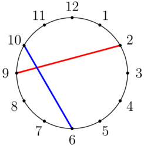
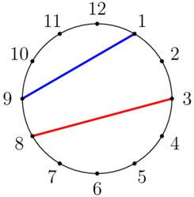

<h1 style='text-align: center;'> C. Clock and Strings</h1>

<h5 style='text-align: center;'>time limit per test: 1 second</h5>
<h5 style='text-align: center;'>memory limit per test: 256 megabytes</h5>

There is a clock labeled with the numbers $1$ through $12$ in clockwise order, as shown below.

 In this example, $(a,b,c,d)=(2,9,10,6)$, and the strings intersect. 

Alice and Bob have four distinct integers $a$, $b$, $c$, $d$ not more than $12$. Alice ties a red string connecting $a$ and $b$, and Bob ties a blue string connecting $c$ and $d$. Do the strings intersect? (The strings are straight line segments.)

### Input

The first line contains a single integer $t$ ($1 \leq t \leq 5940$) — the number of test cases.

The only line of each test case contains four distinct integers $a$, $b$, $c$, $d$ ($1 \leq a, b, c, d \leq 12$).

### Output

For each test case, output "YES" (without quotes) if the strings intersect, and "NO" (without quotes) otherwise.

You can output "YES" and "NO" in any case (for example, strings "yEs", "yes", and "Yes" will be recognized as a positive response).

## Example

### Input


```text
152 9 10 63 8 9 11 2 3 45 3 4 121 8 2 103 12 11 89 10 12 112 1 10 23 12 6 91 9 8 46 7 9 127 12 9 610 12 11 13 9 6 121 4 3 5
```
### Output

```text

YES
NO
NO
YES
YES
NO
NO
NO
NO
NO
NO
YES
YES
YES
YES

```
## Note

The first test case is pictured in the statement.

In the second test case, the strings do not intersect, as shown below. 

  

#### Tags 

#900 #NOT OK #implementation 

## Blogs
- [All Contest Problems](../Codeforces_Round_944_(Div._4).md)
- [Announcement (en)](../blogs/Announcement_(en).md)
- [Tutorial (en)](../blogs/Tutorial_(en).md)
