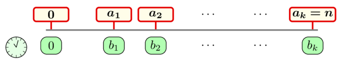

<h1 style='text-align: center;'> E. Find the Car</h1>

<h5 style='text-align: center;'>time limit per test: 3 seconds</h5>
<h5 style='text-align: center;'>memory limit per test: 256 megabytes</h5>

Timur is in a car traveling on the number line from point $0$ to point $n$. The car starts moving from point $0$ at minute $0$.

There are $k+1$ signs on the line at points $0, a_1, a_2, \dots, a_k$, and Timur knows that the car will arrive there at minutes $0, b_1, b_2, \dots, b_k$, respectively. The sequences $a$ and $b$ are strictly increasing with $a_k = n$.

  Between any two adjacent signs, the car travels with a constant speed. Timur has $q$ queries: each query will be an integer $d$, and Timur wants you to output how many minutes it takes the car to reach point $d$, rounded down to the nearest integer.

### Input

The first line contains a single integer $t$ ($1 \leq t \leq 10^4$) — the number of test cases.

The first line of each test case contains three integers $n$, $k$, and $q$, ($k \leq n \leq 10^9$; $1 \leq k, q \leq 10^5$) — the final destination, the number of points Timur knows the time for, and the number of queries respectively.

The second line of each test case contains $k$ integers $a_i$ ($1 \leq a_i \leq n$; $a_i < a_{i+1}$ for every $1 \leq i \leq k-1$; $a_k = n$). 

The third line of each test case contains $k$ integers $b_i$ ($1 \leq b_i \leq 10^9$; $b_i < b_{i+1}$ for every $1 \leq i \leq k-1$).

Each of the following $q$ lines contains a single integer $d$ ($0 \leq d \leq n$) — the distance that Timur asks the minutes passed for.

The sum of $k$ over all test cases doesn't exceed $10^5$, and the sum of $q$ over all test cases doesn't exceed $10^5$.

### Output

For each query, output a single integer — the number of minutes passed until the car reaches the point $d$, rounded down.

## Example

### Input


```text
410 1 3101006710 2 44 104 764271000000000 1 110000000001000000000999999996 1 365265
```
### Output

```text

0 6 7 
5 4 2 5 
99999999 
1 5 4 

```
## Note

For the first test case, the car goes from point $0$ to point $10$ in $10$ minutes, so the speed is $1$ unit per minute and:

* At point $0$, the time will be $0$ minutes.
* At point $6$, the time will be $6$ minutes.
* At point $7$, the time will be $7$ minutes.

For the second test case, between points $0$ and $4$, the car travels at a speed of $1$ unit per minute and between $4$ and $10$ with a speed of $2$ units per minute and:

* At point $6$, the time will be $5$ minutes.
* At point $4$, the time will be $4$ minutes.
* At point $2$, the time will be $2$ minutes.
* At point $7$, the time will be $5.5$ minutes, so the answer is $5$.

For the fourth test case, the car travels with $1.2$ units per minute, so the answers to the queries are:

* At point $2$, the time will be $1.66\dots$ minutes, so the answer is $1$.
* At point $6$, the time will be $5$ minutes.
* At point $5$, the time will be $4.16\dots$ minutes, so the answer is $4$.


#### Tags 

#1500 #NOT OK #binary_search #math #sortings 

## Blogs
- [All Contest Problems](../Codeforces_Round_944_(Div._4).md)
- [Announcement (en)](../blogs/Announcement_(en).md)
- [Tutorial (en)](../blogs/Tutorial_(en).md)
