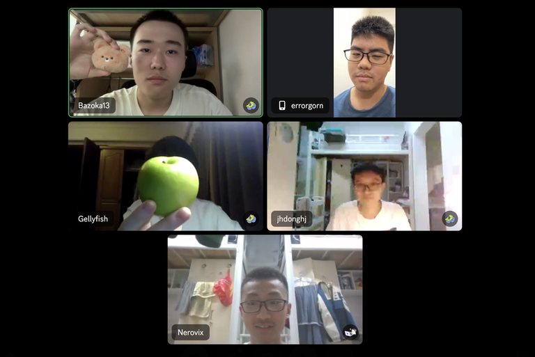

# Announcement_(en)

Hello, Codeforces! Or, as we like to say in Servalish (created by [Serval](https://codeforces.com/profile/Serval "Grandmaster Serval")): High-low, Cold-for-seize!

We are glad to invite you to participate in [Codeforces Round 947 (Div. 1 + Div. 2)](https://codeforces.com/contest/1975), which will start on [Saturday, May 25, 2024 at 20:35UTC+6](https://codeforces.com/https://www.timeanddate.com/worldclock/fixedtime.html?day=25&month=5&year=2024&hour=17&min=35&sec=0&p1=166). The round is a combined round and will be rated for everyone.

The problems are prepared by [Atomic-Jellyfish](https://codeforces.com/profile/Atomic-Jellyfish "Grandmaster Atomic-Jellyfish"), [Nerovix](https://codeforces.com/profile/Nerovix "International Master Nerovix"), [SanweiTreap](https://codeforces.com/profile/SanweiTreap "Grandmaster SanweiTreap"), [Serval](https://codeforces.com/profile/Serval "Grandmaster Serval"), [Toxel](https://codeforces.com/profile/Toxel "International Grandmaster Toxel"), [jhdonghj112](https://codeforces.com/profile/jhdonghj112 "Grandmaster jhdonghj112") and me. You will be given **9 problems** to solve in **3 hours**. Scoring distribution will be announced later.

We would like to thank everyone that makes this round possible:

 * [errorgorn](https://codeforces.com/profile/errorgorn "International Grandmaster errorgorn") for his 🐸, 😱, 👍 and 🥶 coordination.
* [Alexdat2000](https://codeforces.com/profile/Alexdat2000 "Master Alexdat2000") for Russian translation.
* [BFLSTiger](https://codeforces.com/profile/BFLSTiger "Master BFLSTiger") and [wzy2001wzy](https://codeforces.com/profile/wzy2001wzy "Master wzy2001wzy") for providing some ~~rejected~~ problem proposals and discussing problems with us.
* [2sozx](https://codeforces.com/profile/2sozx "International Master 2sozx"), [JJLeo](https://codeforces.com/profile/JJLeo "International Master JJLeo"), [YUKI_LELOUCH](https://codeforces.com/profile/YUKI_LELOUCH "Expert YUKI_LELOUCH"), [Hanghang007](https://codeforces.com/profile/Hanghang007 "Master Hanghang007"), [zlc1114](https://codeforces.com/profile/zlc1114 "Grandmaster zlc1114"), [fried-chicken](https://codeforces.com/profile/fried-chicken "Master fried-chicken"), [zhicheng](https://codeforces.com/profile/zhicheng "Expert zhicheng"), [fsfdgdg](https://codeforces.com/profile/fsfdgdg "Unrated, fsfdgdg"), [H_W_Y](https://codeforces.com/profile/H_W_Y "Candidate Master H_W_Y"), [200815147](https://codeforces.com/profile/200815147 "Master 200815147"), [CrTsIr](https://codeforces.com/profile/CrTsIr "Grandmaster CrTsIr"), [OMG_link](https://codeforces.com/profile/OMG_link "Grandmaster OMG_link"), [RDDCCD](https://codeforces.com/profile/RDDCCD "International Grandmaster RDDCCD"), [SSerxhs](https://codeforces.com/profile/SSerxhs "International Grandmaster SSerxhs"), [Tony2_CF](https://codeforces.com/profile/Tony2_CF "Grandmaster Tony2_CF"), [zhaohaikun](https://codeforces.com/profile/zhaohaikun "Grandmaster zhaohaikun"), [Hank2019](https://codeforces.com/profile/Hank2019 "Master Hank2019"), [WZKQWQ](https://codeforces.com/profile/WZKQWQ "Candidate Master WZKQWQ"), [cxaphoenix](https://codeforces.com/profile/cxaphoenix "Grandmaster cxaphoenix"), [LGyxj](https://codeforces.com/profile/LGyxj "Expert LGyxj"), [Oshwiciqwqq](https://codeforces.com/profile/Oshwiciqwqq "Master Oshwiciqwqq"), [fallleaves01](https://codeforces.com/profile/fallleaves01 "International Grandmaster fallleaves01"), [forget-star](https://codeforces.com/profile/forget-star "Candidate Master forget-star"), [monstersqaq](https://codeforces.com/profile/monstersqaq "International Grandmaster monstersqaq"), [Narukara](https://codeforces.com/profile/Narukara "Newbie Narukara"), [Ricky2021](https://codeforces.com/profile/Ricky2021 "Master Ricky2021"), [MagicalFlower](https://codeforces.com/profile/MagicalFlower "International Grandmaster MagicalFlower"), [Saule_](https://codeforces.com/profile/Saule_ "Candidate Master Saule_"), [kgqy](https://codeforces.com/profile/kgqy "Master kgqy"), [YSY_](https://codeforces.com/profile/YSY_ "Newbie YSY_"), [dan_dolmatov](https://codeforces.com/profile/dan_dolmatov "Candidate Master dan_dolmatov"), [lowbob](https://codeforces.com/profile/lowbob "Candidate Master lowbob"), [sleepwa1ker](https://codeforces.com/profile/sleepwa1ker "Candidate Master sleepwa1ker"), [Nanako](https://codeforces.com/profile/Nanako "Master Nanako"), [Qingyu](https://codeforces.com/profile/Qingyu "Legendary Grandmaster Qingyu"), [Meatherm](https://codeforces.com/profile/Meatherm "Master Meatherm"), [PersistentLife2024](https://codeforces.com/profile/PersistentLife2024 "International Grandmaster PersistentLife2024"), [Vamperox](https://codeforces.com/profile/Vamperox "Pupil Vamperox"), [FransValli](https://codeforces.com/profile/FransValli "Expert FransValli"), [skywalkert](https://codeforces.com/profile/skywalkert "International Master skywalkert"), [shstyle](https://codeforces.com/profile/shstyle "Candidate Master shstyle"), [Lavine](https://codeforces.com/profile/Lavine "Candidate Master Lavine"), [kaichou243](https://codeforces.com/profile/kaichou243 "Expert kaichou243"), [gamegame](https://codeforces.com/profile/gamegame "Legendary Grandmaster gamegame"), [Cai_Guang](https://codeforces.com/profile/Cai_Guang "Master Cai_Guang"), [xhytom](https://codeforces.com/profile/xhytom "Master xhytom"), [qiuzx](https://codeforces.com/profile/qiuzx "International Grandmaster qiuzx"), [Legitimity](https://codeforces.com/profile/Legitimity "Grandmaster Legitimity"), [Kevin114514](https://codeforces.com/profile/Kevin114514 "Legendary Grandmaster Kevin114514"), [Adam_GS](https://codeforces.com/profile/Adam_GS "International Grandmaster Adam_GS"), [htetgm](https://codeforces.com/profile/htetgm "Candidate Master htetgm"), [zengminghao](https://codeforces.com/profile/zengminghao "Master zengminghao"), [Melania](https://codeforces.com/profile/Melania "Grandmaster Melania"), [JCY_](https://codeforces.com/profile/JCY_ "International Grandmaster JCY_"), [yaoxi](https://codeforces.com/profile/yaoxi "Grandmaster yaoxi"), [schrodingerstom](https://codeforces.com/profile/schrodingerstom "International Master schrodingerstom"), [jqdai0815](https://codeforces.com/profile/jqdai0815 "Legendary Grandmaster jqdai0815"), [SSH_automaton](https://codeforces.com/profile/SSH_automaton "Grandmaster SSH_automaton"), [platelet](https://codeforces.com/profile/platelet "International Grandmaster platelet") and [sjc061031](https://codeforces.com/profile/sjc061031 "Master sjc061031") for testing the round and providing valuable feedbacks.
* [MikeMirzayanov](https://codeforces.com/profile/MikeMirzayanov "Headquarters, MikeMirzayanov") for the amazing Codeforces and Polygon platforms.
* You for participating in the round.

We recommend you to read the statements of all problems. Good luck & Have fun! (=・ω・=)

 **A no-prize quiz**Jellyfish usually got ideas from games, so what game did Jellyfish play this time?

**UPD:** Scoring distribution: 250-500-1000-1500-2000-2500-3000-4500-6000

**UPD2:** [Editorial](Tutorial_1_(en).md) is available now.

**UPD3:** Thank you for your participation in this round! Congratulations to the winners:

 1. [tourist](https://codeforces.com/profile/tourist "Legendary Grandmaster tourist")
2. [Golovanov399](https://codeforces.com/profile/Golovanov399 "Legendary Grandmaster Golovanov399")
3. [maspy](https://codeforces.com/profile/maspy "Legendary Grandmaster maspy")
4. [hos.lyric](https://codeforces.com/profile/hos.lyric "Legendary Grandmaster hos.lyric")
5. [Um_nik](https://codeforces.com/profile/Um_nik "Legendary Grandmaster Um_nik")

And the first solves on each problem:

 * A: [abdo3bkr](https://codeforces.com/profile/abdo3bkr "Pupil abdo3bkr")
* B: [Asaemon](https://codeforces.com/profile/Asaemon "Specialist Asaemon")
* C: [tourist](https://codeforces.com/profile/tourist "Legendary Grandmaster tourist")
* D: [tourist](https://codeforces.com/profile/tourist "Legendary Grandmaster tourist")
* E: [maspy](https://codeforces.com/profile/maspy "Legendary Grandmaster maspy")
* F: [tourist](https://codeforces.com/profile/tourist "Legendary Grandmaster tourist")
* G: [maspy](https://codeforces.com/profile/maspy "Legendary Grandmaster maspy")
* H: [Golovanov399](https://codeforces.com/profile/Golovanov399 "Legendary Grandmaster Golovanov399")
* I: [Ormlis](https://codeforces.com/profile/Ormlis "Legendary Grandmaster Ormlis")

**UPD4:** [Chinese editorial](https://codeforces.com/contest/1975/attachments/download/25694/editorial_zh.pdf) is available now.

Photo of reviewer and some authors: 

