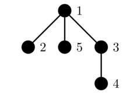

<h1 style='text-align: center;'> E. Chain Queries</h1>

<h5 style='text-align: center;'>time limit per test: 2 seconds</h5>
<h5 style='text-align: center;'>memory limit per test: 256 megabytes</h5>

You are given a tree of $n$ vertices numbered from $1$ to $n$. Initially, all vertices are colored white or black.

You are asked to perform $q$ queries:

* "u" — toggle the color of vertex $u$ (if it was white, change it to black and vice versa).

After each query, you should answer whether all the black vertices form a chain. That is, there exist two black vertices such that the simple path between them passes through all the black vertices and only the black vertices. Specifically, if there is only one black vertex, they form a chain. If there are no black vertices, they do not form a chain.

#### Input

Each test contains multiple test cases. The first line contains the number of test cases $t$ ($1\leq t\leq 10^4$). The description of the test cases follows.

The first line of each test case contains two integers $n$ and $q$ ($1\leq n,q\leq 2\cdot 10^5$).

The second line of each test case contains $n$ integers $c_1,c_2,\ldots,c_n$ ($c_i \in \{ \mathtt{0}, \mathtt{1} \}$) — the initial color of the vertices. $c_i$ denotes the color of vertex $i$ where $\mathtt{0}$ denotes the color white, and $\mathtt{1}$ denotes the color black.

Then $n - 1$ lines follow, each line contains two integers $x_i$ and $y_i$ ($1 \le x_i,y_i \le n$), indicating an edge between vertices $x_i$ and $y_i$. It is guaranteed that these edges form a tree.

The following $q$ lines each contain an integer $u_i$ ($1 \le u_i \le n$), indicating the color of vertex $u_i$ needs to be toggled.

It is guaranteed that the sum of $n$ and $q$ over all test cases respectively does not exceed $2\cdot 10^5$.

#### Output

For each query, output "Yes" if the black vertices form a chain, and output "No" otherwise.

You can output "Yes" and "No" in any case (for example, strings "yEs", "yes", "Yes" and "YES" will be recognized as a positive response).

## Examples

#### Input


```text
22 11 01 215 41 0 0 0 01 21 31 53 44325
```
#### Output

```text

No
No
Yes
Yes
No

```
#### Input


```text
45 31 1 1 1 13 52 53 41 51114 40 0 0 01 22 31 412321 1111 101
```
#### Output

```text

Yes
No
Yes
Yes
Yes
Yes
No
No
Yes

```
## Note

In the second test case, the color of the vertices are as follows:

The initial tree: 

  The first query toggles the color of vertex $4$: 

  The second query toggles the color of vertex $3$: 

  The third query toggles the color of vertex $2$: 

  The fourth query toggles the color of vertex $5$: 

  

#### Tags 

#2100 #NOT OK #binary_search #data_structures #dfs_and_similar #implementation #trees 

## Blogs
- [All Contest Problems](../Codeforces_Round_947_(Div._1_+_Div._2).md)
- [Announcement (en)](../blogs/Announcement_(en).md)
- [Tutorial #1 (en)](../blogs/Tutorial_1_(en).md)
