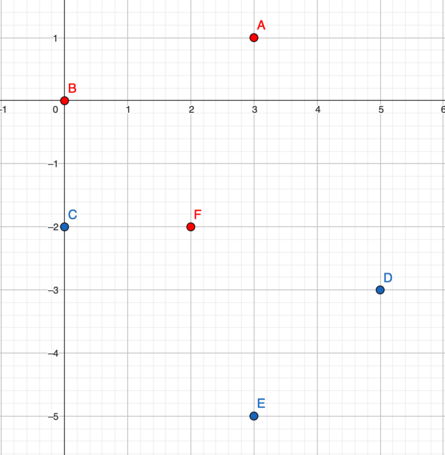
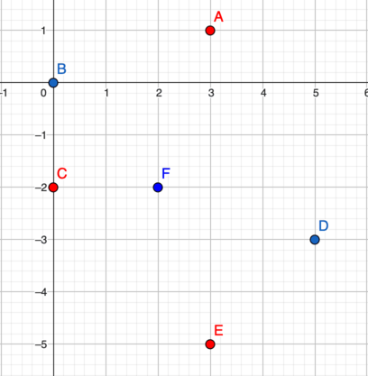

<h1 style='text-align: center;'> E. Manhattan Triangle</h1>

<h5 style='text-align: center;'>time limit per test: 3 seconds</h5>
<h5 style='text-align: center;'>memory limit per test: 256 megabytes</h5>

The Manhattan distance between two points $(x_1, y_1)$ and $(x_2, y_2)$ is defined as: $$|x_1 - x_2| + |y_1 - y_2|.$$

We call a Manhattan triangle three points on the plane, the Manhattan distances between each pair of which are equal.

You are given a set of pairwise distinct points and an even integer $d$. Your task is to find any Manhattan triangle, composed of three distinct points from the given set, where the Manhattan distance between any pair of vertices is equal to $d$.

### Input

Each test consists of multiple test cases. The first line contains one integer $t$ ($1 \le t \le 10^4$) — the number of test cases. The description of the test cases follows.

The first line of each test case contains two integers $n$ and $d$ ($3 \le n \le 2 \cdot 10^5$, $2 \le d \le 4 \cdot 10^5$, $d$ is even) — the number of points and the required Manhattan distance between the vertices of the triangle.

The $(i + 1)$-th line of each test case contains two integers $x_i$ and $y_i$ ($-10^5 \le x_i, y_i \le 10^5$) — the coordinates of the $i$-th point. It is guaranteed that all points are pairwise distinct.

It is guaranteed that the sum of $n$ over all test cases does not exceed $2 \cdot 10^5$.

### Output

For each test case, output three distinct integers $i$, $j$, and $k$ ($1 \le i,j,k \le n$) — the indices of the points forming the Manhattan triangle. If there is no solution, output "$0\ 0\ 0$" (without quotes).

If there are multiple solutions, output any of them.

## Example

### Input


```text
66 43 10 00 -25 -33 -52 -25 40 00 -25 -33 -52 -26 63 10 00 -25 -33 -52 -24 43 00 3-3 00 -310 82 1-5 -1-4 -1-5 -30 1-2 5-4 4-4 20 0-4 14 400000100000 100000-100000 100000100000 -100000-100000 -100000
```
### Output

```text

2 6 1
4 3 5
3 5 1
0 0 0
6 1 3
0 0 0

```
## Note

In the first test case:

  Points $A$, $B$, and $F$ form a Manhattan triangle, the Manhattan distance between each pair of vertices is $4$. Points $D$, $E$, and $F$ can also be the answer. In the third test case:

  Points $A$, $C$, and $E$ form a Manhattan triangle, the Manhattan distance between each pair of vertices is $6$. In the fourth test case, there are no two points with a Manhattan distance of $4$, and therefore there is no suitable Manhattan triangle.


#### Tags 

#2400 #NOT OK #binary_search #constructive_algorithms #data_structures #geometry #implementation #two_pointers 

## Blogs
- [All Contest Problems](../Codeforces_Round_951_(Div._2).md)
- [Announcement](../blogs/Announcement.md)
- [Tutorial (en)](../blogs/Tutorial_(en).md)
