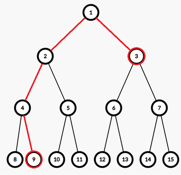

# Tutorial_1_(en)

Thank you for participating! Sorry for being much harder than usual Div. 2 :( But we still hope you find some of our problems interesting.

 **Rating predictions (Inspired by sum's editorial)**It seems like a joke now...

 

| Person | A | B | C | D | E | F |
| --- | --- | --- | --- | --- | --- | --- |
| [zltzlt](https://codeforces.com/profile/zltzlt "Grandmaster zltzlt") | 800 | 1400 | 1600 | 2000 | 2300 | 2800 |
| [small_peter](https://codeforces.com/profile/small_peter "Master small_peter") | 800 | 1400 | 1700 | 1600 |  |  |
| [WRuperD](https://codeforces.com/profile/WRuperD "Expert WRuperD") | 800 | 1300 | 1600 | 2000 |  | 2800 |
| [yinhee](https://codeforces.com/profile/yinhee "Candidate Master yinhee") | 800 | 1000 | 1500 | 2100 | 2200 | 2700 |
| [sinsop90](https://codeforces.com/profile/sinsop90 "Candidate Master sinsop90") | 1000 | 1300 | 1500 | 2000 | 2200 |  |
| [YuJiahe](https://codeforces.com/profile/YuJiahe "Master YuJiahe") | 800 | 1100 | 1600 | 1900 |  | 2700 |
| [CharlieV](https://codeforces.com/profile/CharlieV "International Grandmaster CharlieV") |  |  |  | 2400 | 2500 | 3000 |
| [JWRuixi](https://codeforces.com/profile/JWRuixi "Master JWRuixi") |  |  |  | 1800 |  |  |
| [Edwin__VanCleef](https://codeforces.com/profile/Edwin__VanCleef "Expert Edwin__VanCleef") |  |  | 1600 | 1800 |  |
| [QwQwf](https://codeforces.com/profile/QwQwf "Candidate Master QwQwf") | 1000 | 1600 | 2000 | 2100 |  |  |
| [wsc2008qwq](https://codeforces.com/profile/wsc2008qwq "Candidate Master wsc2008qwq") | 900 | 1000 | 1800 | 2500 | 2600 |  |
| [starrykiller](https://codeforces.com/profile/starrykiller "Expert starrykiller") | 900 | 1400 | 1700 | 1900 |  |  |
| [rui_er](https://codeforces.com/profile/rui_er "International Grandmaster rui_er") | 800 | 1000 | 1600 | 2100 | 2500 |  |
| [Jryno1](https://codeforces.com/profile/Jryno1 "Candidate Master Jryno1") | 800 | 1200 | 1600 | 2100 | 2700 |  |
| [StarSilk](https://codeforces.com/profile/StarSilk "International Grandmaster StarSilk") | 800 | 1200 | 1600 | 2000 | 2500 | 3000 |
| [lovely-ckj](https://codeforces.com/profile/lovely-ckj "Candidate Master lovely-ckj") | 1000 | 1300 | 1800 | 2000 |  |  |
| [FengLing](https://codeforces.com/profile/FengLing "Master FengLing") | 800 | 1100 | 1400 | 2200 |  |  |

 

|  | A | B | C | D | E | F |
| --- | --- | --- | --- | --- | --- | --- |
| Average | 857 | 1236 | 1640 | 2029 | 2438 | 2833 |
| Actual | 800 | 1300 | 1800 | 2400 | 2600 | 3000 |

[1981A - Turtle and Piggy Are Playing a Game](../problems/A._Turtle_and_Piggy_Are_Playing_a_Game.md "Codeforces Round 949 (Div. 2)")

Idea: [zltzlt](https://codeforces.com/profile/zltzlt "Grandmaster zltzlt")

 **Hint 1**What is Piggy's optimal strategy?

 **Hint 2**What does 2l≤r mean?

 **Solution**
### [1981A - Turtle and Piggy Are Playing a Game](../problems/A._Turtle_and_Piggy_Are_Playing_a_Game.md "Codeforces Round 949 (Div. 2)")

For a specific x, Piggy always chooses p such that p is a prime number, so the score is the number of prime factors of x.

It is easy to see that the number with at least t prime factors is 2t. The largest integer t satisfying 2t≤r is ⌊log2r⌋.

Also, because 2l≤r, then log2l+1≤log2r, so log2l<⌊log2r⌋≤log2r, hence l<2⌊log2r⌋≤r.

So the answer is ⌊log2r⌋.

Time complexity: O(1) or O(logr) per test case.

 **Code**
```cpp
#include <bits/stdc++.h>
using namespace std;

int main() {
	int T;
	scanf("%d", &T);
	while (T--) {
		int l, r;
		scanf("%d%d", &l, &r);
		printf("%dn", __lg(r));
	}
	return 0;
}
```
[1981B - Turtle and an Infinite Sequence](../problems/B._Turtle_and_an_Infinite_Sequence.md "Codeforces Round 949 (Div. 2)")

Idea: [zltzlt](https://codeforces.com/profile/zltzlt "Grandmaster zltzlt")

 **Hint 1**Consider each bit separately.

 **Hint 2**Calculate the time when the d-th bit of an becomes 1.

 **Solution 1**
### [1981B - Turtle and an Infinite Sequence](../problems/B._Turtle_and_an_Infinite_Sequence.md "Codeforces Round 949 (Div. 2)")

Each bit of the answer is independent, so we can calculate the value of each bit of the answer separately.

Let's consider the d-th bit. Then, ai=⌊i2d⌋mod.

Every second, a 1 will "spread" one position to the left and right.

If a_n is initially 1, then the answer for this bit is 1.

Otherwise, a_n is in a continuous segment of 0s, and we need to calculate whether the 1s on the left and right of this segment can "spread" to a_n. Let x = n \bmod 2^{d + 1}, then 0 \le x \le 2^d - 1. The left 1 spreading to a_n takes x + 1 seconds, and the right 1 spreading to a_n takes 2^d - x seconds. Therefore, if \min(x + 1, 2^d - x) \le m, then a_n can become 1. Specifically, if n < 2^d, then there is no 1 on the left. Therefore, in this case, if 2^d - x \le m, then a_n can become 1.

Time complexity: O(\log (n + m)) per test case.

 **Solution 2**The answer is the bitwise OR of the range [\max(0, n - m), n + m]. Let's figure out how to calculate the bitwise OR of the range [l, r].

We can consider each bit separately. If the d-th bit of l is 1 or the d-th bit of r is 1, then the d-th bit of the answer is 1.

Otherwise, if \left\lfloor\frac{l}{2^{d + 1}}\right\rfloor \ne \left\lfloor\frac{r}{2^{d + 1}}\right\rfloor, then the d-th bit has been flipped at least twice from l to r, so in this case the d-th bit of the answer is also 1.

Time complexity: O(\log (n + m)) per test case.

 **Code for Solution 1**
```cpp
#include <bits/stdc++.h>
#define pb emplace_back
#define fst first
#define scd second
#define mkp make_pair
#define mems(a, x) memset((a), (x), sizeof(a))

using namespace std;
typedef long long ll;
typedef double db;
typedef unsigned long long ull;
typedef long double ldb;
typedef pair<ll, ll> pii;

void solve() {
	ll n, m;
	scanf("%lld%lld", &n, &m);
	ll ans = 0;
	for (int i = 0; i <= 30; ++i) {
		ll x = n & ((1LL << (i + 1)) - 1);
		ll t = (1LL << i) - x;
		if (n >= (1LL << i)) {
			t = min(t, x + 1);
		}
		if (x >= (1LL << i) || t <= m) {
			ans |= (1LL << i);
		}
	}
	printf("%lldn", ans);
}

int main() {
	int T = 1;
	scanf("%d", &T);
	while (T--) {
		solve();
	}
	return 0;
}
```
 **Code for Solution 2**
```cpp
#include <bits/stdc++.h>
#define pb emplace_back
#define fst first
#define scd second
#define mkp make_pair
#define mems(a, x) memset((a), (x), sizeof(a))

using namespace std;
typedef long long ll;
typedef double db;
typedef unsigned long long ull;
typedef long double ldb;
typedef pair<ll, ll> pii;

void solve() {
	ll n, m;
	scanf("%lld%lld", &n, &m);
	ll l = max(0LL, n - m), r = n + m, ans = 0;
	for (int i = 31; ~i; --i) {
		if ((l & (1LL << i)) || (r & (1LL << i)) || (l >> (i + 1)) != (r >> (i + 1))) {
			ans |= (1LL << i);
		}
	}
	printf("%lldn", ans);
}

int main() {
	int T = 1;
	scanf("%d", &T);
	while (T--) {
		solve();
	}
	return 0;
}
```
[1981C - Turtle and an Incomplete Sequence](../problems/C._Turtle_and_an_Incomplete_Sequence.md "Codeforces Round 949 (Div. 2)")

Idea: [zltzlt](https://codeforces.com/profile/zltzlt "Grandmaster zltzlt")

 **Hint 1**Figure out the case where a'_1 \ne -1, a'_n \ne -1 and a'_2 = a'_3 = \cdots = a'_{n - 1} = -1 first.

 **Hint 2**Imagine a full binary tree. Consider the sequence as a walk on the full binary tree.

 **Solution**
### [1981C - Turtle and an Incomplete Sequence](../problems/C._Turtle_and_an_Incomplete_Sequence.md "Codeforces Round 949 (Div. 2)")

Handle the special case where all elements are -1 first.

Consider extracting all positions where the values are not -1, denoted as c_1, c_2, \ldots, c_k. The segments [1, c_1 - 1] and [c_k + 1, n] with -1s are easy to handle by repeatedly multiplying and dividing by 2. It's easy to see that the constructions of the segments [c_1 + 1, c_2 - 1], [c_2 + 1, c_3 - 1], \ldots, [c_{k - 1} + 1, c_k - 1] are independent of each other. Therefore, we now only need to solve the problem where a'_1 \ne -1, a'_n \ne -1, and a'_2 = a'3 = \cdots = a'{n - 1} = -1.

It's clear that if a_i is determined, then a_{i + 1} can only be one of \left\lfloor\frac{a_i}{2}\right\rfloor, 2a_i, or 2a_i + 1.

We observe that the transition a_i \to a_{i + 1} is essentially moving along an edge in a complete binary tree. Therefore, the problem is reduced to finding a path in a complete binary tree with a given start point a'_1, end point a'_n, and passing through n nodes. For example, a' = [3, -1, -1, -1, 9] is equivalent to finding a path from 3 to 9 in the complete binary tree that passes through 5 nodes:

  First, consider finding the shortest path from a'_1 to a'_n in the complete binary tree (which can be found by computing the LCA of a'_1 and a'_n; the shortest path is a'_1 \to \text{LCA}(a'_1, a'_n) \to a'_n). Let the number of nodes in this shortest path be l. There is no solution if and only if l > n or if the parities of l and n are different. Otherwise, we first fill a'_1, a'_2, \ldots, a'_l with the nodes from the shortest path, and then alternate between a'_n and 2a'_n to fill the remaining positions.

Time complexity: O(n) or O(n \log V) per test case.

 **Code**
```cpp
#include <bits/stdc++.h>
#define pb emplace_back
#define fst first
#define scd second
#define mkp make_pair
#define mems(a, x) memset((a), (x), sizeof(a))

using namespace std;
typedef long long ll;
typedef double db;
typedef unsigned long long ull;
typedef long double ldb;
typedef pair<ll, ll> pii;

const int maxn = 200100;

int n, a[maxn];

inline vector<int> path(int x, int y) {
	vector<int> L, R;
	while (__lg(x) > __lg(y)) {
		L.pb(x);
		x >>= 1;
	}
	while (__lg(y) > __lg(x)) {
		R.pb(y);
		y >>= 1;
	}
	while (x != y) {
		L.pb(x);
		R.pb(y);
		x >>= 1;
		y >>= 1;
	}
	L.pb(x);
	reverse(R.begin(), R.end());
	for (int x : R) {
		L.pb(x);
	}
	return L;
}

void solve() {
	scanf("%d", &n);
	int l = -1, r = -1;
	vector<int> vc;
	for (int i = 1; i <= n; ++i) {
		scanf("%d", &a[i]);
		if (a[i] != -1) {
			if (l == -1) {
				l = i;
			}
			r = i;
			vc.pb(i);
		}
	}
	if (l == -1) {
		for (int i = 1; i <= n; ++i) {
			printf("%d%c", (i & 1) + 1, " n"[i == n]);
		}
		return;
	}
	for (int i = l - 1; i; --i) {
		a[i] = (((l - i) & 1) ? a[l] * 2 : a[l]);
	}
	for (int i = r + 1; i <= n; ++i) {
		a[i] = (((i - r) & 1) ? a[r] * 2 : a[r]);
	}
	for (int _ = 1; _ < (int)vc.size(); ++_) {
		int l = vc[_ - 1], r = vc[_];
		vector<int> p = path(a[l], a[r]);
		if (((int)p.size() & 1) != ((r - l + 1) & 1) || r - l + 1 < (int)p.size()) {
			puts("-1");
			return;
		}
		for (int i = 0; i < (int)p.size(); ++i) {
			a[l + i] = p[i];
		}
		for (int i = l + (int)p.size(), o = 1; i <= r; ++i, o ^= 1) {
			a[i] = (o ? a[i - 1] * 2 : a[i - 1] / 2);
		}
	}
	for (int i = 1; i <= n; ++i) {
		printf("%d%c", a[i], " n"[i == n]);
	}
}

int main() {
	int T = 1;
	scanf("%d", &T);
	while (T--) {
		solve();
	}
	return 0;
}
```
[1981D - Turtle and Multiplication](../problems/D._Turtle_and_Multiplication.md "Codeforces Round 949 (Div. 2)")

Idea: [sinsop90](https://codeforces.com/profile/sinsop90 "Candidate Master sinsop90")

 **Hint 1**a_i should take different primes.

 **Hint 2**Transform it into a graph problem.

 **Solution**
### [1981D - Turtle and Multiplication](../problems/D._Turtle_and_Multiplication.md "Codeforces Round 949 (Div. 2)")

The necessary condition for a_i \cdot a_{i + 1} = a_j \cdot a_{j + 1} is that the unordered pairs (a_i, a_{i + 1}) and (a_j, a_{j + 1}) are identical. In fact, if a_i are all prime numbers, then this necessary condition becomes sufficient.

If we consider (a_i, a_{i + 1}) as an edge, then the problem can be transformed into finding the undirected complete graph with the fewest nodes (where each node also has a self-loop) such that this complete graph contains a path of n - 1 edges without repeating any edge.

Next, we consider how to calculate the length of the longest path in a complete graph with a given number of vertices that does not repeat any edges.

Let the number of vertices in the complete graph be m. If m is odd, then the degree of each node is even, so this graph contains an Eulerian path, and the path length is equal to the number of edges, which is \frac{m(m + 1)}{2}. 

If m is even, then the degree of each node is odd, and we need to remove some edges to make this graph contain an Eulerian path. It is easy to see that each edge removed can reduce the number of vertices with odd degrees by at most 2, so we need to remove at least \frac{m}{2} - 1 edges. Removing the edges (2, 3), (4, 5), \ldots, (m - 2, m - 1) will suffice, and the path length will be \frac{m(m - 1)}{2} - \frac{m}{2} + 1 + m = \frac{m^2}{2} + 1.

When n = 10^6, the smallest m is 1415, and the 1415-th smallest prime number is 11807, which satisfies a_i \le 3 \cdot 10^5.

We can use binary search to find the smallest m and use Hierholzer's algorithm to find an Eulerian path in an undirected graph.

Time complexity: O(n) per test case.

 **Code**
```cpp
#include <bits/stdc++.h>
#define pb emplace_back
#define fst first
#define scd second
#define mkp make_pair
#define mems(a, x) memset((a), (x), sizeof(a))

using namespace std;
typedef long long ll;
typedef double db;
typedef unsigned long long ull;
typedef long double ldb;
typedef pair<int, int> pii;

const int maxn = 4000100;
const int N = 1000000;

int n, a[maxn], pr[maxn], tot, stk[maxn], top;
bool vis[maxn];

inline void init() {
	for (int i = 2; i <= N; ++i) {
		if (!vis[i]) {
			pr[++tot] = i;
		}
		for (int j = 1; j <= tot && i * pr[j] <= N; ++j) {
			vis[i * pr[j]] = 1;
			if (i % pr[j] == 0) {
				break;
			}
		}
	}
	mems(vis, 0);
}

inline bool check(int x) {
	if (x & 1) {
		return x + 1 + x * (x - 1) / 2 >= n;
	} else {
		return x * (x - 1) / 2 - x / 2 + 2 + x >= n;
	}
}

vector<pii> G[10000];

void dfs(int u) {
	while (G[u].size()) {
		pii p = G[u].back();
		G[u].pop_back();
		if (vis[p.scd]) {
			continue;
		}
		vis[p.scd] = 1;
		dfs(p.fst);
	}
	stk[++top] = pr[u];
}

void solve() {
	scanf("%d", &n);
	int l = 1, r = 10000, ans = -1;
	while (l <= r) {
		int mid = (l + r) >> 1;
		if (check(mid)) {
			ans = mid;
			r = mid - 1;
		} else {
			l = mid + 1;
		}
	}
	for (int i = 1; i <= ans; ++i) {
		vector<pii>().swap(G[i]);
	}
	int tot = 0;
	for (int i = 1; i <= ans; ++i) {
		for (int j = i; j <= ans; ++j) {
			if (ans % 2 == 0 && i % 2 == 0 && i + 1 == j) {
				continue;
			}
			G[i].pb(j, ++tot);
			G[j].pb(i, tot);
		}
	}
	for (int i = 1; i <= tot; ++i) {
		vis[i] = 0;
	}
	top = 0;
	dfs(1);
	reverse(stk + 1, stk + top + 1);
	for (int i = 1; i <= n; ++i) {
		printf("%d%c", stk[i], " n"[i == n]);
	}
}

int main() {
	init();
	int T = 1;
	scanf("%d", &T);
	while (T--) {
		solve();
	}
	return 0;
}
```
[1981E - Turtle and Intersected Segments](../problems/E._Turtle_and_Intersected_Segments.md "Codeforces Round 949 (Div. 2)")

Idea: [zltzlt](https://codeforces.com/profile/zltzlt "Grandmaster zltzlt")   
 Developed by [244mhq](https://codeforces.com/profile/244mhq "Legendary Grandmaster 244mhq").

 **Hint 1**Stop thinking about Boruvka.

 **Hint 2**Most of the edges in the graph are useless.

 **Solution**
### [1981E - Turtle and Intersected Segments](../problems/E._Turtle_and_Intersected_Segments.md "Codeforces Round 949 (Div. 2)")

We observe that for three segments (l_1, r_1, a_1), (l_2, r_2, a_2), (l_3, r_3, a_3) where each pair of segments intersects (assume a_1 \le a_2 \le a_3), we only need to keep the edges between (1, 2) and (2, 3), because a_3 - a_1 = a_2 - a_1 + a_3 - a_2 and for every cycle in a graph, the edge with the maximum weight will not appear in the minimum spanning tree.

Therefore, consider the following scanline process: each segment is added at l and removed at r. When adding a segment, find its predecessor and successor in the order sorted by a and connect edges accordingly. Essentially, we maintain all the segments that exist at each moment as a chain sorted by a.

It is easy to see that after the scanline process, the number of edges is reduced to O(n). Then we can directly compute the minimum spanning tree.

Time complexity: O(n \log n) per test case.

 **Code**
```cpp
#include <bits/stdc++.h>
#define pb emplace_back
#define fst first
#define scd second
#define mkp make_pair
#define mems(a, x) memset((a), (x), sizeof(a))

using namespace std;
typedef long long ll;
typedef double db;
typedef unsigned long long ull;
typedef long double ldb;
typedef pair<int, int> pii;

const int maxn = 1000100;

int n, lsh[maxn], tot, fa[maxn];
pii b[maxn];

struct node {
	int l, r, x;
} a[maxn];

struct edg {
	int u, v, d;
	edg(int a = 0, int b = 0, int c = 0) : u(a), v(b), d(c) {}
} E[maxn];

int find(int x) {
	return fa[x] == x ? x : fa[x] = find(fa[x]);
}

inline bool merge(int x, int y) {
	x = find(x);
	y = find(y);
	if (x != y) {
		fa[x] = y;
		return 1;
	} else {
		return 0;
	}
}

void solve() {
	tot = 0;
	cin >> n;
	for (int i = 1; i <= n; ++i) {
		cin >> a[i].l >> a[i].r >> a[i].x;
		lsh[++tot] = a[i].l;
		lsh[++tot] = (++a[i].r);
	}
	int m = 0;
	sort(lsh + 1, lsh + tot + 1);
	tot = unique(lsh + 1, lsh + tot + 1) - lsh - 1;
	for (int i = 1; i <= n; ++i) {
		a[i].l = lower_bound(lsh + 1, lsh + tot + 1, a[i].l) - lsh;
		a[i].r = lower_bound(lsh + 1, lsh + tot + 1, a[i].r) - lsh;
		b[++m] = mkp(a[i].l, i);
		b[++m] = mkp(a[i].r, -i);
	}
	set<pii> S;
	sort(b + 1, b + m + 1);
	int tt = 0;
	for (int i = 1; i <= m; ++i) {
		int j = b[i].scd;
		if (j > 0) {
			auto it = S.insert(mkp(a[j].x, j)).fst;
			if (it != S.begin()) {
				int k = prev(it)->scd;
				E[++tt] = edg(j, k, abs(a[j].x - a[k].x));
			}
			if (next(it) != S.end()) {
				int k = next(it)->scd;
				E[++tt] = edg(j, k, abs(a[j].x - a[k].x));
			}
		} else {
			j = -j;
			S.erase(mkp(a[j].x, j));
		}
	}
	for (int i = 1; i <= n; ++i) {
		fa[i] = i;
	}
	sort(E + 1, E + tt + 1, [&](const edg &a, const edg &b) {
		return a.d < b.d;
	});
	ll ans = 0, cnt = 0;
	for (int i = 1; i <= tt; ++i) {
		if (merge(E[i].u, E[i].v)) {
			++cnt;
			ans += E[i].d;
		}
	}
	cout << (cnt == n - 1 ? ans : -1) << 'n';
}

int main() {
	ios::sync_with_stdio(0);
	cin.tie(0);
	cout.tie(0);
	int T = 1;
	cin >> T;
	while (T--) {
		solve();
	}
	return 0;
}
```
[1981F - Turtle and Paths on a Tree](../problems/F._Turtle_and_Paths_on_a_Tree.md "Codeforces Round 949 (Div. 2)")

Idea: [yinhee](https://codeforces.com/profile/yinhee "Candidate Master yinhee")   
 Developed by [244mhq](https://codeforces.com/profile/244mhq "Legendary Grandmaster 244mhq") and [zltzlt](https://codeforces.com/profile/zltzlt "Grandmaster zltzlt").   
 Thanks [AFewSuns](https://codeforces.com/profile/AFewSuns "Grandmaster AFewSuns") and [crazy_sea](https://codeforces.com/profile/crazy_sea "Legendary Grandmaster crazy_sea") for discovering Solution 2, which runs faster than Solution 1!

 **Hint 1**Try some dp that takes O(n^2) time.

 **Hint 2**What's the maximum MEX in the optimal good set of paths?

 **Solution 1**
### [1981F - Turtle and Paths on a Tree](../problems/F._Turtle_and_Paths_on_a_Tree.md "Codeforces Round 949 (Div. 2)")

Let's consider dp. Let f_{u, i} denote the path extending upward within the subtree rooted at u, with the condition that this path does not include the value i. The value of i ranges from [1, n + 1]. In this case, we can directly take the MEX of this path as i, because if the MEX is not i, then the MEX will be smaller, making this dp state suboptimal.

Let f_{u,i} denote the minimum result of the \operatorname{MEX} of a path that extends outside the subtree of u and is specified to be i (where i is not included in the result). Since the \operatorname{MEX} of each path does not exceed n+1, the values of i range from 1 to n+1.

Consider all the transitions for the dp:

1. If u is a leaf, then: f_{u,i} = \begin{cases} 0, & i \neq a_u \\\ +\infty, & i = a_u \end{cases}
2. If u has only one child, let the child be x. Let \text{minx} = \min\limits_{i \neq a_u} (f_{x,i} + i), then:  f_{u,i} = \begin{cases} \min(f_{x,i}, \text{minx}), & i \neq a_u \\\ +\infty, & i = a_u \end{cases}
3. If u has two children, let the children be x and y. Let \text{minx} = \min\limits_{i \neq a_u} (f_{x,i} + i) and \text{miny} = \min\limits_{i \neq a_u} (f_{y,i} + i). There are four possible transitions:
	* Continuing the path from the subtree of x, i.e., \forall i \neq a_u, f_{u,i} = \min(f_{u,i}, f_{x,i} + \text{miny})
	* Continuing the path from the subtree of y, i.e., \forall i \neq a_u, f_{u,i} = \min(f_{u,i}, f_{y,i} + \text{minx})
	* Creating a new path and merging the paths from both subtrees, i.e., \forall i \neq a_u, f_{u,i} = \min(f_{u,i}, \min\limits_{j \neq a_u} (f_{x,j} + f_{y,j} + j))
	* Creating a new path without merging the paths from the two subtrees, i.e., \forall i \neq a_u, f_{u,i} = \min(f_{u,i}, \text{minx} + \text{miny})Let k = \min(\min\limits_{i \neq a_u} (f_{x,i} + f_{y,i} + i), \text{minx} + \text{miny}), then the transition can be written as follows:  f_{u,i} = \begin{cases} \min(f_{x,i} + \text{miny}, f_{y,i} + \text{minx}, k), & i \neq a_u \\\ +\infty, & i = a_u \end{cases}

This results in a time complexity of O(n^2).

In fact, we can prove that we only need to consider MEX values up to O(\frac{n}{\ln n}) (for n = 25000, we only need to consider MEX values up to 3863). Therefore, the second dimension of the dp only needs to be enumerated up to O(\frac{n}{\ln n}) (or 3863).

Also, we have a construction of a chain that can achieve the MEX value of O(\frac{n}{\ln n}), which is enumerating i from 1 and listing all the divisors of i in descending order, such as [1, 2, 1, 3, 1, 4, 2, 1, 5, 1].

Time complexity: O(\frac{n^2}{\ln n}) per test case.

Proof of the upper bound for MEX:

Let's only consider the case of a chain. For a fixed x, consider a sequence like [a, \ldots, b, x, c, \ldots, d, x, e, \ldots, f, x, g, \ldots, h]. We can divide it into segments as follows:

[a, \ldots, b], [b, x, c], [c, \ldots, d], [d, x, e], [e, \ldots, f], [f, x, g], [g, \ldots, h]

Where segments without x have a MEX value \le x, and segments with x have a MEX value \le 4.

Let t be the answer. Then, t satisfies: (where c_i is the number of occurrences of i)

\min_{i \ge 1} (c_i + 1) i + 4 c_i \ge t

Expanding, we get:

\min_{i \ge 1} (c_i + 1) (i + 4) \ge t

Furthermore, for segments like [b, x, c], if x \ge 4, then the term 4c_i above can be reduced to 3c_i (since x can be none of 1, 2, 3). So, we have:

\min(\min_{i = 1}^3 (c_i + 1)(i + 4), \min_{i \ge 4}(c_i + 1)(i + 3)) \ge t

Hence:

c_i \ge \begin{cases} \left\lceil\frac{t}{i + 4}\right\rceil - 1 & 1 \le i \le 3 \\\ \left\lceil\frac{t}{i + 3}\right\rceil - 1 & i \ge 4 \end{cases}

This means we need O(\frac{t}{i}) occurrences of i, and since n = O(t \ln t), we have t = O(\frac{n}{\ln n}).

We also have:

n = \sum_{i \ge 1} c_i \ge \sum_{i = 1}^3 (\left\lceil\frac{t}{i + 4}\right\rceil - 1) + \sum_{i \ge 4} (\left\lceil\frac{t}{i + 3}\right\rceil - 1)

By fixing n, we can binary search for the largest t satisfying the above condition, and for n = 25000, we find t = 3863.

 **Solution 2**Read the O(n^2) part of Solution 1 first.

Consider using a segment tree to maintain the dp values. The transitions for u with at most one child are easy to maintain, so we only need to consider the case with two children.

First, use a segment tree to maintain the minimum value of f_{u,i} + i, so \text{minx} and \text{miny} can be computed. The value of f_{u,a_u} can be set to +\infty by a point update.

Ignoring how to compute k for now, in the end, all f_{x,i} are incremented by \text{miny}, all f_{y,i} are incremented by \text{minx}, and the segment trees are merged. Finally, all f_{u,i} are taken as the minimum with k.

To compute k, which is \min\limits_{i \neq a_u} (f_{x,i} + f_{y,i} + i), we can use a similar segment tree merging method, quickly computing this as we recursively descend to the leaf nodes of the segment tree. Additionally, we need to maintain the minimum value of f_{u,i}.

Time complexity: \mathcal{O}(n \log n) per test case.

 **Code for Solution 1**
```cpp
#include <bits/stdc++.h>
#define pb emplace_back
#define fst first
#define scd second
#define mkp make_pair
#define mems(a, x) memset((a), (x), sizeof(a))
 
using namespace std;
typedef long long ll;
typedef double db;
typedef unsigned long long ull;
typedef long double ldb;
typedef pair<ll, ll> pii;
 
const int maxn = 25050;
const int inf = 0x3f3f3f3f;
 
int n, m, a[maxn], f[maxn][4000];
vector<int> G[maxn];
 
void dfs(int u) {
	if (G[u].empty()) {
		for (int i = 1; i <= m; ++i) {
			f[u][i] = (i == a[u] ? inf : 0);
		}
		return;
	}
	if ((int)G[u].size() == 1) {
		int x = G[u][0];
		dfs(x);
		int mn = inf;
		for (int i = 1; i <= m; ++i) {
			if (i != a[u]) {
				mn = min(mn, f[x][i] + i);
			}
		}
		if (u == 1) {
			printf("%dn", mn);
			return;
		}
		for (int i = 1; i <= m; ++i) {
			f[u][i] = (i == a[u] ? inf : min(f[x][i], mn));
		}
		return;
	}
	int x = G[u][0], y = G[u][1], mnx = inf, mny = inf, k = inf;
	dfs(x);
	dfs(y);
	for (int i = 1; i <= m; ++i) {
		if (i != a[u]) {
			mnx = min(mnx, f[x][i] + i);
			mny = min(mny, f[y][i] + i);
			k = min(k, f[x][i] + f[y][i] + i);
		}
	}
	k = min(k, mnx + mny);
	if (u == 1) {
		printf("%dn", k);
		return;
	}
	for (int i = 1; i <= m; ++i) {
		f[u][i] = (i == a[u] ? inf : min({f[x][i] + mny, f[y][i] + mnx, k}));
	}
}
 
void solve() {
	scanf("%d", &n);
	m = min(n + 1, 3863);
	for (int i = 1; i <= n; ++i) {
		scanf("%d", &a[i]);
		vector<int>().swap(G[i]);
	}
	for (int i = 2, p; i <= n; ++i) {
		scanf("%d", &p);
		G[p].pb(i);
	}
	dfs(1);
}
 
int main() {
	int T = 1;
	scanf("%d", &T);
	while (T--) {
		solve();
	}
	return 0;
}
```
 **Code for Solution 2**
```cpp
#include<bits/stdc++.h>
using namespace std;
namespace my_std{
	#define ll long long
	#define bl bool
	ll my_pow(ll a,ll b,ll mod){
		ll res=1;
		if(!b) return 1;
		while(b){
			if(b&1) res=(res*a)%mod;
			a=(a*a)%mod;
			b>>=1;
		}
		return res;
	}
	ll qpow(ll a,ll b){
		ll res=1;
		if(!b) return 1;
		while(b){
			if(b&1) res*=a;
			a*=a;
			b>>=1;
		}
		return res;
	}
	#define db double
	#define pf printf
	#define pc putchar
	#define fr(i,x,y) for(register ll i=(x);i<=(y);i++)
	#define pfr(i,x,y) for(register ll i=(x);i>=(y);i--)
	#define go(u) for(ll i=head[u];i;i=e[i].nxt)
	#define enter pc('n')
	#define space pc(' ')
	#define fir first
	#define sec second
	#define MP make_pair
	#define il inline
	#define inf 1e18
	#define random(x) rand()*rand()%(x)
	#define inv(a,mod) my_pow((a),(mod-2),(mod))
	il ll read(){
		ll sum=0,f=1;
		char ch=0;
		while(!isdigit(ch)){
			if(ch=='-') f=-1;
			ch=getchar();
		}
		while(isdigit(ch)){
			sum=sum*10+(ch^48);
			ch=getchar();
		}
		return sum*f;
	}
	il void write(ll x){
		if(x<0){
			x=-x;
			pc('-');
		}
		if(x>9) write(x/10);
		pc(x%10+'0');
	}
	il void writeln(ll x){
		write(x);
		enter;
	}
	il void writesp(ll x){
		write(x);
		space;
	}
}
using namespace my_std;
#define LC tree[x].lc
#define RC tree[x].rc
ll t,n,a[25025],ch[25025][2],ans=inf;
ll rt[25025],tot=0;
struct node{
	ll minn1,minn2,lz,lzmin,lc,rc;
	il void addtag(ll v,ll vmin,ll l){
		minn1=min(minn1+v,vmin);
		minn2=min(minn2+v,vmin+l);
		lz+=v;
		lzmin=min(lzmin+v,vmin);
	}
}tree[1000010];
il void pushup(ll x){
	tree[x].minn1=min(tree[LC].minn1,tree[RC].minn1);
	tree[x].minn2=min(tree[LC].minn2,tree[RC].minn2);
}
il ll newnode(){
	tree[++tot]=(node){(ll)inf,(ll)inf,0,(ll)inf,0,0};
	return tot;
}
il void pushdown(ll x,ll l,ll r){
	if(!LC) LC=newnode();
	if(!RC) RC=newnode();
	ll mid=(l+r)>>1;
	tree[LC].addtag(tree[x].lz,tree[x].lzmin,l);
	tree[RC].addtag(tree[x].lz,tree[x].lzmin,mid+1);
	tree[x].lz=0;
	tree[x].lzmin=inf;
}
void upd(ll &x,ll l,ll r,ll pos){
	if(!x) x=newnode();
	if(l==r){
		tree[x].minn1=tree[x].minn2=inf;
		return;
	}
	ll mid=(l+r)>>1;
	pushdown(x,l,r);
	if(pos<=mid) upd(LC,l,mid,pos);
	else upd(RC,mid+1,r,pos);
	pushup(x);
}
void add(ll &x,ll l,ll r,ll ql,ll qr,ll v){
	if(!x) x=newnode();
	if(ql<=l&&r<=qr){
		tree[x].addtag(v,(ll)inf,l);
		return;
	}
	ll mid=(l+r)>>1;
	pushdown(x,l,r);
	if(ql<=mid) add(LC,l,mid,ql,qr,v);
	if(mid<qr) add(RC,mid+1,r,ql,qr,v);
	pushup(x);
}
void mdf(ll &x,ll l,ll r,ll ql,ll qr,ll v){
	if(!x) x=newnode();
	if(ql<=l&&r<=qr){
		tree[x].addtag(0,v,l);
		return;
	}
	ll mid=(l+r)>>1;
	pushdown(x,l,r);
	if(ql<=mid) mdf(LC,l,mid,ql,qr,v);
	if(mid<qr) mdf(RC,mid+1,r,ql,qr,v);
	pushup(x);
}
ll merge(ll x,ll y,ll l,ll r){
	if(!LC&&!RC){
		tree[y].addtag(0,tree[x].minn1,l);
		return y;
	}
	if(!tree[y].lc&&!tree[y].rc){
		tree[x].addtag(0,tree[y].minn1,l);
		return x;
	}
	ll mid=(l+r)>>1;
	pushdown(x,l,r);
	pushdown(y,l,r);
	LC=merge(LC,tree[y].lc,l,mid);
	RC=merge(RC,tree[y].rc,mid+1,r);
	pushup(x);
	return x;
}
ll query(ll x,ll y,ll l,ll r){
	if(!LC&&!RC) return tree[x].minn1+tree[y].minn2;
	if(!tree[y].lc&&!tree[y].rc) return tree[y].minn1+tree[x].minn2;
	ll mid=(l+r)>>1,res=inf;
	pushdown(x,l,r);
	pushdown(y,l,r);
	res=min(res,query(LC,tree[y].lc,l,mid));
	res=min(res,query(RC,tree[y].rc,mid+1,r));
	return res;
}
void dfs(ll u){
	if(!ch[u][0]){
		mdf(rt[u],1,n+1,1,n+1,0);
		if(a[u]<=(n+1)) upd(rt[u],1,n+1,a[u]);
		if(u==1) ans=0;
	}
	else if(!ch[u][1]){
		dfs(ch[u][0]);
		rt[u]=rt[ch[u][0]];
		if(a[u]<=(n+1)) upd(rt[u],1,n+1,a[u]);
		ll minn=tree[rt[u]].minn2;
		mdf(rt[u],1,n+1,1,n+1,minn);
		if(a[u]<=(n+1)) upd(rt[u],1,n+1,a[u]);
		if(u==1) ans=minn;
	}
	else{
		ll x=ch[u][0],y=ch[u][1];
		dfs(x);
		dfs(y);
		if(a[u]<=(n+1)){
			upd(rt[x],1,n+1,a[u]);
			upd(rt[y],1,n+1,a[u]);
		}
		ll minx=tree[rt[x]].minn2,miny=tree[rt[y]].minn2,k=min(query(rt[x],rt[y],1,n+1),minx+miny);
		add(rt[x],1,n+1,1,n+1,miny);
		add(rt[y],1,n+1,1,n+1,minx);
		rt[u]=merge(rt[x],rt[y],1,n+1);
		mdf(rt[u],1,n+1,1,n+1,k);
		if(a[u]<=(n+1)) upd(rt[u],1,n+1,a[u]);
		if(u==1) ans=k;
	}
}
il void clr(){
	fr(i,1,n) ch[i][0]=ch[i][1]=rt[i]=0;
	tot=0;
	ans=inf;
}
int main(){
	t=read();
	while(t--){
		n=read();
		fr(i,1,n) a[i]=read();
		fr(i,2,n){
			ll x=read();
			if(!ch[x][0]) ch[x][0]=i;
			else ch[x][1]=i;
		}
		dfs(1);
		writeln(ans);
		clr();
	}
}
/*
1
5
3 2 2 1 1
1 1 2 2
ans:
4 
*/ 
```
