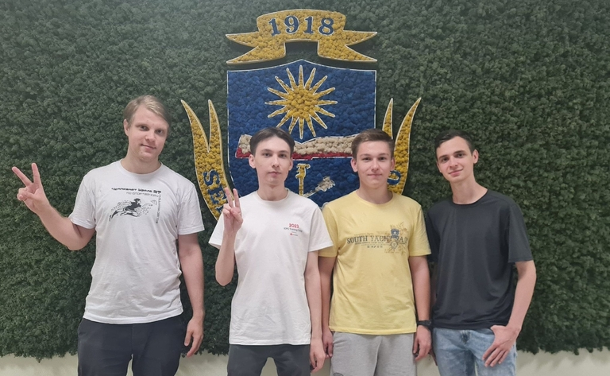

# Announcement_(en)

Hello, Codeforces!

It's been a long journey, and I'm finally pleased to invite you to participate in our [Codeforces Round 955 (Div. 2, with prizes from NEAR!)](https://codeforces.com/contest/1982 "Codeforces Round 955 (Div. 2, with prizes from NEAR!)"), which will take place on [Tuesday, June 25, 2024 at 20:35UTC+6](https://codeforces.com/https://www.timeanddate.com/worldclock/fixedtime.html?day=25&month=6&year=2024&hour=17&min=35&sec=0&p1=166).

This round will be **rated** for all participants with a rating is **below 2100**. Participants with higher ratings can participate out of competition.

During the round, you will need to solve **6 problems**. You will have **2 hours** to solve them.

The problems for the round were prepared by [nik1998](https://codeforces.com/profile/nik1998 "Candidate Master nik1998"), [egor4444ik](https://codeforces.com/profile/egor4444ik "Specialist egor4444ik"), [iamdimonis](https://codeforces.com/profile/iamdimonis "Specialist iamdimonis") and me.

We sincerely thank everyone who provided invaluable assistance in preparing this round:

 * Our insightful coordinator [74TrAkToR](https://codeforces.com/profile/74TrAkToR "Grandmaster 74TrAkToR") for excellent communication, helpful advice and assistance in problem preparation!
* [Kolychestiy](https://codeforces.com/profile/Kolychestiy "Master Kolychestiy") for improving one of the problems.
* [EJIC_B_KEDAX](https://codeforces.com/profile/EJIC_B_KEDAX "Grandmaster EJIC_B_KEDAX"), [A_G](https://codeforces.com/profile/A_G "International Grandmaster A_G"), [zwezdinv](https://codeforces.com/profile/zwezdinv "Grandmaster zwezdinv"), [Dominater069](https://codeforces.com/profile/Dominater069 "International Grandmaster Dominater069"), [culver0412](https://codeforces.com/profile/culver0412 "Grandmaster culver0412"), [TheScrasse](https://codeforces.com/profile/TheScrasse "Grandmaster TheScrasse") for red testing.
* [Kolychestiy](https://codeforces.com/profile/Kolychestiy "Master Kolychestiy"), [CSQ31](https://codeforces.com/profile/CSQ31 "Master CSQ31"), [exhausted](https://codeforces.com/profile/exhausted "Master exhausted"), [azureglow](https://codeforces.com/profile/azureglow "Master azureglow"), [harsh__h](https://codeforces.com/profile/harsh__h "Master harsh__h"), [meowcneil](https://codeforces.com/profile/meowcneil "International Master meowcneil") for yellow testing.
* [onlytrall](https://codeforces.com/profile/onlytrall "Candidate Master onlytrall"), [veleboks](https://codeforces.com/profile/veleboks "Candidate Master veleboks"), [zarubin](https://codeforces.com/profile/zarubin "Candidate Master zarubin"), [robotolev](https://codeforces.com/profile/robotolev "Candidate Master robotolev"), [TimVen74](https://codeforces.com/profile/TimVen74 "Candidate Master TimVen74"), [Vladosiya](https://codeforces.com/profile/Vladosiya "Candidate Master Vladosiya") for purple testing.
* [Alenochka](https://codeforces.com/profile/Alenochka "Expert Alenochka"), [LightSky](https://codeforces.com/profile/LightSky "Expert LightSky"), [Chugunov_Alexander](https://codeforces.com/profile/Chugunov_Alexander "Expert Chugunov_Alexander"), [slash0t](https://codeforces.com/profile/slash0t "Expert slash0t"), [PoDuReMaN](https://codeforces.com/profile/PoDuReMaN "Expert PoDuReMaN"), [katzi](https://codeforces.com/profile/katzi "Expert katzi"), [Vamperox](https://codeforces.com/profile/Vamperox "Expert Vamperox"), [redpanda](https://codeforces.com/profile/redpanda "Expert redpanda") for blue testing.
* [Matrosk1n](https://codeforces.com/profile/Matrosk1n "Specialist Matrosk1n"), [bessarab](https://codeforces.com/profile/bessarab "Specialist bessarab"), [dariasaligina](https://codeforces.com/profile/dariasaligina "Specialist dariasaligina"), [GRIVA_](https://codeforces.com/profile/GRIVA_ "Specialist GRIVA_"), [viteli](https://codeforces.com/profile/viteli "Specialist viteli"), [dazlersan1](https://codeforces.com/profile/dazlersan1 "Specialist dazlersan1") for cyan testing.
* [Kirillar2](https://codeforces.com/profile/Kirillar2 "Pupil Kirillar2"), [Sonya_2009](https://codeforces.com/profile/Sonya_2009 "Pupil Sonya_2009"), [dan00ile](https://codeforces.com/profile/dan00ile "Pupil dan00ile") for green testing.
* [venlesN](https://codeforces.com/profile/venlesN "Newbie venlesN") for gray testing.
* [MikeMirzayanov](https://codeforces.com/profile/MikeMirzayanov "Headquarters, MikeMirzayanov") for the wonderful Codeforces and Polygon systems.

We are pleased to announce that NEAR has supported the round!

NEAR was founded in 2017 by Illia Polosukhin, one of the creators of Transformers, and Alex Skidanov as an attempt to build an artificial system capable of solving competitive programming problems. You can read more about that attempt [here](https://codeforces.com/blog/entry/59746).

Ultimately, NEAR pivoted into building a blockchain protocol, which it launched in 2020.

This year, NEAR started [NEAR.AI](https://codeforces.com/https://near.ai/nearai-master-plan), a new lab with a mission to build AI systems that are open and available to everyone, instead of being controlled by a few mega-corporations.

One of the areas of focus is making models capable of reasoning reliably, and for that, competitive programming problems provide a great environment. To help us build it, we invite all the Russian-speaking members of the Codeforces community with a rating of Specialist or higher (1400+) to help us annotate step-by-step explanations of solutions to competitive programming problems. We want to annotate a very large set of problems of all difficulty levels, and pay relatively high rewards in NEAR per annotation. Don't speak Russian but speak English? Stay tuned here, we will be launching the same project for English-speaking people very soon, and will likely sponsor another round when it happens.

The round also features prizes in NEAR. Participants who rank in the top 16 will receive Ⓝ 16 each. The next 32 participants in the overall ranking (including unofficial participants) will receive Ⓝ 8 each. The following 64 participants will receive Ⓝ 4 each; the subsequent 128 participants will receive Ⓝ 2 each, and finally, the next 256 participants will receive Ⓝ 1 each.

Additionally, 64 random participants from the top 4096 in the overall ranking will each receive Ⓝ 4.

**Score distribution**: 500—1000—1000—1750—2500—3000500—1000—1000—1750—2500—3000

Wishing everyone good luck and high ratings!

**UPD**: Let's continue the series of announcements with a photo of the authors :)

**UPD 2**: [Editorial!](Tutorial.md)

**UPD 3**: **Congratulations to the winners!**

**Div 1**:

 1. [tourist](https://codeforces.com/profile/tourist "Legendary Grandmaster tourist")
2. [jiangly](https://codeforces.com/profile/jiangly "Legendary Grandmaster jiangly")
3. [SSerxhs](https://codeforces.com/profile/SSerxhs "International Grandmaster SSerxhs")
4. [kizen](https://codeforces.com/profile/kizen "Grandmaster kizen")
5. [potato167](https://codeforces.com/profile/potato167 "Legendary Grandmaster potato167")

**Div 2**:

 1. [lunchbox](https://codeforces.com/profile/lunchbox "Candidate Master lunchbox")
2. [_JiaY19_](https://codeforces.com/profile/_JiaY19_ "Specialist _JiaY19_")
3. [gxy001](https://codeforces.com/profile/gxy001 "Candidate Master gxy001")
4. [_DongY19_](https://codeforces.com/profile/_DongY19_ "Expert _DongY19_")
5. [Muelsyse_sep005](https://codeforces.com/profile/Muelsyse_sep005 "Pupil Muelsyse_sep005")

**UPD 4**: Wonderful [video analysis of A-E tasks](https://codeforces.com/blog/entry/130849). Thank you, [Shayan](https://codeforces.com/profile/Shayan "International Grandmaster Shayan")!

