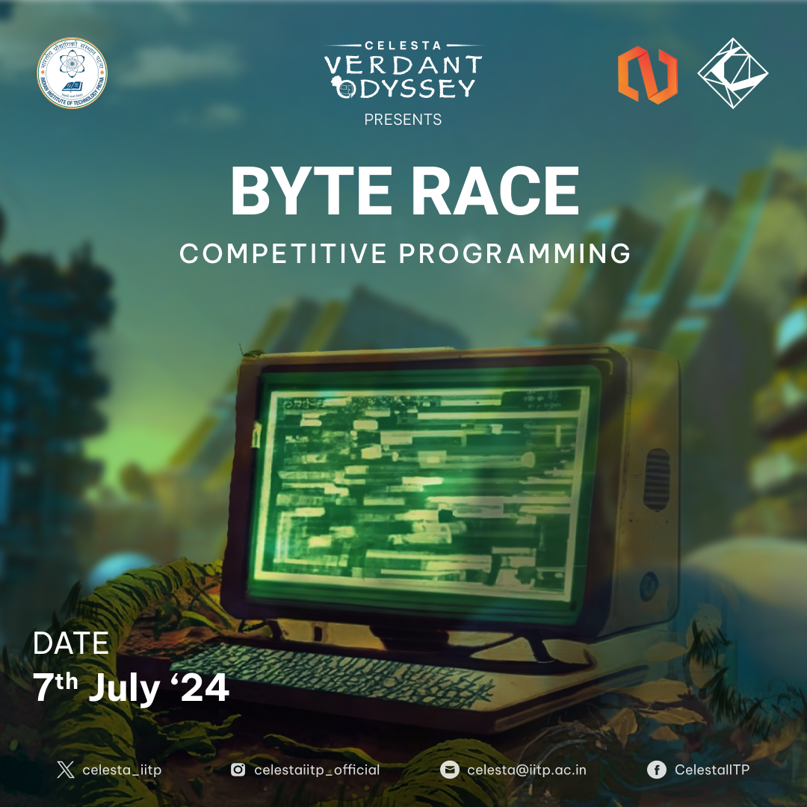

# Announcement_(en)

Hello, Codeforces!

NJACK — the Computer Science Club of IIT Patna is excited to invite you to [Codeforces Round #956 (Div. 2) and ByteRace 2024](https://codeforces.com/contest/1983 "Codeforces Round 956 (Div. 2) and ByteRace 2024") under Celesta — the annual Techno-Management Fest of IIT Patna.

The contest will take place on [Sunday, July 7, 2024 at 20:35UTC+6](https://codeforces.com/https://www.timeanddate.com/worldclock/fixedtime.html?day=7&month=7&year=2024&hour=17&min=35&sec=0&p1=166). This round will be rated for participants with rating lower than 2100.

Many thanks to all the people who made this round possible:

 * The problems were authored and prepared by [AwakeAnay](https://codeforces.com/profile/AwakeAnay "Grandmaster AwakeAnay"), [ShivanshJ](https://codeforces.com/profile/ShivanshJ "Master ShivanshJ"), [TimeWarp101](https://codeforces.com/profile/TimeWarp101 "Candidate Master TimeWarp101"), [DC17](https://codeforces.com/profile/DC17 "Candidate Master DC17"), [BlazingDragon](https://codeforces.com/profile/BlazingDragon "Expert BlazingDragon"), [Swap-nil](https://codeforces.com/profile/Swap-nil "Expert Swap-nil"), [Pew_Pew.](https://codeforces.com/profile/Pew_Pew. "Expert Pew_Pew.") and [me](https://codeforces.com/profile/MrSavageVS).
* Special thanks to [ScarletS](https://codeforces.com/profile/ScarletS "Master ScarletS") for coordinating the round (and not killing me)!
* A big shoutout and thankyou to [Alexdat2000](https://codeforces.com/profile/Alexdat2000 "Master Alexdat2000") for providing the Russian translations.
* Thanks 2.0 to [ScarletS](https://codeforces.com/profile/ScarletS "Master ScarletS") for having [improved the experience of other CF users](https://codeforces.com/blog/entry/72644?#comment-569494) over the years.
* Special mention to [mayankfrost](https://codeforces.com/profile/mayankfrost "Candidate Master mayankfrost") and [quantau](https://codeforces.com/profile/quantau "Expert quantau") for their guidance and moral support.
* [A_G](https://codeforces.com/profile/A_G "International Grandmaster A_G"), [Andreasyan](https://codeforces.com/profile/Andreasyan "Grandmaster Andreasyan"), [maomao90](https://codeforces.com/profile/maomao90 "Grandmaster maomao90"), [CSQ31](https://codeforces.com/profile/CSQ31 "Master CSQ31"), [fishy15](https://codeforces.com/profile/fishy15 "Master fishy15"), [eggag32](https://codeforces.com/profile/eggag32 "Master eggag32"), [MateoCV](https://codeforces.com/profile/MateoCV "International Master MateoCV"), [Evirir](https://codeforces.com/profile/Evirir "Master Evirir"), [bananasaur](https://codeforces.com/profile/bananasaur "Candidate Master bananasaur"), [satyam343](https://codeforces.com/profile/satyam343 "Candidate Master satyam343"), [jat.arc2004](https://codeforces.com/profile/jat.arc2004 "Candidate Master jat.arc2004"), [chromate00](https://codeforces.com/profile/chromate00 "Candidate Master chromate00"), [hashman](https://codeforces.com/profile/hashman "Expert hashman"), [Nishant_K](https://codeforces.com/profile/Nishant_K "Expert Nishant_K"), [Ali_cs7](https://codeforces.com/profile/Ali_cs7 "Expert Ali_cs7"), [Patel45](https://codeforces.com/profile/Patel45 "Expert Patel45"), [Newtech66](https://codeforces.com/profile/Newtech66 "Expert Newtech66"), [CIXTEEN](https://codeforces.com/profile/CIXTEEN "Expert CIXTEEN"), [braman](https://codeforces.com/profile/braman "Expert braman"), [7oSkaaa](https://codeforces.com/profile/7oSkaaa "Expert 7oSkaaa"), [Edward4762](https://codeforces.com/profile/Edward4762 "Expert Edward4762"), [LucaLucaM](https://codeforces.com/profile/LucaLucaM "Expert LucaLucaM"), [waidenf](https://codeforces.com/profile/waidenf "Expert waidenf"), [yoyo0869](https://codeforces.com/profile/yoyo0869 "Specialist yoyo0869"), [priyanshu.p](https://codeforces.com/profile/priyanshu.p "Specialist priyanshu.p") and [ishaandas1](https://codeforces.com/profile/ishaandas1 "Pupil ishaandas1") for testing and providing detailed feedback that improved the quality and balance of the round significantly.
* Our lord and saviour [MikeMirzayanov](https://codeforces.com/profile/MikeMirzayanov "Headquarters, MikeMirzayanov") for great systems Codeforces and Polygon.

You will have 2 hours 15 minutes to solve 7 problems.

**UPD**: Scoring Distribution: 500 — 1000 — 1250 — 1750 — 2000 — 2500 — 3000

**UPD**: [Editorial](Editorial_(en).md)

**UPD**: Congratulations to the winners!

Top 5 (Div 2):  
 1. [_worst_](https://codeforces.com/profile/_worst_ "Unrated, _worst_")  
 2. [Shirayuki_Noa](https://codeforces.com/profile/Shirayuki_Noa "Specialist Shirayuki_Noa")  
 3. [cynNYCal](https://codeforces.com/profile/cynNYCal "Unrated, cynNYCal")  
 4. [cocae](https://codeforces.com/profile/cocae "Candidate Master cocae")  
 5. [_furina](https://codeforces.com/profile/_furina "Newbie _furina")  

Top 5 (Div 1):  
 1. [neal](https://codeforces.com/profile/neal "International Grandmaster neal")  
 2. [jiangly](https://codeforces.com/profile/jiangly "Legendary Grandmaster jiangly")  
 3. [BurnedChicken](https://codeforces.com/profile/BurnedChicken "Legendary Grandmaster BurnedChicken")  
 4. [turmax](https://codeforces.com/profile/turmax "Legendary Grandmaster turmax")  
 5. [Sugar_fan](https://codeforces.com/profile/Sugar_fan "International Grandmaster Sugar_fan")  

About Celesta
-------------

Celesta is the annual Techno-Management Fest of IIT Patna. Celesta conducts a variety of events in various technical domains. Some of these are open and free for all, with exciting prizes and goodies for the winners!

You can head over to our [website](https://codeforces.com/https://celesta.iitp.ac.in/#/events-page) and check it out for yourself!

We have had the 2023 edition of ByteRace hosted on Codeforces too. Feel free to have a look: [Codeforces Round 845 (Div. 2) and ByteRace 2023](https://codeforces.com/contest/1777 "Codeforces Round 845 (Div. 2) and ByteRace 2023")

Good luck!

