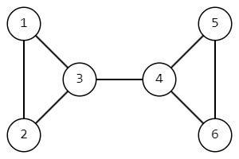
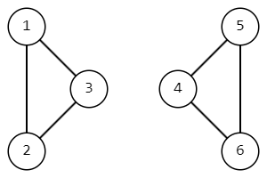
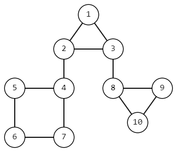
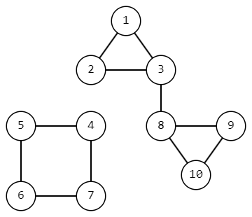

<h1 style='text-align: center;'> F. Non-academic Problem</h1>

<h5 style='text-align: center;'>time limit per test: 2 seconds</h5>
<h5 style='text-align: center;'>memory limit per test: 256 megabytes</h5>

You are given a connected undirected graph, the vertices of which are numbered with integers from $1$ to $n$. Your task is to minimize the number of pairs of vertices $1 \leq u < v \leq n$ between which there exists a path in this graph. To achieve this, you can remove exactly one edge from the graph.

Find the smallest number of pairs of vertices!

### Input

Each test consists of several sets of input data. The first line contains a single integer $t$ ($1 \leq t \leq 10^4$) — the number of sets of input data. Then follows their description.

The first line of each set of input data contains two integers $n$ and $m$ ($2 \leq n \leq 10^5$, $n - 1 \leq m \leq \min(10^5, \frac{n \cdot (n - 1)}{2})$) — the number of vertices in the graph and the number of edges.

Each of the next $m$ lines contains two integers $u$ and $v$ ($1 \leq u, v \leq n, u \neq v$), indicating that there is an undirected edge in the graph between vertices $u$ and $v$.

It is guaranteed that the given graph is connected and without multiple edges.

It is guaranteed that the sum of $n$ and the sum of $m$ over all sets of input data does not exceed $2 \cdot 10^5$.

### Output

For each set of input data, output the smallest number of pairs of reachable vertices, if exactly one edge can be removed.

## Example

### Input


```text
62 11 23 31 22 31 35 51 21 33 44 55 36 71 21 32 33 44 54 65 65 51 21 32 32 43 510 121 21 32 32 44 55 66 77 43 88 99 1010 8
```
### Output

```text

0
3
4
6
6
21

```
## Note

In the first set of input data, we will remove the single edge $(1, 2)$ and the only pair of vertices $(1, 2)$ will become unreachable from each other.

In the second set of input data, no matter which edge we remove, all vertices will be reachable from each other.

In the fourth set of input data, the graph looks like this initially.

  We will remove the edge $(3, 4)$ and then the only reachable pairs of vertices will be $(1, 2)$, $(1, 3)$, $(2, 3)$, $(4, 5)$, $(4, 6)$, $(5, 6)$.

  In the sixth set of input data, the graph looks like this initially.

  After removing the edge $(2, 4)$, the graph will look like this. Thus, there will be $21$ pairs of reachable vertices.

  

#### Tags 

#1900 #NOT OK #dfs_and_similar #graphs #trees 

## Blogs
- [All Contest Problems](../Codeforces_Round_954_(Div._3).md)
- [Announcement](../blogs/Announcement.md)
- [Tutorial #1 (en)](../blogs/Tutorial_1_(en).md)
- [Tutorial #2](../blogs/Tutorial_2.md)
