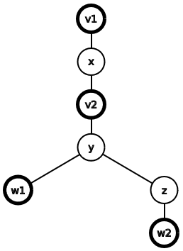
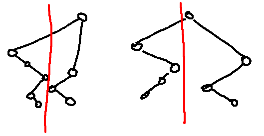

# Tutorial_2_(en)

Hope you liked the problems! We apologize for the (very?) weak tests in H.

Editorials for problems will be added over time (and hints), for now, please take a look at the available hints and model solutions.

 **Easter eggs****A**ForceCodes is a reference CrossCode, you should try it.

 **C**Basil is one of the characters in OMORI, you should also try it.

 **D**"World is Mine" is one of Hatsune Miku's most well known songs, and a fan-made MV has a lot of cakes in it) I originally wanted to make the characters names Miku and Sweetheart(from OMORI), but decided to stick to Alice and Bob to keep the statement clean.

 **E**The epigraph is a reference to KonoSuba.

 **H**The epigraph is a quote from Celeste (you should try it), and the title is a reference to one of it's locations, Mirror Temple, but only now there are fumo dolls in it)

[1987A - Upload More RAM](../problems/A._Upload_More_RAM.md)

 **Hints****Hint 1**Your strategy is to upload more RAM as soon as you can upload.

 **Hint 2**You will upload on the seconds 1,k+1,2k+1,3k+1….

 **Tutorial**
### [1987A - Загрузить больше памяти](../problems/A._Upload_More_RAM.md "EPIC Institute of Technology Round Summer 2024 (Div. 1 + Div. 2)")

First of all, note that you can upload $n$ GBs of RAM if you upload on the seconds $1, k + 1, 2k + 1, \ldots, (n - 1)k + 1$, taking $(n - 1)k + 1$ seconds in total. Let's show that it's impossible to do better.

Suppose there is a solution where you upload on the times $t_1, t_2, \ldots t_n$, taking $t_n$ seconds to upload $n$ GBs. Then, $t_{i} + k \le t_{i + 1}$ for all $1 \le i \le n - 1$. Furthermore, $t_1 \ge 1$. Thus, we have the following inequalities: $$1 \le t_1$$ $$t_1 + k \le t_2$$ $$t_2 + k \le t_3$$ $$\ldots$$ $$t_{n - 1} + k \le t_n$$

Using them, we get the inequalities $$1 \le t_1$$ $$1 + k \le t_1 + k \le t_2$$ $$1 + 2k \le t_2 + k \le t_3$$ $$\ldots$$ $$1 + (n - 1)k \le t_{n-1} + k \le t_n$$

So, $t_n \ge (n - 1)k + 1$, so the answer is at least $(n - 1)k + 1$. Since there is always a way to upload in exactly this many seconds, this is the answer to our problem.

Complexity: $\mathcal{O}(1)$

 **Solution**
```cpp
#include <bits/stdc++.h>

#define all(x) (x).begin(), (x).end()
#define allr(x) (x).rbegin(), (x).rend()

const char nl = 'n';
typedef long long ll;
typedef long double ld;

using namespace std;

void solve() {
    int n, k;
    cin >> n >> k;
    cout << 1 + (n - 1) * k << nl;
}

int main() {
	ios::sync_with_stdio(0); cin.tie(0);
    
    int t;
    cin >> t;
    while (t--) {
        solve();
    }
}
```
 **Feedback*** Good problem 


[*68*](https://codeforces.com/data/like?action=like "I like this")
* Average problem 

 
[*224*](https://codeforces.com/data/like?action=like "I like this")
* Bad problem 

 
[*20*](https://codeforces.com/data/like?action=like "I like this")
[1987B - K-Sort](../problems/B._K-Sort.md)

 **Hints****Hint 1**Try solving the problem if instead of paying k+1 coins, you pay k coins.

 **Hint 2**What if you pay only 1 coin per operation?

 **Hint 3**Can you add the answers to the k coins per operation problem and 1 coin per operation problem to get the answer?

 **Tutorial**
### [1987B - К-сортировка](../problems/B._K-Sort.md "EPIC Institute of Technology Round Summer 2024 (Div. 1 + Div. 2)")

Suppose that after all of the operations, the value at index $i$ has been increased by $b_i$. Notice that our cost can be factored into two parts: $k$ is responsible for how many elements we choose, and $1$ is responsible for how many operations we apply.

Since we have to apply at least $\max(b_i)$ operations, and over all operations we select a total of $\sum{b_i}$ elements, we have to pay at least $\sum{b_i} + \max(b_i)$ coins. This bound is also achievable, if on the $m$-th operation (numbered from $1$ to $\max(b_i)$) we select all indices with $b_i \ge m$.

Suppose the resulting array is sorted ($a_1 + b_1 \le a_2 + b_2 \le \ldots \le a_n + b_n$). Then, $a_i + b_i \le a_j + b_j$ must hold for all $1 \le i \le j \le n$. Using $b_i \ge 0$, we get $a_j + b_j \ge a_i + b_i \ge a_i \implies b_j \ge a_i - a_j$ for all $1 \le i \le j$. If we define $p_j := max(a_1, \ldots, a_j)$, we get $b_j \ge p_j - a_j$. This gives the lower bounds $\sum{b_i} \ge \sum(p_i - a_i)$ and $\max(b_i) \ge \max(p_i - a_i)$. Setting $b_i := p_i - a_i$ achieves them, so the answer to our problem is $\sum(p_i - a_i) + \max(p_i - a_i)$ coins.

Complexity: $\mathcal{O}(n)$

Note: it's possible to simulate the process on the values of $b$ (described above) in $\mathcal{O}(n \log n)$.

 **Solution**
```cpp
#include <bits/stdc++.h>

#define all(x) (x).begin(), (x).end()
#define allr(x) (x).rbegin(), (x).rend()

const char nl = 'n';
typedef long long ll;
typedef long double ld;

using namespace std;

void solve() {
    int n;
    cin >> n;
    
    vector<int> a(n);
    for (int i = 0; i < n; i++) cin >> a[i];
    
    ll pref_max = 0, s = 0, mx = 0;
    for (int i = 0; i < n; i++) {
        pref_max = max(pref_max, (ll) a[i]);
        
        ll d = pref_max - a[i];
        s += d;
        mx = max(mx, d);
    }
    
    cout << s + mx << nl;
}

int main() {
	ios::sync_with_stdio(0); cin.tie(0);
    
    int T;
    cin >> T;
    while (T--) {
        solve();
    }
}
```
 **Feedback*** Good problem 

 
[*322*](https://codeforces.com/data/like?action=like "I like this")
* Average problem 

 
[*56*](https://codeforces.com/data/like?action=like "I like this")
* Bad problem 

 
[*40*](https://codeforces.com/data/like?action=like "I like this")
[1987C - Basil's Garden](../problems/C._Basil's_Garden.md)

 **Hints****Hint 1**When will hn first become equal to zero?

 **Hint 2**When will hn−1 first become equal to zero?

 **Hint 3**Consider solving from right to left.

 **Hint 4**Suppose you want to find when hi will fist be equal to zero. Try splitting into the cases hi=hi+1 at some point (before both are zero) and when that is not true.

 **Tutorial**
### [1987C - Сад Бейзила](../problems/C._Basil's_Garden.md "EPIC Institute of Technology Round Summer 2024 (Div. 1 + Div. 2)")

First, let's try to find when $h_{n}$ will first be equal to zero. The answer is clearly $h_{n}$.

Suppose for some $2 \le i \le n$ we know that $h_{i}$ will first become equal to zero at time $t_{i}$ ($t_n = h_n$). If at some point in time, $h_{i-1}$ was equal to $h_{i}$ (at the start of the second and before they are both equal to zero), $t_{i-1}$ is equal to $t_{i} + 1$. Since after that point in time, if $h_{i}$ decreases, $h_{i-1}$ must decrease in the next second. If $h_{i-1}$ is never equal to $h_{i}$ (until they hit zero), $h_{i - 1}$ must always be strictly greater than $h_{i}$. This means that $h_{i-1}$ will keep decreasing every second until it hits zero, so $t_{i-1}$ is equal to $h_{i-1}$ in this case.

Examples: 

* The array $[2, 3, 1, 1, 1]$ changes as follows: $[2, \color{red}{3}, 1, 1, \color{red}{1}] \rightarrow [2, \color{red}{2}, 1, \color{red}{1}, 0] \rightarrow [\color{red}{2}, 1, \color{red}{1}, 0, 0] \rightarrow$ $[1, \color{red}{1}, 0, 0, 0] \rightarrow [\color{red}{1}, 0, 0, 0, 0] \rightarrow [0, 0, 0, 0, 0]$. If we focus on the first two elements, they change as follows: $[2, \color{red}{3}] \rightarrow [2, \color{red}{2}] \rightarrow [\color{red}{2}, 1] \rightarrow [1, 1] \rightarrow [1, \color{red}{1}] \rightarrow [\color{red}{1}, 0] \rightarrow [0, 0]$.
* The array $[4, 1, 1]$ changes as follows: $[\color{red}{4}, 1, \color{red}{1}] \rightarrow [\color{red}{3}, \color{red}{1}, 0] \rightarrow [\color{red}{2}, 0, 0] \rightarrow [\color{red}{1}, 0, 0] \rightarrow [0, 0, 0]$.

Let's combine the two cases. If initially $h_{i-1} \le h_{i}$ holds, $h_{i-1}$ will become equal to $h_{i}$ at some point in time, so $t_{i-1} = t_{i} + 1$. Else, $h_{i-1} > h_{i}$, so $t_{i-1} = h_{i-1}$. Combining the two, we get $t_{i-1} = \max(h_{i-1}, t_{i} + 1)$.

Since we know $t_n = h_n$, we can easily calculate all the other values of $t_i$ by iterating from $n - 1$ to $1$. The answer to the problem is $t_1$, since $t_{i-1} \ge t_{i} + 1$ for all $2 \le i \le n$.

Complexity: $\mathcal{O}(n)$

 **Solution**
```cpp
#include <bits/stdc++.h>

#define all(x) (x).begin(), (x).end()
#define allr(x) (x).rbegin(), (x).rend()

const char nl = 'n';
typedef long long ll;
typedef long double ld;

using namespace std;

void solve() {
    int n;
    cin >> n;
    
    vector<int> h(n);
    for (auto &x: h) cin >> x;
    
    int ans = h[n - 1];
    for (int i = n - 2; i >= 0; i--) {
        ans = max(ans + 1, h[i]);
    }

    cout << ans << nl;
}

int main() {
	ios::sync_with_stdio(0); cin.tie(0);
    
    int T;
    cin >> T;
    while (T--) solve();
}
```
 **Feedback*** Good problem 

 
[*356*](https://codeforces.com/data/like?action=like "I like this")
* Average problem 

 
[*40*](https://codeforces.com/data/like?action=like "I like this")
* Bad problem 

 
[*294*](https://codeforces.com/data/like?action=like "I like this")
[1987D - World is Mine](../problems/D._World_is_Mine.md)

 **Hints****Hint 1**Alice's optimal strategy is simple (and kind of fixed).

 **Hint 2**Alice always eats the least tasty cake that she can eat.

 **Hint 3**Convert the given array to it's count array ci, for example, the array [1,5,1,2,1,5,1] becomes [4,1,2].

 **Hint 4**Consider a set of k indices that Bob will choose to eat (ci1+...+cik cakes in total). What are the necessary conditions for him to be able to do that?

 **Hint 5**For a set of k indices 1≤i1≤i2≤…≤ik≤|c|, the condition ∑pj=1cij≤ip−p must hold for all 1≤p≤k.

 **Tutorial**
### [1987D - Мир мой](../problems/D._World_is_Mine.md "EPIC Institute of Technology Round Summer 2024 (Div. 1 + Div. 2)")

Let's consider Alice's strategy. Notice that if both players play optimally, Alice eating a cake with a tastiness value of $t$ is equivalent to her eating all remaining cakes with $a_i \le t$. Since it is better for her to have more cakes to choose from later on, she will choose the minimum possible $t$ on each turn.

Now let's consider Bob's strategy. Suppose Bob ate at least one cake with a tastiness value of $t$. Then he has to have eaten all of them, because eating only some of them does not affect Alice's possible moves, resulting in wasted turns (he might be forced to waste moves at the end of the game when there are some leftover cakes).

Let $A_1, \ldots, A_m$ be the sorted unique values of $a_1, \ldots, a_n$, and let $c_i$ be the number of occurrences of $A_i$ in $a$. Then the game is reduced to Alice finding the first $c_i > 0$ and assigning $c_i := 0$, and Bob choosing any $c_i > 0$ and decreasing it by $1$.

Since Bob's optimal strategy is for each $c_i$ either not to touch it or make $c_i = 0$, we can model it as him selecting some set of indices $1 \le i_1 < \ldots < i_k \le m$ and zeroing out $c_{i_1}, c_{i_2}, \ldots, c_{i_k}$ in this order. To be able to zero out $c_{i_p}$ ($1 \le p \le k$), Alice must not have gotten to the value $c_{i_p}$. In $c_{i_1} + \ldots + c_{i_p}$ turns, Alice will zero out exactly that many values. Additionally, Bob would have zeroed out $p - 1$ values before index $i_p$. So, $c_{i_1} + \ldots + c_{i_p} + p - 1$ must be less than $i_p$. Transforming this a bit, we get that the condition $\sum_{j=1}^{p}{c_{i_j}} \le i_p - p$ must hold for all $1 \le p \le k$.

Bob's objective to maximize the size of the set of incides $1 \le i_1 < \ldots < i_k \le m$. Let $dp[i][k] =$ the minimum possible $\sum_{j=1}^{k}{c_{i_j}}$ over all valid sets of indices $1 \le i_1 < \ldots < i_k \le i$. Initialize $dp[0][0] = 0$, and everything else to $+\infty$. The main idea is to grow valid sets of indices one index at a time.

We will iterate over all $i$ from $1$ to $m$, and then for each $k$ from $0$ to $m$. The transitions are: 

* $dp[i][k] = \min(dp[i][k], d[i - 1][k])$, which corresponds to not using the current index in the set.
* Let $s := dp[i - 1][k - 1] + c_i$. If $s \le i_k - k$, update $dp[i][k] = \min(dp[i][k], s)$, which is equivalent to adding the current index to the set. We only need to check the condition on the last index because it is already satisfied for all the previous indices.

The answer to the problem is $m - y$, where $y$ is the largest value where $dp[m][y] < +\infty$.

Complexity: $\mathcal{O}(n^2)$

Note: it is possible to solve in $\mathcal{O}(n \log n)$ by making an additional observation.

 **Solution**
```cpp
#include <bits/stdc++.h>

#define all(x) (x).begin(), (x).end()
#define allr(x) (x).rbegin(), (x).rend()

const char nl = 'n';
typedef long long ll;
typedef long double ld;

using namespace std;

const int inf = 1e9;

void solve() {
    vector<int> a;
    {
        int n;
        cin >> n;
        
        map<int, int> cnt;
        while (n--) {
            int x;
            cin >> x;
            cnt[x]++;
        }
        
        for (auto const &[k, v]: cnt) {
            a.push_back(v);
        }
    }
    
    int n = a.size();
    vector<int> dp(n + 1, inf);
    dp[0] = 0;
    
    for (int i = 1; i <= n; i++) {
        vector<int> ndp = dp;
        
        for (int k = 1; k <= n; k++) {
            int nv = dp[k - 1] + a[i - 1];
            
            if (nv <= i - k) {
                ndp[k] = min(ndp[k], nv);
            }
        }
        
        dp = ndp;
    }
    
    int ans = n;
    while (dp[ans] >= inf) ans--;
    cout << n - ans << nl;
}

int main() {
	ios::sync_with_stdio(0); cin.tie(0);
    
    int T;
    cin >> T;
    while (T--) solve();
}
```
 **Feedback*** Good problem 

 
[*480*](https://codeforces.com/data/like?action=like "I like this")
* Average problem 

 
[*36*](https://codeforces.com/data/like?action=like "I like this")
* Bad problem 

 
[*130*](https://codeforces.com/data/like?action=like "I like this")
[1987E - Wonderful Tree!](../problems/E._Wonderful_Tree!.md)

 **Hints****Hint 1**Let bv=∑u∈Lau−av if L is not empty and +∞ otherwise. What does the operation do to the values of b? What does the objective change to?

 **Hint 2**Let v be an ancestor of w and dv<dw (d is the depth array). Then, you can add 1 to bv and subtract 1 from bw in dw−dv operations. Let this be our new operation on a pair of vertices (v,w).

 **Hint 3**Suppose one optimal sequence of operations uses it on (v1,w1) and (v2,w2), and the paths v1→w1 and v2→w2 intersect. Let dv1≤dv2. Then, if dw1≤dw2, it is not less optimal to apply the operation on (v1,w2) and (v2,w1).

 **Hint 4**Pick the closest vertex to v while bv<0.

 **Tutorial**
### [1987E - Прекрасное дерево!](../problems/E._Wonderful_Tree!.md "EPIC Institute of Technology Round Summer 2024 (Div. 1 + Div. 2)")

Let $b_v := \sum_{u \in L}{a_u} - a_v$ if $L$ is not empty and $b_v := +\infty$ otherwise. Then, in one operation we decrease $b_v$ by $1$ and increase $b_{p_v}$ by $1$ ($p_v$ is the parent of $v$), and our objective is to make $b_v \ge 0$ for all vertices $v$ in as few operations as possible.

We can actually chain our operations to form a more powerful one. In particular, the new operation becomes: 

* Select two vertices $v$ and $w$ such that $d_v \le d_w$ and $v$ is an ancestor of $w$ by paying $d_w - d_v$ coins, where $d_v$ is the depth of vertex $v$.
* Decrease $b_w$ by $1$ and increase $b_v$ by $1$.

 The objective remains the same: make all $b_v \ge 0$ by paying as few coins as possible.Suppose one optimal sequence of operations applies the operations on the pairs of vertices $(v_1, w_1)$ and $(v_2, w_2)$ and the paths $v_1 \rightarrow w_1$ and $v_2 \rightarrow w_2$ intersect. Then, applying the operations on the pairs of vertices $(v_1, w_2)$ and $(v_2, w_1)$, is not less optimal since $(d_{w_1} - d_{v_1}) + (d_{w_2} - d_{v_2}) = (d_{w_2} - d_{v_1}) + (d_{w_1} - d_{v_2})$. This means that we can choose which operations to apply on lower $v$ without caring about its ancestors.

  Example of two operations on $(v_1, w_1)$ and $(v_2, w_2)$. Suppose that after some sequence of operations, which includes the operation $(v, w)$, there is a vertex $u$ in the subtree of $v$ with $d_u < d_w$ and $b_u > 0$. Then, it is optimal to apply the operation on $(v, u)$ instead of $(v, w)$. This means that we want to apply the operation on the closest vertices in the subtree of $v$.

The two observations above lead to a greedy. We will iterate over all $v$ from $n$ to $1$, and while $b_v$ is less than zero, keep applying the operation on $(v, u)$, where $u$ is the closest vertex in the subtree of $v$ with $b_u > 0$. This is possible to implement in a number of ways, one of them includes running a bfs from each vertex $v$.

Complexity: $\mathcal{O}(n^2)$

Note: it is possible to solve this problem faster, up to only $\mathcal{O}(n)$ time.

 **Solution**
```cpp
#include <bits/stdc++.h>

#define all(x) (x).begin(), (x).end()
#define allr(x) (x).rbegin(), (x).rend()

const char nl = 'n';
typedef long long ll;
typedef long double ld;

using namespace std;

const ll inf = 1e15;

void solve() {
    int n;
    cin >> n;
    
    vector<int> a(n);
    for (auto &x: a) cin >> x;
    
    vector<int> d(n);
    vector<vector<int>> g(n);
    for (int i = 1; i < n; i++) {
        int p;
        cin >> p;
        p--;
        
        g[p].push_back(i);
        d[i] = d[p] + 1;
    }
    
    vector<ll> b(n); // b[v] = sum(a[u]) - a[v]
    for (int v = 0; v < n; v++) {
        if (g[v].empty()) {
            b[v] = inf;
        } else {
            b[v] = -a[v];
        
            for (int u: g[v]) {
                b[v] += a[u];
            }
        }
    }
    
    ll ans = 0;
    for (int v = n - 1; v >= 0; v--) {
        queue<int> q;
        
        q.push(v);
        while (!q.empty()) {
            int i = q.front();
            q.pop();
            
            for (int u: g[i]) {
                ll delta = min(-b[v], b[u]);
                
                if (delta > 0) {
                    b[v] += delta;
                    b[u] -= delta;
                    ans += delta * (d[u] - d[v]);
                }
                
                q.push(u);
            }
        }
    }
    
    cout << ans << nl;
}

int main() {
	ios::sync_with_stdio(0); cin.tie(0);
    
    int T;
    cin >> T;
    while (T--) {
        solve();
    }
}
```
 **Feedback*** Good problem 

 
[*177*](https://codeforces.com/data/like?action=like "I like this")
* Average problem 

 
[*22*](https://codeforces.com/data/like?action=like "I like this")
* Bad problem 

 
[*36*](https://codeforces.com/data/like?action=like "I like this")
[1987F1 - Interesting Problem (Easy Version)](../problems/F1._Interesting_Problem_(Easy_Version).md) and [1987F2 - Interesting Problem (Hard Version)](../problems/F2._Interesting_Problem_(Hard_Version).md)

 **Hints****Hint 1**Does the operation have any connection to balanced bracket sequences?

 **Tutorial**
### [1987F2 - Интересная задача (сложная версия)](../problems/F2._Interesting_Problem_(Hard_Version).md "EPIC Institute of Technology Round Summer 2024 (Div. 1 + Div. 2)")

Balanced bracket sequence analogy

Suppose there is a way to remove the entire array. Let's look at the process in reverse. Then, we are effectively inserting pairs of adjacent elements into an array until we get the original one. Let's look at a mirror process, where instead we keep inserting pairs of brackets $()$ to get a balanced bracket sequence.

For example, consider the array $[1, 2, 5, 4, 5, 7, 7, 1]$. Then, one possible way to delete it is $[1, 2, 5, 4, 5, 7, \color{red}{7}, \color{blue}{1}] \rightarrow [1, 2, 5, \color{red}{4}, \color{blue}{5}, 7] \rightarrow [1, \color{red}{2}, \color{blue}{5}, 7] \rightarrow [\color{red}{1}, \color{blue}{7}] \rightarrow []$. If we now build our bracket sequence, we get $\emptyset \rightarrow \color{red}{(}\color{blue}{)} \rightarrow (\color{red}{(}\color{blue}{)}) \rightarrow (()\color{red}{(}\color{blue}{)}) \rightarrow (()())\color{red}{(}\color{blue}{)}$.

Note that such a bracket sequence doesn't tell us in which order the operation needs to be performed, only on which indices.

Solution

Let's go back to the original problem. Suppose we want to eventually perform the operation on index $i$ (in the indexation of the original array). Then, two conditions must be met: 

1. $a_i \equiv i \pmod{2}$ must hold, since the operation does not change the parity of indices.
2. Exactly $\frac{i - a_i}{2}$ operations must be made to the left of $a_i$ before we apply the operation on it.

This, together with the bracket analogy, leads to a pretty natural dynamic programming solution: $dp[l][r] = $ min number of operations that need to be performed to the left of $l$ to be able to remove the subsegment $a_l, \ldots, a_r$. If $l > r$, initialize $dp[l][r] := 0$, else initialize $dp[l][r] := +\infty$.

Similar to dps on balanced bracket sequences, for $a_l$, we will iterate over the other element $a_m$ with which we will perform the operation, $l \equiv m \pmod{2}$: 

* If $dp[l+1][m-1]$ is greater than $\frac{l - a_l}{2}$, it is impossible to apply the operation on the pair $(a_l, a_m)$, so we do not update $dp[l][r]$.
* Else, it will take at least $op := \max(\frac{l - a_l}{2}, dp[m+1][r] - \frac{m-l+1}{2})$ operations to the left of $l$ to delete this subsegment if we want to perform the operation on $(a_l, a_m)$. So we update as follows: $dp[l][r] := \min(dp[l][r], op)$.

Suppose we have calculated all the values of $dp[l][r]$. Let's introduce $dp2[r] =$ the maximum number of times that we can perform the operation on the prefix $a_1, a_2, \ldots, a_r$, initially $dp2[r] := 0$ for all $0 \le r \le n$. Then, for some $r$, the transitions are to iterate over all $1 \le l \le r$ and update $dp2[r] := \max(dp2[r], dp2[l - 1] + \frac{r - l + 1}{2})$ if $dp[l][r] \le dp2[l - 1]$ holds. 

The answer to the problem is $dp2[n]$.

It takes $\mathcal{O}(n^3)$ time to calculate the values of $dp[l][r]$, and $\mathcal{O}(n^2)$ time for $dp2[r]$. 

Complexity: $\mathcal{O}(n^3)$

Note: to solve F1, you can calculate the values of $dp[l][r][k] =$ the maximum number of operations that you can perform on the subsegment $a_l, \ldots, a_r$ if exactly $k$ operations were performed to the left of $l$, which can be done similar to the way above in $O(n^4)$. The answer will be $dp[1][n][0]$.

 **Solution (F2)**
```cpp
#include <bits/stdc++.h>

#define all(x) (x).begin(), (x).end()
#define allr(x) (x).rbegin(), (x).rend()

const char nl = 'n';
typedef long long ll;
typedef long double ld;

using namespace std;

const int inf = 1e9;

void solve() {
    int n;
    cin >> n;
    
    vector<int> a(n);
    for (int i = 0; i < n; i++) cin >> a[i];
    
    
    vector<vector<int>> dp(n + 1, vector<int> (n + 1, inf));
    
    for (int i = 0; i <= n; i++) {
        dp[i][i] = 0;
    }
    
    for (int le = 1; le <= n; le++) {
        for (int l = 0; l + le <= n; l++) {
            if (a[l] % 2 != (l + 1) % 2) continue;
            if (a[l] > l + 1) continue;
            int v = (l + 1 - a[l]) / 2;
            
            int r = l + le;
            for (int m = l + 1; m < r; m += 2) { // index of the closing bracket
                if (dp[l + 1][m] <= v) {
                    int new_val = max(v, dp[m + 1][r] - (m - l + 1) / 2);
                    dp[l][r] = min(dp[l][r], new_val);
                }
            }
        }
    }
    
    vector<int> dp2(n + 1);
    for (int i = 0; i < n; i++) {
        dp2[i + 1] = dp2[i];
        
        for (int j = 0; j < i; j++) {
            if (dp[j][i + 1] <= dp2[j]) {
                dp2[i + 1] = max(dp2[i + 1], dp2[j] + (i - j + 1) / 2);
            }
        }
    }
    
    cout << dp2[n] << nl;
}

int main() {
	ios::sync_with_stdio(0); cin.tie(0);
    
    int T;
    cin >> T;
    while (T--) {
        solve();
    }
}
```
 **Feedback (F1)*** Good problem 

 
[*95*](https://codeforces.com/data/like?action=like "I like this")
* Average problem 

 
[*4*](https://codeforces.com/data/like?action=like "I like this")
* Bad problem 

 
[*92*](https://codeforces.com/data/like?action=like "I like this")
 **Feedback (F2)*** Good problem 

 
[*98*](https://codeforces.com/data/like?action=like "I like this")
* Average problem 

 
[*3*](https://codeforces.com/data/like?action=like "I like this")
* Bad problem 

 
[*33*](https://codeforces.com/data/like?action=like "I like this")
[1987G1 - Spinning Round (Easy Version)](../problems/G1._Spinning_Round_(Easy_Version).md)

 **Hints**Meow? (Waiting for something to happen?)

 **Tutorial (by errorgorn)**Consider that the edges are directed from i→li or i→ri respectively. So that edges point from vertices with smaller values to vertices with larger values. That is a→b implies that pa<pb.

Notice that by definition, every vertex must have only 1 edge that is going out of it. Therefore, if we consider the diameter to be something like v1→v2→v3→…→vk←…←vd−1←vd, since it is impossible for there to be some ←vi→ since each vertex has exactly one edge going out of it.

Therefore, it makes that we can split the path into 2 distinct parts: - v1→v2→v3→…→vk - vd→vd−1→…→vk

I claim that I can choose some m such that the path v1→v2→v3→…→vk−1 and vd→vd−1→…→vk+1 are in the range [1,m] and [m+1,n] or vice versa. That we are able to cut the array into half and each path will stay on their side.



The red line shown above is the cutting line, as described. Proof is at the bottom under Proof 1 for completeness.

Now, we want to use this idea to make a meet in the middle solutions where we merge max stacks from both sides. Specifically: - maintain a max stack of elements as we are sweeping from i=1…n. - for each element on the max stack, maintain the maximum size of a path that is rooted on that element.

Here is an example with p=[4,1,5,3,2,6]

 * i=1: s=[(4,1)]
* i=2: s=[(4,2),(1,1)]
* i=3: s=[(5,3)]
* i=4: s=[(5,3),(3,1)]
* i=5: s=[(5,3),(3,2),(2,1)]
* i=6: s=[(6,4)]

When we insert a new element x, we pop all (pi,val) with pi<px and add in (x,max(val)+1) into the stack. Now, all elements of the stack has to updated with si,1:=max(si,1,si+1,1+1), which is really updating a suffix of s∗,1 with val+k,…,val+1,val. 

Firstly, it is clear that the 2 vertices we merge, should have the biggest pi value, since a bigger pi value implies a bigger path size.

What we care about is the biggest path size possible only using vertices on [1,i], which we denote array best. In the above example, best=[1,2,3,3,4]. We really only care about obtaining the array best and not s. We can find this array in O(nlogn) using segment trees or even in O(n).

However, we cannot directly take the biggest values on each side. Consider p=[2,1∣,3,4]. On the left and right side, the max stacks are [2,1] and [4,3] respectively, but we cannot connect 2 with 4 since the 3 is blocking the 2.

Suppose a1,a2,…,as are the prefix maximums while b1,b2,…,bt are the suffix maximums.

Then, if the dividing line is at ai≤m<ai+1, we will merge ai on the left side with ai+1 on the right side. Similarly, if the dividing line is at bi≤m<bi+1, we will merge bi on the left side with bi+1 on the right side.

So, if ai≤m<ai+1, it is equivalent to merging the best path on [1,m] and (m,ai+1) since then ai+1 will be the root of the best path on the right side. It is similar for bi≤m<bi+1.

Actually, we can prove that instead of (m,ai+1), (m,ai) is enough, and the proof is left as an exercise.

The total complexity becomes O(nlogn) or O(n) depending on how quickly array best is found for subarrays.

### Proof 1

Suppose that there are 2 paths a1→a2→…→as and b1→b2→…→bt, a1<b1, and as=bt but they do not intersect at any vertices other vertices. Then we will prove that there is no such case where a′s>b′t.

Suppose that it is true that we can find some as′>bt′.

Let (s′,t′) be the minimum counterexample so that as′>bt′ but as′−1<bt. Therefore, we have as′−1<bt<as′. By definition, that ras′−1=as′, we have pbt<pas′−1.

Then, as cannot be in between as′−1 and as′ or else ras′−1=as≠as′. But, then we need to find a path from bt′ to bt=as which does not touch either as′−1 or as′ which is impossible.

 **Solution**
```cpp
#include <bits/stdc++.h>
using namespace std;

#define ii pair<int,int>
#define fi first
#define se second

#define pub push_back
#define pob pop_back

#define rep(x,start,end) for(int x=(start)-((start)>(end));x!=(end)-((start)>(end));((start)<(end)?x++:x--))
#define sz(x) (int)(x).size()

int n;
int arr[400005];
string s;

int ans[2][400005];
int t[400005];
vector<int> stk[2];

vector<ii> process(int l,int r,int val[]){
	vector<ii> v;
	int curr=0;
	
	rep(x,l,r+1){
		ii res={x,0};
		while (!v.empty() && arr[v.back().fi]<arr[x]){
			int t=v.back().se; v.pob();
			if (!v.empty()) v.back().se=max(v.back().se,t+1);
			res.se=max(res.se,t+1);
		}
		v.pub(res);
		
		curr=max(curr,res.se+sz(v));
		val[x]=curr;
	}
	
	return v;
}

signed main(){
	ios::sync_with_stdio(0);
	cin.tie(0);
	cout.tie(0);
	cin.exceptions(ios::badbit | ios::failbit);
	
	int TC;
	cin>>TC;
	while (TC--){
		cin>>n;
		rep(x,1,n+1) cin>>arr[x];
		cin>>s;
		
		rep(z,0,2){
			auto v=process(1,n,ans[z]);
			stk[z].clear();
			for (auto [a,b]:v) stk[z].pub(a);
			reverse(arr+1,arr+n+1);
		}
		
		int mx=ans[0][stk[0][0]]+ans[1][n-stk[0][0]+1]-1;
		
		rep(z,0,2){
			rep(x,0,sz(stk[z])-1){
				process(stk[z][x],stk[z][x+1],t);
				rep(y,stk[z][x],stk[z][x+1]) mx=max(mx,t[y]+ans[z^1][n-y]);
			}
			
			reverse(arr+1,arr+n+1);
		}
		
		cout<<mx-1<<endl;
	}
}
```
 **Feedback*** Good problem 

 
[*26*](https://codeforces.com/data/like?action=like "I like this")
* Average problem 

 
[*4*](https://codeforces.com/data/like?action=like "I like this")
* Bad problem 

 
[*13*](https://codeforces.com/data/like?action=like "I like this")
[1987G2 - Spinning Round (Hard Version)](../problems/G2._Spinning_Round_(Hard_Version).md)

 **Hints****Hint 1**Consider dp[li][ri]= a set of pairs (a,b) of possible depths of two paths that do not intersect and start from li and ri respectively.

 **Hint 2**You only need to store only a couple of pairs in dp[li][ri].

 **Tutorial**
### [1987G2 - Очень круглый спин (сложная версия)](../problems/G2._Spinning_Round_(Hard_Version).md "EPIC Institute of Technology Round Summer 2024 (Div. 1 + Div. 2)")

For simplicity, let $p_0 = p_{n+1} = +\infty$, and let's recalculate the values of $l_i$ and $r_i$. Then, the answer is not $-1$ if for all $1 \le i \le n$ and $p_i < n$: 

* $s_i =~$L $\implies l_i \ge 1$.
* $s_i =~$R $\implies r_i \le n$.
* $s_i =~$? $\implies l_i \ge 1$ or $r_i \le n$.

Let $dp[tl][tr]$ store some set of pairs $(a, b)$, where for some valid graph: 

* $a$ is a possible depth of a path that starts at index $tl$ and passes only through indices $tl \le i \le tr$.
* $b$ is a possible depth of a path that starts at index $tr$ and passes only through indices $tl \le i \le tr$.
* The paths do not intersect.

 We are only interested in the values of $tl$ and $tr$ where $tl = l_i$ and $tr = r_i$ for some $1 \le i \le n$. Initialize $dp[tl][tr] := \{ (0, 0) \}$.Let's iterate over all $i$ in order of increasing $p_i$. For each $i$ ($tl = l_i$ and $tr = r_i$), we will iterate over all pairs $(d_1, d_2)$ in $dp[tl][i]$ and $(e_1, e_2)$ in $dp[i][tr]$: 

* If $s_i \neq $ R and $tl \ge 1$, we can add the edge $(tl, i)$, so:
	+ Update the answer with $\max(ans, d_1 + 1 + \max(d_2, e_1))$.
	+ Add the pairs $(d_1, e_2)$, $(d_2 + 1, e_2)$, and $(e_1 + 1, e_2)$ to $dp[tl][tr]$.
* If $s_i \neq $ L and $tr \le n$, we can add the edge $(i, tr)$, so:
	+ Update the answer with $\max(ans, \max(d_2, e_1) + 1 + e_2)$.
	+ Add the pairs $(d_1, d_2 + 1)$, $(d_1, e_1 + 1)$, and $(d_1, e_2)$ to $dp[tl][tr]$.

Turns out, it is enough to store at most three pairs for each $dp[tl][tr]$. Specifically, it is enough to store: 

* One pair with the maximum possible $a$.
* One pair with the maximum possible $b$.
* One pair with the maximum possible $a + b$.

If true, this leads to an $\mathcal{O}(n)$ or $\mathcal{O}(n \log n)$ solution, albeit with a large constant factor.

Proof

We will proceed with a proof by induction.

Hypothesis: it is enough to store the three pairs described above.

Base case: for $i$ with $l_i = i - 1$ and $r_i = i + 1$, only the pairs $(0, 0)$, $(1, 0)$ and $(0, 1)$ are possible.

Induction step: For some $i$, let $dp[tl][i]$ and $dp[i][tr]$ only store the three pairs described above.

First of all, we update the answer with the same value: 

* When adding the left edge:
	+ If the answer came from $d_1 + 1 + d_2$, we maximize $d_1 + d_2$.
	+ If the answer came from $d_1 + 1 + e_1$, we maximize $d_1$ and $e_1$.
* When adding the right edge:
	+ If the answer came from $d_2 + 1 + e_2$, we maximize $d_2$ and $e_2$.
	+ If the answer came from $e_1 + 1 + e_2$, we maximize $e_1 + e_2$.

Secondly, $dp[tl][tr]$ will store the pairs with the same values of $\max a$, $\max b$, and $\max (a + b)$; as in the case when all pairs are stored on all previous stages: 

* When adding the left edge, it is clearly not less optimal to add only the pair $(\max(d_1, d_2 + 1, e_1 + 1), e_2)$:
	+ When maximizing $a$, we maximize $\max(d_1, d_2 + 1, e_1 + 1)$, which we do by maximizing $d_1$, $d_2$, or $e_1$.
	+ When maximizing $b$, we maximize $e_2$.
	+ When maximizing $a + b$, we maximize $d_1 + e_2$, $d_2 + e_2$, or $e_1 + e_2$, which we do by induction.
* When adding the right edge, we can only add the pair $(d_1, \max(d_2 + 1, e_1 + 1, e_2))$:
	+ When maximizing $a$, we maximize $d_1$.
	+ When maximizing $b$, we maximize $\max(d_2 + 1, e_1 + 1, e_2)$, which we do by maximizing $d_2$, $e_1$, or $e_2$.
	+ When maximizing $a + b$, we maximize $d_1 + d_2$, $d_1 + e_1$, or $d_1 + e_2$, which we do by induction.

Thus, we achieve the same answer by only storing these pairs, which concludes our proof.

Complexity: $\mathcal{O}(n)$ or $\mathcal{O}(n \log n)$

Note: there are a number of other possible solutions, please refer to the comments below.

 **Solution**
```cpp
#include <bits/stdc++.h>

#define all(x) (x).begin(), (x).end()
#define allr(x) (x).rbegin(), (x).rend()

const char nl = 'n';
typedef long long ll;
typedef long double ld;

using namespace std;

array<vector<int>, 2> get_l_and_r(vector<int> &p) {
    int n = p.size();
    
    vector<int> l(n), r(n);
    
    stack<int> s;
    for (int i = 0; i < n; i++) {
        while (!s.empty() && p[s.top()] < p[i]) s.pop();
        
        if (s.empty()) l[i] = -1;
        else l[i] = s.top();
        
        s.push(i);
    }
    
    s = {};
    for (int i = n - 1; i >= 0; i--) {
        while (!s.empty() && p[s.top()] < p[i]) s.pop();
        
        if (s.empty()) r[i] = n;
        else r[i] = s.top();
        
        s.push(i);
    }
    
    return {l, r};
}

int ans_l_edge(array<int, 2> d, array<int, 2> e) {
    return d[0] + 1 + max(d[1], e[0]);
}

int ans_r_edge(array<int, 2> d, array<int, 2> e) {
    return e[1] + 1 + max(d[1], e[0]);
}

array<int, 2> add_l_edge(array<int, 2> d, array<int, 2> e) {
    return {max({d[0], d[1] + 1, e[0] + 1}), e[1]};
}

array<int, 2> add_r_edge(array<int, 2> d, array<int, 2> e) {
    return {d[0], max({d[1] + 1, e[0] + 1, e[1]})};
}

vector<array<int, 2>> process_dp(vector<array<int, 2>> &dp) {
    array<int, 2> max_a = {-1, -1}, max_b = {-1, -1}, max_s = {-1, -1};
    
    for (auto [a, b]: dp) {
        if (a > max_a[0] || (a == max_a[0] && b > max_a[1])) {
            max_a = {a, b};
        }
        
        if (b > max_b[1] || (b == max_b[1] && a > max_b[0])) {
            max_b = {a, b};
        }
        
        if (a + b > max_s[0] + max_s[1]) {
            max_s = {a, b};
        }
    }
    
    return {max_a, max_b, max_s};
}

void add_to_map(map<array<int, 2>, int> &dp_ind, int &len_dp, array<int, 2> a) {
    if (!dp_ind.count(a)) {
        dp_ind[a] = len_dp++;
    }
}

void solve() {
    int n;
    cin >> n;
    
    vector<int> p(n);
    for (int i = 0; i < n; i++) cin >> p[i];
    
    string s;
    cin >> s;
    
    auto [l, r] = get_l_and_r(p);
    
    for (int i = 0; i < n; i++) {
        if (p[i] == n) continue;
        
        if (l[i] == -1 && s[i] == 'L') {
            cout << -1 << nl;
            return;
        }
        
        if (r[i] == n && s[i] == 'R') {
            cout << -1 << nl;
            return;
        }
    }
    
    int ans = 0;
    
    vector<int> q(n + 1);
    for (int i = 0; i < n; i++) {
        q[p[i]] = i;
    }
    
    int len_dp = 0;
    map<array<int, 2>, int> dp_ind;
    
    for (int x = 1; x <= n; x++) {
        int i = q[x];
        int tl = l[i], tr = r[i];
        
        add_to_map(dp_ind, len_dp, {tl, i});
        add_to_map(dp_ind, len_dp, {i, tr});
        add_to_map(dp_ind, len_dp, {tl, tr});
    }
    
    vector<vector<array<int, 2>>> dp(len_dp, {{0, 0}});
    for (int x = 1; x <= n; x++) {
        int i = q[x];
        int tl = l[i], tr = r[i];
        
        int ind_l = dp_ind[{tl, i}];
        int ind_r = dp_ind[{i, tr}];
        int ind_c = dp_ind[{tl, tr}];
        
        for (auto const &d: dp[ind_l]) {
            for (auto const &e: dp[ind_r]) {
                ans = max(ans, d[1] + e[0]);
                
                if (tl >= 0 && s[i] != 'R') {
                    ans = max(ans, ans_l_edge(d, e));
                    dp[ind_c].push_back(add_l_edge(d, e));
                }
                
                if (tr <= n - 1 && s[i] != 'L') {
                    ans = max(ans, ans_r_edge(d, e));
                    dp[ind_c].push_back(add_r_edge(d, e));
                }
            }
        }
        
        dp[ind_c] = process_dp(dp[ind_c]);
    }
    
    cout << ans << nl;
}

int main() {
	ios::sync_with_stdio(0); cin.tie(0);

    int T;
    cin >> T;
    while (T--) {
        solve();
    }
}
```
 **Feedback*** Good problem 

 
[*9*](https://codeforces.com/data/like?action=like "I like this")
* Average problem 

 
[*2*](https://codeforces.com/data/like?action=like "I like this")
* Bad problem 

 
[*17*](https://codeforces.com/data/like?action=like "I like this")
[1987H - Fumo Temple](../problems/H._Fumo_Temple.md)

Please try solving the problem with a deterministic solution :)

 **Hints****Hint 1**Think of the query result as some number between |i−i0|+|j−j0| and |i−i0|+|j−j0|+(|i−i0|+1)⋅(|j−j0|+1).

 **Hint 2**Try solving for n=1.

 **Hint 3**Try solving in nlog2(m) queries (might be useful later).

 **Hint 4**Try to either decrease n by a bit, or decrease m by a lot.

 **Hint 5**One way to do that would be to either decrease n by 3 or decrease m by a lot.

 **Hint 6**Make all the queries in the middle row of a three row strip.

 **Hint 7**"Binary search" base case for small m.

 **Tutorial**
### [1987H - Храм фумо](../problems/H._Fumo_Temple.md "EPIC Institute of Technology Round Summer 2024 (Div. 1 + Div. 2)")

In this solution, we will assume that there is no matrix $a$ and the interactor just returns some number $x$ between $di + dj \le x \le di + dj + (di + 1)(dj + 1)$, where $di = |i - i_0|$ and $dj = |j - j_0|$.

Let's first solve for $n = 1$. Let the hidden cell be $(1, j_0)$. Let $l = 1$ and $r = m$. On each iteration, we will query the cell $(1, l)$, let the result be $x$. If $x = 0$, we are done. Else, we know that $j_0 - l \le x \le j_0 - l + (j_0 - l + 1)$. Transforming, we get $\max(l + 1, \frac{x-1}{2} + l) \le j_0 \le \min(r, x + l)$. So, on each iteration, we at least half the length of $[l; r]$, so we use at most $\lceil \log_2(m) \rceil$ queries. This allows us to solve the problem in $n \cdot \lceil \log_2(m) \rceil$ queries, if for each row we assume that the hidden cell is in it and then run the algorithm above.

We will solve the problem recursively, ensuring $n \le m$. If $m \le A$ (we will choose $A$ later), we can solve the problem for the remaining rows in $A \cdot \lceil \log_2(A) \rceil$ queries. 

Else, our objective is to either decrease $m$ by a lot, or decrease $n$ by a bit and recurse further. To do that, we will query the three cells $(2, \frac{3m}{16}), (2, \frac{m}{2}), (2, \frac{13m}{16})$ (choose integer coordinates + things should be pretty symmetrical). This ensures that for large enough $m$, if we get a large query result $> B$ ($B$ is around $\frac{3m}{4}$), we will know that $i_0 \ge 4$ must hold, and so we will recurse with $n_{new} = n - 3$ and $m_{new} = m$. If not, we will recurse to $n_{new} \le m_{new} \le B$ ($n_{new} \le m_{new}$ since we query on the edge of the matrix).

For the model solution below, we take at most $63$ queries to get to $m \le A = 25$, so we solve the problem in at most $n + 3 \cdot 21 + 25 \cdot \lceil \log_2(25) \rceil = n + 188 \le n + 225$ queries. You can get a slightly better constant factor with this solution, or you can even reduce $n$ by a rate of quicker than $1$ per $1$ query.

Complexity: $\mathcal{O}(nm)$

 **Solution**
```cpp
#include <bits/stdc++.h>

#define all(x) (x).begin(), (x).end()
#define allr(x) (x).rbegin(), (x).rend()

const char nl = 'n';
typedef long long ll;
typedef long double ld;

using namespace std;

int ans_x = 0, ans_y = 0, cnt_q = 0;
// Coordinates are flipped
int query(int x, int y) {
    cnt_q++;

    int res = 0;
    cout << "? " << y << ' ' << x << endl;
    cout.flush();
    
    cin >> res;
    
    if (res < 0) {
        exit(0);
    }
    
    if (res == 0) {
        ans_x = x;
        ans_y = y;
    }
    
    return res;
}

/* Explanation:
 * Splits the stripe of three into |a-O-a-b-O-b-a-O-a|.
 * O are the three query points (all in the same column). 
 * Cons: hard to correctly account for errors in a non-bruteforce way.
 * Pros: gives a better constant factor (3 / 4 of the original length)
 * Number of queries: n + 3 * 21 + 25 * ceil(log(25, 2)) + eps 
 * Though the binary search part uses less queries than that */

void f(int lx, int rx, int ly, int ry) {
    int n = rx - lx + 1;
    
    // Bruteforce base case (uses binary search)
    if (n <= 25) { // can be n <= 22 or above
        for (int x = lx; x <= rx; x++) {
            int lb = ly, ub = ry;
            
            while (lb <= ub) {
                int res = query(x, lb);
                
                int low_y = ((res - 1) + 1) / 2, high_y = res;
                
                int new_lb = lb + max(1, low_y), new_ub = min(ub, lb + high_y);
                lb = new_lb;
                ub = new_ub;
            }
        }
        
        return;
    }
    
    
    // Here, (2a - 1) + (2b - 1) + (2a - 1) = n
    int a = 3 * (n + 3) / 16;
    int y = min(ry, ly + 1);
    
    int x1 = lx + a - 1;
    x1 = max(x1, lx);
    x1 = min(x1, rx);
    
    int x2 = (lx + rx) / 2;
    x2 = max(x2, x1 + 1);
    x2 = min(x2, rx);
    
    int x3 = rx - a + 1;
    x3 = max(x3, x2 + 1);
    x3 = min(x3, rx);


    int m = min(3, ry - ly + 1);
    vector<vector<bool>> good(n, vector<bool> (m, true));
    
    int new_lx = lx, new_rx = rx;
    int new_ly = ly, new_ry = ry;
    
    for (int x: {x1, x2, x3}) {
        int res = query(x, y);
        
        new_lx = max(new_lx, x - res);
        new_rx = min(new_rx, x + res);
        
        new_ly = max(new_ly, y - res);
        new_ry = min(new_ry, y + res);
        
        for (int i = 0; i < n; i++) {
            for (int j = 0; j < m; j++) {
                int r_x = lx + i, r_y = ly + j;
                
                int dx = abs(r_x - x);
                int dy = abs(r_y - y);
                
                int d = dx + dy;
                int S = (dx + 1) * (dy + 1);
                
                // d <= res <= d + S must hold
                if (res < d || d + S < res) {
                    good[i][j] = false;
                }
            }
        }
    }
    
    bool has_good = false;
    for (auto vx: good) {
        for (auto vy: vx) {
            if (vy) {
                has_good = true;
            }
        }
    }
    good.clear();
    good.shrink_to_fit();
    
    if (has_good) {
        f(new_lx, new_rx, new_ly, new_ry);
    } else {
        f(lx, rx, ly + m, ry);
    }
}

void solve() {
    int n, m;
    cin >> n >> m;
    ans_x = 0; ans_y = 0; cnt_q = 0;
    
    f(1, m, 1, n);
    
    cout << "! " << ans_y << ' ' << ans_x << endl;
    cout.flush();
    
    cerr << n << ' ' << cnt_q << " | " << n + 225 << endl;
}

int main() {
	ios::sync_with_stdio(0); cin.tie(0);
    
    int T;
    cin >> T;
    while (T--) {
        solve();
    }
}
```
 **Feedback*** Good problem 

 
[*19*](https://codeforces.com/data/like?action=like "I like this")
* Average problem 

 
[*3*](https://codeforces.com/data/like?action=like "I like this")
* Bad problem 

 
[*22*](https://codeforces.com/data/like?action=like "I like this")
