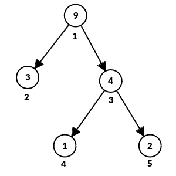

<h1 style='text-align: center;'> E. Wonderful Tree!</h1>

<h5 style='text-align: center;'>time limit per test: 2 seconds</h5>
<h5 style='text-align: center;'>memory limit per test: 256 megabytes</h5>

God's Blessing on This ArrayForces!A Random PebbleYou are given a tree with $n$ vertices, rooted at vertex $1$. The $i$-th vertex has an integer $a_i$ written on it.

Let $L$ be the set of all direct children$^{\text{∗}}$ of $v$. A tree is called wonderful, if for all vertices $v$ where $L$ is not empty, $$a_v \le \sum_{u \in L}{a_u}.$$ In one operation, you choose any vertex $v$ and increase $a_v$ by $1$.

Find the minimum number of operations needed to make the given tree wonderful!

$^{\text{∗}}$ Vertex $u$ is called a direct child of vertex $v$ if: 

* $u$ and $v$ are connected by an edge, and
* $v$ is on the (unique) path from $u$ to the root of the tree.
### Input

Each test contains multiple test cases. The first line of input contains a single integer $t$ ($1 \le t \le 1000$) — the number of test cases. The description of the test cases follows.

The first line of each test case contains a single integer $n$ ($2 \le n \le 5000$) — the number of vertices in the tree.

The second line of each test case contains $n$ integers $a_1, a_2, \ldots, a_n$ ($0 \le a_i \le 10^9$) — the values initially written on the vertices.

The third line of each test case contains $n - 1$ integers $p_2, p_3 , \ldots, p_n$ ($1 \le p_i < i$), indicating that there is an edge from vertex $p_i$ to vertex $i$. It is guaranteed that the given edges form a tree.

It is guaranteed that the sum of $n$ over all test cases does not exceed $5000$.

### Output

For each test case, output a single integer — the minimum number of operations needed to make the tree wonderful.

## Example

### Input


```text
459 3 4 1 21 1 3 325 31236 54130 0 01 2
```
### Output

```text

3
2
0
0

```
## Note

The tree in the first test case: 

  You can apply the operation once on vertex $5$ and twice on vertex $2$ to get a wonderful tree.

In the second test case, you can apply the operation twice on vertex $2$ to get a wonderful tree.

In the third and fourth test cases, the tree is already wonderful, so you don't need to apply any operations.


#### Tags 

#2000 #NOT OK #brute_force #data_structures #dfs_and_similar #dsu #greedy #trees 

## Blogs
- [All Contest Problems](../EPIC_Institute_of_Technology_Round_Summer_2024_(Div._1_+_Div._2).md)
- [Announcement (en)](../blogs/Announcement_(en).md)
- [Video Tutorial (en)](../blogs/Video_Tutorial_(en).md)
- [Tutorial #2 (en)](../blogs/Tutorial_2_(en).md)
