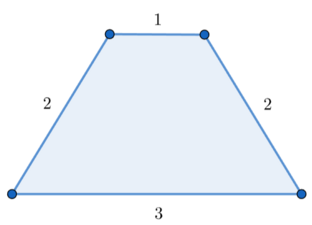

<h1 style='text-align: center;'> F. Polygonal Segments</h1>

<h5 style='text-align: center;'>time limit per test: 8 seconds</h5>
<h5 style='text-align: center;'>memory limit per test: 512 megabytes</h5>

You are given an array $a$ of size $n$.

A segment $[l, r](1 \le l < r \le n)$ is called a polygonal segment only if the following conditions hold:

* $(r-l+1) \geq 3$;
* Considering $a_l, a_{l+1}, \ldots, a_r$ as side lengths, these sides can form a polygon with $(r-l+1)$ sides.

Process $q$ queries of two types:

* "1 l r": find the length of the longest segment among all polygonal segments $[l_0,r_0]$ satisfying $l \le l_0 \le r_0 \le r$. If there is no such polygonal segment, output $-1$ instead;
* "2 i x": assign $a_i := x$.
### Input

The first line contains an integer $t$ ($1 \leq t \leq 10^4$) — the number of test cases.

For each test case: 

* The first line of each testcase contains two integers $n$, $q$ ($4 \le n \le 2\cdot 10^5$, $1 \le q \le 10^5$);
* The second line of each testcase contains $n$ integers $a_1,a_2,\ldots, a_n$ ($1 \le a_i \le 10^{12}$);
* The following $q$ lines contain the description of queries. Each line is of one of two types:
	+ "1 l r" ($1 \le l < r \le n$, $r-l+1\ge 3$);
	+ "2 i x" ($1 \le i \le n$, $1 \le x \le 10^{12}$).

It is guaranteed that the sum of $n$ over all test cases will not exceed $2 \cdot 10^5$, and the sum of $q$ over all test cases will not exceed $10^5$.

### Output

For each query, if there is no suitable segment, output $-1$ in a new line. Otherwise, output the length of the longest segment satisfying the condition above in a new line.

## Example

### Input


```text
25 63 1 2 2 81 1 31 1 41 1 52 1 51 1 41 1 54 10500000000000 500000000000 1000000000000 5000000000001 1 31 2 41 1 42 1 4999999999992 3 9999999999991 1 31 2 41 1 42 3 10000000000001 1 3
```
### Output

```text

-1
4
4
3
5
-1
-1
4
-1
3
4
-1

```
## Note

In the first query of the first test case, there is no polygonal segment under the given condition. For example, considering segment $[1,3]$, you can not form a triangle with side lengths of $a_1=3$, $a_2=1$, and $a_3=2$.

In the second query of the first test case, the longest polygonal segment is $[1,4]$. You can form a quadrilateral with side lengths of $a_1=3$, $a_2=1$, $a_3=2$, and $a_4=2$.

  An example of a quadrilateral with side lengths of $3$, $1$, $2$, and $2$. 

#### Tags 

#2800 #NOT OK #brute_force #data_structures #divide_and_conquer #dp #greedy #two_pointers 

## Blogs
- [All Contest Problems](../Codeforces_Round_960_(Div._2).md)
- [Announcement (en)](../blogs/Announcement_(en).md)
- [Tutorial (en)](../blogs/Tutorial_(en).md)
- [Video Tutorial (en)](../blogs/Video_Tutorial_(en).md)
