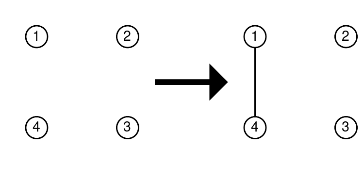
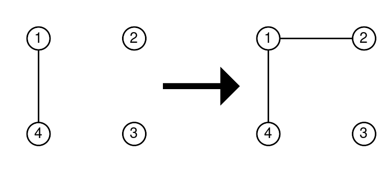
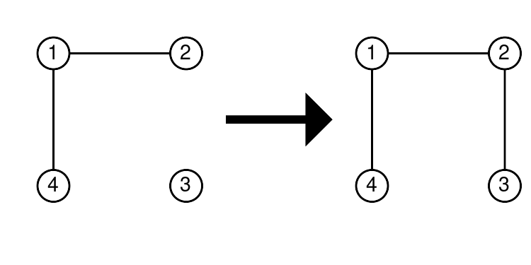

<h1 style='text-align: center;'> D. Funny Game</h1>

<h5 style='text-align: center;'>time limit per test: 2 seconds</h5>
<h5 style='text-align: center;'>memory limit per test: 256 megabytes</h5>

Vanya has a graph with $n$ vertices (numbered from $1$ to $n$) and an array $a$ of $n$ integers; initially, there are no edges in the graph. Vanya got bored, and to have fun, he decided to perform $n - 1$ operations.

Operation number $x$ (operations are numbered in order starting from $1$) is as follows:

* Choose $2$ different numbers $1 \leq u,v \leq n$, such that $|a_u - a_v|$ is divisible by $x$.
* Add an undirected edge between vertices $u$ and $v$ to the graph.

Help Vanya get a connected$^{\text{∗}}$ graph using the $n - 1$ operations, or determine that it is impossible.

$^{\text{∗}}$A graph is called connected if it is possible to reach any vertex from any other by moving along the edges.

### Input

Each test consists of multiple test cases. The first line contains an integer $t$ ($1 \le t \le 10^{3}$) — the number of test cases. Then follows the description of the test cases.

The first line of each test case contains the number $n$ ($1 \leq n \leq 2000$) — the number of vertices in the graph.

The second line of each test case contains $n$ numbers $a_1, a_2, \cdots a_n$ ($1 \leq a_i \leq 10^9$).

It is guaranteed that the sum of $n$ over all test cases does not exceed $2000$.

### Output

For each test case, if there is no solution, then output "No" (without quotes). 

Otherwise, output "Yes" (without quotes), and then output $n - 1$ lines, where in the $i$-th line, output the numbers $u$ and $v$ that need to be chosen for operation $i$.

You can output each letter in any case (for example, the strings "yEs", "yes", "Yes", and "YES" will be recognized as a positive answer).

## Example

### Input


```text
821 4499 7 1 13510 2 31 44 73587 6 81 44 32562 35 33 79 1656 51 31 69 42552 63 25 21 51233 40 3 11 31 43 37 8 50 5 12 22
```
### Output

```text

YES
2 1
YES
4 1
2 1
3 2
YES
5 1
4 1
3 1
2 1
YES
4 1
3 1
2 1
5 4
YES
3 1
5 1
2 1
4 2
YES
4 1
5 1
2 1
3 2
YES
2 1
5 2
3 1
4 3
YES
9 1
12 9
11 1
10 1
6 1
7 6
2 1
8 2
5 2
3 1
4 1

```
## Note

Let's consider the second test case. 

* First operation $(x = 1)$: we can connect vertices $4$ and $1$, since $|a_4 - a_1| = |13 - 99| = |-86| = 86$, and $86$ is divisible by $1$.

  * Second operation $(x = 2)$: we can connect vertices $2$ and $1$, since $|a_2 - a_1| = |7 - 99| = |-92| = 92$, and $92$ is divisible by $2$.

  * Third operation $(x = 3)$: we can connect vertices $3$ and $2$, since $|a_3 - a_2| = |1 - 7| = |-6| = 6$, and $6$ is divisible by $3$.

  From the picture, it can be seen that a connected graph is obtained.

#### Tags 

#1900 #NOT OK #constructive_algorithms #dsu #graphs #greedy #math #number_theory #trees 

## Blogs
- [All Contest Problems](../Codeforces_Round_959_sponsored_by_NEAR_(Div._1_+_Div._2).md)
- [Announcement](../blogs/Announcement.md)
- [Video Tutorial (en)](../blogs/Video_Tutorial_(en).md)
- [Editorial (en)](../blogs/Editorial_(en).md)
