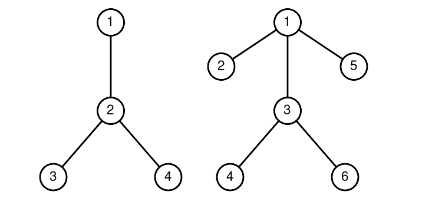

<h1 style='text-align: center;'> E. Wooden Game</h1>

<h5 style='text-align: center;'>time limit per test: 2 seconds</h5>
<h5 style='text-align: center;'>memory limit per test: 256 megabytes</h5>

You are given a forest of $k$ rooted trees$^{\text{∗}}$. Lumberjack Timofey wants to cut down the entire forest by applying the following operation: 

* Select a subtree$^{\text{†}}$ of any vertex of one of the trees and remove it from the tree.

Timofey loves bitwise operations, so he wants the [bitwise OR](https://en.wikipedia.org/wiki/Bitwise_operation#OR) of the sizes of the subtrees he removed to be maximum. Help him and find the maximum result he can obtain.

$^{\text{∗}}$ A tree is a connected graph without cycles, loops, or multiple edges. In a rooted tree, a selected vertex is called a root. A forest is a collection of one or more trees.

$^{\text{†}}$ The subtree of a vertex $v$ is the set of vertices for which $v$ lies on the shortest path from this vertex to the root, including $v$ itself.

### Input

Each test consists of multiple test cases. The first line contains an integer $t$ ($1 \leq t \leq 10^4$) — the number of test cases. Then follows the description of the test cases.

The first line of each test case contains a single integer $k$ ($1 \leq k \leq 10^6$) — the number of trees in the forest.

This is followed by a description of each of the $k$ trees:

The first line contains a single integer $n$ ($1 \leq n \leq 10^6$) — the size of the tree. The vertices of the tree are numbered with integers from $1$ to $n$. The root of the tree is vertex number $1$.

The second line contains $n - 1$ integers $p_2, p_3, \ldots p_n$ ($1 \leq p_i < i$), where $p_i$ — the parent of vertex $i$.

It is guaranteed that the sum of $k$ and $n$ for all sets of input data does not exceed $10^6$.

### Output

For each test case, output a single integer — the maximum result that can be obtained.

## Example

### Input


```text
311  
241 2 261 1 3 1 31101 2 2 1 1 5 7 6 4
```
### Output

```text

1
7
10

```
## Note

In the second test case, the trees look like this:



The first operation removes the entire second tree.


The second operation removes vertex $4$ from the first tree.


The third operation removes the first tree. The result is $6|1|3 = 7$ ($|$ denotes bitwise OR).

In the third test case, the entire tree needs to be removed.


#### Tags 

#2000 #NOT OK #bitmasks #greedy #math #trees 

## Blogs
- [All Contest Problems](../Codeforces_Round_959_sponsored_by_NEAR_(Div._1_+_Div._2).md)
- [Announcement](../blogs/Announcement.md)
- [Video Tutorial (en)](../blogs/Video_Tutorial_(en).md)
- [Editorial (en)](../blogs/Editorial_(en).md)
