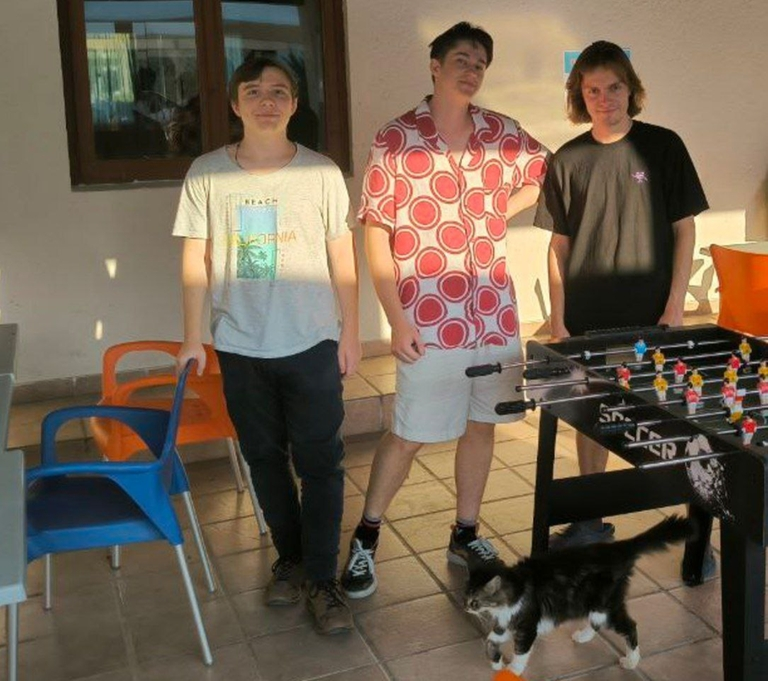

# Announcement_(en)

Attention! Attention! Attention! Don't miss this opportunity!

[Codeforces Round 961 (Div. 2)](https://codeforces.com/contest/1995 "Codeforces Round 961 (Div. 2)") will be held on [Tuesday, July 23, 2024 at 20:35UTC+6](https://codeforces.com/https://www.timeanddate.com/worldclock/fixedtime.html?day=23&month=7&year=2024&hour=17&min=35&sec=0&p1=166)!

Problems for this round were prepared by a team of [Neapolis University Pafos](https://codeforces.com/https://www.nup.ac.cy/) (yes, you've seen its logo in Educational Round announcements) students: [Vitaly503](https://codeforces.com/profile/Vitaly503 "Candidate Master Vitaly503"), [goncharovmike](https://codeforces.com/profile/goncharovmike "Candidate Master goncharovmike"), [ikrpprppp](https://codeforces.com/profile/ikrpprppp "Master ikrpprppp"). 

You will be given **5 problems** some of which will be divided into two subtasks and **2 hours** to solve them.

**Important disclaimer!** Some problems of this round were also used in **CPFED x JetBrains Training Camp 2024. NUP Contest** in Kazakhstan this June. If you've participated in this camp or seen the problems from there, please do not participate in this round.

We would like to thank:

 * [Akulyat](https://codeforces.com/profile/Akulyat "International Master Akulyat") for coordinating the round and frequent pinging;
* [pashka](https://codeforces.com/profile/pashka "International Grandmaster pashka") for valuable discussions and the idea of one of the problems;
* [MikeMirzayanov](https://codeforces.com/profile/MikeMirzayanov "Headquarters, MikeMirzayanov") for the all-powerful Codeforces and Polygon platforms;
* Our testers [denk](https://codeforces.com/profile/denk "Expert denk"), [artem3605](https://codeforces.com/profile/artem3605 "Candidate Master artem3605"), [physics0523](https://codeforces.com/profile/physics0523 "International Grandmaster physics0523"), [BurnedChicken](https://codeforces.com/profile/BurnedChicken "Legendary Grandmaster BurnedChicken"), [oursaco](https://codeforces.com/profile/oursaco "Master oursaco"), [AdityaTakkar](https://codeforces.com/profile/AdityaTakkar "Expert AdityaTakkar"), [shade34](https://codeforces.com/profile/shade34 "Candidate Master shade34"), [md_nihal](https://codeforces.com/profile/md_nihal "Specialist md_nihal"), [Vamperox](https://codeforces.com/profile/Vamperox "Expert Vamperox"), [Binary_Thinker](https://codeforces.com/profile/Binary_Thinker "Newbie Binary_Thinker"), [Dominater069](https://codeforces.com/profile/Dominater069 "International Grandmaster Dominater069"), [-2.71](https://codeforces.com/profile/-2.71 "Pupil -2.71"), [Yugandhar_Master](https://codeforces.com/profile/Yugandhar_Master "Expert Yugandhar_Master"), [Banis](https://codeforces.com/profile/Banis "Expert Banis"), [dazlersan1](https://codeforces.com/profile/dazlersan1 "Specialist dazlersan1"), [MaxLevitsky](https://codeforces.com/profile/MaxLevitsky "Expert MaxLevitsky"), [larush](https://codeforces.com/profile/larush "Expert larush"), [aufannn](https://codeforces.com/profile/aufannn "Master aufannn"), [thenymphsofdelphi](https://codeforces.com/profile/thenymphsofdelphi "International Grandmaster thenymphsofdelphi"), [turmax](https://codeforces.com/profile/turmax "Legendary Grandmaster turmax"), [ishaandas1](https://codeforces.com/profile/ishaandas1 "Pupil ishaandas1"), [vahtang](https://codeforces.com/profile/vahtang "Candidate Master vahtang"), [GrandFruit](https://codeforces.com/profile/GrandFruit "Expert GrandFruit"), [okwedook](https://codeforces.com/profile/okwedook "Master okwedook"), [Vladithur](https://codeforces.com/profile/Vladithur "Grandmaster Vladithur");
* Participants of the onsite version of this contest in Kazakhstan who also made this round better: [AmirMakaM](https://codeforces.com/profile/AmirMakaM "Specialist AmirMakaM"), [kaztayev](https://codeforces.com/profile/kaztayev "Master kaztayev"), [MnTm](https://codeforces.com/profile/MnTm "Master MnTm"), [shenfe1](https://codeforces.com/profile/shenfe1 "Master shenfe1"), [mispertion20](https://codeforces.com/profile/mispertion20 "Master mispertion20"), [dondurma](https://codeforces.com/profile/dondurma "Expert dondurma"), [N29](https://codeforces.com/profile/N29 "Candidate Master N29"), [Relice](https://codeforces.com/profile/Relice "Expert Relice"), [k1ngash](https://codeforces.com/profile/k1ngash "Expert k1ngash"), [Alihan_8](https://codeforces.com/profile/Alihan_8 "Specialist Alihan_8"), [Otalp](https://codeforces.com/profile/Otalp "Expert Otalp"), [Tima19](https://codeforces.com/profile/Tima19 "Candidate Master Tima19"), [kanye_east](https://codeforces.com/profile/kanye_east "Master kanye_east"), [adiyer](https://codeforces.com/profile/adiyer "Specialist adiyer"), [BallBreaker](https://codeforces.com/profile/BallBreaker "Expert BallBreaker"), [I_Love_Diar_Narumov](https://codeforces.com/profile/I_Love_Diar_Narumov "Candidate Master I_Love_Diar_Narumov"), [Tangirkul](https://codeforces.com/profile/Tangirkul "Expert Tangirkul"), [Issa](https://codeforces.com/profile/Issa "Candidate Master Issa"), [fft97](https://codeforces.com/profile/fft97 "Expert fft97"), [Aiperiii](https://codeforces.com/profile/Aiperiii "Expert Aiperiii"), [Bichpaket](https://codeforces.com/profile/Bichpaket "Expert Bichpaket"), [Baytoro](https://codeforces.com/profile/Baytoro "Expert Baytoro"), [kylych03](https://codeforces.com/profile/kylych03 "Expert kylych03"), [Wansur](https://codeforces.com/profile/Wansur "Master Wansur"), [Chalishkan](https://codeforces.com/profile/Chalishkan "Unrated, Chalishkan");
* And participants of the [Codeforces Round 961 (Div. 2)](https://codeforces.com/contest/1995 "Codeforces Round 961 (Div. 2)") (i.e. you)!

*Not-so-important not-so-disclaimer.* If you're interested in getting a Bachelor's degree in computer science in the indefinite future, you might want to take a look at [Computer Science and Artificial Intelligence](https://codeforces.com/https://lp.jetbrains.com/academy/csai-program/) program in our university administered by [JetBrains](https://codeforces.com/https://www.jetbrains.com/).

**UPD.** Scoring distribution: 500+(1000+500)+1750+2250+(2500+1500)500+(1000+500)+1750+2250+(2500+1500)

**UPD2.** Congratulations to the winners:

Div 2:

 1. [rainboy](https://codeforces.com/profile/rainboy "Candidate Master rainboy")
2. [GidrAcH](https://codeforces.com/profile/GidrAcH "Expert GidrAcH")
3. [toma_ariciu](https://codeforces.com/profile/toma_ariciu "Candidate Master toma_ariciu")
4. [biximo](https://codeforces.com/profile/biximo "Candidate Master biximo")
5. [zhengjc](https://codeforces.com/profile/zhengjc "Specialist zhengjc")

Div 1 + Div 2:

 1. [tourist](https://codeforces.com/profile/tourist "Legendary Grandmaster tourist")
2. [Ormlis](https://codeforces.com/profile/Ormlis "Legendary Grandmaster Ormlis")
3. [potato167](https://codeforces.com/profile/potato167 "Legendary Grandmaster potato167")
4. [risujiroh](https://codeforces.com/profile/risujiroh "International Grandmaster risujiroh")
5. [kotatsugame](https://codeforces.com/profile/kotatsugame "International Grandmaster kotatsugame")

**UPD3.** [Editorial](Tutorial_1_(en).md).

