# Tutorial_(en)

Long time no see!

As [VK Cup Round 2](//codeforces.com/contest/924) and its two parallel rounds ([Div. 1](//codeforces.com/contest/956) and [Div. 2](//codeforces.com/contest/957)) comes to a close, we're here to congratulate on all who did well on the contest and cheer for everyone who participated — the queue won't stop you!

Here are the detailed tutorials for the problems. Feel free to discuss in the comments!

Kudos to [arsor](https://codeforces.com/profile/arsor "Specialist arsor") for translating the tutorials into Russian!

 

---

 
### [957A - Tritonic Iridescence](https://codeforces.com/contest/957/problem/A "Codeforces Round 472 (rated, Div. 2, based on VK Cup 2018 Round 2)")

The problem can be solved in different approaches. Here we describe one based on manually finding out all cases.

What causes the answer to be "Yes"? Of course, there cannot be adjacent segments that already have the same colour; but what else?

We can figure out that whenever two consecutive question marks appear, there are at least two ways to fill them.

But the samples lead us to ponder over cases with one single question mark: a question mark can be coloured in two different colours if it lies on the boundary of the canvas, or is between two adjacent segments of the same colour.

Putting it all together, we get a simple but correct solution.

There surely are dynamic programming solutions to this problem, and if you'd like a harder version, try this [USACO problem](https://codeforces.com/http://usaco.org/index.php?page=viewproblem2&cpid=766). So to me seems like a notorious coincidence ._.

 **Model solution**
```cpp
_, s = input(), input()
print('Yes' if
    ('??' in s or 'C?C' in s or 'M?M' in s or 'Y?Y' in s or s[0] == '?' or s[-1] == '?') and
    not ('CC' in s or 'MM' in s or 'YY' in s)
else 'No')
```
 **Alternative solution (Errichto)**
```cpp
#include <bits/stdc++.h>
using namespace std;

void NO() {
	puts("No");
	exit(0);
}
void YES() {
	puts("Yes");
	exit(0);
}

int main() {
	int n;
	cin >> n;
	string s;
	cin >> s;
	for(int i = 0; i < n - 1; ++i)
		if(s[i] != '?' && s[i] == s[i+1])
			NO();
	for(int i = 0; i < n; ++i) if(s[i] == '?') {
		if(i == 0 || i == n - 1) YES();
		if(s[i+1] == '?') YES();
		if(s[i-1] == s[i+1]) YES();
	}
	NO();
}
```
(by [cyand1317](https://codeforces.com/profile/cyand1317 "Grandmaster cyand1317"))

 
### [924A - Mystical Mosaic](../problems/A._Mystical_Mosaic.md "VK Cup 2018 - Round 2")

No row or column can be selected more than once, hence whenever a row *r* is selected in an operation, all cells in it uniquely determine the set of columns that need to be selected — let's call it *S**r*.

Let's assume a valid set of operations exists. Take out any two rows, *i* and *j*. If rows *i* and *j* are selected in the same operation, we can deduce that *S**i* = *S**j*; if they're in different operations, we get 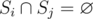. Therefore, if *S**i* ≠ *S**j* and 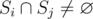 hold for any pair of rows (*i*, *j*), no valid operation sequence can be found.

Otherwise (no pair violates the condition above), a valid sequence of operations can be constructed: group all rows with the same *S*'s and carry out an operation with each group.

Thus, it's a necessary and sufficient condition for the answer to be "Yes", that for each pair of rows (*i*, *j*), either *S**i* = *S**j* or  holds.

The overall complexity is *O*(*n*2*m*). It can be divided by the system's word size if you're a [bitset enthusiast](//codeforces.com/blog/entry/53168), and a lot more if hashes and hash tables release their full power.

 **Model solution**
```cpp
#include <cstdio>

typedef long long int64;
static const int MAXN = 53;

static int n, m;
static bool a[MAXN][MAXN];
static int64 b[MAXN];

int main()
{
    scanf("%d%d", &n, &m); getchar();
    for (int i = 0; i < n; ++i)
        for (int j = 0; j <= m; ++j) a[i][j] = (getchar() == '#');

    for (int i = 0; i < n - 1; ++i)
        for (int j = i + 1; j < n; ++j) {
            bool all_same = true, no_intersect = true;
            for (int k = 0; k < m; ++k) {
                if (a[i][k] != a[j][k]) all_same = false;
                if (a[i][k] && a[j][k]) no_intersect = false;
            }
            if (!all_same && !no_intersect) {
                puts("No"); return 0;
            }
        }

    puts("Yes"); return 0;
}
```
 **Alternative solution with DSU in O(nm alpha(n)) (skywalkert)**
```cpp
#include <bits/stdc++.h>
using namespace std;
const int maxn = 5001, maxm = maxn << 1 | 1;
int n, m, dsu[maxm], cB[maxm], cW[maxm], cE[maxm];
char buf[maxn];
int dsu_find(int u) {
	return dsu[u] < 0 ? u : (dsu[u] = dsu_find(dsu[u]));
}
void dsu_merge(int u, int v) {
	u = dsu_find(u);
	v = dsu_find(v);
	if(u == v) {
		++cE[u];
		return;
	}
	if(dsu[u] < dsu[v])
		swap(u, v);
	dsu[v] -= dsu[u] == dsu[v];
	dsu[u] = v;
	cB[v] += cB[u];
	cW[v] += cW[u];
	cE[v] += cE[u] + 1;
}
int main() {
	scanf("%d%d", &n, &m);
	memset(dsu, -1, (n + m) * sizeof(int));
	for(int i = 0; i < n; ++i)
		cB[i] = 1;
	for(int i = 0; i < m; ++i)
		cW[n + i] = 1;
	for(int i = 0; i < n; ++i) {
		scanf("%s", buf);
		for(int j = 0; j < m; ++j)
			if(buf[j] != '.')
				dsu_merge(i, n + j);
	}
	for(int i = 0; i < n + m; ++i)
		if(dsu_find(i) == i && cB[i] * cW[i] != cE[i]) {
			puts("No");
			return 0;
		}
	puts("Yes");
	return 0;
}
```
 **Alternative solution in O(nm)**
```cpp
#include <cstdio>
#include <algorithm>
#include <vector>
static const int MAXN = 1004;

static int n, m;
static bool g[MAXN][MAXN];
// c[i] = set of rows where the i-th column is coloured
static std::vector<int> c[MAXN];
static bool checked[MAXN] = { false };

int main()
{
    scanf("%d%d", &n, &m); getchar();
    for (int i = 0; i < n; ++i)
        for (int j = 0; j <= m; ++j) {
            g[i][j] = (getchar() == '#');
            if (g[i][j]) c[j].push_back(i);
        }

    for (int i = 0; i < n; ++i) if (!checked[i]) {
        std::vector<int> r;
        for (int j = 0; j < m; ++j) if (g[i][j])
            for (int k : c[j]) r.push_back(k);
        std::sort(r.begin(), r.end());
        r.resize(std::unique(r.begin(), r.end()) - r.begin());

        for (int k : r) {
            if (checked[k]) { puts("No"); return 0; }
            checked[k] = true;
            for (int p = 0; p < m; ++p)
                if (g[i][p] != g[k][p]) { puts("No"); return 0; }
        }
    }

    puts("Yes"); return 0;
}
```
(by [cyand1317](https://codeforces.com/profile/cyand1317 "Grandmaster cyand1317"))

 
### [924B - Three-level Laser](../problems/B._Three-level_Laser.md "VK Cup 2018 - Round 2")

First of all, you can note that for fixed *i* and *k* setting *j* = *i* + 1 is always the best choice. Indeed, if *X* > *Y*, then 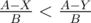 for positive *B*.

Then, let's fix *i*. Then *j* = *i* + 1, and what is the optimal *k*? We can define the energy loss as 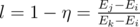. As we need to minimize the loss, it's obvious that we should maximize *E**k*, so we should choose as large *k* as possible satisfying *E**k* - *E**i* ≤ *U*. This is a classic problem that can be solved with two pointers approach, this leads to *O*(*n*) solution, or with binary search approach, this leads to  solution. Both are acceptable.

 **Model solution**
```cpp
#include <iostream>
#include <sstream>
#include <cstdio>
#include <vector>
#include <cmath>
#include <queue>
#include <string>
#include <cstring>
#include <cassert>
#include <iomanip>
#include <algorithm>
#include <set>
#include <map>
#include <ctime>
#include <cmath>

#define forn(i, n) for(int i=0;i<n;++i)
#define fore(i, l, r) for(int i = int(l); i <= int(r); ++i)
#define sz(v) int(v.size())
#define all(v) v.begin(), v.end()
#define pb push_back
#define mp make_pair
#define x first
#define y1 ________y1
#define y second
#define ft first
#define sc second
#define pt pair<int, int>

template<typename X> inline X abs(const X& a) { return a < 0? -a: a; }
template<typename X> inline X sqr(const X& a) { return a * a; }

typedef long long li;
typedef long double ld;

using namespace std;

const int INF = 1000 * 1000 * 1000;
const ld EPS = 1e-9;
const ld PI = acos(-1.0);

const int N = 100 * 1000 + 13;

int n, u;
int a[N];
int idx1 = -1, idx2, idx3;

inline void read() {	
	scanf("%d%d", &n, &u);
	for (int i = 0; i < n; i++) {
		scanf("%d", &a[i]);
	}
}

inline void solve() {
	int k = 0;
	for (int i = 0; i < n; i++) {
		k = max(k, i);
		while (k + 1 < n && a[k + 1] - a[i] <= u) {
      		k++;
		}
        if (k - i - 1 <= 0) {
        	continue;
        }
        int j = i + 1;

        if (idx1 == -1 || (a[k] - a[j]) * 1ll * (a[idx3] - a[idx1]) > (a[idx3] - a[idx2]) * 1ll * (a[k] - a[i])) {
			idx1 = i, idx2 = j, idx3 = k;        	
        }
	}	

	if (idx1 == -1) {
		cout << -1 << endl;
		return;
	}

	cout.precision(20);
    cout << (double)(a[idx3] - a[idx2]) / (a[idx3] - a[idx1]) << endl;
}

int main () {
#ifdef fcspartakm
    freopen("input.txt", "r", stdin);
    //freopen("output.txt", "w", stdout);
#endif
    srand(time(NULL));
    cerr << setprecision(10) << fixed;
    
    read();
    solve();
 
    //cerr << "TIME: " << clock() << endl;
}
```
(by [KAN](https://codeforces.com/profile/KAN "Grandmaster KAN"), prepared by [fcspartakm](https://codeforces.com/profile/fcspartakm "Candidate Master fcspartakm"))

 
### [924C - Riverside Curio](../problems/C._Riverside_Curio.md "VK Cup 2018 - Round 2")

Define *t**i* as the total number of marks (above or at or under the water level) on the *i*-th day. As *t**i* = *m**i* + 1 + *d**i*, minimizing 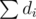 is equivalent to minimizing .

For the *i*-th day we would like to find the minimum value of *t**i*.

Needless to say *t**i* ≥ *max*{*t**i* - 1, *m**i* + 1} should hold.

On each day we can increase *t* by at most one, thus *t**i* ≥ *t**i* + 1 - 1, which is equivalent to the condition that *t**i* ≥ *t**j* - (*j* - *i*) holds for all *j* > *i*.

The first condition is straightforward — just go over from left to right and keep a record; but how to ensure that the second condition hold?

One of the approaches is going backwards. Go from right to left and keep a counter which, on each day, decreases by 1 and then is taken maximum with the *t**i* currently at hand. This counter always records the minimum required *t**i* value that satisfies the second condition. Assign this counter to *t**i* along the way.

Based on such minimum decisions, raising any *t**i* by any positive value does not allow other *t**i*'s to be reduced. Hence summing this value over all days provides us with an optimal answer in *O*(*n*) time.

 **Model solution**
```cpp
#include <cstdio>
#include <algorithm>

typedef long long int64;
static const int MAXN = 1e5 + 4;

static int n, m[MAXN];
static int t[MAXN];

int main()
{
    scanf("%d", &n);
    for (int i = 0; i < n; ++i) scanf("%d", &m[i]);

    for (int i = n - 1, cur = 0; i >= 0; --i) {
        cur = std::max(0, cur - 1);
        cur = std::max(cur, m[i] + 1);
        t[i] = cur;
    }

    int64 ans = 0;
    for (int i = 0, cur = 0; i < n; ++i) {
        cur = std::max(cur, t[i]);
        ans += cur;
    }

    for (int i = 0; i < n; ++i) ans -= (m[i] + 1);
    printf("%lldn", ans);

    return 0;
}
```
(by [cyand1317](https://codeforces.com/profile/cyand1317 "Grandmaster cyand1317"))

 
### [924D - Contact ATC](../problems/D._Contact_ATC.md "VK Cup 2018 - Round 2")

Stuck in tedious fractions produced by kinematic formulae? No, that's not the way to go. Forgetting about all physics, how does wind speed affect the time when a plane flies over the origin?

Consider a plane flying from left to right, passing through the origin. Initially it has speed *v**i* - *w* and meets the origin at time *t*. As the wind speed goes from  - *w* to  + *w*, the plane's speed continually rises to *v**i* + *w*, with *t* becoming smaller and smaller (this is true because *w* < |*v**i*|). The similar holds for planes going from right to left, with the exception that *t* becomes greater and greater.

Then, how does wind speed affect the order in which a pair of planes pass the origin?

Imagine two planes, *A* and *B*. With wind speed  - *w*, they arrive at the origin at moments *t**A* and *t**B*, respectively. As the wind speed goes from  - *w* to  + *w*, *t**A* moves smoothly and so does *t**B* and suddenly... Uh! They become the same! That makes them a valid pair.

From this perspective we can conclude that for such a pair of planes *A* and *B*, if *A* arrives at the origin at moment *t**A* and *t*'*A* with wind speed  - *w* and  + *w*, and *B* at *t**B* and *t*'*B* respectively, they possibly meet at the origin iff (*t**A* - *t**B*)·(*t*'*A* - *t*'*B*) ≤ 0.

Oh, what's this? Inversion pairs, of course! Apply wind  - *w* and  + *w* to all the planes, find out the orders in which they arrive at the origin under the two winds, and count the pairs (*A*, *B*) where *A* goes before *B* in the first permutation, and after *B* in the second one. One detail to note is that in case of ties, pairs should be sorted by descending values of speed in the first pass and ascending in the second (the speeds cannot be the same since all planes are distinct). That leaves us only with a binary indexed tree to be implemented. The overall time complexity is .

Please note that it's recommended to use an integer pair to represent a fraction, since the difference between arrival times can be as little as 10- 10 — though a floating point error tolerance of 5 × 10- 12 passes all tests, its robustness is not so easy to control.

 **Model solution**
```cpp
#include <cstdio>
#include <algorithm>
#include <utility>

typedef long long int64;
static const int MAXN = 1e5 + 4;
static const int MAXX = 1e8 + 4;

static int n, w;
static int x[MAXN], v[MAXN];

struct fraction {
    template <typename T> static inline T gcd(const T a, const T b) {
        return (b == 0) ? a : gcd(b, a % b);
    }

    int64 num, deno;
    inline void simplify() {
        if (deno < 0) { num *= -1; deno *= -1; }
        int64 g = gcd(num < 0 ? -num : num, deno); num /= g; deno /= g;
    }

    fraction() { }
    fraction(int64 num, int64 deno) : num(num), deno(deno) { simplify(); }

    inline bool operator < (const fraction &rhs) const {
        return num * rhs.deno < deno * rhs.num;
    }
    inline bool operator != (const fraction &rhs) const {
        return num * rhs.deno != deno * rhs.num;
    }
};

// Time bounds at which clouds can arrive at the origin
static std::pair<fraction, fraction> t[MAXN];
// Used at discretization
static std::pair<fraction, int> d[MAXN];
static int p[MAXN];

struct bit {
    static const int MAXN = ::MAXN;
    int f[MAXN];
    bit() { std::fill(f, f + MAXN, 0); }
    inline void add(int pos, int inc) {
        for (++pos; pos < MAXN; pos += (pos & -pos)) f[pos] += inc;
    }
    inline int sum(int rg) {
        int ans = 0;
        for (++rg; rg; rg -= (rg & -rg)) ans += f[rg];
        return ans;
    }
    inline int sum(int lf, int rg) {
        return sum(rg) - sum(lf - 1);
    }
} arkady;

int main()
{
    scanf("%d%d", &n, &w);
    for (int i = 0; i < n; ++i) scanf("%d%d", &x[i], &v[i]);

    for (int i = 0; i < n; ++i) {
        int64 v1 = v[i] - w, v2 = v[i] + w;
        t[i] = {fraction(-x[i], v1), fraction(-x[i], v2)};
    }

    for (int i = 0; i < n; ++i) t[i].second.num *= -1;
    std::sort(t, t + n);
    for (int i = 0; i < n; ++i) t[i].second.num *= -1;
    for (int i = 0; i < n; ++i) d[i] = {t[i].second, i};
    std::sort(d, d + n);
    for (int i = 0, rk = -1; i < n; ++i) {
        if (i == 0 || d[i].first != d[i - 1].first) ++rk;
        p[d[i].second] = rk;
    }
    /*for (int i = 0; i < n; ++i)
        printf("%.4lf %.4lf | %dn",
            (double)t[i].first.num / t[i].first.deno,
            (double)t[i].second.num / t[i].second.deno, p[i]);*/

    int64 ans = 0;
    for (int i = 0; i < n; ++i) {
        ans += arkady.sum(p[i], MAXN - 1);
        arkady.add(p[i], 1);
    }

    printf("%lldn", ans);

    return 0;
}
```
(by [KAN](https://codeforces.com/profile/KAN "Grandmaster KAN"), prepared by [cyand1317](https://codeforces.com/profile/cyand1317 "Grandmaster cyand1317"))

 
### [924E - Wardrobe](../problems/E._Wardrobe.md "VK Cup 2018 - Round 2")

The first idea of the author's solution is to reverse the problem: change *l* to *H* - *r* and *r* to *H* - *l*, where *H* is the total height of the wardrobe. Now an important box is counted in the answer if and only if its top edge is within the segment [*l*, *r*]. We'll see later the profit of this operation.

Now, we'll build a wardrobe of arbitrary height using only a subset of the boxes, and choose the maximum possible answer. Why can we remove the constraint to use all boxes? We can always assume that we add all the boxes we don't take at the top of the boxes we take, and the answer won't decrease. So, we can do some kind of knapsack, where not taking a box means putting it on the top after considering all boxes.

What we don't know is how to compute the answer and in which order to consider the boxes in the knapsack. Ok, if we consider them in such an order that there is an optimal answer in which the boxes we "take" in the knapsack always come in this order, then computing the answer is easy: we can always assume that we put a new box on the top of already taken ones, and add 1 to the current answer if it is an important box and its top edge falls in the range [*l*, *r*].

Now we should find such an order. Note that in an optimal answer we can always arrange boxes in this order: some number of unimportant boxes, then some number of important boxes that don't increase the answer, then some number of important boxes that increase the answer, and after that a mix of important and unimportant boxes which don't count in the answer and that we consider as "not taken" in the knapsack. This means that we can first consider all unimportant boxes in the knapsack, and then all important ones. It's also easy to see that the order of unimportant boxes does not matter. However, it turns out that the order of important boxes matters.

To choose the order of important boxes, we can use an old, but good trick. Suppose two important boxes with heights *a**i* and *a**j* stand one on the other. Answer the question: "What is the condition such that if it is satisfied, then it is always better to put *a**j* on the top of *a**i*, and not vice versa?" Here we consider only the boxes that count in the answer and those under them, because other we simply "don't take" in the knapsack. It turns out that the condition is simple: *a**j* ≤ *a**i*, no matter do these boxes count in the answer or not. Here we used the fact that we inversed the problem, and the position of the top edge matters, not the bottom one. So, as we now know that it is always optimal to put the important boxes from largest to smallest (in the inversed problem), we can sort them in that order and perform the knapsack.

The complexity is 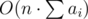. This can also be reduced to 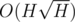 where *H* is the height of the wardrobe, using a standard optimization for the knapsack.

 **Model solution**
```cpp
/**
 * This is a solution for problem wardrobe
 * This is nk_ok.cpp
 * 
 * @author: Nikolay Kalinin
 * @date: Tue, 20 Mar 2018 21:48:33 +0300
 */
#include <bits/stdc++.h>

using namespace std;

using ll = long long;
using ld = long double;
using D = double;
using uint = unsigned int;
template<typename T>
using pair2 = pair<T, T>;

#ifdef WIN32
    #define LLD "%I64d"
#else
    #define LLD "%lld"
#endif

#define pb push_back
#define mp make_pair
#define all(x) (x).begin(),(x).end()
#define fi first
#define se second

struct tbox
{
    int h, t;
};

inline bool operator<(const tbox &a, const tbox &b)
{
    if (a.t != b.t) return a.t < b.t;
    return a.h > b.h;
}

const int maxn = 10005;
const int inf = 1e9;

tbox b[maxn];
int ans[maxn];
int n, l, r;

int main()
{
    scanf("%d%d%d", &n, &l, &r);
    int sumh = 0;
    for (int i = 0; i < n; i++)
    {
        scanf("%d", &b[i].h);
        sumh += b[i].h;
    }
    tie(l, r) = pair{sumh - r, sumh - l};
    for (int i = 0; i < n; i++) scanf("%d", &b[i].t);
    sort(b, b + n);
    for (int i = 0; i <= sumh; i++) ans[i] = -inf;
    ans[0] = 0;
    for (int i = 0; i < n; i++)
    {
        for (int h = sumh - b[i].h; h >= 0; h--) ans[h + b[i].h] = max(ans[h + b[i].h], ans[h] + b[i].t * (h + b[i].h >= l && h + b[i].h <= r));
    }
    cout << *max_element(ans, ans + sumh + 1) << endl;
    return 0;
}
```
(by [KAN](https://codeforces.com/profile/KAN "Grandmaster KAN"))

 
### [924F - Minimal Subset Difference](../problems/F._Minimal_Subset_Difference.md "VK Cup 2018 - Round 2")

Let *f*(*x*) be the minimal subset difference mentioned in the problem statement. The problem seems like a regular digit DP problem. However, it's a bit hard to reduce the number of DP states. Let's take a careful consideration. 

For a given integer *x*, we can use knapsack DP to determine *f*(*x*). Denote the sum of digits of *x* as *s*(*x*). You can just calculate whether there is a subset such that the sum of the subset is a fixed number *y*, and then find the maximal *y* 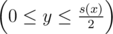 which concludes *f*(*x*) = *s*(*x*) - 2*y*. By the way, this type of knapsack DP could be implemented by bitwise operation.

If we defined *dp*(*len*, *sum*, *state*) as the number of integers *x* such that the length of *x* is *len*, the digit sum is *sum*, and the knapsack DP array is *state* (an array only consisting 0 and 1, which could be represented as bit vector), the problem would be difficult to solve. For example, to represent *x* = 88888888899999999, a case of *f*(*x*) = 0, the length of *state* might be 73, which is a bit long vector. Although most of *state*s satisfy *dp*(*len*, *sum*, *state*) = 0, there are still many *state*s which might be used.

You may notice the order of digits is unnecessary for the knapsack DP. If we defined *state* as the number of appearance of digits 1, 2, ..., 9 (digit 0 is unnecessary), the number of *state*s would be 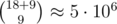. Hence, we can apply knapsack DP for each *state* first and then calculate for digit DP. 

Here are more details. Let's redefine *dp*(*len*, *k*, *state*) as the number of ways to arrange the lowest *len* digits of *x* such that *f*(*x*) = *k* and the other digits (higher than the lowest *len* digits) form the *state* (i. e. the number of appearance of digits 1, 2, ..., 9). We firstly search all the *state*s such that the total number of appearance  ≤ 18 and *f*(*x*) = *k*, and then set *dp*(0, *k*, *state*) = 1. After searching, we calculate *dp*(*len*, *k*, *new* *state*) from *dp*(*len* - 1, *k*, *state*) > 0 by enumerating the *len*-th digit.

However, the number of *dp*(*len*, *k*, *state*) > 0 is still too large to calculate for digit DP. You should notice that in decimal representation it always has 0 ≤ *f*(*x*) ≤ 9 for any integer *x*. Furthermore, because of the distribution of digits, most of *state*s are in cases of *f*(*x*) = 0, 1 (you can make a knapsack DP to prove). In addition, it is easy to show *f*(*x*) and *s*(*x*) always have the same parity, so we can apply inclusion-exclusion principle to solve the problem only in the cases of *f*(*x*) ≥ 2 and another counting problem with fixed parity of *s*(*x*).

The total time complexity in above is 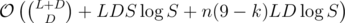, where *L* ( = 18) is the maximal length of *x*, *D* ( = 9) is the maximal digit, and *S* ( ≈ 3·104) is the number of distinct *state*s such that there exists *dp*(*len*, *k*, *state*) > 0 (0 ≤ *len* ≤ *L*, 2 ≤ *k* ≤ 9). However, it can hardly pass the tests with *n* = 5·104, because we have some fairly worse tests to maximize the times of *dp* access (e. g. *l* and *r* have a lot of 9 as digits and *k* = 1). 

We could make a tradeoff between pretreatment and queries by several ways. For example, define *dp*(*len*, *k*, *state*, *upp*) as the similar but it memorizes that the *len*-th digit is less than *upp*. If we did that, the total time complexity would be 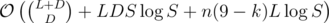, which is acceptable.

The aforementioned solution is not easy to code; you can use some advanced approach to get accepted, though. Here are bonuses for advanced solutions.

Bonus 1. Solve the problem in case of *n* = 5·105, 1 ≤ *l* ≤ *r* ≤ 1018 with the same limits of time and memory.

Bonus 2. Solve the problem in case of *n* = 105, 1 ≤ *l* ≤ *r* ≤ 10100 (answer in modulo some 32-bit integer) with the same limits of time and memory.

 **Model solution**
```cpp
#include <bits/stdc++.h>
using namespace std;
typedef long long LL;
const int maxd = 10, maxl = 18, maxs = 81, BLEN = 5, BMSK = 31;
struct States {
	vector<LL> keys, vals[maxd + 1];
	void insert(LL key) {
		keys.push_back(key);
	}
	void initialize(LL val = 0) {
		sort(keys.begin(), keys.end());
		keys.erase(unique(keys.begin(), keys.end()), keys.end());
		for(int i = 0; i < maxd; ++i)
			vals[i].assign(keys.size(), val);
	}
	void summation() {
		for(int i = 1; i < maxd; ++i)
			for(vector<LL>::iterator it = vals[i - 1].begin(), jt = vals[i].begin(); jt != vals[i].end(); ++it, ++jt)
				*jt += *it;
	}
	size_t size() const {
		return keys.size();
	}
	void update(int upp, LL key, LL adt) {
		vals[upp][lower_bound(keys.begin(), keys.end(), key) - keys.begin()] += adt;
	}
	LL find(int upp, LL key) {
		vector<LL>::iterator it = lower_bound(keys.begin(), keys.end(), key);
		if(it == keys.end() || *it != key)
			return 0;
		return vals[upp][it - keys.begin()];
	}
} f[maxd + 1][maxl + 1];
LL c[2][maxl + 1], bit[maxd + 1];
bitset<maxs + 1> vis[maxd + 1];
void dfs(int dep, int cnt, int sum, LL msk) {
	if(dep == maxd) {
		for(int i = sum >> 1; i >= 0; --i)
			if(vis[dep - 1].test(i)) {
				int dif = sum - i - i;
				if(dif > 1)
					f[dif][0].insert(msk);
				break;
			}
		return;
	}
	vis[dep] = vis[dep - 1];
	dfs(dep + 1, cnt, sum, msk);
	while(cnt < maxl) {
		vis[dep] |= vis[dep] << dep;
		dfs(dep + 1, ++cnt, sum += dep, msk += bit[dep]);
	}
}
LL solve(int dif, LL lim) {
	char dig[maxl + 3];
	int len = sprintf(dig, "%lld", lim);
	LL ret = 0, msk = 0;
	States *F = f[dif];
	for(int i = 0; i < len; ++i) {
		dig[i] -= '0';
		if(len - i > maxl) {
			for(int j = 0; j < dig[i]; ++j)
				ret += F[len - i - 1].find(maxd - 1, msk);
		} else if(dig[i]) {
			ret += F[len - i].find(dig[i] - 1, msk);
			msk += bit[dig[i]];
		}
	}
	return ret;
}
LL solve2(LL lim) {
	char dig[maxl + 3];
	int len = sprintf(dig, "%lld", lim), part = 0;
	LL ret = 0;
	for(int i = 0; i < len; ++i) {
		dig[i] -= '0';
		int odd = dig[i] >> 1, even = (dig[i] + 1) >> 1;
		ret += c[part][len - 1 - i] * odd + c[part ^ 1][len - 1 - i] * even;
		part ^= dig[i] & 1;
	}
	return ret;
}
int main() {
	c[0][0] = 1;
	for(int i = 0; i < maxl; ++i) {
		int odd = maxd >> 1, even = (maxd + 1) >> 1;
		c[0][i + 1] = c[0][i] * even + c[1][i] * odd;
		c[1][i + 1] = c[0][i] * odd + c[1][i] * even;
	}
	bit[1] = 1;
	for(int i = 2; i < maxd; ++i)
		bit[i] = bit[i - 1] << BLEN;
	vis[0].set(0);
	dfs(1, 0, 0, 0);
	for(int i = 2; i < maxd; ++i) {
		f[i][0].initialize(1);
		for(int j = 0; j < maxl; ++j) {
			States &cur = f[i][j], &nxt = f[i][j + 1];
			for(int idx = 0, sz = cur.size(); idx < sz; ++idx) {
				int cnt = j;
				LL msk = cur.keys[idx], tmp = msk;
				for(int k = 1; k < maxd; ++k, tmp >>= BLEN) {
					int rem = tmp & BMSK;
					if(!rem)
						continue;
					cnt += rem;
					nxt.insert(msk - bit[k]);
				}
				if(cnt < maxl)
					nxt.insert(msk);
			}
			nxt.initialize(0);
			for(int idx = 0, sz = cur.size(); idx < sz; ++idx) {
				int cnt = j;
				LL msk = cur.keys[idx], ways = cur.vals[maxd - 1][idx], tmp = msk;
				for(int k = 1; k < maxd; ++k, tmp >>= BLEN) {
					int rem = tmp & BMSK;
					if(!rem)
						continue;
					cnt += rem;
					nxt.update(k, msk - bit[k], ways);
				}
				if(cnt < maxl)
					nxt.update(0, msk, ways); 
			}
			nxt.summation();
		}
	}
	int t;
	scanf("%d", &t);
	for(int Case = 1; Case <= t; ++Case) {
		LL L, R;
		int k;
		scanf("%lld%lld%d", &L, &R, &k);
		LL ans = R + 1 - L;
		if(!k) {
			ans -= solve2(R + 1) - solve2(L);
			for(int i = 2; i < maxd; i += 2)
				ans -= solve(i, R + 1) - solve(i, L);
		} else {
			for(int i = k + 1; i < maxd; ++i)
				ans -= solve(i, R + 1) - solve(i, L);
		}
		printf("%lldn", ans);
	}
	return 0;
}
```
(by [Claris](https://codeforces.com/profile/Claris "International Master Claris") and [skywalkert](https://codeforces.com/profile/skywalkert "Master skywalkert"))

 

---

My gratitude to the coordinators, problem authors, testers, and every participant. You made all this possible! Cheers \(^ ^)/

