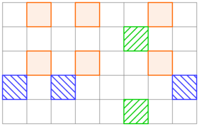

<h1 style='text-align: center;'> A. Mystical Mosaic</h1>

<h5 style='text-align: center;'>time limit per test: 1 second</h5>
<h5 style='text-align: center;'>memory limit per test: 256 megabytes</h5>

There is a rectangular grid of *n* rows of *m* initially-white cells each.

Arkady performed a certain number (possibly zero) of operations on it. In the *i*-th operation, a non-empty subset of rows *R**i* and a non-empty subset of columns *C**i* are chosen. For each row *r* in *R**i* and each column *c* in *C**i*, the intersection of row *r* and column *c* is coloured black.

There's another constraint: a row or a column can only be chosen at most once among all operations. In other words, it means that no pair of (*i*, *j*) (*i* < *j*) exists such that  or , where  denotes intersection of sets, and  denotes the empty set.

You are to determine whether a valid sequence of operations exists that produces a given final grid.

##### Input

The first line contains two space-separated integers *n* and *m* (1 ≤ *n*, *m* ≤ 50) — the number of rows and columns of the grid, respectively.

Each of the following *n* lines contains a string of *m* characters, each being either '.' (denoting a white cell) or '#' (denoting a black cell), representing the desired setup.

##### Output

If the given grid can be achieved by any valid sequence of operations, output "Yes"; otherwise output "No" (both without quotes).

You can print each character in any case (upper or lower).

## Examples

##### Input


```text
5 8  
.#.#..#.  
.....#..  
.#.#..#.  
#.#....
#  
.....#..  

```
##### Output


```text
Yes  

```
##### Input


```text
5 5  
..#..  
..#..  
#####  
..#..  
..#..  

```
##### Output


```text
No  

```
##### Input


```text
5 9  
........
#  
#........  
..##.#...  
.......#.  
....#.#.
#  

```
##### Output


```text
No  

```
## Note

For the first example, the desired setup can be produced by 3 operations, as is shown below.

  For the second example, the desired setup cannot be produced, since in order to colour the center row, the third row and all columns must be selected in one operation, but after that no column can be selected again, hence it won't be possible to colour the other cells in the center column.


#### Tags 

#1300 #NOT OK #greedy #implementation 

## Blogs
- [All Contest Problems](../VK_Cup_2018_-_Round_2.md)
- [Announcement](../blogs/Announcement.md)
- [Tutorial (en)](../blogs/Tutorial_(en).md)
