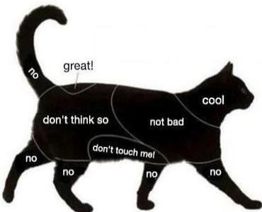
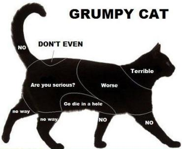

<h1 style='text-align: center;'> B. A Map of the Cat</h1>

<h5 style='text-align: center;'>time limit per test: 1 second</h5>
<h5 style='text-align: center;'>memory limit per test: 256 megabytes</h5>

If you have ever interacted with a cat, you have probably noticed that they are quite particular about how to pet them. Here is an approximate map of a normal cat.

  However, some cats won't tolerate this nonsense from the humans. Here is a map of a grumpy cat.

  You have met a cat. Can you figure out whether it's normal or grumpy?

## Interaction

This is an interactive problem. Initially you're not given any information about the cat. Instead, the cat is divided into ten areas, indexed from 0 to 9. 

In one query you can choose which area you'll pet and print the corresponding index to standard out. You will get the cat's response, as depicted on the corresponding map, via standard in. For simplicity all responses are written in lowercase.

Once you're certain what type of cat you're dealing with, output "normal" or "grumpy" to standard out.

## Note

Please make sure to use the stream flushing operation after each query in order not to leave part of your output in some buffer.

#### Tags 

#1900 #NOT OK #brute_force #interactive 

## Blogs
- [All Contest Problems](../April_Fools_Contest_2018.md)
- [Announcement](../blogs/Announcement.md)
- [Tutorial](../blogs/Tutorial.md)
