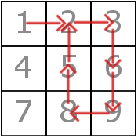

<h1 style='text-align: center;'> C. Matrix Walk</h1>

<h5 style='text-align: center;'>time limit per test: 1 second</h5>
<h5 style='text-align: center;'>memory limit per test: 256 megabytes</h5>

There is a matrix *A* of size *x* × *y* filled with integers. For every ,  *A**i*, *j* = *y*(*i* - 1) + *j*. Obviously, every integer from [1..*xy*] occurs exactly once in this matrix. 

You have traversed some path in this matrix. Your path can be described as a sequence of visited cells *a*1, *a*2, ..., *a**n* denoting that you started in the cell containing the number *a*1, then moved to the cell with the number *a*2, and so on.

From the cell located in *i*-th line and *j*-th column (we denote this cell as (*i*, *j*)) you can move into one of the following cells:

1. (*i* + 1, *j*) — only if *i* < *x*;
2. (*i*, *j* + 1) — only if *j* < *y*;
3. (*i* - 1, *j*) — only if *i* > 1;
4. (*i*, *j* - 1) — only if *j* > 1.

Notice that making a move requires you to go to an adjacent cell. It is not allowed to stay in the same cell. You don't know *x* and *y* exactly, but you have to find any possible values for these numbers such that you could start in the cell containing the integer *a*1, then move to the cell containing *a*2 (in one step), then move to the cell containing *a*3 (also in one step) and so on. Can you choose *x* and *y* so that they don't contradict with your sequence of moves?

##### Input

The first line contains one integer number *n* (1 ≤ *n* ≤ 200000) — the number of cells you visited on your path (if some cell is visited twice, then it's listed twice).

The second line contains *n* integers *a*1, *a*2, ..., *a**n* (1 ≤ *a**i* ≤ 109) — the integers in the cells on your path.

##### Output

If all possible values of *x* and *y* such that 1 ≤ *x*, *y* ≤ 109 contradict with the information about your path, print NO.

Otherwise, print YES in the first line, and in the second line print the values *x* and *y* such that your path was possible with such number of lines and columns in the matrix. Remember that they must be positive integers not exceeding 109.

## Examples

##### Input


```text
8  
1 2 3 6 9 8 5 2  

```
##### Output


```text
YES  
3 3  

```
##### Input


```text
6  
1 2 1 2 5 3  

```
##### Output


```text
NO  

```
##### Input


```text
2  
1 10  

```
##### Output


```text
YES  
4 9  

```
## Note

The matrix and the path on it in the first test looks like this:

  Also there exist multiple correct answers for both the first and the third examples.


#### Tags 

#1700 #NOT OK #implementation 