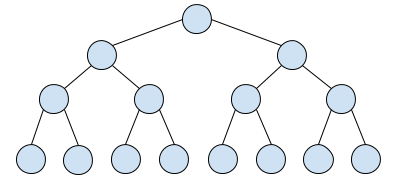

<h1 style='text-align: center;'> H. Path Counting</h1>

<h5 style='text-align: center;'>time limit per test: 5 seconds</h5>
<h5 style='text-align: center;'>memory limit per test: 256 megabytes</h5>

You are given a rooted tree. Let's denote *d*(*x*) as depth of node *x*: depth of the root is 1, depth of any other node *x* is *d*(*y*) + 1, where *y* is a parent of *x*.

The tree has the following property: every node *x* with *d*(*x*) = *i* has exactly *a**i* children. Maximum possible depth of a node is *n*, and *a**n* = 0.

We define *f**k* as the number of unordered pairs of vertices in the tree such that the number of edges on the simple path between them is equal to *k*.

Calculate *f**k* modulo 109 + 7 for every 1 ≤ *k* ≤ 2*n* - 2.

#### Input

The first line of input contains an integer *n* (2  ≤  *n*  ≤  5 000) — the maximum depth of a node.

The second line of input contains *n* - 1 integers *a*1,  *a*2,  ...,  *a**n* - 1 (2 ≤  *a**i*  ≤ 109), where *a**i* is the number of children of every node *x* such that *d*(*x*) = *i*. Since *a**n* = 0, it is not given in the input.

#### Output

Print 2*n* - 2 numbers. The *k*-th of these numbers must be equal to *f**k* modulo 109 + 7.

## Examples

#### Input


```text
4  
2 2 2  

```
#### Output


```text
14 19 20 20 16 16 
```
#### Input


```text
3  
2 3  

```
#### Output


```text
8 13 6 9 
```
## Note

This the tree from the first sample: 

  

#### Tags 

#2500 #NOT OK #combinatorics #dp 