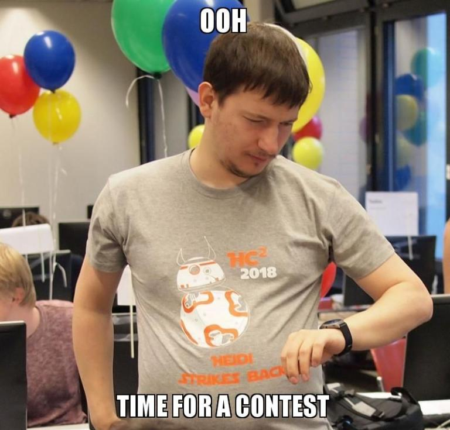

# a_(en)

**UPDATE: the editorial is [here](https://assets.codeforces.com/files/helvetic/helvetic-coding-contest-2018-editorial.pdf)**

Hello CodeForces! This year again, I'd like to invite you to the online mirror of an open championship of Switzerland called HC2 (the Helvetic Coding Contest). A mirror was also held [last year](//codeforces.com/contest/802) and [two years ago](//codeforces.com/contest/690).

[The Helvetic Coding Contest](https://codeforces.com/http://hc2.ch/) is a yearly contest held at [the EPFL](https://codeforces.com/http://epfl.ch/) in Lausanne by the [PolyProg](https://codeforces.com/http://polyprog.epfl.ch/) association. The contest itself took place on March the 17th, but the online mirror is scheduled on [**Saturday, 14th of April, 10:05 Moscow time**](https://codeforces.com/https://www.timeanddate.com/worldclock/fixedtime.html?msg=Helvetic+Coding+Contest+2017+online+mirror&iso=20180414T0705&ah=4&am=30). The duration is 4:30.

Rules:

 * you can participate in teams or individually (1-3 people),
* standard ACM-ICPC rules (no hacking),
* the contest is not rated,
* if you have participated in the onsite contest, please do not participate in the mirror.

The contest this year is Star Wars-themed. It features 6 series of 2-3 related tasks with increasing difficulty (easy/medium/hard). Sometimes it may be the case that a solution for the hard version solves all of them, but usually not. We think that the problemset is diverse and interesting, and while the contest is ACM-style, you will find that some problems are not so standard. Most easy&medium problems are even solvable in Python, so you can also recommend this contest to your newbie friends :) We promise to post a nice editorial as soon as the contest ends.

Acknowledgments: the problems were set by [maksay](https://codeforces.com/profile/maksay "Candidate Master maksay"), [boba5551](https://codeforces.com/profile/boba5551 "Candidate Master boba5551"), [mukel](https://codeforces.com/profile/mukel "Candidate Master mukel"), [DamianS](https://codeforces.com/profile/DamianS "International Master DamianS"), [esrever](https://codeforces.com/profile/esrever "Candidate Master esrever"), and myself. Thanks also go out to people who helped with the statements and testing: [bgamlath](https://codeforces.com/profile/bgamlath "Expert bgamlath"), Michalina Pacholska (who also draws the cows), and [KAN](https://codeforces.com/profile/KAN "Grandmaster KAN") for CodeForces coordination, as well as everyone involved in the actual onsite contest, who are too many to name here. We also thank the sponsors [Open Systems](https://codeforces.com/http://open.ch/) and [AdNovum](https://codeforces.com/http://www.adnovum.ch/). Lastly, thanks to [MikeMirzayanov](https://codeforces.com/profile/MikeMirzayanov "Headquarters, MikeMirzayanov") for CodeForces and Polygon (which was used to prepare the problems).

Finally, in a bit of autopromotion, note that you can use [Hightail](//codeforces.com/blog/entry/13141) to automatically test your solutions :) Good luck!

**After-contest UPDATE:**

[>>> Editorial <<<](https://assets.codeforces.com/files/helvetic/helvetic-coding-contest-2018-editorial.pdf)
------------------------------------------------------------------------------------------------------------------

Feel free to ask questions in this topic.

Thanks to everyone who participated! We hope you have enjoyed the problems despite the interruption in judging. The top 4 teams, who have solved all problems, are:

 1. SpicyFriedTomatoes: [AbstractKangaroo](https://codeforces.com/profile/AbstractKangaroo "Candidate Master AbstractKangaroo"), [jqdai0815](https://codeforces.com/profile/jqdai0815 "Legendary Grandmaster jqdai0815")
2. (｀・ω・´): [King_George](https://codeforces.com/profile/King_George "Pupil King_George"), [ohweonfire](https://codeforces.com/profile/ohweonfire "Grandmaster ohweonfire"), [FizzyDavid](https://codeforces.com/profile/FizzyDavid "Legendary Grandmaster FizzyDavid")
3. ymd队长ioi捧杯超稳: [sunset](https://codeforces.com/profile/sunset "International Grandmaster sunset"), [TLE](https://codeforces.com/profile/TLE "International Grandmaster TLE"), [yanQval](https://codeforces.com/profile/yanQval "Grandmaster yanQval")
4. ★SweeT DiscoverY★: [dotorya](https://codeforces.com/profile/dotorya "Legendary Grandmaster dotorya"), [molamola.](https://codeforces.com/profile/molamola. "International Grandmaster molamola."), [zigui](https://codeforces.com/profile/zigui "International Grandmaster zigui")

See you again next year!

