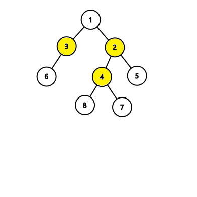
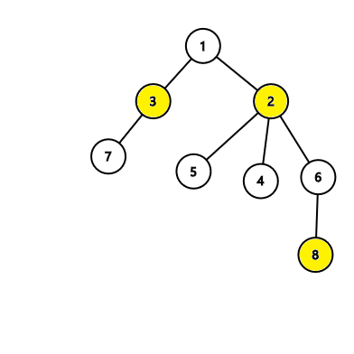

<h1 style='text-align: center;'> C. Mahmoud and Ehab and the wrong algorithm</h1>

<h5 style='text-align: center;'>time limit per test: 2 seconds</h5>
<h5 style='text-align: center;'>memory limit per test: 256 megabytes</h5>

Mahmoud was trying to solve the vertex cover problem on trees. The problem statement is:

Given an undirected tree consisting of *n* nodes, find the minimum number of vertices that cover all the edges. Formally, we need to find a set of vertices such that for each edge (*u*, *v*) that belongs to the tree, either *u* is in the set, or *v* is in the set, or both are in the set. Mahmoud has found the following algorithm:

* Root the tree at node 1.
* Count the number of nodes at an even depth. Let it be *evenCnt*.
* Count the number of nodes at an odd depth. Let it be *oddCnt*.
* The answer is the minimum between *evenCnt* and *oddCnt*.

The depth of a node in a tree is the number of edges in the shortest path between this node and the root. The depth of the root is 0.

Ehab told Mahmoud that this algorithm is wrong, but he didn't believe because he had tested his algorithm against many trees and it worked, so Ehab asked you to find 2 trees consisting of *n* nodes. The algorithm should find an incorrect answer for the first tree and a correct answer for the second one.

#### Input

The only line contains an integer *n* (2 ≤ *n* ≤ 105), the number of nodes in the desired trees.

#### Output

The output should consist of 2 independent sections, each containing a tree. The algorithm should find an incorrect answer for the tree in the first section and a correct answer for the tree in the second. If a tree doesn't exist for some section, output "-1" (without quotes) for that section only.

If the answer for a section exists, it should contain *n* - 1 lines, each containing 2 space-separated integers *u* and *v* (1 ≤ *u*, *v* ≤ *n*), which means that there's an undirected edge between node *u* and node *v*. If the given graph isn't a tree or it doesn't follow the format, you'll receive wrong answer verdict.

If there are multiple answers, you can print any of them.

## Examples

#### Input


```text
2  

```
#### Output


```text
-1  
1 2  

```
#### Input


```text
8  

```
#### Output


```text
1 2  
1 3  
2 4  
2 5  
3 6  
4 7  
4 8  
1 2  
1 3  
2 4  
2 5  
2 6  
3 7  
6 8
```
## Note

In the first sample, there is only 1 tree with 2 nodes (node 1 connected to node 2). The algorithm will produce a correct answer in it so we printed  - 1 in the first section, but notice that we printed this tree in the second section.

In the second sample:

In the first tree, the algorithm will find an answer with 4 nodes, while there exists an answer with 3 nodes like this:  In the second tree, the algorithm will find an answer with 3 nodes which is correct: 


#### Tags 

#1500 #NOT OK #constructive_algorithms #trees 

## Blogs
- [All Contest Problems](../Codeforces_Round_473_(Div._2).md)
- [Announcement (en)](../blogs/Announcement_(en).md)
- [Tutorial (en)](../blogs/Tutorial_(en).md)
