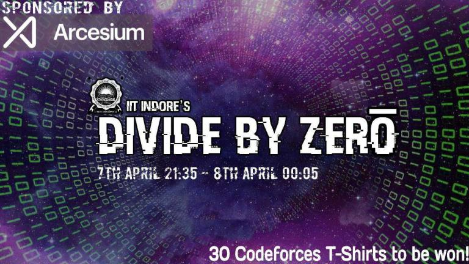

# A_(en)

Hi Codeforces!

[Programming Club, IIT Indore](https://codeforces.com/https://pclubiiti.github.io/) and [Euristica 2018](https://codeforces.com/https://euristica.in/) are proud to present our flagship event, **Divide By Zero!** The contest will take place on [Saturday, 7th April at 9:35PM IST](https://codeforces.com/https://www.timeanddate.com/worldclock/fixedtime.html?day=7&month=4&year=2018&hour=19&min=5&sec=0&p1=166).

**Prizes :** Codeforces T-shirts for top 15 participants overall and top 15 participants in India.

Thanks to the following people for making the round possible :

 * [apoorv_kulsh](https://codeforces.com/profile/apoorv_kulsh "Candidate Master apoorv_kulsh"), [arnabsamanta](https://codeforces.com/profile/arnabsamanta "Expert arnabsamanta"), [AakashHanda](https://codeforces.com/profile/AakashHanda "Candidate Master AakashHanda"), [Vicennial](https://codeforces.com/profile/Vicennial "Candidate Master Vicennial"), [kr_abhinav](https://codeforces.com/profile/kr_abhinav "Candidate Master kr_abhinav"), [7dan](https://codeforces.com/profile/7dan "Expert 7dan"), [rohitranjan017](https://codeforces.com/profile/rohitranjan017 "Expert rohitranjan017") and myself for setting the problems.
* [usaxena95](https://codeforces.com/profile/usaxena95 "Candidate Master usaxena95") and [killer_bee](https://codeforces.com/profile/killer_bee "Expert killer_bee") for their help with the problems.
* [300iq](https://codeforces.com/profile/300iq "International Grandmaster 300iq") and [demon1999](https://codeforces.com/profile/demon1999 "Grandmaster demon1999") for testing the problems.
* [vintage_Vlad_Makeev](https://codeforces.com/profile/vintage_Vlad_Makeev "International Grandmaster vintage_Vlad_Makeev") for coordinating throughout the round.
* [fcspartakm](https://codeforces.com/profile/fcspartakm "Candidate Master fcspartakm") and [arsor](https://codeforces.com/profile/arsor "Specialist arsor") for translating the problems.
* [KAN](https://codeforces.com/profile/KAN "Grandmaster KAN") for his invaluable help with the round.
* [MikeMirzayanov](https://codeforces.com/profile/MikeMirzayanov "Headquarters, MikeMirzayanov") for the amazing Codeforces and Polygon platforms.

There are 8 problems, and 2.5 hours to solve them. The points distribution will be updated later.

**Euristica**, sponsored by [Arcesium](https://codeforces.com/https://www.arcesium.com/) is the inaugral Programming festival of IIT Indore. It comprised of 10 events this year, spanning across various domains like Competitive Programming, Application Development, Cyber Security and Machine Learning. For more information, visit [www.euristica.in](https://codeforces.com/http://euristica.in) .

Hope you guys enjoy the contest! See you on the leaderboard!

**UPD:** The scoring distribution is 500-1000-1500-2000-2250-2500-3000-3500.

**UPD 2:** Do give your feedback here : [https://goo.gl/forms/xbsdMxnkA3XsG4092](https://codeforces.com/https://goo.gl/forms/xbsdMxnkA3XsG4092). Would love to hear your feedback, since that would help us get better!

We hope you guys enjoyed the contest and found the problems interesting.

**UPD 3:** You can find the editorial [here](//codeforces.comTutorial_(en).md). 

Here are the list of winners who won Tshirts. We will contact you guys soon. Congrats!

**Overall Top 15:**

 1. [jqdai0815](https://codeforces.com/profile/jqdai0815 "Legendary Grandmaster jqdai0815")
2. [Benq](https://codeforces.com/profile/Benq "International Grandmaster Benq")
3. [Syloviaely](https://codeforces.com/profile/Syloviaely "Legendary Grandmaster Syloviaely")
4. [ainta](https://codeforces.com/profile/ainta "International Grandmaster ainta")
5. [ko_osaga](https://codeforces.com/profile/ko_osaga "International Grandmaster ko_osaga")
6. [dotorya](https://codeforces.com/profile/dotorya "Legendary Grandmaster dotorya")
7. [Um_nik](https://codeforces.com/profile/Um_nik "Legendary Grandmaster Um_nik")
8. [uwi](https://codeforces.com/profile/uwi "International Grandmaster uwi")
9. [izban](https://codeforces.com/profile/izban "International Grandmaster izban")
10. [SpyCheese](https://codeforces.com/profile/SpyCheese "International Grandmaster SpyCheese")
11. [dreamoon_love_AA](https://codeforces.com/profile/dreamoon_love_AA "International Grandmaster dreamoon_love_AA")
12. [ilyakor](https://codeforces.com/profile/ilyakor "International Grandmaster ilyakor")
13. [chemthan](https://codeforces.com/profile/chemthan "International Master chemthan")
14. [JOHNKRAM](https://codeforces.com/profile/JOHNKRAM "International Grandmaster JOHNKRAM")
15. [eddy1021](https://codeforces.com/profile/eddy1021 "Grandmaster eddy1021")

**Top 15 in India:**

 1. [gvaibhav21](https://codeforces.com/profile/gvaibhav21 "Master gvaibhav21")
2. [pranjal.ssh](https://codeforces.com/profile/pranjal.ssh "Candidate Master pranjal.ssh")
3. [Baba](https://codeforces.com/profile/Baba "International Master Baba")
4. [yashChandnani](https://codeforces.com/profile/yashChandnani "Candidate Master yashChandnani")
5. [teja349](https://codeforces.com/profile/teja349 "Grandmaster teja349")
6. [jtnydv25](https://codeforces.com/profile/jtnydv25 "Master jtnydv25")
7. [ajinkya1p3](https://codeforces.com/profile/ajinkya1p3 "Candidate Master ajinkya1p3")
8. [polingy](https://codeforces.com/profile/polingy "Master polingy")
9. [hitman623](https://codeforces.com/profile/hitman623 "Candidate Master hitman623")
10. [GT_18](https://codeforces.com/profile/GT_18 "Candidate Master GT_18")
11. [Equinox](https://codeforces.com/profile/Equinox "Candidate Master Equinox")
12. [sinus_070](https://codeforces.com/profile/sinus_070 "Candidate Master sinus_070")
13. [Shivram](https://codeforces.com/profile/Shivram "Candidate Master Shivram")
14. [abisheka](https://codeforces.com/profile/abisheka "Candidate Master abisheka")
15. [nishant_coder](https://codeforces.com/profile/nishant_coder "Candidate Master nishant_coder")
