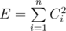
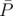
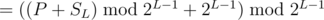
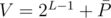
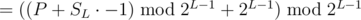
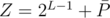
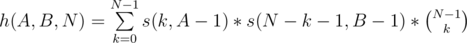
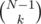
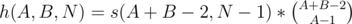
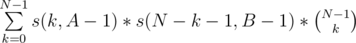

# Tutorial_(en)


### [960A - Check the string](../problems/A._Check_the_string.md "Divide by Zero 2018 and Codeforces Round 474 (Div. 1 + Div. 2, combined)")

Traverse the string once and check if the ASCII value of all characters is greater than or equal or the ASCII value of the previous character. This ensures that the string does not have a,b,c in wrong order.

Also, while traversing the string, keep three separate counters for the number of 'a', 'b' and 'c' along.

Now, do a simple check on the condition for the count of 'c'.

The hack case for many solutions was to check that the count of 'a' is atleast 1 and the count of 'b' is atleast 1.

Set by : [vntshh](https://codeforces.com/profile/vntshh "Candidate Master vntshh")

 **Setter's solution**
```cpp
#include<bits/stdc++.h>
#define rep(i,start,lim) for(lld i=start;i<lim;i++)
#define repd(i,start,lim) for(lld i=start;i>=lim;i--)
#define scan(x) scanf("%lld",&x)
#define print(x) printf("%lld ",x)
#define f first
#define s second
#define pb push_back
#define mp make_pair
#define br printf("n")
#define sz(a) lld((a).size())
#define YES printf("YESn")
#define NO printf("NOn")
#define all(c) (c).begin(),(c).end()
#define INF         1011111111
#define LLINF       1000111000111000111LL
#define EPS         (double)1e-10
#define MOD         1000000007
#define PI          3.14159265358979323
using namespace std;
typedef long double ldb;
typedef long long lld;
lld powm(lld base,lld exp,lld mod=MOD) {lld ans=1;while(exp){if(exp&1) ans=(ans*base)%mod;exp>>=1,base=(base*base)%mod;}return ans;}
lld ctl(char x,char an='a') {return (lld)(x-an);}
char ltc(lld x,char an='a') {return (char)(x+an);}
#define bit(x,j) ((x>>j)&1)
typedef vector<lld> vlld;
typedef pair<lld,lld> plld;
typedef map<lld,lld> mlld;
typedef set<lld> slld;
#define sync ios_base::sync_with_stdio(0); cin.tie(0); cout.tie(0)
#define mxm(a,b) a = max(a,b)
#define mnm(a,b) a = min(a,b)
#define endl 'n'
#define fre freopen("1.in","r",stdin); freopen("1.out","w",stdout);
#define N 1000005
int main()
{
    //sync;
    string s;
    map<char,lld> m;
    cin>>s;
    lld k = sz(s);
    string tmp = "";
    tmp += s[0];
    rep(i,1,k) if(s[i]!=s[i-1]) tmp+=s[i];
    rep(i,0,k) m[s[i]]++;
    if(tmp != "abc") return 0*NO;
    if(m['c']!=m['a'] and m['c']!=m['b']) return 0*NO;
    if(m['a']>=1 and m['b']>=1) return 0*YES;
    else return 0*NO;
    return 0;
}
```
 
### [960B - Minimize the error](../problems/B._Minimize_the_error.md "Divide by Zero 2018 and Codeforces Round 474 (Div. 1 + Div. 2, combined)")

The problem can be interpreted as follows: array *B* is fixed and a total of *k*1 + *k*2 = *K* operations allowed on *A*. Let the array *C* be defined as *Ci* = |*Ai* - *Bi*| Now this is just a simple greedy problem where value of  is to be minimized after exactly *K* subtraction/addition operations spread over the elements of array *C*. 

1. Till *E* is non-zero, the largest element is chosen and 1 is subtracted from it. This is done as currently we want to maximize the reduction in error per operation and decreasing an element *x* by 1 reduces error by *x*2 - (*x* - 1)2 = 2·*x* - 1.
2. Once all the elements become zero, we can use the remaining moves to alternately increase and decrease the same element till we run out of moves.

This can be implemented using a priority queue or by sorting the array *C* and iterating over it.

Expected complexity: *O*(*N*·*K*·*log*(*N*)) or *O*(*N*·*log*(*N*))

Set by : [AakashHanda](https://codeforces.com/profile/AakashHanda "Candidate Master AakashHanda")

 **Setter's solution**
```cpp
#include<bits/stdc++.h>
using namespace std;

typedef long long ll;

priority_queue<ll> pq;

int main(){
    int n, k1, k2, k;
    cin>>n>>k1>>k2;
    k = k1+k2;
    vector<ll> a(n), b(n), arr(n);
    for(int i=0 ; i<n ; ++i)
        cin>>a[i];
    for(int i=0 ; i<n ; ++i){
        cin>>b[i];
        arr[i] = abs(a[i]-b[i]);
        pq.push(arr[i]);
    }
    while(k>0){
        ll curr = pq.top();
        pq.pop();
        pq.push(abs(curr-1));
        k--;
    }
    ll ans = 0;
    while(!pq.empty()){
        ll curr = pq.top();
        ans += (curr*curr);
        pq.pop();
    }
    cout<<ans;
}
```
 
### [960C - Subsequence Counting](../problems/C._Subsequence_Counting.md "Divide by Zero 2018 and Codeforces Round 474 (Div. 1 + Div. 2, combined)")

Let's call a subsequence valid if the difference of maximum element and minimum element is less than d.

For an array of size *n* with all the elements equal, there are 2*n* - 1 non-empty subsequences and all of them are valid. This is because for any subsequence, the difference of maximum element and minimum element is always zero. 

We will use this observation in constructing the answer. Let's look at the binary representation of *X*. If the *i**th* bit is set in X, we will add *i* equal elements (let's say *y*) in our final array. However this would give us 2*i* - 1 non-empty valid subsequences. To correct this, we will add a separate element *y* + *d* in the final array so that the final contribution of *i**th* bit becomes 2*i*. We will carry out the same process for all the bits, keeping a counter of the previous 

In this way, the length of the final array will never exceed  600 elements. 

Expected Complexity : O(logX * logX)

Set by : [7dan](https://codeforces.com/profile/7dan "Expert 7dan")

 **Setter's solution**
```cpp
#include<bits/stdc++.h>
#define rep(i,start,lim) for(lld i=start;i<lim;i++)
#define repd(i,start,lim) for(lld i=start;i>=lim;i--)
#define scan(x) scanf("%lld",&x)
#define print(x) printf("%lld ",x)
#define f first
#define s second
#define pb push_back
#define mp make_pair
#define br printf("n")
#define sz(a) lld((a).size())
#define YES printf("YESn")
#define NO printf("NOn")
#define all(c) (c).begin(),(c).end()
#define INF         1011111111
#define LLINF       1000111000111000111LL
#define EPS         (double)1e-10
#define MOD         1000000007
#define PI          3.14159265358979323
using namespace std;
typedef long double ldb;
typedef long long lld;
lld powm(lld base,lld exp,lld mod=MOD) {lld ans=1;while(exp){if(exp&1) ans=(ans*base)%mod;exp>>=1,base=(base*base)%mod;}return ans;}
lld ctl(char x,char an='a') {return (lld)(x-an);}
char ltc(lld x,char an='a') {return (char)(x+an);}
#define bit(x,j) ((x>>j)&1)
typedef vector<lld> vlld;
typedef pair<lld,lld> plld;
typedef map<lld,lld> mlld;
typedef set<lld> slld;
#define sync ios_base::sync_with_stdio(0); cin.tie(0); cout.tie(0)
#define mxm(a,b) a = max(a,b)
#define mnm(a,b) a = min(a,b)
#define endl 'n'
#define fre freopen("1.in","r",stdin); freopen("1.out","w",stdout);
#define N 1000005
int main()
{
    //sync;
    lld x,d;
    vector<lld> ans;
    cin>>x>>d;
    lld num = 1, cnt = 0;
    repd(i,60,1) if(bit(x,i)) {
        rep(j,0,i) ans.pb(num);
        cnt++;
        num+=(d+1);
    }
    while(cnt--) ans.pb(num),num+=(d+1);
    if(x%2) ans.pb(num);
    cout<<sz(ans)<<endl;
    for(auto i:ans) cout<<i<<" ";
    return 0;
}
```
 
### [960D - Full Binary Tree Queries](../problems/D._Full_Binary_Tree_Queries.md "Divide by Zero 2018 and Codeforces Round 474 (Div. 1 + Div. 2, combined)")

Let us define the root of the tree to be at level *L* = 1. 

Now, the level *L* for any value *X* can be found using this formula: *L* = 64 -  (Number of leading unset bits in *X*). In C++, you can conveniently calculate the leading unset bits by using __builtin_clzll(*X*). 

Let us imagine each level of the tree as an array *A**L*. Observe that we only need to consider *L* upto 60 due to the constraint that *X* ≤ 1018. 

* Queries of type 1 are equivalent to performing a cyclic shift of *K* on array *A**L*.
* Queries of type 2 are equivalent to performing a cyclic shift of *K* on array *A**L* , 2·*K* on array *A**L* + 1 , 22·*K* on array *A**L* + 2 ... 2*Z*·*K* on array *A**L* + *Z* and so on. Since we only care about the first 60 levels, 0 ≤ *Z* ≤ 60 - *L*.

 Now,we can store the net shift *S**L* of each level. Note that, for level *L*, we calculate *S**L* under modulo 2*L* - 1 because there are exactly 2*L* - 1 values in some *A**L*. 

Finally, to answer queries of type 3, do the following: 

1. Let the original index(0-indexed) of *X* in *A**L* be *P* (*P* = *X* - 2*L* - 1). The new index after the shift will be  . The original value at this index was . We can find the parent of this value in the original tree by dividing *V* by 2 (Integer Division).Thus, We can now find all the values in the path from *V* to the root in the original tree. To get the values in the current tree, we just apply the opposite shift at each level to find the value and print it.
2. Let the original value at index *P* in *A**L* at some level *L* be *V*. The current value at this position after the shift will be the same as the value at index   in the original array. Let this value be *Z*. Now,. Print *Z* and set *V* = *V* / 2.
3. Repeat Step 2 and stop when *V* = 0.

Complexities of: 

* Query 1: *O*(1).
* Query 2: *O*(60).
* Query 3: *O*(60).
* Overall: *O*(60·*Q*)

 Refer to the code for further understanding. 

Set by : [Vicennial](https://codeforces.com/profile/Vicennial "Candidate Master Vicennial")

 **Setter's solution**
```cpp
//Gvs Akhil (Vicennial)
#include<bits/stdc++.h>
#define int long long
#define pb push_back
#define eb emplace_back
#define mp make_pair
#define mt make_tuple
#define ld(a) while(a--)
#define tci(v,i) for(auto i=v.begin();i!=v.end();i++)
#define tcf(v,i) for(auto i : v)
#define all(v) v.begin(),v.end()
#define rep(i,start,lim) for(long long (i)=(start);i<(lim);i++)
#define sync ios_base::sync_with_stdio(0); cin.tie(0); cout.tie(0)
#define osit ostream_iterator
#define INF 		0x3f3f3f3f
#define LLINF       1000111000111000111LL
#define PI 			3.14159265358979323
#define endl 'n'
#define trace1(x)                cerr<<#x<<": "<<x<<endl
#define trace2(x, y)             cerr<<#x<<": "<<x<<" | "<<#y<<": "<<y<<endl
#define trace3(x, y, z)          cerr<<#x<<":" <<x<<" | "<<#y<<": "<<y<<" | "<<#z<<": "<<z<<endl
#define trace4(a, b, c, d)       cerr<<#a<<": "<<a<<" | "<<#b<<": "<<b<<" | "<<#c<<": "<<c<<" | "<<#d<<": "<<d<<endl
#define trace5(a, b, c, d, e)    cerr<<#a<<": "<<a<<" | "<<#b<<": "<<b<<" | "<<#c<<": "<<c<<" | "<<#d<<": "<<d<<" | "<<#e<< ": "<<e<<endl
#define trace6(a, b, c, d, e, f) cerr<<#a<<": "<<a<<" | "<<#b<<": "<<b<<" | "<<#c<<": "<<c<<" | "<<#d<<": "<<d<<" | "<<#e<< ": "<<e<<" | "<<#f<<": "<<f<<endl
const int N=1000006;
using namespace std;
typedef vector<int> vi;
typedef vector<vi> vvi;
typedef long long ll;
typedef vector<long long> vll;
typedef vector<vll> vvll;
typedef long double ld;
typedef pair<int,int> ii;
typedef vector<ii> vii;
typedef vector<vii> vvii;
typedef tuple<int,int,int> iii;
typedef set<int> si;
typedef complex<double> pnt;
typedef vector<pnt> vpnt;
typedef priority_queue<ii,vii,greater<ii> > spq;
const ll MOD=1000000007LL;
template<typename T> T gcd(T a,T b){if(a==0) return b; return gcd(b%a,a);}
template<typename T> T power(T x,T y,ll m=MOD){T ans=1;while(y>0){if(y&1LL) ans=(ans*x)%m;y>>=1LL;x=(x*x)%m;}return ans%m;}
int shift[66];
inline int getlev(int x){
	int z=__builtin_clzll(x);
	return 64-z;
}
inline int getmod(int x){
	return (1LL<<(x-1));
}
void addshift(int x,int k){
	int m=getmod(x);
	if(k>=m) k%=m;
	shift[x]+=k;
	if(shift[x]>=m) shift[x]-=m;
	if(shift[x]<0) shift[x]+=m;	
}
int getorig(int V,int l){
	int fval=(1LL<<(l-1)); // 2^(L-1)
	int mod=getmod(l);
	int P= V-fval; 
	int Z= fval+((P-shift[l])%mod + mod)%mod;
	return Z;
}
int32_t main(){
	sync;
	int q; cin>>q;
	while(q--){
		int t,x,k;
		cin>>t>>x;
		int l=getlev(x);
		if(t==1){ 
			cin>>k; k%=getmod(l);
			addshift(l,k);
		}
		else if(t==2){// propogating
			cin>>k; 
			k%=getmod(l);
			if(k<0) k+=getmod(l);
			 int curr=1;
			for(int i=l;i<=60;i++){
				addshift(i,k*curr);
				curr<<=1;
			}
		}
		else{ // printing
			int P= x - (1LL<<(l-1)); // Finding index in array
			int V= (1LL<<(l-1)) + ((P+shift[l])%(1LL<<(l-1)) + (1LL<<(l-1)) )%(1ll<<(l-1)); //Finding original value at the new index of X after performing the shift.
			for(int i=l;i>=1;i--){
				int Z = getorig(V,i); // Finding the current value
				cout<<Z<<" "; // printing the current value
				V>>=1; // dividing the original value by 2 to get its parent value
			}
			cout<<endl;
		}
	}
}
```
 
### [960E - Alternating Tree](../problems/E._Alternating_Tree.md "Divide by Zero 2018 and Codeforces Round 474 (Div. 1 + Div. 2, combined)")

An important observation for the question is 

* A(u,v)=−A(v,u)A(u,v)=−A(v,u) if there are even number of nodes on the simple path from uu to vv
* A(u,v)=A(v,u)A(u,v)=A(v,u) if there are odd number of nodes on the simple path from uu to vv

 Hence A(u,v)+A(v,u)=0A(u,v)+A(v,u)=0 for paths with even number of nodes.

 Hence the task has been reduced to finding the total sum of alternating function of paths with odd number of nodes. Also we can make use of the fact that A(u,v)+A(v,u)=2∗A(u,v)A(u,v)+A(v,u)=2∗A(u,v) , but this does not hold true when u=vu=v, hence we must handle this case by subtracting ∑i=1nVi∑i=1nVi from the final answer.

 Now with the help of a single dfs we can calculate 

* oddioddi the number of paths in the subtree of ii with odd number of nodes ending at node ii.
* evenieveni the number of paths in the subtree of ii with even number of nodes ending at node ii.

In the first part of the solution, for each node ii, we calculate its contribution to the alternating function for paths passing through this node but strictly lying within its subtree. For doing this we can merge two paths with either both having even or both having odd number of nodes ending at its children to create odd length paths.

 For the case where both the paths have even number of nodes, the current node's contribution to the summation is ViVi because its position in the sequence of nodes is odd . Similarly, we add −Vi−Vi for the other case. This can be done using a single dfs in O(n)O(n) time as we have oddioddi and evenieveni for all the nodes.

 Now for the second part of the question, we have to consider the paths which end up outside the subtree. We have the information oddioddi and evenieveni . We have to merge these paths with those ending at parentiparenti. How do we get this information? Note that oddioddi and evenieveni just represent paths strictly lying within the subtree of ii but not the entire tree. An important observation for this computation is -

 If node uu has a total of xx odd and yy even length paths ending at it then, if vv is the neighbour of uu then vv has a total of yy odd and xx even length paths ending at it. It is fairly simple to observe. We know oddrootoddroot and evenrootevenroot and since the subtree of rootroot is the entire tree, we can use these values for our requirement. Now let's represent the total number of odd and even length paths ending at ii by todditoddi and teveniteveni respectively. From our previous observation,

 if ii is odd number of nodes away from the rootroot node - 

* toddi=evenroottoddi=evenroot
* teveni=oddrootteveni=oddroot

if ii is even number of nodes away from the rootroot node - 

* toddi=oddroottoddi=oddroot
* teveni=evenrootteveni=evenroot

 The number of paths ending at parentiparenti but lying strictly outside the subtree of ii can be calculated -

* odd length paths =toddparenti−eveni=toddparenti−eveni
* even length paths =tevenparenti−oddi=tevenparenti−oddi

 Now we have to construct odd-length paths by merging paths in the subtree of ii ending at node ii with paths ending at parentiparenti but strictly lying outside the subtree of ii. For paths with odd-length component ending at ii we must add ViVi to the summation and −Vi−Vi otherwise. 

 Finally, the summation of contributions of each node yields you the total summation of alternating functions for all pair of nodes. This can be done for each node in O(n)O(n) time.

The overall time complexity of the solution is O(n)O(n). 

Set by : [rohitranjan017](https://codeforces.com/profile/rohitranjan017 "Expert rohitranjan017")

 **Setter's solution**
```cpp
#include<bits/stdc++.h>
using namespace std;
typedef long long ll;
const int M=1000005,mod=1e9+7;
vector<int> adj[M];
int par[M],lev[M];
ll v[M];
ll e[M],o[M];
ll ans,res,n;
ll powmod(ll base, ll exponent)
{ 
	//cout<<base<<" "<<exponent<<endl;

	ll ans=1;
	
		while(exponent)
		{ 
			while(exponent%2==0)
			{
				base=(base*base)%mod;
				exponent/=2;
			}
			
			exponent--;
			ans=(ans*base)%mod;
		}
		
	return ans;
}
void dfs(int x,int depth)
{
	//o[x]++;

	lev[x]=depth;
	
	int cno=0;

	for(int i=0;i<adj[x].size();i++)
	{
		int c=adj[x][i];
	
		if(c!=par[x])
		{
			par[c]=x;
	
			dfs(c,depth+1);
		
			if(cno>0)
			{
				ans=( (ans+ 2*( o[x]*e[c]%mod - e[x]*o[c]%mod + mod)%mod*v[x]%mod)+mod )%mod;
			}
			
			cno++;
		
			o[x]+=e[c];
			e[x]+=o[c];
		
		}
	
	}
	
	o[x]++;

	
}
int main()
{
	//freopen("o.out","r",stdin);

	cin>>n;
	
	for(int i=1;i<=n;i++)
	{
		cin>>v[i];
	}
	
	for(int i=1;i<n;i++)
	{
		int u,v;
		
		cin>>u>>v;
		
		adj[u].push_back(v);
		adj[v].push_back(u);
	}
	
	dfs(1,0); 
	
	//cout<<ans<<endl;
	
	for(int i=1;i<=n;i++)
	{	
		//cout<<"###"<<i<<endl;
		if(lev[i]%2)
		{
			ans=((ans+2*(o[i]*(e[1]-o[i]+1)%mod - e[i]*(o[1]-e[i])%mod +mod)%mod*v[i]%mod)%mod+mod )%mod;
		}
		else
		{
			ans=((ans+2*(o[i]*(o[1]-o[i]+1)%mod - e[i]*(e[1]-e[i])%mod +mod)%mod*v[i]%mod)%mod+mod )%mod;
		}
		
		//cout<<ans<<endl;
		
		ans=((ans-v[i])%mod+mod)%mod;
		
//		cout<<i<<" "<<ans<<endl;
		//cout<<ans<<endl;
	}
	
	cout<<ans<<endl;

}
```
 
### [960F - Pathwalks](../problems/F._Pathwalks.md "Divide by Zero 2018 and Codeforces Round 474 (Div. 1 + Div. 2, combined)")

The problem is similar to Longest Increasing Subsequence, done on a graph instead of an array. 

The solution for this problem can be obtained in the following ways:- 

*Approach*1 

Maintain a map for every node, consisting of weights and the corresponding max no of edges you can achieve for some path ending at that node at a given point. Now when you process the next edge, suppose *a**i* *b**i* *w**i* , you query max no of edges having weight  < *w**i* in map of node *a**i* . Let's call this *X*. Now, you try to insert *X* + 1 for weight *w**i* in map of node *b**i*. Maintain it in such a way that no of edges for higher weights in a particular node is always larger than that for smaller weights. You can do this with (kind of) the conventional sliding window idea, by removing higher weight edges with smaller values than the current inserted answer in the map, or not inserting the current value at all because an equivalent or better answer exists for weights  ≤ *w**i* for the node *b**i*. Finally the max of all such *X* + 1 you encounter during processing the graph is the maximum number of edges in any given path. 

*Approach*2 

You can also solve this problem with the help of sparse/dynamic/persistent segment tree on every node of the graph. Suppose you are at the *i**th* edge at some point in your processing, and the query was *a**i* *b**i* *w**i*. Do a Range Max Query on segtree at node *a**i*, uptil value *w**i* - 1. Suppose this answer was *X*. Now update segtree at location *b**i* with value of (*X* + 1). Store the max of all such (*X* + 1), and this is the length of longest path in your graph. 

Set by : [kr_abhinav](https://codeforces.com/profile/kr_abhinav "Candidate Master kr_abhinav")

 **Setter's solution**
```cpp
#include <bits/stdc++.h>
using namespace std;
vector<map<int,int> > s;
int getedgelen(int a, int w)
{
    auto it = s[a].lower_bound(w);
    if(it == s[a].begin()) return 1;
    it--;
    return (it->second)+1;
}
int32_t main() {
    ios::sync_with_stdio(false);cin.tie(0);
    int n,m,a,b,w;
    cin>>n>>m;
    s.resize(n+1);
    int ans = 0;
    while(m--)
    {
        cin>>a>>b>>w;
        int val = getedgelen(a,w);
        if(getedgelen(b,w+1) > val)
            continue;
        s[b][w] = max(s[b][w],val);
        auto it = s[b].upper_bound(w);
        while(!(it==s[b].end() || it->second > val))
        {
            it = s[b].erase(it);
        }
        ans = max(ans,val);
    }
    cout<<ans;
    return 0;
}
```
 
### [960G - Bandit Blues](../problems/G._Bandit_Blues.md "Divide by Zero 2018 and Codeforces Round 474 (Div. 1 + Div. 2, combined)")

The problem can be seen as to count the number of permutations such that the number of records from the front is A and the number of records from the back is B, where a record is an element greater than all previous.

let *s*(*A*, *N*) be the number of permutations such that for *N* elements exactly *A* records are present from front. Then *s*(*A*, *N*) can be calculated as

*s*(*A*, *N*) = *s*(*A* - 1, *N* - 1) + (*N* - 1) * *s*(*A*, *N* - 1) 

Let's consider the smallest element if we have it as a record then we can place it on front and have the remaining *A* - 1 records in *s*(*A* - 1, *N* - 1) ways or we don't have it as a record than we can have the remaining *A* records in *s*(*A*, *N* - 1) ways and place this smallest element at any of the remaining *N* - 1 positions.

let *h*(*A*, *B*, *N*) be the number of permutations such that the number of records from the front is *A* and the number of records from the back is *B*.

 

*k* elements are chosen and placed before the largest record such that exactly *A* - 1 records are present in them in *s*(*k*, *A* - 1) ways and the remaining *N* - *k* - 1 after the largest record such that *B* - 1 records are present in *s*(*N* - *k* - 1, *B* - 1) ways.We choose the *k* elements in  ways. 

Now we claim that 



Proof — Consider permutations of length *N* - 1 with *A* + *B* - 2 records of which *A* - 1 are colored blue and *B* - 1 are colored green.

Note — Coloring a record means coloring the record and every element between this record and previous record.

We can choose permutations of *N* - 1 with *A* + *B* - 2 records ,then choose *A* - 1 of these records to be blue in  ways.

Also for any *k* between 0 and *N* - 1 we choose *k* elements to be in blue then make permutations in these *k* elements with *A* - 1 records and make permutations with exactly *B* - 1 records on remaining *N* - *k* - 1 elements, thus we have in total  ways.

Hence both are equivalent. Therefore calculating *s*(*A* + *B* - 2, *N* - 1) gives our answer. *s*(*k*, *n*) forms stirling number of first kind which can be calculated by coefficent of *x**k* in *x* * (*x* + 1) * (*x* + 2) * ..... * (*x* + *n* - 1) using FFT.

Set by : [apoorv_kulsh](https://codeforces.com/profile/apoorv_kulsh "Candidate Master apoorv_kulsh")

 **Setter's solution**
```cpp
#include <bits/stdc++.h>
using namespace std;
typedef long long ll;
#define pb push_back
const int mod = 998244353;
const int root = 15311432;
const int root_1 = 469870224;
const int root_pw = 1 << 23;
const int N = 400004;

vector<int> v[N];

ll modInv(ll a, ll mod = mod){
	ll x0 = 0, x1 = 1, r0 = mod, r1 = a;
	while(r1){
		ll q = r0 / r1;
		x0 -= q * x1; swap(x0, x1);
		r0 -= q * r1; swap(r0, r1);
	}
	return x0 < 0 ? x0 + mod : x0;
}

void fft (vector<int> &a, bool inv) {
	int n = (int) a.size();

	for (int i=1, j=0; i<n; ++i) {
		int bit = n >> 1;
		for (; j>=bit; bit>>=1)
			j -= bit;
		j += bit;
		if (i < j)
			swap (a[i], a[j]);
	}

	for (int len=2; len<=n; len<<=1) {
		int wlen = inv ? root_1 : root;
		for (int i=len; i<root_pw; i<<=1)
			wlen = int (wlen * 1ll * wlen % mod);
		for (int i=0; i<n; i+=len) {
			int w = 1;
			for (int j=0; j<len/2; ++j) {
				int u = a[i+j],  v = int (a[i+j+len/2] * 1ll * w % mod);
				a[i+j] = u+v < mod ? u+v : u+v-mod;
				a[i+j+len/2] = u-v >= 0 ? u-v : u-v+mod;
				w = int (w * 1ll * wlen % mod);
			}
		}
	}

	if(inv) {
		int nrev = modInv(n, mod);
		for (int i=0; i<n; ++i)
			a[i] = int (a[i] * 1ll * nrev % mod);
	}
}

void pro(const vector<int> &a, const vector<int> &b, vector<int> &res) {
	vector<int> fa(a.begin(), a.end()),  fb(b.begin(), b.end());
	int n = 1;
	while (n < (int) max(a.size(), b.size()))  n <<= 1;
	n <<= 1;
	fa.resize (n),  fb.resize (n);

	fft(fa, false), fft (fb, false);
	for (int i = 0; i < n; ++i)
		fa[i] = 1LL * fa[i] * fb[i] % mod;
	fft (fa, true);
	res = fa;
}

int S(int n, int r) {

	int nn = 1;
	while(nn < n) nn <<= 1;

	for(int i = 0; i < n; ++i) {
		v[i].push_back(i);
		v[i].push_back(1);
	}
	for(int i = n; i < nn; ++i) {
		v[i].push_back(1);
	}

	for(int j = nn; j > 1; j >>= 1){
		int hn = j >> 1;
		for(int i = 0; i < hn; ++i){
			pro(v[i], v[i + hn], v[i]);
		}
	}

	return v[0][r];
}

int fac[N], ifac[N], inv[N];

void prencr(){
	fac[0] = ifac[0] = inv[1] = 1;
    for(int i = 2; i < N; ++i)
    	inv[i] = mod - 1LL * (mod / i) * inv[mod % i] % mod;
    for(int i = 1; i < N; ++i){
    	fac[i] = 1LL * i * fac[i - 1] % mod;
    	ifac[i] = 1LL * inv[i] * ifac[i - 1] % mod;
    }
}

int C(int n, int r){
	return (r >= 0 && n >= r) ? (1LL * fac[n] * ifac[n - r] % mod * ifac[r] % mod) : 0;
}

int main(){
	prencr();
	int n, p, q;
	cin >> n >> p >> q;
	ll ans = C(p + q - 2, p - 1);
	ans *= S(n - 1, p + q - 2);
	ans %= mod;
	cout << ans;
}

```
 
### [960H - Santa's Gift](../problems/H._Santa's_Gift.md "Divide by Zero 2018 and Codeforces Round 474 (Div. 1 + Div. 2, combined)")

The actual cost of replacing all candies of flavour kk in the subtree of vertex xx is hk(x)⋅ckhk(x)⋅ck. Here, hk(x)hk(x) is the number of vertices (candy) in the subtree of xx with value (flavour) kk and ckck is the cost of replacing each candy of flavour kk.

Error E(v)E(v) is defined as (hk(x)⋅ck–C)2(hk(x)⋅ck–C)2 = hk(x)2⋅c2k+C2–2⋅hk(x)⋅ck⋅Chk(x)2⋅ck2+C2–2⋅hk(x)⋅ck⋅C.

Expectation of error E(v)E(v) can be written Exp[E(v)]Exp[E(v)] = Exp[hk(x)2⋅c2k+C2–2⋅hk(x)⋅ck⋅C]Exp[hk(x)2⋅ck2+C2–2⋅hk(x)⋅ck⋅C] = c2k⋅Exp[hk(x)2]+Exp[C2]–2⋅ck⋅C⋅Exp[hk(x)]ck2⋅Exp[hk(x)2]+Exp[C2]–2⋅ck⋅C⋅Exp[hk(x)].

Exp[hk(x)]Exp[hk(x)] can be expressed as ∑nx=1hk(x)n∑x=1nhk(x)n. The above sum can be managed by adding or by subtracting the depth of node (assuming root to be of depth 1). Exp[hk(x)2]Exp[hk(x)2] can be expressed as ∑nx=1hk(x)2n∑x=1nhk(x)2n. It can be observed that for every pair of vertices with value kk we need to add depth of LCA to the answer.

∑x=1nhk(x)2=∑fi=k∑fj=kDepth(LCA(i,j))=∑fi=k∑fj=kDist(i,j)/2–Depth(i)–Depth(j)∑x=1nhk(x)2=∑fi=k∑fj=kDepth(LCA(i,j))=∑fi=k∑fj=kDist(i,j)/2–Depth(i)–Depth(j)

Now we need to find the summation ∑fi=k∑fj=kDist(i,j)∑fi=k∑fj=kDist(i,j).

To find sum we use centroid decomposition. We create a centroid tree from the given tree. Initially, no vertices have been inserted or updated. We update vertices one by one. While inserting a vertex with value kk. We need to calculate its distance with all other vertices with the same value and add to the answer. To do so we maintain few things for a given vertex xx in the centroid tree.

* p(x)p(x) — Parent of vertex xx in the centroid tree
* hk(x)hk(x) — Number of vertices currently present in the subtree of xx with value vv
* ak(x)ak(x) — ∑i∈subtree(x)distance(x,i)∑i∈subtree(x)distance(x,i)
* bk(x)bk(x) — ∑i∈subtree(x)distance(p(x),i)∑i∈subtree(x)distance(p(x),i)

The distance of any given vertex xx with value kk with other vertices of same value is given as ak(x)+dk(x)ak(x)+dk(x). 

Here, dk(x)dk(x) is ∑i∈all ancestor of xdistance(i,x)⋅(hk(p(i)−hk(i))+ak(p(i))−bk(i))∑i∈all ancestor of xdistance(i,x)⋅(hk(p(i)−hk(i))+ak(p(i))−bk(i)) 

For each vertex, we need to store for all values kk present in the subtree. We can use a map for this purpose. In worst case, O(n⋅log(n))O(n⋅log(n)) memory will be used.

Set by : [arnabsamanta](https://codeforces.com/profile/arnabsamanta "Expert arnabsamanta")

 **Setter's solution**
```cpp
#include <bits/stdc++.h>
using namespace std;
typedef long long ll;
#define pb push_back
const int N = 400004;

int n;
vector<int> e[N];
int sz[N], par[N], sp[30][N];
int V[N], L[N], CS[N];
bool mark[N];

struct tri {
	long long A, B;
	int C;
};

map<int, tri> nmp[N];

long long D[N]; // Sum of Distances
long long S[N]; // Sum of Depth
int T[N]; // Count

//======================================PRE-PROCESS=========================================

void getLevel(int u, int p = -1){
	sp[0][u] = p;
	for(auto x : e[u]) if(x != p) {
		L[x] = 1 + L[u];
		getLevel(x, u);
	}
}

void prepAncestor(){
	for(int i = 1; (1 << i) <= n; ++i) {
		for(int j = 1; j <= n; ++j) {
			sp[i][j] = sp[i - 1][sp[i - 1][j]];
		}
	}
}

int dist(int u, int v){
	if(L[u] < L[v]) swap(u, v);
	int lgn = 0;
	while((1 << lgn) < n) lgn++;
	int ans = 0;
	for(int i = lgn; i >= 0; --i){
		if(L[u] - (1 << i) >= L[v]){
			u = sp[i][u];
			ans += (1 << i);
		}
	}
	if(u == v) return ans;
	for(int i = lgn; i >= 0; --i){
		if(sp[i][u] != sp[i][v]){
			ans += 1 << (i + 1);
			u = sp[i][u];
			v = sp[i][v];
		}
	}
	return ans + 2;
}

//=================================CENTROID DECOMPOSITION===================================

void getSize(int u, int p = -1) {
      sz[u] = 1;
      for(auto v : e[u]) if(v != p && !mark[v]) {
            getSize(v, u);
            sz[u] += sz[v];
      }
}
 
int getCentroid(int u, int p, int lim) {
      for(auto v : e[u]) if(v != p && !mark[v] && sz[v] > lim) {
            return getCentroid(v, u, lim);
      }
      return u;
}

void decompose(int u, int p = -1) {
      getSize(u);
      int cen = getCentroid(u, -1, sz[u] / 2);
      par[cen] = p == -1 ? cen : p;
      mark[cen] = true;
       
      for(auto v : e[cen]) if(v != p && !mark[v]) {
            decompose(v, cen);
      }
}

//==========================================QUERY-HANDLER===============================================

void updAns(int u, int add) {

	int Z = V[u];
	
	tri tY = nmp[u][Z];
	ll ret = tY.A;
	int y = u, x = par[u];
	while(y != x) {
		tri tX = nmp[x][Z];
		ret += 1LL * (tX.C - tY.C) * dist(x, u) + (tX.A - tY.B);
		y = x;
		tY = tX;
		x = par[x];
	}
	ret <<= 1;

	int mul = add ? 1 : -1;
	D[Z] += mul * ret;
	S[Z] += mul * L[u];
	T[Z] += mul;
}

void updTree(int u, bool add) {
	int Z = V[u];
	int mul = add ? 1 : -1;
	for(int x = u; ; x = par[x]) {
		tri &tX = nmp[x][Z];
		tX.C += mul;
		if(!tX.C) {
			nmp[x].erase(Z);
		} else {
			tX.A += mul * dist(u, x);
			tX.B += mul * dist(u, par[x]);
		}
		if(x == par[x]) break;
	}
}

void upd(int u, bool add) {
	if(add) {
		updTree(u, add);
		updAns(u, add);
	} else {
		updAns(u, add);
		updTree(u, add);
	} 
}

//=========================================MAIN============================================

int main(){
	
	int m, q, ac;
	scanf("%d %d %d %d", &n, &m, &q, &ac);

	for(int i = 1; i <= n; ++i) {
		scanf("%d", &V[i]);
	}
	
	for(int i = 2; i <= n; ++i) {
		int v;
		scanf("%d", &v);
		e[v].pb(i);
		e[i].pb(v);
	}

	for(int i = 1; i <= m; ++i) {
		scanf("%d", &CS[i]);
	}

	L[1] = 1;
	getLevel(1);
	prepAncestor();
	decompose(1);
	
	for(int i = 1; i <= n; ++i) {
		upd(i, true);
	}

	while(q--) {
		int t;
		scanf("%d", &t);
		if(t == 1) {
			int u, v;
			scanf("%d %d", &u, &v);
			upd(u, false);
			V[u] = v; 
			upd(u, true);
		}
		else if(t == 2) {
			int v;
			scanf("%d", &v);
			long double ans = S[v] * T[v] - D[v] / 2;

			ans *= 1LL * CS[v] * CS[v];


			ans += 1LL * n * ac * ac;

			
			long long anst = 2LL * CS[v] * ac * S[v];
			
			ans -= anst;

			cout << fixed << setprecision(12) << ans / n << "n"; 
		}
	}
}
```
Do give your feedback here : [https://goo.gl/forms/xbsdMxnkA3XsG4092](https://codeforces.com/https://goo.gl/forms/xbsdMxnkA3XsG4092). Would love to hear your feedback, since that would help us get better!

