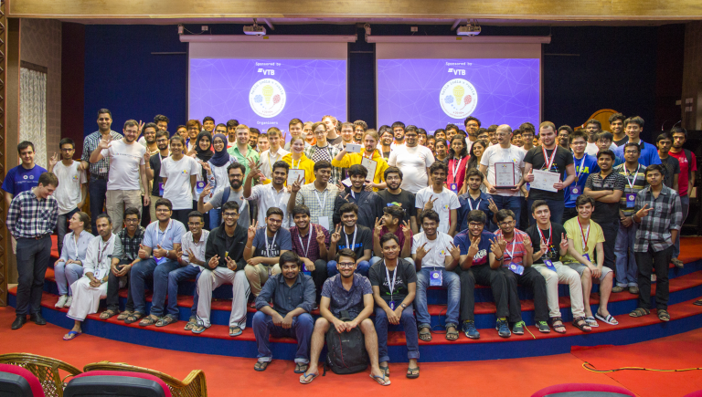
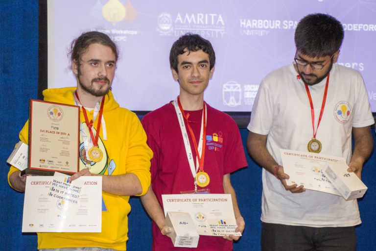
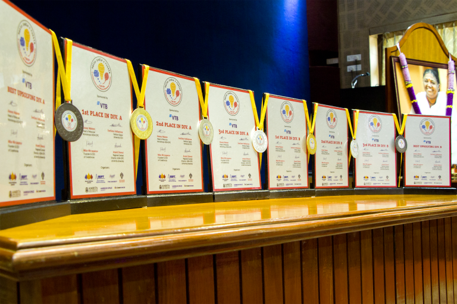

# Announcement

Hello Codeforces!

On [April 10, 14:35 UTC](https://codeforces.com/https://www.timeanddate.com/worldclock/fixedtime.html?day=10&month=4&year=2018&hour=17&min=35&sec=0&p1=166) Educational Codeforces Round 42 will start.

Series of Educational Rounds continue being held as [Harbour.Space University](https://codeforces.com/https://harbour.space/) initiative! You can read the details about the cooperation between [Harbour.Space University](https://codeforces.com/https://harbour.space/) and Codeforces in the [blog post](//codeforces.com/blog/entry/51208).

This round will be **rated for Div. 2**. It will be held on extented ACM ICPC rules. After the end of the contest you will have one day to hack any solution you want. You will have access to copy any solution and test it locally.

You will be given **7 problems** and **2 hours** to solve them.

The problems were prepared by me and Alex [fcspartakm](https://codeforces.com/profile/fcspartakm "Candidate Master fcspartakm") Frolov.

We'd like to thank Nikolay [KAN](https://codeforces.com/profile/KAN "Grandmaster KAN") Kalinin, Grigory [vintage_Vlad_Makeev](https://codeforces.com/profile/vintage_Vlad_Makeev "International Grandmaster vintage_Vlad_Makeev") Reznikov, Vladimir [vovuh](https://codeforces.com/profile/vovuh "Candidate Master vovuh") Petrov for the testing and help in preparing the round.

Good luck to all participants!

**UPD**: Some information from Harbour.Space U

The third Hello Programming Bootcamp finished as teams from around the world learned, competed, and got to know each other in the cities of Kollam and Moscow.

“I'm positively surprised with the level and number of Indian teams. I believe when following a systematic and regular training schedule — they will certainly attend top world records in programming” says Mike [MikeMirzayanov](https://codeforces.com/profile/MikeMirzayanov "Headquarters, MikeMirzayanov") Mirzayanov.

**The results of the India boot camp are as follows:**

We would like to congratulate the top teams from the India side in both divisions A and B — and especially recognise division A’s winner: Team SDV — Vasily [platypus179](https://codeforces.com/profile/platypus179 "Master platypus179") Alferov, Vaibhav [gvaibhav21](https://codeforces.com/profile/gvaibhav21 "International Master gvaibhav21") Gosain, Motasem [Motarack](https://codeforces.com/profile/Motarack "International Master Motarack") AL-Kayed sponsored by [Social Discovery Ventures](https://codeforces.com/http://sdventures.com/), and winners of the [Educational Codeforces Round 39](//codeforces.com/blog/entry/58155).

The division A winners are: **Team SDV** ([platypus179](https://codeforces.com/profile/platypus179 "Master platypus179"), [gvaibhav21](https://codeforces.com/profile/gvaibhav21 "International Master gvaibhav21"), [Motarack](https://codeforces.com/profile/Motarack "International Master Motarack")), **TheVindicators** (IIIT Kharagpur) ([pranjal.ssh](https://codeforces.com/profile/pranjal.ssh "International Master pranjal.ssh"), [Chenghiz](https://codeforces.com/profile/Chenghiz "Candidate Master Chenghiz")), **DomiNUS** (NU of Singapore) ([vodanhna](https://codeforces.com/profile/vodanhna "Candidate Master vodanhna"), [darknsux](https://codeforces.com/profile/darknsux "Candidate Master darknsux"), [minh141198](https://codeforces.com/profile/minh141198 "Master minh141198")).

The division B winners are: **BEU Programmers** (Baku Engineering University) ([mahmud2690](https://codeforces.com/profile/mahmud2690 "Candidate Master mahmud2690"), [Mamedov](https://codeforces.com/profile/Mamedov "Candidate Master Mamedov"), [fuck_coderinuse](https://codeforces.com/profile/fuck_coderinuse "Expert fuck_coderinuse")), **Penza State University** ([Fortin](https://codeforces.com/profile/Fortin "Expert Fortin"), [WooDeND](https://codeforces.com/profile/WooDeND "Pupil WooDeND"), [Key_J](https://codeforces.com/profile/Key_J "Specialist Key_J")) and **Sab_lite_hai** (IIT(BHU),Varanasi) ([Enigma27](https://codeforces.com/profile/Enigma27 "Expert Enigma27"), [Dsingh_24](https://codeforces.com/profile/Dsingh_24 "Specialist Dsingh_24"), [nitishk24](https://codeforces.com/profile/nitishk24 "Expert nitishk24")).

[All results from India side](https://codeforces.com/http://india2018.workshops.it-edu.mipt.ru/)  
 [All results from Russia side](https://codeforces.com/http://prefinal2018.workshops.it-edu.mipt.ru/)

From the ever present in ACM World Finals city of Moscow, to the new-comer on the world stage city of Kollam — Hello India x Russia Programming Bootcamp showcased heart, passion, and a universal drive towards a better competition.

“It's the first time I participate at Hello ACM-ICPC Bootcamp in Asia and I admire local hospitality and students motivation. Everyone seems to be eager to learn, participants stay very late upsolving the contest problems and revising the topics they were thought during the day” states Gleb [GlebsHP](https://codeforces.com/profile/GlebsHP "International Grandmaster GlebsHP") Evstropov, The Coordinator of the Programming Committee.

The latest in world finals simulation training would not be possible without the bronze sponsorship of [VTB](https://codeforces.com/https://www.vtb.com), the institute with the most extensive international network of any Russian bank, boasting more than 30 banks and financial companies in more than 20 countries.

### Fill out this [**form**](https://codeforces.com/https://harbourspace.typeform.com/to/bWoBFf) and we will keep you up to date on our next boot camp!

**UPD:** [Tutorial](//codeforces.comРазбор_задач.md?locale=en)

