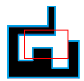

<h1 style='text-align: center;'> G. Visible Black Areas</h1>

<h5 style='text-align: center;'>time limit per test: 1 second</h5>
<h5 style='text-align: center;'>memory limit per test: 256 megabytes</h5>

Petya has a polygon consisting of $n$ vertices. All sides of the Petya's polygon are parallel to the coordinate axes, and each two adjacent sides of the Petya's polygon are perpendicular. It is guaranteed that the polygon is simple, that is, it doesn't have self-intersections and self-touches. All internal area of the polygon (borders are not included) was painted in black color by Petya.

Also, Petya has a rectangular window, defined by its coordinates, through which he looks at the polygon. A rectangular window can not be moved. The sides of the rectangular window are parallel to the coordinate axes.

  Blue color represents the border of a polygon, red color is the Petya's window. The answer in this case is 2. Determine the number of black connected areas of Petya's polygon, which can be seen through the rectangular window.

### Input

The first line contain four integers $x_1, y_1, x_2, y_2$ ($x_1 < x_2$, $y_2 < y_1$) — the coordinates of top-left and bottom-right corners of the rectangular window. 

The second line contains a single integer $n$ ($4 \le n \le 15\,000$) — the number of vertices in Petya's polygon.

Each of the following $n$ lines contains two integers — the coordinates of vertices of the Petya's polygon in counterclockwise order. Guaranteed, that the given polygon satisfies the conditions described in the statement.

All coordinates of the rectangular window and all coordinates of the vertices of the polygon are non-negative and do not exceed $15\,000$.

### Output

Print the number of black connected areas of Petya's polygon, which can be seen through the rectangular window.

## Example

### Input


```text
5 7 16 3  
16  
0 0  
18 0  
18 6  
16 6  
16 1  
10 1  
10 4  
7 4  
7 2  
2 2  
2 6  
12 6  
12 12  
10 12  
10 8  
0 8  

```
### Output


```text
2
```
## Note

The example corresponds to the picture above.


#### Tags 

#2800 #NOT OK #data_structures #dsu #geometry #trees 

## Blogs
- [All Contest Problems](../Educational_Codeforces_Round_42_(Rated_for_Div._2).md)
- [Announcement](../blogs/Announcement.md)
- [Разбор задач](../blogs/Разбор_задач.md)
