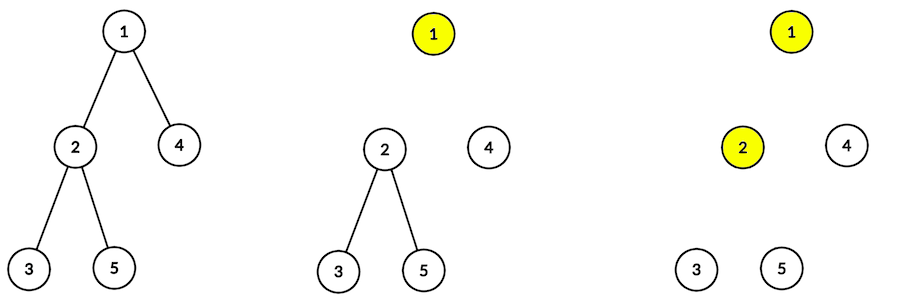

<h1 style='text-align: center;'> B. Destruction of a Tree</h1>

<h5 style='text-align: center;'>time limit per test: 1 second</h5>
<h5 style='text-align: center;'>memory limit per test: 256 megabytes</h5>

You are given a tree (a graph with *n* vertices and *n* - 1 edges in which it's possible to reach any vertex from any other vertex using only its edges).

A vertex can be destroyed if this vertex has even degree. If you destroy a vertex, all edges connected to it are also deleted.

Destroy all vertices in the given tree or determine that it is impossible.

#### Input

The first line contains integer *n* (1 ≤ *n* ≤ 2·105) — number of vertices in a tree.

The second line contains *n* integers *p*1, *p*2, ..., *p**n* (0 ≤ *p**i* ≤ *n*). If *p**i* ≠ 0 there is an edge between vertices *i* and *p**i*. It is guaranteed that the given graph is a tree.

#### Output

If it's possible to destroy all vertices, print "YES" (without quotes), otherwise print "NO" (without quotes).

If it's possible to destroy all vertices, in the next *n* lines print the indices of the vertices in order you destroy them. If there are multiple correct answers, print any.

## Examples

#### Input


```text
5  
0 1 2 1 2  

```
#### Output


```text
YES  
1  
2  
3  
5  
4  

```
#### Input


```text
4  
0 1 2 3  

```
#### Output


```text
NO  

```
## Note

In the first example at first you have to remove the vertex with index 1 (after that, the edges (1, 2) and (1, 4) are removed), then the vertex with index 2 (and edges (2, 3) and (2, 5) are removed). After that there are no edges in the tree, so you can remove remaining vertices in any order.

  

#### Tags 

#2000 #NOT OK #constructive_algorithms #dfs_and_similar #dp #greedy #trees 

## Blogs
- [All Contest Problems](../Tinkoff_Internship_Warmup_Round_2018_and_Codeforces_Round_475_(Div._1).md)
- [Announcement](../blogs/Announcement.md)
- [Tutorial](../blogs/Tutorial.md)
