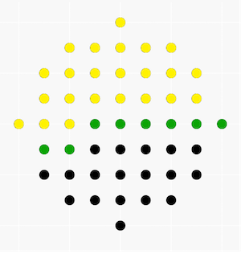

# Tutorial

Thanks for participating in my contest!

It was my first round, I hope you enjoyed.

#### **Editorial**:

 
### [964A - Splits](../problems/A._Splits.md "Tinkoff Internship Warmup Round 2018 and Codeforces Round 475 (Div. 2)")

There are 2 cases:

If weight of the split equals nn, then the split consist of ones. Here we have only 1 option.

Else maximum number in the split is more then 1. Then we can replace all maximum numbers with twos and the rest we split into ones and weight will be the same. So, here we have n2n2 options.

Answer for this problem is n2n2 + 1. 

 Tutorial is loading... 
### [963A - Alternating Sum](https://codeforces.com/contest/963/problem/A "Tinkoff Internship Warmup Round 2018 and Codeforces Round 475 (Div. 1)")

Let Z=∑i=0k−1sian−ibiZ=∑i=0k−1sian−ibi and q=(ba)kq=(ba)k. 

Let's notice that according equality is true: ∑i=0nsian−ibi=∑i=0(n+1)/k−1Z⋅qi∑i=0nsian−ibi=∑i=0(n+1)/k−1Z⋅qi

We can easily get values of ZZ, qq. We only have to count the value of geometric progression.

Remember to handle the situation when q=1q=1. In this case it is not necessarily means that a=ba=b.

 
### [963B - Destruction of a Tree](https://codeforces.com/contest/963/problem/B "Tinkoff Internship Warmup Round 2018 and Codeforces Round 475 (Div. 1)")

If *n* is even, then the answer is always *NO*, because such trees have odd degree, but we can destroy only even number of edges. 

For any odd *n* the answer exists.

Let's call *dfs*(*i*) from subtree *i* and destroy such nodes, that new subtree will be empty or for all alive nodes in connected component will be true, that they have odd degree. 

Realisation of this *dfs*:

Call it from sons of *i* and recount degree of *i*, if it is even we destroy all subtree. 

Assume, that after the destruction we have nonempty subtree. All nodes have odd degree, so amount of left nodes is even. So number of left edges is odd, but in start we have even count of edges, contradiction. That means, that we destroyed all nodes.

 
### [963C - Cutting Rectangle](https://codeforces.com/contest/963/problem/C "Tinkoff Internship Warmup Round 2018 and Codeforces Round 475 (Div. 1)")

There are a lot of ways to solve this problem.

Let aiai occurs in input cntaicntai (sum of cc) times аnd ajaj occurs cntajcntaj. Then on a side of initial rectangle number of times aiai occurs // number of times ajaj occurs is a ratio (cntai:cntaj)(cntai:cntaj). Analogically for bb.

Let's build the smallest rectangle which satisfies this ratio and call him the base one. Then initial rectangle should consist of it.

The last step is to check that initial rectangle consists of base ones. To do this we'll iterate over all types of rectangles in input and if we find a mistake - print 0. In this way we will check no more than n+1n+1 types of recktangles.

An answer for this task is number of divisors of ratio between the initial rectangle and the base one (it's not hard to see that this ratio equals to GCDGCD of all cici)

 
### [963D - Frequency of String](https://codeforces.com/contest/963/problem/D "Tinkoff Internship Warmup Round 2018 and Codeforces Round 475 (Div. 1)")

Let MM be the summary length of mimi

Number of different lengths of mimi is O(M−−√)O(M). All mimi are distinct, so summary number of their entries in ss is O(MM−−√))O(MM)).

Let's find all entries of every mimi. To do this we can use Aho-Corasick's algorithm. Then we know entries of mimi, it is not hard to calculate the answer.

 
### [963E - Circles of Waiting](https://codeforces.com/contest/963/problem/E "Tinkoff Internship Warmup Round 2018 and Codeforces Round 475 (Div. 1)")

Let's call a sell "good", if for its coordinates the following condition is satisfied *x*2 + *y*2 ≤ *R*2. 

For each good cell we consider the equation of its expected value:

*f*(*x*, *y*) = *p*1·*f*(*x* - 1, *y*) + *p*2·*f*(*x*, *y* + 1) + *p*3·*f*(*x* + 1, *y*) + *p*4·*f*(*x*, *y* - 1) + 1.

Then this problem can be reduced to solving the system of linear equations.

We can do this using Gauss's method with a complexity of *O*(*R*6), but this solution gets TL. 

Now, we can see that we only need to calculate *f*(0, 0). So we will handle cells top down. While handling each row, we will relax values of all previous rows and a row of cell (0;0). Also we will iterate only for non-zero elements of each row. This solution has a complexity of *O*(*R*4). 

Prove of the complexity:

Let's dye yellow all cells that we have already passed, green - all cells adjacent to them and black - all other cells. Then next cell which we will add is green. Note that its equation(for a moment of adding) doesn't include yellow cells. It consists of initially adjacent black cells and green cells. It's not hard to see, that then row includes only *O*(*R*) non-zero elements and the current green cell is inside of *O*(*R*) not visited rows. So one row in Gauss's method is handled in*O*(*R*2) and there are *O*(*R*2) rows. That's why this Gauss's method works in *O*(*R*4).

  