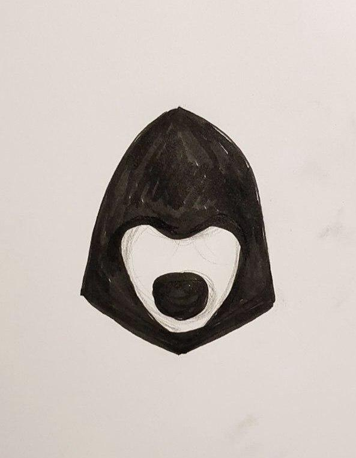

# Announcement

Hi everyone!

Tomorrow, [on the April 25-th, 2018 at 17:35 UTC](https://codeforces.com/http://www.timeanddate.com/worldclock/fixedtime.html?day=25&month=4&year=2018&hour=20&min=35&sec=0&p1=166) we are holding [Codeforces Round 476 (Div. 2) [Thanks, Telegram!]](https://codeforces.com/contest/965 "Codeforces Round 476 (Div. 2) [Thanks, Telegram!]")! The round will be rated for the second division participants, members with higher rating can take part out of competition.

I give the floor to [MikeMirzayanov](https://codeforces.com/profile/MikeMirzayanov "Headquarters, MikeMirzayanov") to announce the round:

*This round opens a series of thanks-rounds to those who significantly supported Codeforces in the crowdfunding campaign for the 8th anniversary. Although Telegram is not explicitly present on the list of donators, for us this is the first and most important friend. We express our gratitude to Telegram and personally to Pavel Durov for the constant support and send regards from programming contest community. Now that the medieval inquisition against Telegram and all the free Internet has been declared in our country, I admire and express support for Pavel's principled position on protecting our rights and freedoms. Thank you, Telegram!* 

I join the thanks to Telegram, and also want to thank [FalseMirror](https://codeforces.com/profile/FalseMirror "Candidate Master FalseMirror") and [Livace](https://codeforces.com/profile/Livace "Master Livace") who helped me with the problems for the round. Also many thanks to [vintage_Vlad_Makeev](https://codeforces.com/profile/vintage_Vlad_Makeev "International Grandmaster vintage_Vlad_Makeev"), [GreenGrape](https://codeforces.com/profile/GreenGrape "Candidate Master GreenGrape") and [300iq](https://codeforces.com/profile/300iq "International Grandmaster 300iq") for their help in round preparation, and [arsor](https://codeforces.com/profile/arsor "Specialist arsor") for translation.

Good luck!

Congratulations to winners!

Div. 2:

 1. [Akylbeek](https://codeforces.com/profile/Akylbeek "Expert Akylbeek") — solved all problems!
2. [kolkulator](https://codeforces.com/profile/kolkulator "Expert kolkulator")
3. [reeWorld](https://codeforces.com/profile/reeWorld "Expert reeWorld")
4. [16bit075](https://codeforces.com/profile/16bit075 "Expert 16bit075")
5. [teamskiy](https://codeforces.com/profile/teamskiy "Expert teamskiy")

Div. 1:

 1. [uwi](https://codeforces.com/profile/uwi "International Grandmaster uwi")
2. [quailty](https://codeforces.com/profile/quailty "Grandmaster quailty")
3. [bicsi](https://codeforces.com/profile/bicsi "Grandmaster bicsi")
4. [Barichek](https://codeforces.com/profile/Barichek "International Master Barichek")
5. [Adalbert](https://codeforces.com/profile/Adalbert "International Master Adalbert")

The analysis is [here](Tutorial.md).

