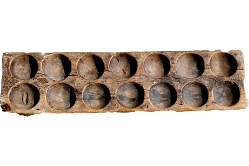

<h1 style='text-align: center;'> B. Mancala</h1>

<h5 style='text-align: center;'>time limit per test: 1 second</h5>
<h5 style='text-align: center;'>memory limit per test: 256 megabytes</h5>

Mancala is a game famous in the Middle East. It is played on a board that consists of 14 holes. 

  Initially, each hole has $a_i$ stones. When a player makes a move, he chooses a hole which contains a positive number of stones. He takes all the stones inside it and then redistributes these stones one by one in the next holes in a counter-clockwise direction.

## Note

 that the counter-clockwise order means if the player takes the stones from hole $i$, he will put one stone in the $(i+1)$-th hole, then in the $(i+2)$-th, etc. If he puts a stone in the $14$-th hole, the next one will be put in the first hole.

After the move, the player collects all the stones from holes that contain even number of stones. The number of stones collected by player is the score, according to Resli.

Resli is a famous Mancala player. He wants to know the maximum score he can obtain after one move.

#### Input

The only line contains 14 integers $a_1, a_2, \ldots, a_{14}$ ($0 \leq a_i \leq 10^9$) — the number of stones in each hole.

It is guaranteed that for any $i$ ($1\leq i \leq 14$) $a_i$ is either zero or odd, and there is at least one stone in the board.

#### Output

#### Output

 one integer, the maximum possible score after one move.

## Examples

#### Input


```text
0 1 1 0 0 0 0 0 0 7 0 0 0 0  

```
#### Output


```text
4  

```
#### Input


```text
5 1 1 1 1 0 0 0 0 0 0 0 0 0  

```
#### Output


```text
8  

```
## Note

In the first test case the board after the move from the hole with $7$ stones will look like 1 2 2 0 0 0 0 0 0 0 1 1 1 1. Then the player collects the even numbers and ends up with a score equal to $4$.


#### Tags 

#1100 #NOT OK #brute_force #implementation 

## Blogs
- [All Contest Problems](../Codeforces_Round_478_(Div._2).md)
- [Announcement (en)](../blogs/Announcement_(en).md)
- [Tutorial (en)](../blogs/Tutorial_(en).md)
