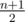
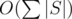
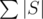
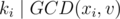
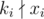
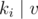
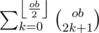
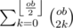
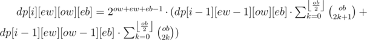

# Tutorial_(en)

Hi Codeforces!

This is the editorial of [Codeforces Round 482 (Div. 2)](https://codeforces.com/contest/979 "Codeforces Round 482 (Div. 2)"). I hope you guys enjoy it.

[979A - Пицца, пицца, пицца!!!](../problems/A._Pizza,_Pizza,_Pizza!!!.md "Codeforces Round 482 (Div. 2)")

 **Solution**If *n* = 0, the answer is obviously 0.

If *n* + 1 is even, we can make  diametric cuts. Otherwise, the only way is to make *n* + 1 cuts.

Time complexity: *O*(1).

 **Code**
```cpp
#include <stdio.h>
using namespace std;

long long n;

int main()
{
    scanf("%I64d", &n);
    n++;
    if (n == 1) printf("0"); else if (n % 2 == 0) printf("%I64d", n / 2); else printf("%I64d", n);
    return 0;
}

```
[979B - Охота за сокровищами](../problems/B._Treasure_Hunt.md "Codeforces Round 482 (Div. 2)")

 **Solution**We all knew that the substrings with length 1 appear at most in the string. So, to make a string as beautiful as possible, we will choose the letter that firstly appears at most in the string and replace all the other letters with the chosen letter.

There is some cases. If *n* is less than or equal to the number of remaining letters, just add *n* to the beauty. If *n* is even after replacing all letters with the chosen, we can choose an arbitrary letter, replace it with some other letter, return it back and repeat the work till *n* reach 0. Otherwise, we will not replace all the other letters. Instead, we will replace the letters until there is 1 letter left (now *n* is even) then replace that one with another letter different from our chosen letter. After that, replace that letter with our chosen letter. Now *n* is even again, we repeat the work discussed above.

In conclusion, let's call our string *s*, our chosen letter *a* and its number of occurrences in the string *f**a*, then our answer is *min*(*f**a* + *n*, |*s*|). Be careful with *n* = 1.

Time complexity: , where  is the total length of the three strings.

 **Code**
```cpp
#include <bits/stdc++.h>

using namespace std;

int a[256], b[256], c[256], n, ma, mb, mc;
string p, q, r;

int main() {
      cin >> n >> p >> q >> r;
      for (char x: p) ma = max(ma, ++a[x]);
      for (char x: q) mb = max(mb, ++b[x]);
      for (char x: r) mc = max(mc, ++c[x]);
      if (n == 1 && ma == (int)p.length()) p.pop_back();
      if (n == 1 && mb == (int)q.length()) q.pop_back();
      if (n == 1 && mc == (int)r.length()) r.pop_back();
      ma = min(ma + n, (int)p.length());
      mb = min(mb + n, (int)q.length());
      mc = min(mc + n, (int)r.length());
      if (ma > mb && ma > mc) {
            puts("Kuro");
            return 0;
      }
      if (mb > ma && mb > mc) {
            puts("Shiro");
            return 0;
      }
      if (mc > ma && mc > mb) {
            puts("Katie");
            return 0;
      }
      puts("Draw");
      return 0;
}

```
[979C - Куро и прогулочный маршрут](../problems/C._Kuro_and_Walking_Route.md "Codeforces Round 482 (Div. 2)")

 **Solution**We can consider the city as a graph, in which every town is a vertex and every road connecting two towns is an edge. Since *m* < *n*, we can deduce that this graph is a tree. Now, instead of finding the number of pairs that Kuro can choose, we can find the number of pairs that Kuro cannot choose. In other words, we must find the number of pairs of vertices (*u*, *v*), in which the shortest path from *u* to *v* passes through *x* and then through *y*. But how can we do this?

If we take vertex *y* as the root of the tree, we can see that every pair of vertices that Kuro cannot choose begins from any node within the subtree of node *x*, and finishes at any node but within the subtree of node *z*, which *z* is a direct child of *y* lying on the shortest path from *x* to *y*. In total, the number of pairs of vertices that we are looking for is equal of *n*·(*n* - 1) - *s*[*x*]·(*s*[*y*] - *s*[*z*]), which *s*[*i*] denotes the size of the subtree of node *i*. We can implement this using simple DFS.

Time complexity: *O*(*n*).

 **Code**
```cpp
#include <iostream>
#include <cstdio>
#include <vector>
using namespace std;

const int MAXN = 3e5;

int n, m, u, v, x, y, sub_size[MAXN + 5];
bool vis[MAXN + 5], chk_sub[MAXN + 5];
vector<int> adj[MAXN + 5];

int DFS(int u)
{
    vis[u] = true; sub_size[u] = 1;
    if (u == x)
        chk_sub[u] = true;
    else chk_sub[u] = false;
    for (int v: adj[u])
        if (!vis[v])
        {
            sub_size[u] += DFS(v);
            chk_sub[u] |= chk_sub[v];
        }
    return sub_size[u];
}

int main()
{
    scanf("%d%d%d", &n, &x, &y);
    m = n - 1;
    while (m--)
    {
        scanf("%d%d", &u, &v);
        adj[u].push_back(v);
        adj[v].push_back(u);
    }
    DFS(y);

    long long fin;
    for (int v: adj[y])
        if (chk_sub[v])
        {
            fin = sub_size[y] - sub_size[v];
            break;
        }

    printf("%I64d", 1LL * n * (n - 1) - fin * sub_size[x]);
    return 0;
}

```
[979D - Куро, НОД, побитовое исключающее ИЛИ, сумма и все-все-все](../problems/D._Kuro_and_GCD_and_XOR_and_SUM.md "Codeforces Round 482 (Div. 2)")

 **Solution**We first look at the condition . This condition holds iff both *x**i* and *v* are divisible by *k**i*. Therefore, if , we return `-1` immediately, else we only consider numbers in *a* that are divisible by *k**i*.

Finding the maximum XOR of *x**i* with *v* in the array *a* reminds us of a classic problem, where the data structure trie is used to descend from the higher bit positions to the lower bit positions. But since we only consider *v* such that  and *x**i* + *v* ≤ *s**i*, we build 105 tries, where the *i**th* trie holds information of numbers in *a* that are divisible by *i*, and we only descend to a branch in the trie if the branch is not empty and the minimum value in the branch is  ≤ *s**i* - *x**i*.

Adding a number into *a* is trivial by now: we update every *u**th* trie where *u* divides the number we need to add into the array. Notice that we only add a number if the number doesn't exist in the array yet.

Time complexity: *O*(*MAXlog*(*MAX*) + *qlog*(*MAX*)2).

 **Code**
```cpp
#include <iostream>
#include <cstdio>
#include <vector>
using namespace std;

const int MAX = 1E5 + 5;

struct SNode
{
    int mi;
    SNode *bit[2];

    SNode()
    {
        mi = MAX;
        bit[0] = bit[1] = nullptr;
    }
} *rt[MAX];
vector<int> di[MAX];
int q, t, u, k, x, s;
bool chk[MAX];

void init()
{
    for (int i = 1; i < MAX; i++)
    {
        for (int j = i; j < MAX; j += i)
            di[j].push_back(i);
        rt[i] = new SNode();
    }
}

void add(int k, int u)
{
    SNode *cur = rt[k];
    cur->mi = min(cur->mi, u);
    for (int i = 18; i >= 0; i--)
    {
        if (cur->bit[u >> i & 1] == nullptr)
            cur->bit[u >> i & 1] = new SNode();
        cur = cur->bit[u >> i & 1];
        cur->mi = min(cur->mi, u);
    }
}

int que(int x, int k, int s)
{
    SNode *cur = rt[k];
    if (x % k != 0 || cur->mi + x > s)
        return -1;
    int ret = 0;
    for (int i = 18; i >= 0; i--)
    {
        int bi = x >> i & 1;
        if (cur->bit[bi ^ 1] != nullptr && cur->bit[bi ^ 1]->mi + x <= s)
        {
            ret += ((bi ^ 1) << i);
            cur = cur->bit[bi ^ 1];
        }
        else
        {
            ret += (bi << i);
            cur = cur->bit[bi];
        }
    }
    return ret;
}

int main()
{
    init();
    scanf("%d", &q);
    while (q--)
    {
        scanf("%d", &t);
        if (t == 1)
        {
            scanf("%d", &u);
            if (!chk[u])
            {
                chk[u] = true;
                for (int k : di[u])
                    add(k, u);
            }
        }
        else
        {
            scanf("%d%d%d", &x, &k, &s);
            printf("%dn", que(x, k, s));
        }
    }
    return 0;
}

```
[979E - Куро и Топологическая четность](../problems/E._Kuro_and_Topological_Parity.md "Codeforces Round 482 (Div. 2)")

 **Solution**The problem asks us to find the number of different simple directed acyclic graphs with 1 → *n* forming its topological order to ensure the parity of the number of alternating paths to be equal to *p*. We will solve this problem using the dynamic programming approach. 

Let's define **even-white** as the number of different nodes *u* colored in white that has an even number of alternating paths that end in *u*. In the same fashion, let's define **odd-white** as the number of different nodes *u* colored in white that has an odd number of alternating paths that end in *u*, **even-black** — the number of different nodes *u* colored in black that has an even number of alternating paths that end in *u*, and **odd-black** — the number of different nodes *u* colored in black that has an odd number of alternating paths that end in *u*. Let's also define *dp*[*i*][*ew*][*ow*][*eb*] as the number of different graphs following the requirements that can be built using the first *i* nodes, with *ew* even-white nodes, *ow* odd-white nodes and *eb* even-black nodes (the number of odd-black nodes *ob* = *i* - *ew* - *ow* - *eb*). We will figure out how to calculate such value. For the sake of simplicity, let's consider the current node — the {*i*}*th* node to be a white node.

We can notice a few things:

 * If none of the previous *i* - 1 nodes connects to the current node, the current node becomes an odd-white node (the only alternating path that ends the current node is the node itself).
* How the previous white nodes connect to the current node does not matter. There are 2*ow* + *ew* - 1 ways to add edges between the previous white nodes and the current node.
* How the previous even-black nodes connect to the current node does not matter, as it does not change the state of the current white node (i.e. odd-white to even-white or even-white to odd-white). There are 2*eb* ways to add edges between the previous even-black nodes and the current node.
* If there are an odd number of previous odd-black nodes that have edges to the current node, the current node becomes an even-white node. There are  ways to do this.
* If there are an even number of previous odd-black nodes that have edges to the current node, the current node becomes an odd-white node. There are  ways to do this.

In conclusion, we can figure out that:



It is worth mentioning that we can use the same analogy to process when the current node is black.

In total, we process through *n*4 states, with an *O*(*n*) iteration for each stage, so the time complexity is *O*(*n*5). However, with precomputation of  and  for every value of *ob*, we can optimize the time complexity to *O*(*n*4).

Time complexity: *O*(*n*4).

 **Code**
```cpp
#include <iostream>
using namespace std;

const int N = 55, MOD = 1E9 + 7;

int n, p, c[N];
long long ans = 0, pw[N], fct[N], inv[N], od[N], ev[N], f[N][N][N][N];

long long power(int u, int p)
{
    if (p == 0)
        return 1;
    long long ret = power(u, p >> 1);
    (ret *= ret) %= MOD;
    if (p & 1)
        (ret *= u) %= MOD;
    return ret;
}

long long C(int n, int k)
{
    return fct[n] * inv[k] % MOD * inv[n - k] % MOD;
}

void init()
{
    f[0][0][0][0] = 1;
    pw[0] = 1;
    fct[0] = 1;
    for (int i = 1; i < N; i++)
    {
        pw[i] = pw[i - 1] * 2 % MOD;
        fct[i] = fct[i - 1] * i % MOD;
    }
    inv[N - 1] = power(fct[N - 1], MOD - 2);
    for (int i = N - 2; i >= 0; i--)
        inv[i] = inv[i + 1] * (i + 1) % MOD;
    for (int i = 0; i < N; i++)
    {
        for (int j = 0; j <= i; j += 2)
            (ev[i] += C(i, j)) %= MOD;
        for (int j = 1; j <= i; j += 2)
            (od[i] += C(i, j)) %= MOD;
    }
}

void find_ans(int ob, int eb, int ow, int ew, int col, long long &ret)
{
    // current node is even-white
    if (col != 0 && ew != 0)
        (ret += f[ob][eb][ow][ew - 1] * pw[ow + ew - 1 + eb] % MOD * od[ob] % MOD) %= MOD;

    // current node is odd-white
    if (col != 0 && ow != 0)
        (ret += f[ob][eb][ow - 1][ew] * pw[ow - 1 + ew + eb] % MOD * ev[ob] % MOD) %= MOD;

    // current node is even-black
    if (col != 1 && eb != 0)
        (ret += f[ob][eb - 1][ow][ew] * pw[ob + eb - 1 + ew] % MOD * od[ow] % MOD) %= MOD;

    // current node is odd-black
    if (col != 1 && ob != 0)
        (ret += f[ob - 1][eb][ow][ew] * pw[ob - 1 + eb + ew] % MOD * ev[ow] % MOD) %= MOD;
}

int main()
{
    init();
    scanf("%d%d", &n, &p);
    for (int i = 1; i <= n; i++)
        scanf("%d", c + i);
    for (int i = 1; i <= n; i++)
        for (int ob = 0; ob <= i; ob++)
            for (int eb = 0; ob + eb <= i; eb++)
                for (int ow = 0; ob + eb + ow <= i; ow++)
                {
                    int ew = i - ob - eb - ow;
                    find_ans(ob, eb, ow, ew, c[i], f[ob][eb][ow][ew]);
                    if (i == n && ((ob + ow) & 1) == p)
                        (ans += f[ob][eb][ow][ew]) %= MOD;
                }
    printf("%lld", ans);
    return 0;
}

```
