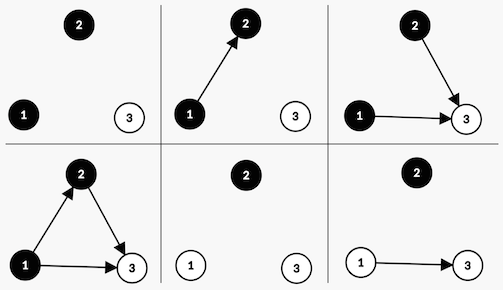

<h1 style='text-align: center;'> E. Kuro and Topological Parity</h1>

<h5 style='text-align: center;'>time limit per test: 1 second</h5>
<h5 style='text-align: center;'>memory limit per test: 256 megabytes</h5>

Kuro has recently won the "Most intelligent cat ever" contest. The three friends then decided to go to Katie's home to celebrate Kuro's winning. After a big meal, they took a small break then started playing games.

Kuro challenged Katie to create a game with only a white paper, a pencil, a pair of scissors and a lot of arrows (you can assume that the number of arrows is infinite). Immediately, Katie came up with the game called Topological Parity.

The paper is divided into $n$ pieces enumerated from $1$ to $n$. Shiro has painted some pieces with some color. Specifically, the $i$-th piece has color $c_{i}$ where $c_{i} = 0$ defines black color, $c_{i} = 1$ defines white color and $c_{i} = -1$ means that the piece hasn't been colored yet.

The rules of the game is simple. Players must put some arrows between some pairs of different pieces in such a way that for each arrow, the number in the piece it starts from is less than the number of the piece it ends at. Also, two different pieces can only be connected by at most one arrow. After that the players must choose the color ($0$ or $1$) for each of the unpainted pieces. The score of a valid way of putting the arrows and coloring pieces is defined as the number of paths of pieces of alternating colors. For example, $[1 \to 0 \to 1 \to 0]$, $[0 \to 1 \to 0 \to 1]$, $[1]$, $[0]$ are valid paths and will be counted. You can only travel from piece $x$ to piece $y$ if and only if there is an arrow from $x$ to $y$.

But Kuro is not fun yet. He loves parity. Let's call his favorite parity $p$ where $p = 0$ stands for "even" and $p = 1$ stands for "odd". He wants to put the arrows and choose colors in such a way that the score has the parity of $p$.

It seems like there will be so many ways which satisfy Kuro. He wants to count the number of them but this could be a very large number. Let's help him with his problem, but print it modulo $10^{9} + 7$.

##### Input

The first line contains two integers $n$ and $p$ ($1 \leq n \leq 50$, $0 \leq p \leq 1$) — the number of pieces and Kuro's wanted parity.

The second line contains $n$ integers $c_{1}, c_{2}, ..., c_{n}$ ($-1 \leq c_{i} \leq 1$) — the colors of the pieces.

##### Output

Print a single integer — the number of ways to put the arrows and choose colors so the number of valid paths of alternating colors has the parity of $p$.

## Examples

##### Input


```text
3 1  
-1 0 1  

```
##### Output


```text
6
```
##### Input


```text
2 1  
1 0  

```
##### Output


```text
1
```
##### Input


```text
1 1  
-1  

```
##### Output


```text
2
```
## Note

In the first example, there are $6$ ways to color the pieces and add the arrows, as are shown in the figure below. The scores are $3, 3, 5$ for the first row and $5, 3, 3$ for the second row, both from left to right.

  

#### Tags 

#2400 #NOT OK #dp 

## Blogs
- [All Contest Problems](../Codeforces_Round_482_(Div._2).md)
- [Announcement (en)](../blogs/Announcement_(en).md)
- [Tutorial (en)](../blogs/Tutorial_(en).md)
