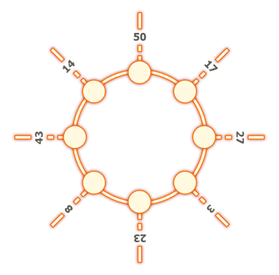

# Tutorial_(en)

Hello again,

Thank you for participating. It was a great experience for me and I learned a lot. Hope you learned something as well! I'll try to avoid the issues some of you complained about, next time.

The tutorial of problems [A-C] was written by [Motarack](https://codeforces.com/profile/Motarack "International Master Motarack"), [D-E] by [Dark](https://codeforces.com/profile/Dark "Master Dark"), and all were reviewed by [Reem](https://codeforces.com/profile/Reem "Expert Reem"). Thank you guys!

 
### [980A - Links and Pearls](../problems/A._Links_and_Pearls.md "Codeforces Round 480 (Div. 2)")

The problem can be viewed as the following:

You have a cyclic array with the characters '-' and 'o', you want to rearrange the elements of the array such that the number of '-' characters after every 'o' character is the same.

So we want to distribute the '-' characters over the 'o' characters so that all the 'o' characters have the same number of '-' characters after them.

If we have aa of 'o' and bb of '-', then that can be done if and only if bmoda=0bmoda=0. When a=0a=0, the answer is YES since the condition still holds.

 
### [980B - Marlin](../problems/B._Marlin.md "Codeforces Round 480 (Div. 2)")

Instead of looking at the second path from (4,1)(4,1) to (1,n)(1,n), consider it as from (1,n)(1,n) to (4,1)(4,1).

Now when kk is even, we can do the following: start from (2,2), put a hotel in that cell and another hotel in (2,n-1), then a hotel in (2,3) and one in (2, n-2), and so on until either the second row is full (expect for the middle column) or the number of hotels is kk, if you still need more hotels then just do the same for the third row.

This works because going from (1,1)(1,1) to (4,n)(4,n) is identical to going from (1,n)(1,n) to (4,1)(4,1) since the constructed grid is symmetric.

Now if k=2∗(n−2)k=2∗(n−2) then just fill the the middle column (second and third row), and if kk is odd then just add a hotel in middle column.

 
### [980C - Posterized](../problems/C._Posterized.md "Codeforces Round 480 (Div. 2)")

First, it's obvious that for each group we should choose the color with minimum value as the group's key. Now since we want to find the lexicographically smallest array, we iterate from the leftmost number in the array and minimize it as much as possible without considering the numbers to its right.

There are many ways to implement this, one of them is the following:

Iterate from left to right, for each number xx, if it is already assigned to a group then ignore it. Otherwise, check the colors less than xx in decreasing order until you find a color yy that is assigned.

If we can extend the group of yy to include xx and the size won't be exceeding kk, then we do extend it and assign all the colors between y+1y+1 and xx to the key of yy's group. If the size will exceed kk or such yy was not found (set it to −1−1 in this case), we create a new group with key equals to max(y+1,x−k+1)max(y+1,x−k+1) and assign all colors in the range to it.

The complexity of this solution is O(n+c)O(n+c), where cc is the size of the color range.

 
### [980D - Perfect Groups](../problems/D._Perfect_Groups.md "Codeforces Round 480 (Div. 2)")

First let us examine perfect squares; a perfect square is a number xx that can be written as the product of an integer and itself y∗yy∗y. This means that for each prime factor of the number xx, the frequency of that factor must be even so it can be distributed evenly between each of the two yy's.

This leads to the idea that for every two numbers aa and bb in a group, for a prime factor pipi, either both aa and bb have an even frequency of pipi, or they both have an odd frequency of it.

So using that observation, for each number xx in the array we can discard all pairs of equal prime factors (keeping one copy of each factor with an odd frequency).

For example, number 4040 has factors 2,2,2,52,2,2,5, so we can just ignore the first pair of 2′s2′s because they're redundant and transform it into 2,52,5, which is the number 1010.

Now after replacing each number with the product of its odd factors, we can just count the number of distinct elements in each subarray as each element can be only grouped with its copies. This can be done by checking all possible subarrays and keeping a frequency array to count the number of distinct elements in it.

- Elements need to be mapped to non-negative integers between 11 and nn so we don't use a set to count them.

- Need to be careful in case there's a zero in the subarray. Zeros can join any group, so unless the subarray contains only zeros, we can ignore them.

Solution Complexity: O(n×sqrt(maxai)+n2)O(n×sqrt(maxai)+n2)

 
### [980E - The Number Games](../problems/E._The_Number_Games.md "Codeforces Round 480 (Div. 2)")

As the final set of remaining districts need to be reachable from each other, this means that the resulting tree is a sub-graph of the original one.

Now, looking at the number of fans in each district, district ii has 2i2i fans. This means that if we had a choice of including a district ii in our solution and discarding all the districts with indices less than ii then it'd be better than discarding district ii and including all the others, as 2i=2i−1+2i−2+...+20+12i=2i−1+2i−2+...+20+1.

This leads us to the following greedy solution:

Let's try to find which districts to keep instead of which to discard, let's first root the tree at district nn, as we can always keep it, and go through the remaining districts by the order of decreasing index. Now at each step, if we can include district ii into our solution by taking it and all of the nodes on the path connecting it to our current sub-graph, then we should surely do so, otherwise we can just ignore it and move on to the next district.

This can be implemented by building a parent sparse-table and using Binary Lifting at each district ii to find the first of its ancestors that has been already included in our sub-graph. The distance to this ancestor represents the number of districts that need to be included in the games to have district ii included. So if we can still include that many districts in our sub-graph then we will traverse through the path and mark them as included.

Solution Complexity: O(nlogn)O(nlogn)

 
### [980F - Cactus to Tree](../problems/F._Cactus_to_Tree.md "Codeforces Round 480 (Div. 2)")

The following solution is implemented in 136 lines, but most of it is a simple BFS and two DFS functions for finding bridges and marking cycles, the main part of the solution is implemented in 38 lines. Please check the code after (or while?) reading if it is not clear.

Note that if we run a BFS from a node uu, the BFS spanning tree will represent the edges that we should keep to minimize the answer for node uu. So we actually need to find the maximum length out of all shortest paths that starts at uu and end at every other node.

We will first focus on finding the answer for each node on one cycle:

  For each node uu on the cycle, we can compute L[u]L[u], the length of the longest shortest path that starts at node uu and uses only the edges that do not belong to the cycle. This can be done using BFS in O(n+m)O(n+m) for one cycle.

Using the computed values, we can find the final answer for all nodes on the cycle in O(klogk)O(klogk), or O(k)O(k), where kk is the number of nodes on the cycle.

For a node uu, we need to find a node vv on the cycle such that L[v]+distance(u,v)L[v]+distance(u,v) is maximized, where distance(u,v)distance(u,v) is the length of the shortest path between uu and vv on the cycle. Therefore, the answer with regards to each node uu will be the maximum between L[u]L[u] and L[v]+distance(u,v)L[v]+distance(u,v), for each node vv in the same cycle as uu.

We can do this using a heap and prefix sums idea as follows: loop for 2k2k iterations over the cycle nodes, in the ithith iteration (0≤i<2k0≤i<2k) add the value L[cycle[imodk]]+2k−iL[cycle[imodk]]+2k−i to the heap with the time it was added in (time=2k−itime=2k−i, time is decreasing), that is, add the pair (L[cycle[imodk]]+2k−i,2k−iL[cycle[imodk]]+2k−i,2k−i). Now at a given iteration jj, pop from the heap all top values added at time greater than 2k−j+k/22k−j+k/2, as distance(u,v)distance(u,v) can't exceed k/2k/2. Now assuming the top pair in the queue is (x,yx,y), then x−(2k−j)x−(2k−j) is a possible answer for this node.

We need to do this again in counter-clockwise. Since we will visit each node four times, keep the maximum distance ZiZi found for each node ii in the cycle and the final answer for that node will be max(Li,Zi)max(Li,Zi).

Now if we have the answer for one cycle, when we move using an edge (a,ba,b) to another cycle (or node), we only need to know one value to be able to solve the next cycle, that value is the maximum between ZaZa and the length of the longest path that goes through bridges other than (a,ba,b). This value is increased by 11 when passed since we will move through the edge (a,ba,b).

Implementation:

Marking the bridges will help in deciding if an edge will take us outside a cycle or not so we can compute LiLi. Also removing the bridges will make it easy to find which nodes form each cycle.

We can find any BFS spanning tree and use it to find the length of the longest path that starts at a node and uses a bridge first, note that this distance goes only down as the tree is rooted at the starting node, but the values LuLu for every uu in the first cycle will be correct so we can start with them.

Solution: [https://ideone.com/EEORpR](https://codeforces.com/https://ideone.com/EEORpR)

