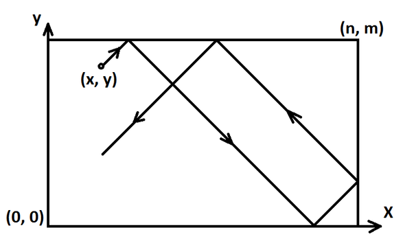
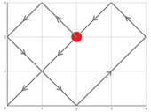
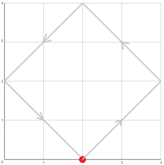

<h1 style='text-align: center;'> E. Billiard</h1>

<h5 style='text-align: center;'>time limit per test: 1 second</h5>
<h5 style='text-align: center;'>memory limit per test: 256 megabytes</h5>

Consider a [billiard table](https://en.wikipedia.org/wiki/Billiard_table) of rectangular size $n \times m$ with four pockets. Let's introduce a coordinate system with the origin at the lower left corner (see the picture). 

  There is one ball at the point $(x, y)$ currently. Max comes to the table and strikes the ball. The ball starts moving along a line that is parallel to one of the axes or that makes a $45^{\circ}$ angle with them. We will assume that: 

1. the angles between the directions of the ball before and after a collision with a side are equal,
2. the ball moves indefinitely long, it only stops when it falls into a pocket,
3. the ball can be considered as a point, it falls into a pocket if and only if its coordinates coincide with one of the pockets,
4. initially the ball is not in a pocket.

## Note

 that the ball can move along some side, in this case the ball will just fall into the pocket at the end of the side.

Your task is to determine whether the ball will fall into a pocket eventually, and if yes, which of the four pockets it will be.

##### Input

The only line contains $6$ integers $n$, $m$, $x$, $y$, $v_x$, $v_y$ ($1 \leq n, m \leq 10^9$, $0 \leq x \leq n$; $0 \leq y \leq m$; $-1 \leq v_x, v_y \leq 1$; $(v_x, v_y) \neq (0, 0)$) — the width of the table, the length of the table, the $x$-coordinate of the initial position of the ball, the $y$-coordinate of the initial position of the ball, the $x$-component of its initial speed and the $y$-component of its initial speed, respectively. It is guaranteed that the ball is not initially in a pocket.

##### Output

Print the coordinates of the pocket the ball will fall into, or $-1$ if the ball will move indefinitely.

## Examples

##### Input


```text
4 3 2 2 -1 1  

```
##### Output


```text
0 0
```
##### Input


```text
4 4 2 0 1 1  

```
##### Output


```text
-1
```
##### Input


```text
10 10 10 1 -1 0  

```
##### Output


```text
-1
```
## Note

The first sample: 

  The second sample: 

  In the third sample the ball will never change its $y$ coordinate, so the ball will never fall into a pocket.


#### Tags 

#2600 #NOT OK #geometry #number_theory 

## Blogs
- [All Contest Problems](../Codeforces_Round_484_(Div._2).md)
- [Announcement (ru)](../blogs/Announcement_(ru).md)
- [Tutorial #1 (ru)](../blogs/Tutorial_1_(ru).md)
- [Editorial (en)](../blogs/Editorial_(en).md)
