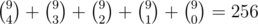
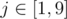

# Tutorial

[984A - Game](../problems/A._Game.md "Codeforces Round 483 (Div. 2) [Thanks, Botan Investments and Victor Shaburov!]")

 **tutorial**
### [984A - Game](../problems/A._Game.md "Codeforces Round 483 (Div. 2) [Thanks, Botan Investments and Victor Shaburov!]")

First let's notice that the first player makes ⌈n−12⌉⌈n−12⌉ turns and the second one makes ⌊n−12⌋⌊n−12⌋. 

So, if numbers are 11-indexed and sorted, first player can make the answer not more than (n−⌈n−12⌉)(n−⌈n−12⌉)-th by deleting maximal number every time. The second can make it not less than (⌊n−12⌋+1)(⌊n−12⌋+1)-th. 

But n−⌈n−12⌉=⌊n−12⌋+1n−⌈n−12⌉=⌊n−12⌋+1, because n−1=⌈n−12⌉+⌊n−12⌋n−1=⌈n−12⌉+⌊n−12⌋.

So the answer has minimal and maximal values, which are the same. So the answer is (⌊n−12⌋+1)(⌊n−12⌋+1)-th number ascending.

Asymptotics is O(n⋅log(n)O(n⋅log(n) or O(n2)O(n2)

[Solution](//codeforces.com/contest/984/submission/38302744)

[984B - Minesweeper](../problems/B._Minesweeper.md "Codeforces Round 483 (Div. 2) [Thanks, Botan Investments and Victor Shaburov!]")

 **tutorial**
### [984B - Minesweeper](../problems/B._Minesweeper.md "Codeforces Round 483 (Div. 2) [Thanks, Botan Investments and Victor Shaburov!]")

Let's make two-dimensional array d[n][m]d[n][m]. For each cell i,ji,j if it has bomb in it we add 11 in d[g][h]d[g][h] where g,hg,h is neighboring cell for i,ji,j. Now d[i][j]d[i][j] is a number of bombs in neighboring cells of i,ji,j and we can check validity of field according to the condition of the problem: 

* If there is a number kk in the cell, then exacly kk of neighboring cells have bombs.
* Otherwise, if cell has no bomb, then neighboring cells have no bombs.

[Solution](//codeforces.com/contest/984/submission/38302738)

[983A - Finite or not?](https://codeforces.com/contest/983/problem/A "Codeforces Round 483 (Div. 1) [Thanks, Botan Investments and Victor Shaburov!]")

 **tutorial**
### [983A - Finite or not?](https://codeforces.com/contest/983/problem/A "Codeforces Round 483 (Div. 1) [Thanks, Botan Investments and Victor Shaburov!]")

First, if pp and qq are not coprime, divide them on gcd(p,q)gcd(p,q). Fraction is finite if and only if there is integer kk such that q∣p⋅bkq∣p⋅bk. Since pp and qq are being coprime now, q∣bk⇒q∣bk⇒ all prime factors of qq are prime factors of bb. Now we can do iterations q=q÷gcd(b,q)q=q÷gcd(b,q) while gcd(q,b)≠1gcd(q,b)≠1. If q≠1q≠1 after iterations, there are prime factors of qq which are not prime factors of b⇒b⇒ fraction is Infinite, else fraction is Finite. But this solution works in O(nlog21018)O(nlog21018). Let's add b=gcd(b,q)b=gcd(b,q) in iterations and name iterations when gcd(b,q)gcd(b,q) changes iterations of the first type and when it doesn't change — iterations of the second type. Iterations of second type works summary in O(log1018)O(log⁡1018). Number of iterations of the first type is O(log1018)O(log⁡1018) too but on each iteration bb decreases twice. Note that number of iterations in Euclid's algorithm is equal to number of this decreases. So iterations of first type works in O(log1018)O(log⁡1018) summary. Total time complexity is O(nlog1018)O(nlog⁡1018)

[Solution](//codeforces.com/contest/983/submission/38302722)

[983B - XOR-pyramid](https://codeforces.com/contest/983/problem/B "Codeforces Round 483 (Div. 1) [Thanks, Botan Investments and Victor Shaburov!]")

 **tutorial**
### [983B - XOR-pyramid](https://codeforces.com/contest/983/problem/B "Codeforces Round 483 (Div. 1) [Thanks, Botan Investments and Victor Shaburov!]")

Let's calculate f(a)f(a) recursively and save arrays from each level of recursion. We get two-dimencional array dp[n][n]dp[n][n] and dp[n][1]=f(a)dp[n][1]=f(a). Now let's view recursive calculation for f(al…ar)f(al…ar). You can see what array of ii-th level of recursion is dp[i][l…r−i+1]⇒dp[r−l+1][l]=f(al…ar)dp[i][l…r−i+1]⇒dp[r−l+1][l]=f(al…ar) (numbeer of levels of recursion is length of segment). To calculate maximum of all sub-segments for each segment, replace dp[i][j]dp[i][j] on max(dp[i][j],dp[i−1][j],dp[i−1][j+1])max(dp[i][j],dp[i−1][j],dp[i−1][j+1]). Now answer of question l,rl,r is dp[r−l+1][l]dp[r−l+1][l]. Overall time complexity is O(n2+q)O(n2+q).

[Solution](//codeforces.com/contest/983/submission/38302716)

[983C - Elevator](https://codeforces.com/contest/983/problem/C "Codeforces Round 483 (Div. 1) [Thanks, Botan Investments and Victor Shaburov!]")

 **tutorial**
### [983C - Elevator](https://codeforces.com/contest/983/problem/C "Codeforces Round 483 (Div. 1) [Thanks, Botan Investments and Victor Shaburov!]")

This problem is inspired by living in the house of 9 floors with the elevator, which can accommodate up to 4 people. What a surprise!

We have a strict order. So let's make *dp*[*i*][*state*] =  minimal possible time, where *i* means that first *i* employees already came in the elevator (and possibly came out). 

So, what is a *state*? Let's store something what will allow us to determine the state. For this purpose we want to know the floor, where the elevator currently is, and number of people, who want to reach each floor. So, it's 10 integers. Let's estimate the number of states: floor takes 9 values, *state* can take  (Wow!). Also let's notice, that we don't want to visit floor of nobody in the elevator don't want to go there and the next person isn't on that floor. So we have not more than 5 interesting floors for each *state*. Let's say the total count of states is *s* = 5·256.

Now we've got two different solutions.

The fast one is we say we go from the floor *a*[*i*] to the floor *a*[*i* + 1] and iterate over the persons who we let come in on the way.

The slow one is to run Dijkstra for each *i*: from *state* we can go to the floor and let somebody come out or go to the floor *a*[*i* + 1]. Now, when we calculated answers for *i* - 1, we can calculate *dp*[*i*][*state*] = 1 + *dp*[*i* - 1][*state*], if state has floor equals to *a**i* and there are no more than 3 people inside.

The answer will be in *dp*[*n*][*floor* = *j* & *elevator* *is* *empty*] for .

Asymptotics is *O*(*n*·*s*) or *O*(*n*·*s*·*log*(*s*))

[Solution](//codeforces.com/contest/983/submission/38302708)

[983D - Arkady and Rectangles](https://codeforces.com/contest/983/problem/D "Codeforces Round 483 (Div. 1) [Thanks, Botan Investments and Victor Shaburov!]")

 **tutorial**
### [983D - Arkady and Rectangles](https://codeforces.com/contest/983/problem/D "Codeforces Round 483 (Div. 1) [Thanks, Botan Investments and Victor Shaburov!]")

First let's compress the coordinates. Now all the coordinates are in [0,2n)[0,2n).

Now we do scanline on xx coordinate with segment tree on yy coordinate. Let's talk about segment tree structute. In each vertex we store: 

* Set of colors which cover the whole segment. If color covers a segment, we don't push it to it childs (colors[v]colors[v])
* Maximal visible color in subtree which isn't in the answer (max[v]max[v])
* Minimal visible color in subtree (min[v]min[v])

For the vertex max and min can be calculated as: 

* If colorscolors isn't empty and max value in colorscolors is more than max in children:
	+ If it's already in the answer or it's less than min in children, max=−1max=−1.
	+ Otherwise max=max in colorsmax=max in colors
* Otherwise max=max in childrenmax=max in children
* If colorscolors isn't empty min=max(max in colors,min in children)min=max(max in colors,min in children)
* Otherwise min=min in childrenmin=min in children

Now in scanline we: 

* Add all the segments, starting at this point
* Remove all the segments, ending at this point
* While max[root]max[root] isn't −1−1 we put it into answeranswer and recalculate everything by readding this segment to tree.

At the end we know all visible colors and print the number of them.

Asymptotics is O(n⋅log(n)+n⋅log2(n))O(n⋅log(n)+n⋅log2(n))

[Solution](//codeforces.com/contest/983/submission/38302697)

[983E - NN country](https://codeforces.com/contest/983/problem/E "Codeforces Round 483 (Div. 1) [Thanks, Botan Investments and Victor Shaburov!]")

 **tutorial**
### [983E - NN country](https://codeforces.com/contest/983/problem/E "Codeforces Round 483 (Div. 1) [Thanks, Botan Investments and Victor Shaburov!]")

Let's say we go down when we go towards the root, and we go up when we go against the root. Also we say that vertex aa lower than vertex bb if aa is closer to the root.

Each way from vv to uu can be represented as two parts: at first we go down from vv to lcalca and then we go up from lcalca to uu. 

Let's say we have to use aa buses to go from vv to lcalca and bb buses to go from lcalca to uu. Let's learn how to calculate aa and bb fast. Firstly, notice that we can move down greedily. So we calculate lowest[v]lowest[v] as the lowest vertex, where we can go from vv using only one bus. Secondly, notice that we can now build binary lifting on lowestlowest. 

The answer is either a+ba+b or a+b−1a+b−1. Let's say the lowest vertex we can go from vv using a−1a−1 buses is lvlv and for uu and b−1b−1 buses it's lulu. lvlv and lulu can be also calculated using binary lifting on lowestlowest. Then, if there is a route connecting lvlv and lulu, the answer is a+b−1a+b−1 and it's a+ba+b otherwise.

Let's calculate lvlv and lulu for all the queries.

Now we build an euler's tour. For each we now know the interval, corresponding to it's subtree. Let's say it is [time_in[v],time_out[v])[time_in[v],time_out[v]). Then we run dfs again and do the following: when we came into lvlv we ask for sum on [time_in[lu],time_out[lu])[time_in[lu],time_out[lu]). Now for each way, starting in lvlv we add 11 to its other end. Now we run dfs for all of its children. And now we ask for sum on [time_in[lu],time_out[lu])[time_in[lu],time_out[lu]) for the second time. If it changed the route connecting lvlv and lulu exists. 

Asymptotics is O(n⋅log(n)+m⋅log(n)+q⋅log(n))O(n⋅log(n)+m⋅log(n)+q⋅log(n)).

Read the solution for better understanding. It tried to make it as readable as possible.

[Solution](//codeforces.com/contest/983/submission/38302686)

