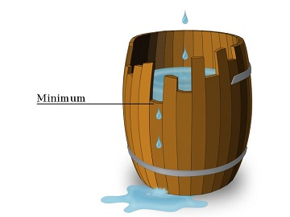

<h1 style='text-align: center;'> C. Liebig's Barrels</h1>

<h5 style='text-align: center;'>time limit per test: 2 seconds</h5>
<h5 style='text-align: center;'>memory limit per test: 256 megabytes</h5>

You have *m* = *n*·*k* wooden staves. The *i*-th stave has length *a**i*. You have to assemble *n* barrels consisting of *k* staves each, you can use any *k* staves to construct a barrel. Each stave must belong to exactly one barrel.

Let volume *v**j* of barrel *j* be equal to the length of the minimal stave in it.

  You want to assemble exactly *n* barrels with the maximal total sum of volumes. But you have to make them equal enough, so a difference between volumes of any pair of the resulting barrels must not exceed *l*, i.e. |*v**x* - *v**y*| ≤ *l* for any 1 ≤ *x* ≤ *n* and 1 ≤ *y* ≤ *n*.

Print maximal total sum of volumes of equal enough barrels or 0 if it's impossible to satisfy the condition above.

###### Input

The first line contains three space-separated integers *n*, *k* and *l* (1 ≤ *n*, *k* ≤ 105, 1 ≤ *n*·*k* ≤ 105, 0 ≤ *l* ≤ 109).

The second line contains *m* = *n*·*k* space-separated integers *a*1, *a*2, ..., *a**m* (1 ≤ *a**i* ≤ 109) — lengths of staves.

###### Output

Print single integer — maximal total sum of the volumes of barrels or 0 if it's impossible to construct exactly *n* barrels satisfying the condition |*v**x* - *v**y*| ≤ *l* for any 1 ≤ *x* ≤ *n* and 1 ≤ *y* ≤ *n*.

## Examples

###### Input


```text
4 2 1  
2 2 1 2 3 2 2 3  

```
###### Output


```text
7  

```
###### Input


```text
2 1 0  
10 10  

```
###### Output


```text
20  

```
###### Input


```text
1 2 1  
5 2  

```
###### Output


```text
2  

```
###### Input


```text
3 2 1  
1 2 3 4 5 6  

```
###### Output


```text
0  

```
## Note

In the first example you can form the following barrels: [1, 2], [2, 2], [2, 3], [2, 3].

In the second example you can form the following barrels: [10], [10].

In the third example you can form the following barrels: [2, 5].

In the fourth example difference between volumes of barrels in any partition is at least 2 so it is impossible to make barrels equal enough.


#### Tags 

#1500 #NOT OK #greedy 

## Blogs
- [All Contest Problems](../Educational_Codeforces_Round_44_(Rated_for_Div._2).md)
- [Announcement](../blogs/Announcement.md)
- [Tutorial](../blogs/Tutorial.md)
