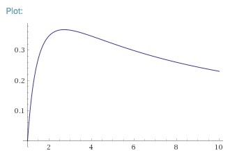

# Tutorial

I want to apologize once more for queue problems. It has also aggravated some tight ML/TL issues which probably would be not so big otherwise. I hope you enjoyed the problems nevertheless.

 
### [987A - Infinity Gauntlet](https://codeforces.com/contest/987/problem/A "Codeforces Round 485 (Div. 2)")

Just do what is written in the statement. Convenient way is to use map in C++ or dict in Python.

[38799778](https://codeforces.com/contest/987/submission/38799778 "Submission 38799778 by Um_nik")

 
### [987B - High School: Become Human](https://codeforces.com/contest/987/problem/B "Codeforces Round 485 (Div. 2)")

We need to compare xy with yx. Let's take logarithms of both sides. Now we need to compare ylnx with xlny. If you will compare this numbers with appropriate epsilon, it will get AC, but let's analyze a bit more and get solution in integers. Let's divide both sides by xy, now we need to compare lnxx with lnyy. That's the values of some function f(x)=lnxx taken in two points. Let's take a closer look on this function. You can take derivative or just look at the plot at WolframAlpha.

It's clear that this function have maximum at point e, and it is increasing on [1,e] and decreasing on [e,+∞). Considering only integer points, f(1)=0, f(3) is maximal, f(2)=f(4) (because 24=42=16), and values in points greater than 4 are decreasing but always positive. So, the order of x from larger f(x) to smaller f(x) is 3,2=4,5,6,…,+∞,1.

[38799800](https://codeforces.com/contest/987/submission/38799800 "Submission 38799800 by Um_nik") — logs  
[38799811](https://codeforces.com/contest/987/submission/38799811 "Submission 38799811 by Um_nik") — case analisys

 
### [987C - Three displays](https://codeforces.com/contest/987/problem/C "Codeforces Round 485 (Div. 2)")

Let's fix j. Now we can see that i and k are independent, so we can find best i by iterating over all i<j, checking if si<sj holds and choosing the one with smallest ci. Then do the same for k.

There are O(n) options for j, for each of them we will do O(n) operations. Total complexity is O(n2)

[38799824](https://codeforces.com/contest/987/submission/38799824 "Submission 38799824 by Um_nik")

 
### [986A - Fair](../problems/A._Fair.md "Codeforces Round 485 (Div. 1)")

Let's find a cost to bring a good t in each town. To do this we will run BFS from all towns producing good t at once. Just add all that towns in queue and run usual BFS. Complexity of BFS is O(n+m), so total complexity of k BFSs will be O(k(n+m)).

Now for each town we should choose s cheapest goods. We can sort them in O(klogk), but we can use nth_element instead. It will put the s-th element in sorted order on place s, and all elements smaller will be to the left. Since we are interested only in their sum, we can just sum up first s elements after calling nth_element.

Another way to achieve O(k(m+n)) complexity is to run all k BFSs simultaneously, then for each town first s goods to reach it are the cheapest.

Bonus: solve the problem in O(s(m+n)) time.

[38799831](https://codeforces.com/contest/986/submission/38799831 "Submission 38799831 by Um_nik")

 
### [986B - Petr and Permutations](../problems/B._Petr_and_Permutations.md "Codeforces Round 485 (Div. 1)")

Each swap change the parity of permutation. 3n and 7n+1 always have different parities, so the solution is just to calculate the parity of the given permutation and check if it is equal to parity of 3n or to parity of 7n+1.

To calculate the parity you can just calculate the number of inversions with your favorite method (Fenwick tree, Segment tree, mergesort or whatever) in O(nlogn) time. But it is easier to calculate the number of cycles in permutation in O(n) time. 

[38799840](https://codeforces.com/contest/986/submission/38799840 "Submission 38799840 by Um_nik")

I hope that [Petr](https://codeforces.com/profile/Petr "Legendary Grandmaster Petr") is not mad at me for my joke.

 
### [986C - AND Graph](../problems/C._AND_Graph.md "Codeforces Round 485 (Div. 1)")

Let's build directed graph on m+2n vertices. There will be two types of vertices: (x,1) is a vertex for x from input and (x,2) is a vertex for all x between 0 and 2n−1.

There will be edges of three classes: 

* (x,1)→(x,2) for all x from input
* (x,2)→(x|(1≪k),2) for all x and k such that k-th bit of x is 0
* (∼x,2)→(x,1) for all x from input. Here ∼x=((2n−1)−x) — the complement of x

Let's look at some path of form (a,1)→(x1,2)→(x2,2)→…→(xk,2)→(b,1). The transition from x1 to xk just change some 0 bits to 1. So, x1 is a submask of xk. a is x1 and b is the complement of xk. Now it is clear that a&b=0. The opposite is also true: whenever a&b=0, there is a path from (a,1) to (b,1).

The solution is simple now: iterate over all x from input, and if the vertex (x,1) is not visited yet, run a DFS from it and increase the answer by 1. It is clear that we will run DFS exactly once for each connected component of original graph.

Complexity — O(n2n)

[38799850](https://codeforces.com/contest/986/submission/38799850 "Submission 38799850 by Um_nik")  
[38799853](https://codeforces.com/contest/986/submission/38799853 "Submission 38799853 by Um_nik") — completely different solution with complexity *O*(6*n* / 2)

 
### [986D - Perfect Encoding](../problems/D._Perfect_Encoding.md "Codeforces Round 485 (Div. 1)")

The problem asks to find integers bi such that ∏bi≥n and ∑bi is minimized.

Let's suppose that in optimal solution there is x≥4 among bi. It is better to split it to 2 and (x−2): the sum remains the same and the product is increased (or stays the same). So we will use only 2 and 3 as our bi. If there are at least three 2 among bi, we can replace them with two 3: the sum remains the same, the product is increased.

So, optimal solution looks like this: zero, one or two 2s and some 3s.

For now let's say that we try all three possibilities for the number of 2s. The problem now looks like "find ⌈log3n⌉".

The trick here is that we can estimate the answer very accurately. Let's say that the length of decimal form of n is L. Then log3n is very close to Llog10log3, the difference is not greater than 3. So it is easy to calculate the number p such that 3p<n/4<n<3p+6.

If we will calculate 3p, then we should adjust this a little bit by multiplying by 3 a few number of times. Multiplying by 3 can be done in linear time, comparing two numbers also in linear time. Let's now remember that we have tried all the possibilities for the number of 2s. We will do it not beforehand, but only now, because now each option can be checked in linear time.

To calculate 3p we will use binary exponentiation with FFT. If the length of the result is L, then the running time will be O(LlogL+L2logL+L4logL+…)=O(LlogL).

To reduce the running time you should store the numbers in base 1000, not in base 10. This will reduce the length of the number 3 times, and the numbers we are getting in FFT will be at most 5⋅1011 which is good enough to avoid precision issues.

In the end, running time is roughly equivalent to 4 FFT calls of size 219 which is not that big.

Total complexity — O(LlogL).

[38799873](https://codeforces.com/contest/986/submission/38799873 "Submission 38799873 by Um_nik")

 
### [986E - Prince's Problem](../problems/E._Prince's_Problem.md "Codeforces Round 485 (Div. 1)")

Let's solve the problem offline and independently for all primes, then multiply the answers. The sum of powers of all primes is O((n+q)logC). To factorize numbers we will precalculate smallest prime divisor for all numbers using sieve.

For fixed prime p let's write its power bv in every vertex. Then if p is in x from query in power z, then the query become "calculate ∑vmin(bv,z)". Let's do the following. We will start with cv=0 in all vertices. Then we will iterate over w — the power of p — from 1 to maximal power in queries. If bv≥w, then increase cv by 1. Now in all vertices cv=min(bv,w) so to answer all queries with z=w we should just take sum on path. This can be done if we will maintain cv in Fenwick tree over Euler tour of our tree (this allows to calculate sum on path to root in O(logn) time, to get sum on arbitrary path we also need to compute LCA).

The number of queries to Fenwick tree is O((n+q)logC), so total complexity is O((n+q)logClogn).

[38799881](https://codeforces.com/contest/986/submission/38799881 "Submission 38799881 by Um_nik")

I hope that [PrinceOfPersia](https://codeforces.com/profile/PrinceOfPersia "Master PrinceOfPersia") is not mad at me for my joke.

 
### [986F - Oppa Funcan Style Remastered](../problems/F._Oppa_Funcan_Style_Remastered.md "Codeforces Round 485 (Div. 1)")

Let's understand the problem first. The rule f(x) must be bijective, because otherwise some platforms will be empty in k seconds. So we are looking for permutations p of size n. Let's say that cycles of the permutation have lengths c1,c2,…,cm. pk is an identity permutation if and only if ci divides k for all i. Also ci≠1. So, we need to check if there are such numbers ci for which all these holds:

* n=∑ci
* ci≠1
* ci is a divisor of k

It is not profitable to use composite divisors of k because we can substitute each of them with any its prime divisor repeated necessary number of times.

Let's say that p1<p2<…<pm — the list of all distinct prime divisors of k. Then the problem is essentially: Check if there are nonnegative coefficients bi such that n=∑bi⋅pi.

If m=0 (k=1) answer is NO.

If m=1, then the answer is YES if and only if n is divisible by p1.

If m=2, then you have to say if there is a nonnegative solution to Diophantine equation. It can be done using extended Euclid algorithm.

And if m≥3, then p1≤k1/m≤k1/3≤105. Let's find d(r) — the minimal number equal to r modulo p1 that can be written in form ∑bi⋅pi. If we do this, the answer is obvious: YES if and only if n≥d(nmodp1). To find all the d we'll build a directed graph. It's vertices are the remainders modulo p1, and there is a directed edge from x to (x+pi)modp1 with weight pi for all x and i. Let's see that the path from 0 in this graph is a set of pi, its weight is the sum of pi and it leads to a remainder of this sum modulo p1. Therefore, d(r) is shortest path from 0 to r in this graph. There are p1 vertices and p1⋅m edges in this graph, so dijkstra's running time is O(mp1logp1)=O(mk1/mlog(k1/m))=O(k1/mlogk)=O(k1/3logk).

We also need to factorize k. Let's build sieve once and find all the primes up to √K (K=1015). Then we can factorize numbers up to K in O(√KlogK) just like in trivial O(√K) algorithm but trying only prime divisors.

Let's calculate complexity now. Let's say that number of all tests is t≤104 and number of different k is q≤50. Solutions for m=1 and m=2 works in O(1) and O(logn) time, so total time is O(tlogn). Solution for m≥3 works in O(k1/3logk), but this dijkstra should be done once for each k, for different n we should only check one condition using calculated distances. Therefore, total time for these solutions is O(qk1/3logk+t). Also there is sieve in O(√KloglogK) and factorization in O(√klogk) q times.

Total complexity — O(√KloglogK+q(√klogk+k1/3logk)+tlogn).

[38799887](https://codeforces.com/contest/986/submission/38799887 "Submission 38799887 by Um_nik")

