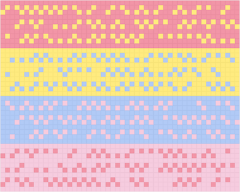

# Tutorial_(en)

Selamat petang!

The curtain has fallen on [Codeforces Round 487 (Div. 2)](https://codeforces.com/contest/989 "Codeforces Round 487 (Div. 2)"). Have you enjoyed the problems themselves? Or the stories? Or both? Neither?

I hadn't ever intended to create a hard contest, believe me... (╥﹏╥) The author will try to find ways to estimate the difficulty better in the future. Also, stronger pretests, notes taken.

Anyways, hope you've all enjoyed the challenges you've faced, and gained something from this round. Congratulations to those who performed well, and commiserations to those waiting for their next chance to shine (^_−)−☆

Below are the tutorials of all problems. Feel free to point out mistakes (if any) or share your ideas in the comments! I might be overcomplicating or confusing something > <

 Tutorial is loading... **Short Ruby solution**
```cpp
puts gets.codepoints.each_cons(3).any?{|x,y,z|x*y*z==287430}?'Yes':'No'
```
 
### [989B - A Tide of Riverscape](../problems/B._A_Tide_of_Riverscape.md "Codeforces Round 487 (Div. 2)")

Our very first observation is that when p≤n2p≤n2, the answer can never be "No".

Under this case, find any dot si="."si=".". At least one of si−psi−p and si+psi+p exists because p≤n2p≤n2 and 1≤i≤n1≤i≤n. We want to make sisi different from this character. In case this character is "0""0" or "1""1", replace the dot the other way round. In case it's a dot, replace the two dots differently with "0""0" and "1""1". After that, fill the remaining dots arbitrarily, and we obtain a valid answer.

If p>n2p>n2, we'd like to find a dot with a similiar property. That is, si="."si=".", and si−psi−p or si+psi+p exists. Go over all dots, try find one, and carry out the same operation as above. If no such dot exists, the answer is "No".

Bonus. Prove the time complexity of the seemingly-brute-force solution below.

Bonus. In case the answer is "Yes", find the lexicographically smallest string that fulfill the requirements.

Bonus. Solve the bonus challenge with n≤105n≤105. (Estimated difficulty: Div. 2 C)

 **Noam's C++ solution**
```cpp
#include <bits/stdc++.h>
#define endl 'n'
#define fast ios::sync_with_stdio(0), cin.tie(0), cout.tie(0)
#define finish(x) return cout << x << endl, 0
using namespace std;

string s, t;
int n, p;

bool isperiod() {
	for (int i = p; i < n; i++)
		if (t[i] != t[i - p]) return false;
	return true;
}

int main() {
	fast;
	cin >> n >> p >> s;

	// attempt 1
	t = s;
	for (auto &i : t)
		if (i == '.') i = '0';
	if (!isperiod()) finish(t);

	// attempt 2
	int i = 0;
	while (i < n && s[i] != '.') i++;
	if (i + p < n) {
		t[i] = '1';
		finish(t);
	}
	i = n - 1;
	while (i >= 0 && s[i] != '.') i--;
	if (i - p >= 0) {
		t[i] = '1';
		finish(t);
	}

	finish("No");
}
```
 **Python solution for the original problem as well as for the last challenge**
```cpp
n, p = map(int, input().split())
s = input()

t = s.replace('.', '0')

if all(t[i] == t[i + p] for i in range(n - p)):
    rmost = -1
    for r in range(p - 1, -1, -1):
        x = s[r::p].rfind('.')
        if x != -1 and s[r::p] != '.':
            rmost = max(rmost, x * p + r)
    if rmost == -1:
        print('No')
    else:
        print(t[:rmost] + '1' + t[(rmost + 1):])
else:
    print(t)
```
 **C++ seemingly-brute-force solution**
```cpp
#include <algorithm>
#include <cstdio>

static const int MAXN = 2005;

static int n, p;
static char s[MAXN];

static int dots_ct = 0, dots[MAXN];

int main()
{
    scanf("%d%d%s", &n, &p, s);

    for (int i = 0; i < n; ++i) if (s[i] == '.') {
        dots[dots_ct++] = i;
        s[i] = '0';
    }

    for (int i = 1; i <= (1 << std::min(dots_ct, 19)); ++i) {
        bool is_period = true;
        for (int j = 0; j < n - p; ++j)
            if (s[j] != s[j + p]) { is_period = false; break; }
        if (!is_period) {
            puts(s);
            return 0;
        }
        for (int j = 0; j <= __builtin_ctz(i); ++j)
            s[dots[j]] ^= 1;
    }

    puts("No");
    return 0;
}
```
 
### [989C - A Mist of Florescence](../problems/C._A_Mist_of_Florescence.md "Codeforces Round 487 (Div. 2)")

A picture is worth a thousand words.

  There are enormous ways to solve this problem. What's yours? Fine-tune your input and parameters, depict your woods [here](https://codeforces.com/https://gistpreview.github.io/?708dc63d28276939da6b89cf225feac0) and share with us in the comments! (Remember to clip and scale the image, though. You can surround the image with a spoiler tag to avoid taking up too much space.)

Note: in case jscolor doesn't load properly (a pop-up should appear when the colour inputs are clicked on), try refreshing once.

Shoutouts to Alexander Golovanov (Golovanov399) for his [grid-drawing tool](//codeforces.com/blog/entry/54122), on which our utility is based!

 **Model solution**
```cpp
#include <cstdio>
#include <cstdlib>
#include <algorithm>
#include <string>
#include <utility>
#include <vector>

static const int MAXM = 50;

int main()
{
    srand(1);

    int a[4];
    scanf("%d%d%d%d", &a[0], &a[1], &a[2], &a[3]);

    int M = std::max(2, std::min(MAXM, *std::max_element(a, a + 4)));
    std::vector<std::string> g;

    for (int k = 0; k < 4; ++k) {
        int islands = a[(k + 1) % 4] - 1;
        std::string s(M, 'A' + k);
        std::vector<std::pair<int, int>> pos;

        g.push_back(s);
        for (int x = 0; x < (islands + (M - 2)) / (M - 1); ++x) {
            for (int i = 0; i < 3; ++i) g.push_back(s);
            for (int i = (x & 1); i < M - !(x & 1); ++i)
                pos.push_back({(int)g.size() - 2 - ((i ^ x) & 1), i});
        }

        std::random_shuffle(pos.begin(), pos.end());
        for (int i = 0; i < islands; ++i)
            g[pos[i].first][pos[i].second] = 'A' + (k + 1) % 4;
    }

    if (g.size() <= M) {
        printf("%lu %dn", g.size(), M);
        for (int i = 0; i < g.size(); ++i) puts(g[i].c_str());
    } else {
        printf("%d %lun", M, g.size());
        for (int i = 0; i < M; ++i) {
            for (int j = 0; j < g.size(); ++j) putchar(g[j][i]);
            putchar('n');
        }
    }

    return 0;
}
```
 
### [989D - A Shade of Moonlight](../problems/D._A_Shade_of_Moonlight.md "Codeforces Round 487 (Div. 2)")

There are some ways to play around with formulae of kinematics, but here's an intuitive way.

With the concept of relative motion, let's not change the velocities of clouds, but the velocity of the moon instead. Namely, under a wind speed of ww, consider the moon to be moving at a velocity of −w−w (seriously). This doesn't affect the relative positions of all objects.

Our next insight is to represent the passage of time with a vertical yy axis. In this way, a cloud becomes a stripe of width l2√l2 tilted at 45∘45∘, and the moon becomes a ray passing through the origin arbitrarily chosen above the curve y=|x|wmaxy=|x|wmax.

  The diagram for the first sample, where l=1l=1 and wmax=2wmax=2. Square-shaped intersections of sky blue stripes denote the intersections of clouds at different moments. The moon's track can be chosen in the range painted light yellow. Now we'd like to count how many squares above the xx axis (because of the "future moment" constraint) have positive-area intersections with the yellow range.

Since wmax≥1wmax≥1, the tilt angle of the curve does not exceed 45∘45∘ in either half-plane. Thus, a square has positive intersection with the range, if and only if its top corner lies strictly inside the range.

For a pair of rightwards-moving cloud uu and leftwards-moving cloud vv, their intersection in the diagram has a top corner of (12(xu+xv+l),12(xv−xu+l))(12(xu+xv+l),12(xv−xu+l)). One additional constraint is xu<xvxu<xv, which is a requirement for the square to be above the xx axis.

For this point to be inside the allowed range, we need xv−xu+l>|xu+xv+l|wmaxxv−xu+l>|xu+xv+l|wmax. Going into two cases where xu+xv+l≥0xu+xv+l≥0 and xu+xv+l<0xu+xv+l<0 and solving linear inequalities, we get the following necessary and sufficient condition of valid pairs:

−(xv+l)≤ xu<min{(xv+l)⋅(w+1)w−1,−(xv+l)}orxu<min{(xv+l)⋅(w−1)w+1,xv}xu<min{(xv+l)⋅(w+1)w−1,−(xv+l)}or−(xv+l)≤ xu<min{(xv+l)⋅(w−1)w+1,xv}

According to these formulae, go over each leftwards-moving cloud vv, and find the number of uu's with binary search. The overall time complexity is O(nlogn)O(nlog⁡n). It's recommended to calculate the fractions with integer floor-division, but... Lucky you.

Bonus. Solve the problem without the seemingly-weird constraint that no clouds intersect initially. This should be rather easy based on the original solution.

Bonus. Prove that the fractions above, when calculated with IEEE doubles (5353 significand bits), will never cause wrong answers under the problem's constraints. (Tricky one, enjoy ;))

 **Model solution**
```cpp
#include <cstdio>
#include <algorithm>
#include <vector>

static const int MAXN = 1e5 + 3;
static const int INF32 = 0x7fffffff;
typedef long long int64;

static int n, l, w;
static int x[MAXN], v[MAXN];
static std::vector<int> pos, neg;

inline int div_floor(int64 a, int b)
{
    if (b == 0) return (a > 0 ? +INF32 : -INF32);
    if (a % b < 0) a -= (b + a % b);
    return a / b;
}

int main()
{
    scanf("%d%d%d", &n, &l, &w);

    for (int i = 0; i < n; ++i) {
        scanf("%d%d", &x[i], &v[i]);
        (v[i] == +1 ? pos : neg).push_back(x[i]);
    }
    std::sort(pos.begin(), pos.end());
    std::sort(neg.begin(), neg.end());

    int64 ans = 0;
    for (int v : neg) {
        auto barrier = std::lower_bound(pos.begin(), pos.end(), -v - l);
        int u_max_0 = div_floor((int64)(v + l) * (w + 1) - 1, w - 1),
            u_max_1 = div_floor((int64)(v + l) * (w - 1) - 1, w + 1);
        ans +=
            (std::upper_bound(pos.begin(), barrier, u_max_0) - pos.begin()) +
            (std::upper_bound(barrier, pos.end(), std::min(v, u_max_1)) - barrier);
    }

    printf("%lldn", ans);
    return 0;
}
```
 Tutorial is loading... **Model solution**
```cpp
#include <cassert>
#include <cstdio>
#include <algorithm>
#include <utility>
#include <vector>

static const int MAXN = 202;
static const int LOGM = 15;

static int gcd(int a, int b) { return b == 0 ? a : gcd(b, a % b); }

struct point {
    int x, y;
    point(int x = 0, int y = 0) : x(x), y(y) { }
};

struct line {
    // ax + by + c = 0
    int a, b, c;

    line() : a(0), b(0), c(0) { }
    line(const point &p, const point &q)
        : a(p.y - q.y)
        , b(q.x - p.x)
        , c(q.y * p.x - q.x * p.y)
    {
        int g = gcd(gcd(a, b), c);
        if (g != 1) { a /= g; b /= g; c /= g; }
        if (a < 0) { a = -a; b = -b; c = -c; }
    }

    inline bool contains(const point &p) {
        return a * p.x + b * p.y + c == 0;
    }

    // For sorting & duplicate removing
    inline bool operator < (const line &other) const {
        return a != other.a ? a < other.a :
            b != other.b ? b < other.b : c < other.c;
    }
    inline bool operator == (const line &other) const {
        return a == other.a && b == other.b && c == other.c;
    }
};

struct mat {
    static const int N = ::MAXN;
    int sz;
    double a[N][N];

    mat(int sz = N, int id = 0) : sz(sz) {
        for (int i = 0; i < N; ++i)
            for (int j = 0; j < N; ++j)
                a[i][j] = (i == j ? id : 0);
    }

    inline mat operator * (const mat &other) {
        assert(other.sz == this->sz);
        mat ret(sz, 0);
        for (int i = 0; i < sz; ++i)
            for (int k = 0; k < sz; ++k)
                for (int j = 0; j < sz; ++j)
                    ret.a[i][j] += this->a[i][k] * other.a[k][j];
        return ret;
    }

    inline std::vector<double> operator * (const std::vector<double> &u) {
        assert(u.size() == this->sz);
        std::vector<double> v(sz);
        for (int i = 0; i < sz; ++i)
            for (int j = 0; j < sz; ++j)
                v[i] += a[i][j] * u[j];
        return v;
    }
};

static int n, q;
static point p[MAXN];

static line l[MAXN * MAXN / 2];
// Lists of lines that pass through points
static std::vector<int> pl[MAXN];
// Lists of points that lie on lines
static std::vector<int> lp[MAXN * MAXN / 2];

static mat A, Ap[LOGM];

int main()
{
    scanf("%d", &n);
    for (int i = 0; i < n; ++i) scanf("%d%d", &p[i].x, &p[i].y);

    int l_num = 0;
    for (int i = 0; i < n; ++i)
        for (int j = i + 1; j < n; ++j)
            l[l_num++] = line(p[i], p[j]);
    std::sort(l, l + l_num);
    l_num = std::unique(l, l + l_num) - &l[0];

    for (int i = 0; i < n; ++i)
        for (int j = 0; j < l_num; ++j)
            if (l[j].contains(p[i])) {
                pl[i].push_back(j);
                lp[j].push_back(i);
            }

    A = mat(n, 0);
    for (int i = 0; i < n; ++i) {
        for (int j : pl[i])
            for (int k : lp[j])
                A.a[i][k] += 1.0L / (pl[i].size() * lp[j].size());
    }

    Ap[0] = A;
    for (int i = 1; i < LOGM; ++i) Ap[i] = Ap[i - 1] * Ap[i - 1];

    scanf("%d", &q);
    std::vector<double> u(n);
    for (int i = 0, t, m; i < q; ++i) {
        scanf("%d%d", &t, &m); --t;

        std::fill(u.begin(), u.end(), 0);
        u[t] = 1.0;
        for (int j = 0; j < LOGM; ++j)
            if ((m - 1) & (1 << j)) u = Ap[j] * u;

        double max = -1.0;
        for (int j = 0; j < l_num; ++j) {
            double cur = 0.0;
            for (int k : lp[j]) cur += u[k];
            cur /= lp[j].size();
            max = std::max(max, cur);
        }
        printf("%.12lfn", (double)max);
    }

    return 0;
}
```
 

---

See you next time! I hope I'll be welcomed. Cheers!

