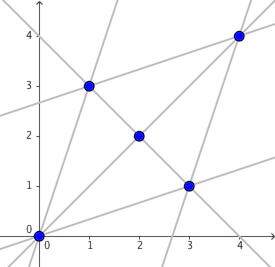

<h1 style='text-align: center;'> E. A Trance of Nightfall</h1>

<h5 style='text-align: center;'>time limit per test: 2 seconds</h5>
<h5 style='text-align: center;'>memory limit per test: 256 megabytes</h5>

 The cool breeze blows gently, the flowing water ripples steadily."Flowing and passing like this, the water isn't gone ultimately; Waxing and waning like that, the moon doesn't shrink or grow eventually."

"Everything is transient in a way and perennial in another."

Kanno doesn't seem to make much sense out of Mino's isolated words, but maybe it's time that they enjoy the gentle breeze and the night sky — the inexhaustible gifts from nature.

Gazing into the sky of stars, Kanno indulges in a night's tranquil dreams. 

There is a set $S$ of $n$ points on a coordinate plane.

Kanno starts from a point $P$ that can be chosen on the plane. $P$ is not added to $S$ if it doesn't belong to $S$. Then the following sequence of operations (altogether called a move) is repeated several times, in the given order:

1. Choose a line $l$ such that it passes through at least two elements in $S$ and passes through Kanno's current position. If there are multiple such lines, one is chosen equiprobably.
2. Move to one of the points that belong to $S$ and lie on $l$. The destination is chosen equiprobably among all possible ones, including Kanno's current position (if it does belong to $S$).

There are $q$ queries each consisting of two integers $(t_i, m_i)$. For each query, you're to help Kanno maximize the probability of the stopping position being the $t_i$-th element in $S$ after $m_i$ moves with a proper selection of $P$, and output this maximum probability. 
## Note

 that according to rule 1, $P$ should belong to at least one line that passes through at least two points from $S$.

### Input

The first line contains a positive integer $n$ ($2 \leq n \leq 200$) — the number of points in $S$.

The $i$-th of the following $n$ lines contains two space-separated integers $x_i$ and $y_i$ ($-10^4 \leq x_i, y_i \leq 10^4$) — the coordinates of the $i$-th point in $S$. The input guarantees that for all $1 \leq i \lt j \leq n$, $(x_i, y_i) \neq (x_j, y_j)$ holds.

The next line contains a positive integer $q$ ($1 \leq q \leq 200$) — the number of queries.

Each of the following $q$ lines contains two space-separated integers $t$ and $m$ ($1 \leq t_i \leq n$, $1 \leq m_i \leq 10^4$) — the index of the target point and the number of moves, respectively.

### Output

### Output

 $q$ lines each containing a decimal number — the $i$-th among them denotes the maximum probability of staying on the $t_i$-th point after $m_i$ steps, with a proper choice of starting position $P$.

Your answer will be considered correct if each number in your output differs from the corresponding one in jury's answer by at most $10^{-6}$.

Formally, let your answer be $a$, and the jury's answer be $b$. Your answer is considered correct if $|a - b| \le 10^{-6}$.

## Example

### Input


```text
5  
0 0  
1 3  
2 2  
3 1  
4 4  
10  
1 1  
2 1  
3 1  
4 1  
5 1  
3 2  
3 3  
3 4  
3 5  
3 6  

```
### Output


```text
0.50000000000000000000  
0.50000000000000000000  
0.33333333333333331483  
0.50000000000000000000  
0.50000000000000000000  
0.18518518518518517491  
0.15226337448559670862  
0.14494741655235482414  
0.14332164812274550414  
0.14296036624949901017  

```
## Note

The points in $S$ and possible candidates for line $l$ are depicted in the following figure.

  For the first query, when $P = (-1, -3)$, $l$ is uniquely determined to be $3x = y$, and thus Kanno will move to $(0, 0)$ with a probability of $\frac 1 2$.

For the third query, when $P = (2, 2)$, $l$ is chosen equiprobably between $x + y = 4$ and $x = y$. Kanno will then move to the other four points with a probability of $\frac 1 2 \cdot \frac 1 3 = \frac 1 6$ each, or stay at $(2, 2)$ with a probability of $\frac 1 3$.


#### Tags 

#2700 #NOT OK #dp #geometry #matrices #probabilities 

## Blogs
- [All Contest Problems](../Codeforces_Round_487_(Div._2).md)
- [Announcement (en)](../blogs/Announcement_(en).md)
- [Tutorial (en)](../blogs/Tutorial_(en).md)
