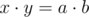
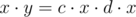
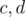
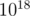
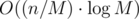

# Tutorial

All the problems have been prepared by us, — [gop2024](https://codeforces.com/profile/gop2024 "Master gop2024") and [----------](https://codeforces.com/profile/---------- "Master ----------").

(Idea of the problem — [gop2024](https://codeforces.com/profile/gop2024 "Master gop2024"))

 
### [992A - Nastya and an Array](../problems/A._Nastya_and_an_Array.md "Codeforces Round 489 (Div. 2)")

Let's notice that after one second we aren't able to decrease the number of distinct non-zero elements in the array more than by 1. It means that we can't make all elements equal to zero faster than after  seconds, where  is the number of distinct elements in the array initially. And let's notice that we are able to make it surely after  second, if we will subtract every second some number which is in the array, so all elements equal this number in the array will have become zero, and the number of distinct non-zero elements will be decreased.

So the answer is the number of distinct non-zero elements initially. Complexity is 

Code — [39423470](https://codeforces.com/contest/992/submission/39423470 "Submission 39423470 by gop2024")

(Idea of the problem — [GreenGrape](https://codeforces.com/profile/GreenGrape "Candidate Master GreenGrape"))

 
### [992B - Nastya Studies Informatics](../problems/B._Nastya_Studies_Informatics.md "Codeforces Round 489 (Div. 2)")

Let's consider some suitable pair . As , we can present number  as , and number  as , where we know that  and .

Let's consider too that from the restriction from the problem  we surely know the restriction for  and , that is . 

Let's remember we know that  (because  is ,  is ). Then we can get . Dividing by :

.

.

Now if , answer equals 0.

Else as  is surely less than , we can just sort out all possible pairs  of divisors , such that  , and then to check that  and  are in the getting above restrictions. Complexity of this solution is .

Code — [39423481](https://codeforces.com/contest/992/submission/39423481 "Submission 39423481 by gop2024")

(Idea of the problem — [----------](https://codeforces.com/profile/---------- "Master ----------"))

 
### [992C - Nastya and a Wardrobe](../problems/C._Nastya_and_a_Wardrobe.md "Codeforces Round 489 (Div. 2)")

Let's present we have initially  dresses.

What does occur in the first month? Initially the number of dresses is multiplied by 2, that is becomes . Then with probability  the wardrobe eats a dress, that is expected value of the number of dresses becomes . The same way after the second month expected value becomes . It's easy to notice that after -th month(if ) expected value equals . Eventually it will be only doubled(as the wardrobe doesn't eat a dress in the last month), that is will be equal .

Thus, answer of the problem is . Expressing it with , we get:

 = .

 = .

Thus, we need to calculate degree of 2 right up to . Complexity of the soltion is .

Let's notice that the case  we need to calculate separately, because wardrobe can't eat a dress when it doesn't exist. If  it's easy to proof that the number of dresses is never negative, that is the formula works.

Code — [39423497](https://codeforces.com/contest/992/submission/39423497 "Submission 39423497 by gop2024")

(Idea of the problem — [gop2024](https://codeforces.com/profile/gop2024 "Master gop2024"))

 
### [992D - Nastya and a Game](../problems/D._Nastya_and_a_Game.md "Codeforces Round 489 (Div. 2)")

Let's call numbers which are more than 1 as good. Notice the following fact:

If a subsegment is suitable, it contains not more than 60 good numbers.

Indeed, let's assume that a subsegment contains more than 60 good numbers. In this subsegment . At the same time, as , and , there is . Therefore, this subsegment can't be suitable due to .

Let's keep all positions of good numbers in a sorted array. We sort out possible left border of a subsegment and then with binary search we find the next good number to the right of this left border. Then let's iterate from this found number to the right by the good numbers(that is we sort out the rightmost good number in a subsegment), until product of all numbers in the subsegment becomes more than  (it's flag which shows us, that product is too big for a suitable subsgment and we need to finish to iterate). We have shown above the number of iterations isn't more than 60. Now for sorted out the left border and the rightmost good number we only need to know the number of 1's which needs to be added to the right of the rightmost good number, as we can easily maintain sum and product in the subsegment during iterating. Then we need to check whether found number of 1's exists to the right of the rightmost good number. It can be checked if we look at the next good number's position.

Complexity is .

In order to check that  is more than , you shouldn't calculate  multiply by , due to overflow. You must only check that .

(Idea of the problem — [gop2024](https://codeforces.com/profile/gop2024 "Master gop2024"))

Code — [39423501](https://codeforces.com/contest/992/submission/39423501 "Submission 39423501 by gop2024")

 
### [992E - Nastya and King-Shamans](../problems/E._Nastya_and_King-Shamans.md "Codeforces Round 489 (Div. 2)")

This problem was inspired by idea which was offered by my unbelievable girlfriend :)

Solution I

In this problem we maintain two segment trees - with maximum and with sum. After every query we recalculate these trees in  for a query. Now we only have to understand, how to answer for a query? Let's call a prefix of the array as good in the case if we surely know that it doesn't contain a king-shaman. So either the first shaman is king and we are able to answer for the query, or we call the prefix with length 1 as good. Then let's repeat the following operation:

* We call  as sum in the good prefix now. We find it using the segment tree with sums.
* We find the leftmost element which may be king-shaman yet. We can realise that it's the leftmost element, which doesn't lie in the good prefix (as there isn't king-shaman according the definition), which have a value at least . It can be done using segment tree with maximums, with descent.
* We check if this found shaman is king. If isn't, we can say that the good prefix finishes in this shaman now, because it was the leftmost shaman who might be king.

Every operation works in . Let's notice, that one operation increases sum in the good prefix at least by two times. So, after  operations sum in the good prefix will become more than a maximal possible number in the array, so that we will be able to finish, because we will be sure that answer will be -1. Complexity of the solution is .

Solution II

Let *p**i* be the prefix sums of *a*. We're gonna introduce *f**i* = *p**i* - 2·*a**i* and reformulate the queries using these new terms.

1. Imagine we wanna change the value at *j* to *val*. Let δ = *val* - *a**j*. Then *f**j* will decrease by δ whereas *f**i* > *j* will increase by δ.
2. Imagine we wanna find the answer. Then it's sufficient to find any *i* satisfying *f**i* = 0.

Split *f* into blocks of size *M*. Each block will be comprised of pairs (*f**i*, *i*) sorted by *f*. At the same time we will maintain *overhead* array responsible for lazy additions to blocks. How does this help?

1. Let *b* = *j* / *M*. The goal is to find the position of *j*, decrease its value and increase values for all *i* > *j* within this block. It can be done in a smart way in *O*(*M*) (actually, this can be represented as merging sorted vectors). You should also take care of the tail, i.e add δ to *overhead**j* > *b* in *O*(*n* / *M*) time.
2. We're asked to find such *i* that *f**i* + *overhead**j* / *M* = 0. All blocks are sorted, thus we can simply apply binary search in  overall.

The optimal assignment is  which results into  total runtime. 

The huge advantage of this approach is its independency from constraints on *a* (i.e non-negativity). Although we didn't succeed in squeezing this into TL :)

Solution III

Group the numbers according to their highest bits (with groups of the form [2*k*... 2*k* + 1] and separately for zeros). Inside each groups (no more than  of them) we maintain elements in increasing order of indexes. 

It's easy to see that each group contains no more than two candidates for answer (since their sum is guaranteed to be greater than any of the remaining ones). This observation leads to an easy solution in  — we iterate over groups and check prefix sums for these candidates.

There's actually further space for optimizations. Let's maintain prefix sums for our candidates — this allows us to get rid of the extra log when quering the tree. Almost everything we need at this step is to somehow process additions and deletions — change the order inside two blocks and probably recalculate prefix sums. The only thing left is to stay aware of prefix sum changes for the remaining blocks. Luckily, they can be fixed in *O*(1) per block (if *i* > *j* then the sum increases by *val* - *a**j* and stays the same otherwise). 

The resulting comlexity is .

Code of the solution I — [39423519](https://codeforces.com/contest/992/submission/39423519 "Submission 39423519 by gop2024")

Code of the solution II — [39418926](https://codeforces.com/contest/992/submission/39418926 "Submission 39418926 by GreenGrape"). Try to optimize :)

Thank you [tfg](https://codeforces.com/profile/tfg "Master tfg") for the idea and the code of the solution III. Very good job!

Code of the solution III — [39392321](https://codeforces.com/contest/992/submission/39392321 "Submission 39392321 by tfg")

