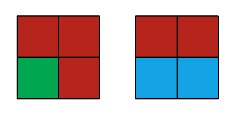
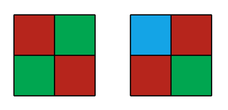

<h1 style='text-align: center;'> C. Sky Full of Stars</h1>

<h5 style='text-align: center;'>time limit per test: 4 seconds</h5>
<h5 style='text-align: center;'>memory limit per test: 256 megabytes</h5>

On one of the planets of Solar system, in Atmosphere University, many students are fans of bingo game.

It is well known that one month on this planet consists of $n^2$ days, so calendars, represented as square matrix $n$ by $n$ are extremely popular.

Weather conditions are even more unusual. Due to the unique composition of the atmosphere, when interacting with sunlight, every day sky takes one of three colors: blue, green or red.

To play the bingo, you need to observe the sky for one month — after each day, its cell is painted with the color of the sky in that day, that is, blue, green or red.

At the end of the month, students examine the calendar. If at least one row or column contains only cells of one color, that month is called lucky.

Let's call two colorings of calendar different, if at least one cell has different colors in them. It is easy to see that there are $3^{n \cdot n}$ different colorings. How much of them are lucky? Since this number can be quite large, print it modulo $998244353$.

##### Input

The first and only line of input contains a single integer $n$ ($1 \le n \le 1000\,000$) — the number of rows and columns in the calendar.

##### Output

Print one number — number of lucky colorings of the calendar modulo $998244353$

## Examples

##### Input


```text
1  

```
##### Output


```text
3  

```
##### Input


```text
2  

```
##### Output


```text
63  

```
##### Input


```text
3  

```
##### Output


```text
9933  

```
## Note

In the first sample any coloring is lucky, since the only column contains cells of only one color.

In the second sample, there are a lot of lucky colorings, in particular, the following colorings are lucky:

  While these colorings are not lucky:

  

#### Tags 

#2500 #NOT OK #combinatorics #math 

## Blogs
- [All Contest Problems](../Codeforces_Round_493_(Div._1).md)
- [Codeforces Round #493](../blogs/Codeforces_Round_493.md)
- [Tutorial (en)](../blogs/Tutorial_(en).md)
