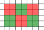

# Tutorial_(en)

Author — [vintage_Vlad_Makeev](https://codeforces.com/profile/vintage_Vlad_Makeev "Международный гроссмейстер vintage_Vlad_Makeev")

 
### [998A - Balloons](../problems/A._Balloons.md "Codeforces Round 493 (Div. 2)")

It is easy to show, that if at least one solution exists, than it is possible to use the answer, which contains only one, minimal, element.

Suppose, that this set is not valid. Then one of the following holds:

* Either n=1n=1, and then there is no solution
* Or n=2n=2, and other element is equal to minimum, in this case it is ease to see that there are not solution too.

Also, the limits were set in such way, that solution which bruteforces all 2n2n subsets and checks them also passes.

Author — [MikeMirzayanov](https://codeforces.com/profile/MikeMirzayanov "Штаб, MikeMirzayanov")

 
### [998B - Cutting](../problems/B._Cutting.md "Codeforces Round 493 (Div. 2)")

It is possible to proof, that cut after ii-th number can be done if and only if the prefix of length ii contains equal number of odd and even numbers.

This way each cut can be done or not done independently of all other cuts (except the budget issue).

Why it is true?

Let's proof that criterion is sufficient. If you make some set of cuts, where each cut is valid according to criterion above, than the result would be correct — each part of result lies between to cuts, and if prefixes which correspond to cuts have same number of odds-evens, than the part between also will have these numbers equal.

Let's show that the condition is required — if there is some set of cuts, which produces correct parts, than each part has same number of odds-evens, and than all prefixes, which correspond to cuts also have the same number of odds-evens.

This way each cut can be done independently, so you can identify all valid cuts, order them by cut-price, and take greedy from the beginning of the list while the budget allows.

Author — [300iq](https://codeforces.com/profile/300iq "Международный гроссмейстер 300iq")

 
### [997A - Convert to Ones](https://codeforces.com/contest/997/problem/A "Codeforces Round 493 (Div. 1)")

Let's partite consecutive elements of the same color into groups.

For example, we will split «00011001110» into «000» + «11» + «00» + «111» + «0».

Then it is obvious that it is useless to make moves within one group, and then (if we have at least two groups of color 00) for one move we can reduce by one (and can't reduce by two) the number of segments of color 00, paying for it either xx or yy (whatever).

Let's consider, for example, if we have a string «11001100», we can flip the segment [5…8][5…8], and turn it into a string «11000011», or, for example, invert the segment [3…4][3…4], turning the string into «111111111100> (Then the number of color groups 00 decreased from two to one).

But in the end you still need to do at least one inverting of the segment (which will be one at the end).

Then let pp — number of groups of color 00.

If p=0p=0, the answer is 00.

Otherwise, the answer is (p−1)⋅min(x,y)+y(p−1)⋅min(x,y)+y

Author — [cdkrot](https://codeforces.com/profile/cdkrot "Международный мастер cdkrot")

 
### [997B - Roman Digits](https://codeforces.com/contest/997/problem/B "Codeforces Round 493 (Div. 1)")

TL; DR — among all the sequences, select the one, which contains the maximum number of 5050, in case of tie, select one with largest number of 99. Bruteforce all configurations in such way, that each number is counted only in it's "maximum" configuration.

Since the length of sequence is fixed, we can solve problem not for digits {1,5,10,50}{1,5,10,50}, but for digits {0,4,9,49}{0,4,9,49}.

Let's solve the problem for digits {0,4,9}{0,4,9} first.

We have a problem that some numbers have many representations. But this, in fact, is easy to deal with — if we have at least nine digits "4" than we can convert them no some number of "9" digits, and fill the rest with zeroes.

In this case, the solution is to bruteforce the number of "4" from 00 to min(8,n)min(8,n), and then from the remaining digits select any arbitrary number of "9", each such choice leads to an unique number.

Let's return to the original problem with {0,4,9,49}{0,4,9,49}.

In this case we can also face the situation, when the number of 4949 can be increased. We need to identify all pairs (x,y)(x,y) where x,y≤50x,y≤50, such that they can be transformed to other pair (x′,y′) with detachment of few 49.

We can bruteforce all x, y, x′, y′ with four nested for-loops and check, that the sum of first differs from sum of latter by few number of 49 removed, in such case we mark the pair (x,y) as broken.

We can also note, that if some pair is marked as broken, than all "dominating" pairs also marked as broken.

When we discovered which pairs are good we can simply:


```cpp
  
for number_of_4  
for number_of_9  
if pair_is_good  
count the answer, all remaining digits are either $0$ or $49$ and all such alternatives are unique.  

```
———

Another solution: if you examine the solution above precisely, you will notice that starting some reasonable n (you can easy proof a lowerbound like 50 or 100, but it is, in fact, 12), the function grows linearly.

So if n≤12, you count the answer in any stupid way, and otherwise, simply approximate it linearly using answer(12) and answer(13).

Author — [cdkrot](https://codeforces.com/profile/cdkrot "Международный мастер cdkrot")

 
### [997C - Sky Full of Stars](https://codeforces.com/contest/997/problem/C "Codeforces Round 493 (Div. 1)")

Let Ai be the set of all colorings, where i-th line contains only one color, and Bi be the set of colorings, where i-th column contains only one color.

This way, you need to calculate |A1∪A2…An∪B1∪B2…Bn|.

As usual, we can use inclusion-exclusion formula to reduce the calculation of multiplications to calculation all possible intersections of sets above.

More over, due to the obvious symmetry, to calculate the size of intersection of some set of Ai and Bi it is not important to know exact indices — only number of taken A-s and number of B-s.

This way ans=∑i=0…n,j=0…n,i+j>0CinCjn(−1)i+j+1f(i,j)

Where f(i,j) — is the number of colorings, where first i rows and first j columns are onecolored.

It turns out, that formula for f differs significantly depending on presence of zero in it's arguments.

Let's examine the case where zero is present, the f(0,k)=3k⋅3n(n−k).

Indeed, you should choose one color in each of the first k columns, and the rest should be painted in any way.

——

If both arguments are >0, that is, there is at least one one-colored column and at least one-colored row, than we can notice, that all one-colored rows and columns are in fact of one color.

This way, f(i,j)=3⋅3(n−i)(n−j)

Since we should first select the globally common color, and then paint all the rest in any way.

Summation of all f-s gives solution with O(n2) or O(n2log) complexity, depending on implementation.

But we need to go faster.

—–

Let's sum all summands with i=0 or j=0 in a stupid way, in O(n).

Then examine all other summands. We have a formula:

ans=∑ni=1∑nj=1CinCjn(−1)i+j+13⋅3(n−i)(n−j)

Let's replace our variables: i→n−i, j→n−j.

ans=3∑n−1i=0∑n−1j=0Cn−inCn−jn(−1)n−i+n−j+1⋅3ij

Since Cn−in=Cin, (−1)2n=1, (−1)−i=(−1)i we have

ans=3∑n−1i=0∑n−1j=0CinCjn(−1)i+j+1⋅3ij

Note, that (a+b)n=∑ni=0Cinaibn−i.

Using this, we can collect all summands for fixed i, however with fixed i we have not n summands, but n−1. We can workaround it by adding and removing the missing summand.

—–

Let's go:

ans=3∑n−1i=0∑n−1j=0CinCjn(−1)i+j+1⋅3ij

ans=3∑n−1i=0Cin(−1)i+1∑n−1j=0Cjn(−1)j⋅(3i)j

ans=3∑n−1i=0Cin(−1)i+1∑n−1j=0Cjn(−3i)j

ans=3∑n−1i=0Cin(−1)i+1[(1+(−3i))n−(−3i)n]

—–

This formula has only O(n) summands, аnd hence can be evaluated fast enough.

To calculate powers of number fast, we can use binary pow method.

Author — [cdkrot](https://codeforces.com/profile/cdkrot "Международный мастер cdkrot")

 
### [997D - Cycles in product](https://codeforces.com/contest/997/problem/D "Codeforces Round 493 (Div. 1)")

Consider an arbitrary cycle in a graph product.

Due to the definition of the product, the adjacent vertices in the cycle correspond to the transition by the edge either in the first tree or in the second tree.

This way, if you write the edges corresponding to one tree in a separate list, you will get a cycle in this tree.

Also, if we have a cycle in one tree of length a and a cycle of length b in the second tree, we can make Caa+b cycles in the product.

Thus, the problem is reduced to calculating for each length up to k the number of cycles in each tree separately, and then mixing them into cycles in the product.

—–

Let's select the centroid c of the tree and count all cycles, which go through it, delete centroid and then recursively count in remaining components.

How looks cycle which goes through c? We need to start in some vertex v, then go to c (not going through c in between), and then go back to v, possibly going through c.

Let's define two dp's: f[v][k] — number of ways to go from c to v by exactly k steps not going through c in between, g[v][k] — number of ways to go from c to v, but without previous limitation.

This way the answer for v through centroid c in convolution of f[v] и g[v]: ans[i+j]+=f[v][i]∗g[v][j].

Case where v=c should be processed separately, in this case we can simply ans[i]+=g[c][i].

How much time it takes to compute dp? In fact, it is O(nk), g[v][i] is equal to sum of g[u][i−1] where u is neighbor of v. Since the graph is tree, there are O(n) neighbors in total and O(nk) transitions.

f[v] is counted the same way, but with removed transitions through c. ——

The final complextiy is: O(nk2log(n)).

\O(log(n)) is for centroid decomposition.

On one level we need to compute dp O(nk) and then compute convolution O(nk2), so it is O(nk2log(n)).

Solution can be optimized with fast polynomial multiplication, leading to complexity O(nklog(k)log(n)), but it wasn't required.

Author — [300iq](https://codeforces.com/profile/300iq "Международный гроссмейстер 300iq")

 
### [997E - Good Subsegments](https://codeforces.com/contest/997/problem/E "Codeforces Round 493 (Div. 1)")

Let's look at two solutions for all array, and each of them can be upgraded to subquadratic time for queries on subsegments.

First solution is Divide&Conquer.

Let's take a middle of the array and find number of segments, that contain it.

If minimum and maximum are at one side of middle, then by the end on the half where they are, you can restore the entire segment and check that it is correct (and remember it somewhere).

Else let them be on different sides.

Then let maximum will be at the right (other case are symmetric and you can solve them similarly), so we need r−l=max−min, but we already know r and max , so we can get r−max=l−min.

Then let's partite the elements into equivalence classes, where we broke into classes by r−max if element on the left and l−min if element on the right (where the max and min is the minimum and maximum on the segment to the middle m), then the segment l≤m<r (where the maximum on the left) is good if and only if when in the interval [l…m] there are no numbers less than minimum on the interval (m,…r] and the interval (m,…r] has no numbers larger than maximum on the interval [l…m], and l and r are in the same class.

Then, for one segment end, some interval of elements from its class is suitable (these intervals can be selected, for example, by stack or a binary search).

Also you need (don't forget it!) to go recursively to the left half and to the right half :)

And then you can apply the Mo's algorithm!

Let's move the left and right ends, run through the classes where this end lies, and add/subtract from the answer the size of the intersection of the interval of this class that fits this end and the interval of this class that current segment now contains, so this part works for O(n√nlogn) (but operations are not so heavy, so it is working fast).

Also you need to not forget about the segments where the minimum and maximum contained at one side of the middle, they can be processed, for example, by passing with a sweep line with a fenwick tree, this part works in O(nlogn).

So we can upgrade D&C idea to O(n√nlogn).


But let's look at the geometric interpretation of the problem.

Let good segments be points (l,r) on the plane!

Then the query is just the sum on the rectangle [1…l][r…n].

To solve the problem on the whole array, let's move the right end of the query, and for each left we will store r−l−(max−min), this can be stored in the segment tree (and you can recalculate it with stacks), and then you can note that values always are ≤0, so you can simply store in the segment tree the maximum and number of maximums, and at each time add this value to the answer.

In order to generalize this idea for a complete solution, let's split the field N×N into squares K×K



(Colors are not important, they are just for convenience).

Then let's go with the same sweep line from left to right, but we will store everything not in the segment tree, but in the sqrt decomposition.

And we will store for a piece of size K by y-coordinate the number of (good segments) points that we have already met in it.

So we can cut off from the original query


The lower part, leaving a horizontal strip of size ≤K.


We made it in O(n⋅k+n⋅nk).

With similar sweep line from top to bottom, and not from left to right, we can cut off the left part, leaving as a query a rectangle with sides <K.


Then you can create <K events of the form: "Add the sum on the vertical segment to the answer to i-th query", and these events can be processed by a sweep line from left to right with the segment tree , so you can solve this part in O(n⋅k⋅logn).

So we can get a solution in O(n⋅nk+n⋅k⋅logn), and choosing k=√nlogn allows to solve the task in O(n⋅√n⋅logn).

