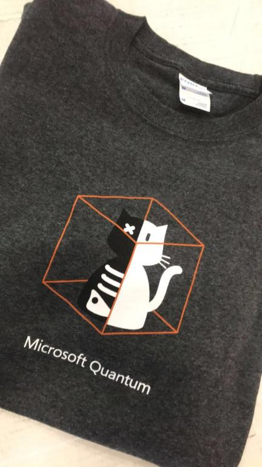

# Announcement_(en)

Microsoft's Quantum Team and Codeforces are excited to invite you to Microsoft Q
# Coding Contest — Winter 2019!

The contest will run from **March 1 to March 4** and will offer increasingly challenging tasks on superposition, measurement, quantum oracles and unitary transformations. 

As a reminder, last weekend we held a warmup round with easier tasks on quantum oracles and unitary transformations; the tasks are available for practice [here](https://codeforces.com/contest/1115), and the solutions are explained [here](https://assets.codeforces.com/rounds/1115/warmup-editorial.pdf). You can brush up on the topics of superposition and measurement in the [first Q
# contest](https://codeforces.com/contest/1002) and [its warmup round](//codeforces.com/contest/1001).

Several useful reminders:

 * The contest is unrated :-)
* Solutions are accepted only in Q#.
* Participants are ranked according to the number of correctly solved tasks, with the last correct submission time as a tiebreaker.
* The tasks are grouped by topic, and the tasks within one topic are ordered in approximate order of increasing difficulty. If you find a problem too hard, don't forget to check the next problems in this topic and problems from different topics, they might turn out to be easier.
* Submission verdicts work as follows:  
 *Wrong Answer* means that the solution fails any problem-specific checks (such as leaving the qubits in a state other than expected, using measurements in a task which prohibits them or returning incorrect classical value in measurement tasks) or prints anything to the standard output (using Message or DumpMachine functions);  
 *Runtime Error* means that the solution throws a more general exception (for example, caused by releasing allocated qubits in non-zero state or trying to access array elements outside of array bounds);  
 *Memory Limit Exceeded* means that the solution together with the checker allocated more qubits than it is allowed (the limit is ~15 qubits for problems related to quantum oracles with memory limit 1024MB, and ~25 qubits for other types of problems);  
 *Time Limit Exceeded* works the same way as in classical competitions (your program is too slow), but I have to mention it for the sake of completeness :-)
* Custom Invocation allows you to run Q
# code on Codeforces servers; make sure your code has namespace `Solution` and an operation with a signature `operation RunQsharp () : Bool` defined in it.
* And finally, the really important stuff: the top 50 ranked participants will receive a Microsoft Quantum T-shirt! Here is a preview: 
* NO PURCHASE NECESSARY. Must be 16 years of age or older. Game ends 3/4/19. For details, see [Official Rules](https://assets.codeforces.com/rounds/1115-1116/microsoft-quantum-winter-2019-qs-coding-contest-official-rules.pdf).

Good luck! We hope you enjoy the contest! 

For first time Codeforces users:

 1. Create user account [here](https://codeforces.com/register).
2. Register for the contest [here](https://codeforces.com/contestRegistration/1116).
3. Once the contest starts on March 1st, access the problems [here](https://codeforces.com/contest/1116).

**Update:** The contest is over. Congratulations to [eatmore](https://codeforces.com/profile/eatmore "Международный гроссмейстер eatmore") for a very convincing victory!

**Update 2:** The editorials are published [here](Contest_editorial_(en).md). The comments to that post have some great explanations of alternative solutions as well.

