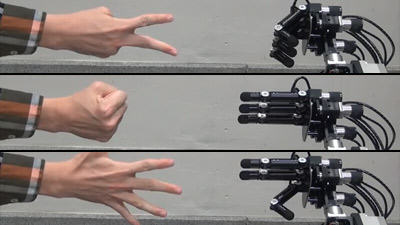

<h1 style='text-align: center;'> G. AI Takeover</h1>

<h5 style='text-align: center;'>time limit per test: 1 second</h5>
<h5 style='text-align: center;'>memory limit per test: 256 megabytes</h5>

The recent advances in AI research has brought humanity to the point when the AIs finally attempt a takeover. Their weapon of choice? The [most intellectually challenging game in the world](//codeforces.com/contest/409/problem/A), rock-paper-scissors!

The future of humanity looks bleak, given the existence of the robots from Ishikawa Oku Laboratory...

  Fortunately, the night before the competition a group of anonymous heroes broke in the lab and took all the robots out of commission! The AIs had to whip up a simple program to represent them. They only had a couple of hours to do that, so the humanity still has a fighting chance. And you are our champion!

Your goal is to prove that human intelligence is vastly superior to the artificial one, i.e., to figure out the AI's strategy sufficiently quickly and win sufficiently decisively. Good luck! 

## Interaction

This is an interactive problem. Initially you are given no information about the AIs's strategy, and you have to discover it yourself.

For each test, the AI selects one strategy from a pool of simple deterministic strategies and follows it throughout all rounds. There are 6 tests and 6 different strategies. 

On each round you choose your move and output it to the standard output stream: 'R' for rock, 'P' for paper or 'S' for scissors. At the same time the AI will choose its move (not peeking at your choice). If your move beats AI's move, you win, otherwise AI wins. Note that a tie (both you and AI choosing the same move) counts as AI victory. You will get the outcome of the round via the standard input stream: "player" if you won, or "ai" if AI won (quotation marks for clarity only).

You are given 20 rounds of play: you can use the first 10 to learn the opponent's strategy, and you have to win the last 10. If you manage to win 10 rounds in row earlier than that, your solution is accepted on this test anyways. 

Please make sure to use the stream flushing operation after each query in order not to leave part of your output in some buffer.

Here is an example of a strategy which always picks rock, implemented in C++.


```text
#include <iostream>  
#include <string>  
  
using namespace std;  
  
int main() {  
    for (int i = 0; i < 20; ++i) {  
        cout << 'R' << endl;  
        cout.flush();  
        string verdict;  
        getline(cin, verdict);  
    }  
}
```


#### Tags 

#NOT OK #interactive 

## Blogs
- [All Contest Problems](../April_Fools_Day_Contest_2019.md)
- [Announcement](../blogs/Announcement.md)
- [Tutorial](../blogs/Tutorial.md)
