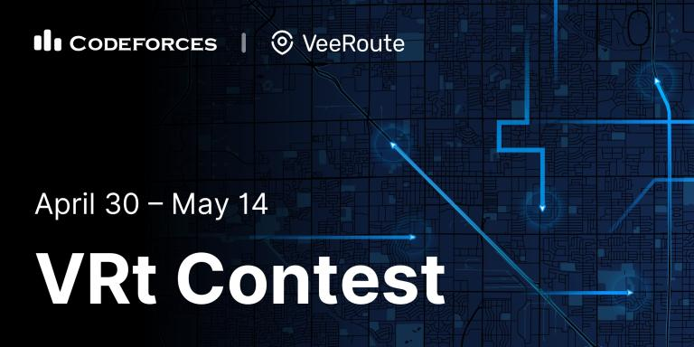

# Announcement

Hi all!

From April 30th to May 14th, Codeforces will host VRt Contest: the second contest organized by VeeRoute. VeeRoute is the developer of planning and management software for transportation and multimodal logistics.

Contest participants will have to solve an optimization problem where local optimization is challenging. The task is similar to those that VeeRoute has to solve regularly. Since the format is nothing like a standard Codeforces round, the contest will be unrated.

### Participation

Everyone is welcome to take part in the contest. The consest is for individual participation, with no restrictions on age or division.

### Prizes

 * I place — 75 000 RUB (1155 USD)
* II place — 50 000 RUB (770 USD)
* III place — 25 000 RUB (385 USD)

Additionally, top 25 participants will get a VRt T-shirt.

Good luck to all participants, and have a great contest!

