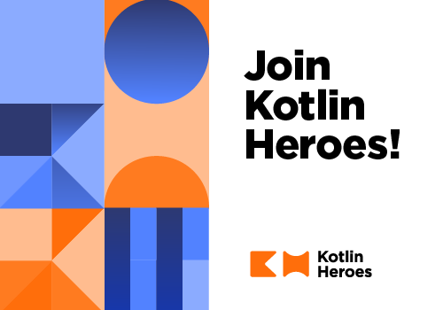

# Announcement_(en)

Hello, Codeforces!

We are happy to announce that in partnership with Codeforces to promote [Kotlin programming language](https://codeforces.com/https://kotlinlang.org/) we are launching a series of "Kotlin Heroes" programming contests.

Kotlin programming language was introduced by JetBrains in 2011 and reached its first stable version 1.0 in 2016. The current language version is 1.3.31. The language is focused on solving the needs of application developers in various domains. Kotlin is a statically typed language that is designed for writing concise code, with less ceremony and more substance in it, and to scale from applications of just a few lines long to multi-million-lines projects. 

While not being specifically designed for competitive programming, it incidentally fits well in this domain, reducing the typical amount boilerplate that a programmer needs to write and read while working with the code almost to the level offered by dynamically-typed scripting languages, while having tooling and performance of a statically-typed language.

The first "Kotlin Heroes" competition will be hosted at Codeforces platform on [Tuesday, May 28, 2019 at 20:35UTC+6](https://codeforces.com/https://www.timeanddate.com/worldclock/fixedtime.html?day=28&month=5&year=2019&hour=17&min=35&sec=0&p1=166). The contest will last 2 hours 30 minutes and will feature a set of problems from simple ones, designed to be solvable by anyone, to hard ones, to make it interesting for seasoned competitive programmers. **Top three winners will get prizes of $512, $256, and $128 respectively, top 50 will win a Kotlin Heroes t-shirt and an exclusive Kotlin badge, competitors solving at least one problem will enter into a draw for one of 50 Kotlin Heroes t-shirts.**

The round is held in accordance with slightly modified ICPC rules:

 * The round is unrated.
* The contest will have 6-10 problems of various levels of complexity.
* You are only allowed to use Kotlin to solve these problems.
* Participants are ranked according to the number of correctly solved problems.
* Ties are resolved based on the lowest total penalty time for all problems, which is computed as follows. For each solved problem, a penalty is set to the submission time of that problem (the time since the start of the contest). An extra penalty of 10 minutes is added for each failed submission on solved problems (i.e., if you never solve the problem, you will not be penalized for trying that problem).

Registration is already open and available via [the link](https://codeforces.com/contests/1170). It will be available until the end of the round.

  

 [REGISTER →](https://codeforces.com/contests/1170)  To help you get familiar with Kotlin we have prepared a tutorial on [competitive programming in Kotlin](https://codeforces.com/https://kotlinlang.org/docs/tutorials/competitive-programming.html) and a practice round, where you can try to solve a few simple problems in Kotlin. All solutions are open, it means that you can look at a solution even if you haven't solved a problem yet. The practice round is available by [the link](https://codeforces.com/contests/1171).

We wish you luck and hope you enjoy Kotlin.

**UPD 1:** Many thanks to the testers [elizarov](https://codeforces.com/profile/elizarov "Candidate Master elizarov"), [Benq](https://codeforces.com/profile/Benq "Legendary Grandmaster Benq"), [cdkrot](https://codeforces.com/profile/cdkrot "Grandmaster cdkrot"), [nhho](https://codeforces.com/profile/nhho "Grandmaster nhho"), [ksun48](https://codeforces.com/profile/ksun48 "Legendary Grandmaster ksun48"). Also [KAN](https://codeforces.com/profile/KAN "Grandmaster KAN") helped a lot with suggestions to the problems. And to all the participants warm greetings from authors [MikeMirzayanov](https://codeforces.com/profile/MikeMirzayanov "Headquarters, MikeMirzayanov"), [vovuh](https://codeforces.com/profile/vovuh "Candidate Master vovuh"), [adedalic](https://codeforces.com/profile/adedalic "International Master adedalic") and [pashka](https://codeforces.com/profile/pashka "Grandmaster pashka") — they invented and prepared the problems for you!

