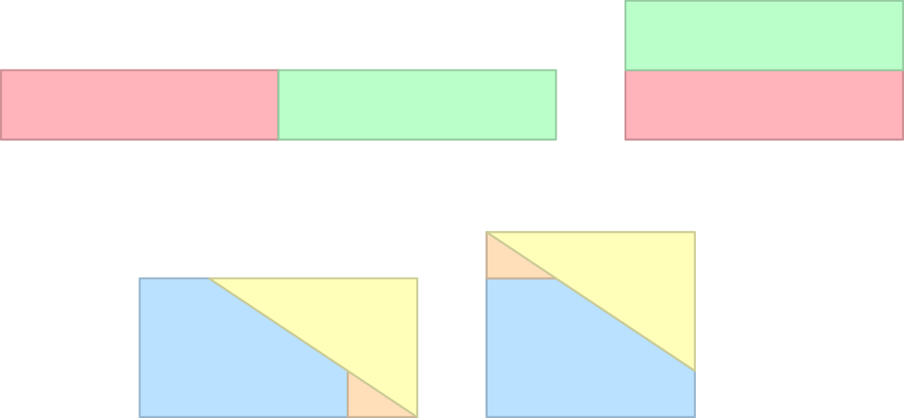
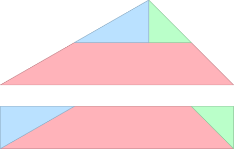
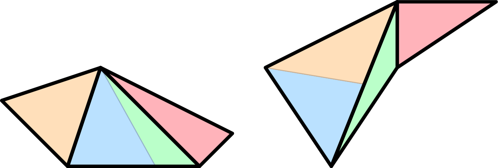

# T_(en)


### [1193A - Парк аттракционов](../problems/A._Amusement_Park.md "CEOI 2019 day 2 online mirror (unrated, IOI format)")

Subtask 1

There are only five non-isomorphic directed graphs on at most three vertices (ignoring the isolated vertices), and the answer can be simply computed by hand.

Subtask 2

As m≤(72)=21, we can enumerate all 2m reorientations, check whether they are acyclic and sum their cost. Time complexity is O((n+m)2m).

Subtask 3

Consider a permutation of vertices P. This permutation is a valid topological order in some reorientation of G. However, there may be multiple topological orders of the same graph. We can enumerate all N! permutations, and sum the cost of all distinct reorientations - each one is represented as a bitmask of flipped edges, and those are put into set. There are at most 45 edges, so 64-bit integer is sufficient and easy to implement option, where __builtin_popcountll returns the cost the reorientation. Time complexity is O(mn!)

Subtask 4

O(4n) solution. Will be described later.

Subtask 5

Let's first solve the problem of counting the number of acyclic reorientations using the topological orders as outlined in the previous subtask. Recall Kahn's algorithm for finding topological ordering: while there are vertices in the graph, pick a vertex with in-degree 0 and remove it along with all incident arcs. With proper bookkeeping, this can be implemented in O(n+m).

We will consider only certain topological orders called canonical. We call a topological order canonical, if at every step of Kahn's algorithm the available vertex with the smallest index is picked. Clearly, each acyclic graph has exactly one canonical topological order, so we can restrict ourselves to counting those.

We will use the following dynamic programming approach - let D[A][B] be the number of ways of permuting the vertices of A, such that this order is a prefix of some canonical topological order, and the set of vertices that can have zero indegree equals to B. The transition from D[A][B] consists of trying all possible choices of vertex c from the set B to be the next vertex in the canonical topological order. To which state D[A′][B′] do we transition?

The case of A′ is simple: A′:=A∪{c}

What happens to B′? All vertices with smaller index than c clearly can't have indegree zero anymore, as otherwise we would not have picked c. However, we must also remove all outgoing edges from c. To do this, observe that all neighbours of c that are not already in A get their indegree decreased. In particular, it may become zero, so the vertex is added to B′:

B′:=(B∖{0,1,...,c−1})∪(N(c)∖A)

where N(c) is the set of neighbours of c.

How to sum the costs of the reorientations? We maintain a second DP table C[a][b]. When picking a vertex v, we have to flip all outgoing arcs with their endpoint in A. In other words 

C[A′][B′]+=C[A][B]+D[A][B]∗|N+(c)∩A|

where N+(c) is the set of vertices to which there is an arc from c in graph G.

Alternatively, we can observe that for each acyclic reorientation H the reverse orientation HR is also acyclic and the sum of costs of these two orientations is m. As a result, the answer is count⋅m/2.

As A is always disjoint with B, there are 3n states and each state has at most n transitions. These can be performed using bitmasks, so the total runtime can be bounded from above by O(n3n).

A lot of states are in fact unreachable. Can you prove a tighter upper bound than the one we have shown?

 
### [1193B - Волшебное дерево](../problems/B._Magic_Tree.md "CEOI 2019 day 2 online mirror (unrated, IOI format)")

The first couple subtasks are meant as a reward for understanding the problem statement.

In the subtask 1, we can enumerate all subsets of fruit, decide whether this set is valid (i.e. it doesn't contain pair of fruits u, v such that u is an ancestor of v and u is ripe earlier than v) and output the maximum.

If all fruit is in the leaves, all fruit can be harvested at proper times, so the answer is simply the total juiciness of all fruits.

In subtask 3, the problem formulated on a path is equivalent to finding the longest non-decreasing subsequence in the list of ripening times along the path. Using any O(nlogn) solution gives the answer.

Not very surprisingly, on a tree the task can be solved by a dynamic programming approach by processing the tree upwards from leaves to the root. The scoring rewards different solutions of how information is stored, merged and propagated in the tree.

For the O(nk) solution one calculates for each vertex u and number of days i the following quantity: Cv,ℓ=maximum total juiciness one can harvest from the subtree rooted at v during the first i days. The transition for parent u and children vi is C′u,ℓ=∑viCvi,ℓ Cu,ℓ={max(C′u,ℓ,wu+C′u,du)if fruit in u is ripe at du≤ℓC′u,ℓotherwise Obviously the above recurrence can be computed in O(k⋅# children of v) in a vertex v. As each vertex can be a child of only a single vertex the total time complexity is O(nk).

This solves subtasks 4 and 5, and if we also compress the coordinates and the tree, it solves subtask 6.

Improving the dynamic programming

We will now do several small steps that will ultimately result in an O(nlog2n) solution.

First of all note that for a fixed vertex u the values Cu,i's are non-decreasing function of i.

A nontrivial observation is that there are not arbitrarily many distinct values of Cu,i's. In particular, there are at most one more than the number of vertices in the subtree of u, as the steps in this function can occur only at days when a fruit is ripe. We can use this to obtain a sparse representaiton of Cu,i which will be increasing.

For example the following function 


```cpp
t       1 2 3 4 5 ... k  
C[u,t]  0 2 2 3 4 ... 4  

```
 is compressed as 
```cpp
2 4 5  
2 3 4  

```
If we represent these in a simple array we can do the merge of two sparse representations of the functions using two pointers. This can give us a solution in which we process a vertex u in time proportional to the size of its subtree – i.e., worst-case O(n2).

(Note that another related way to get an O(n2) solution when k is much larger than n is to do coordinate compression on the times when the fruits become ripe.)

At this point we assume that our tree is a binary tree as arbitrary tree can be always converted into a binary tree. Hence we will only be merging two arrays into one.

In order to do this efficiently we have to represent our sparse function in a different datastructure as we cannot afford to run both pointers on the full range of the larger array. This datastructure is a range tree – one stores the ranges where the function value is constant. To combine two trees, one can iterate over all ranges in one of the trees, and perform a range addition on the second tree. Two trees can thus be combined in O(mlogn), where m is the size of the smaller of the trees. Merging a smaller structure into larger one is a well know trick that only adds a logarithmic factor. Furthermore, the act of adding a fruit to a representation can also be done in time O(logn) by one lookup and one range addition.

For subtask 7, we don't even need a range tree – a simple multiset is enough. In this multiset we store the IDs of days in which a fruit can be harvest from a subtree. Each prefix of this multiset gives us the number of fruits that may be harvested until a particular day, although the set itself is not necessarily correct. Merging subtrees from two siblings is a simple smaller-to-larger merge. To process fruit that is in the root of a subtree, we first remove the earliest fruit that ripes after the fruit in the root, if any, and then add the fruit itself.

 
### [1193C - Scissors and Tape](../problems/C._Scissors_and_Tape.md "CEOI 2019 day 2 online mirror (unrated, IOI format)")

There are many correct approaches. We will describe one that's reasonably simple to implement. We'll start with some basic shapes and we'll work our way up to general polygons.

Step one: a nice rectangle to another nice rectangle

We will do this in a series of steps. While the input rectangle is at least twice as wide (or twice as tall) as the other, cut it in half and place those halves one on top of the other. For the final step (if needed) we can go directly from one rectangle to the other by cutting it into three pieces and shifting two of them, as shown in the figure below.



Step two: any triangle to a nice rectangle

Move the input triangle so that its longest side is on the x-axis and its other vertex has positive y. (You can "abuse" the tape operation with k=1 to do this.) Then, cut it horizontally at half of its height and cut the top part vertically through the vertex. The three pieces can be reassembled to form a rectangle.

Step three: a nice rectangle to a triangle

This is just step two backwards: resize the rectangle to be as wide as the longest side of the triangle, then cut it in three pieces and assemble the triangle you need.



For the full construction, we can now go as follows: Triangulate the input polygon. Change each triangle into a rectangle. Resize all rectangles to have the same height. Tape them to a single rectangle R of that height. 

Triangulate the output polygon to know the areas of its triangles. Cut R into rectangles of those areas. Transform each rectangle to the corresponding triangle, and tape them all together.

An alternate full construction is can be implemented by having "triangle to triangle" as a primitive and then taking the triangulations of S and T and additionally cutting some of their triangles into two so that you'll get two collections of triangles of matching areas. (Imagine having a list of triangles from S and a list of triangles from T. You read both lists at the same time and whenever the areas don't match you cut off and use an appropriate part of the bigger triangle.)



Historic background: The equivalence relation between objects that can be obtained by a finite number of our "scissors" and "tape" steps is better known under the name scissors congruence. Wallace, Bolyai and Gerwien were the first to show that in 2D any two polygons with the same area are scissors-congruent. The 3D version of this problem was one of Hilbert's problems, and it was the first one solved – with a negative result. Within a year of Hilbert's talk, his student Dehn constructed two polyhedra with the same volume that are not scissors-congruent.

