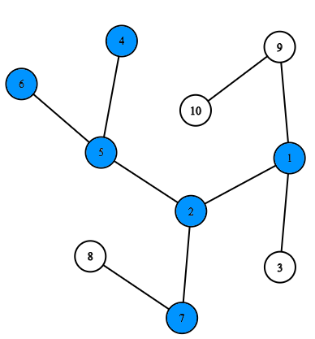

<h1 style='text-align: center;'> E. Modernization of Treeland</h1>

<h5 style='text-align: center;'>time limit per test: 5 seconds</h5>
<h5 style='text-align: center;'>memory limit per test: 256 megabytes</h5>

Treeland consists of $n$ cities and $n-1$ two-way roads connecting pairs of cities. From every city, you can reach every other city moving only by the roads. You are right, the system of cities and roads in this country forms an undirected tree.

The government has announced a program for the modernization of urban infrastructure of some cities. You have been assigned to select an arbitrary subset of cities $S$ to upgrade (potentially all the cities) that satisfies the following requirements:

* the subset of cities must be "connected", that is, from any city of the subset $S$ you can get to any other city of the subset $S$ by roads, moving only through cities from $S$,
* the number of "dead-ends" in $S$ must be equal to the given number $k$. A city is a "dead-end" if it is the only city in $S$ or connected to exactly one another city from $S$.

  This shows one of the possible ways to select $S$ (blue vertices) for a given configuration and $k=4$. Dead-ends are vertices with numbers $1$, $4$, $6$ and $7$. Help Treeland upgrade its cities. Find any of the possible subsets $S$ or determine that such a subset does not exist.

### Input

The first line contains an integer $t$ ($1 \le t \le 10^4$) — the number of test cases in the input. This is followed by the test cases themselves.

Each test case begins with a line that contains two integers $n$ and $k$ ($2 \le n \le 3 \cdot 10^5$, $1 \le k \le n$) — the number of cities in Treeland and the number of "dead-end" cities required in the subset $S$.

This is followed by $n-1$ lines with road descriptions. Each road is given by two integers $x$ and $y$ ($1 \le x, y \le n$; $x \ne y$) — the numbers of the cities that are connected by this road. It is guaranteed that from every city you can reach any other, moving only by the roads.

The sum of the values of $n$ for all test cases in the input does not exceed $3 \cdot 10^5$.

### Output

For each test case print Yes or No (in any case, upper or lower), depending on whether the answer exists or not. If the answer exists, then print an integer $m$ ($1 \le m \le n$) — the number of cities in the found subset. Then print $m$ different numbers from $1$ to $n$ — the numbers of the cities in the found subset. City numbers can be printed in any order. If there are several answers, print any of them.

## Example

### Input


```text
4
10 4
4 5
5 2
2 1
1 3
1 9
9 10
2 7
7 8
5 6
4 3
1 2
2 3
3 4
5 3
1 2
1 3
1 4
1 5
4 1
1 2
2 4
2 3
```
### Output


```text
Yes
9
1 2 4 5 6 7 8 9 10 
No
Yes
4
1 3 4 5 
Yes
1
4 
```


#### Tags 

#NOT OK #*special #dfs_and_similar #trees 

## Blogs
- [All Contest Problems](../Kotlin_Heroes:_Episode_3.md)
- [Kotlin Heroes: Episode 3 (en)](../blogs/Kotlin_Heroes:_Episode_3_(en).md)
- [Tutorial (en)](../blogs/Tutorial_(en).md)
